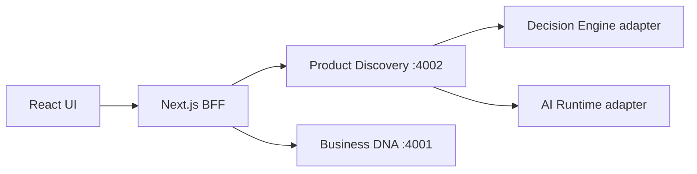

# AI Product Manager — Architecture

## Layer

Layer 6 Application — thin presentation over platform services. No business logic; all discovery and decision flows delegate to backend services.

## Structure

```
apps/ai-product-manager/
├── src/
│   ├── app/                    # Next.js App Router pages + BFF API
│   │   ├── api/                # Server-side proxies to platform services
│   │   ├── discovery/          # Discovery runs views
│   │   ├── recommendations/    # Recommendation review
│   │   ├── signals/            # Trend signals
│   │   ├── capabilities/       # Capability matches
│   │   ├── profit/             # Profit estimates
│   │   ├── decisions/          # Decision Engine status
│   │   └── activity/           # AI Runtime timeline
│   ├── components/             # UI (shadcn-style)
│   ├── lib/                    # API clients, auth, utils
│   ├── providers/              # TanStack Query
│   └── types/                  # API response types
```

## BFF Pattern

Browser → Next.js API routes → Platform services

| BFF Route | Backend |
| --------- | ------- |
| `/api/discovery/*` | Product Discovery Service (:4002) |
| `/api/business-dna/*` | Business DNA Service (:4001) |
| `/api/decisions` | Decision actions + discovery recommendations |
| `/api/runtime/*` | AI Runtime task view (derived from discovery runs) |
| `/api/dashboard` | Aggregated dashboard data |

## Data Flow



## Agent Boundary

The AI Product Manager agent:

- **May** run discovery, analyze signals, produce recommendations
- **May** submit recommendations to the Decision Engine
- **Must not** execute catalog changes, orders, or production actions

Approve/Reject in the UI records human decision intent via the BFF — final decisions remain with the Decision Engine and authorized employees.

## Authentication

- Dev: `Bearer dev:<orgId>:ai-product-manager` injected server-side
- Production: Keycloak OIDC (`KEYCLOAK_*` env vars) — session token wired when enabled

## Types

Domain types imported from `@lateen-os/business-dna` for catalog entities. Discovery types defined locally mirroring Product Discovery service API responses.
