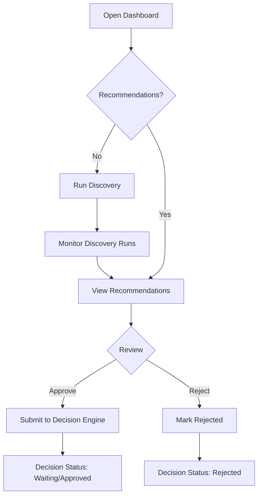

# AI Product Manager — UI Flow

## Primary User Journey

## Screen Map

| Route | Screen | Actions |
| ----- | ------ | ------- |
| `/` | Dashboard | View KPIs, charts, latest recommendations, run discovery |
| `/discovery` | Discovery Runs | List runs, view stage progress |
| `/discovery/[runId]` | Run Detail | Pipeline status, decision submission |
| `/recommendations` | Recommendations | Approve, reject, view reasoning |
| `/signals` | Trend Signals | Browse collected market signals |
| `/capabilities` | Capability Matches | View manufacturing alignment |
| `/profit` | Profit Estimates | View ROI projections |
| `/decisions` | Decision Status | Filter pending/waiting/approved/rejected |
| `/activity` | AI Activity | Runtime tasks, metrics, timeline |

## Run Discovery Flow

1. User clicks **Run Discovery** in header
2. Enters keywords (comma-separated)
3. BFF `POST /api/discovery/run` → Product Discovery Service
4. AI Runtime registers discovery as executable task
5. 7-stage pipeline executes (signals → recommendations → decision)
6. UI refreshes via TanStack Query invalidation
7. User reviews recommendations on `/recommendations`

## Recommendation Review Flow

1. User opens recommendation card
2. Reviews: confidence, capabilities, ROI, AI reasoning, trend sources
3. **Approve for Decision** → `POST /api/decisions` with `action: approve`
4. **Reject** → `POST /api/decisions` with `action: reject`
5. Decision Status tab reflects updated state

## Dashboard Charts

| Chart | Data Source |
| ----- | ----------- |
| Discovery Trend | Run signal/recommendation counts over time |
| Opportunity Score | Recommendation candidate confidence |
| Estimated ROI | Profit estimate margins and monthly profit |
| Capabilities Usage | Matched capability frequency |
| Machine Utilization | Business DNA machine fleet status |

## Error States

- Backend unavailable: error message on page, platform health shows degraded
- Empty state: prompt to run first discovery
- Loading: skeleton placeholders via TanStack Query `isLoading`
