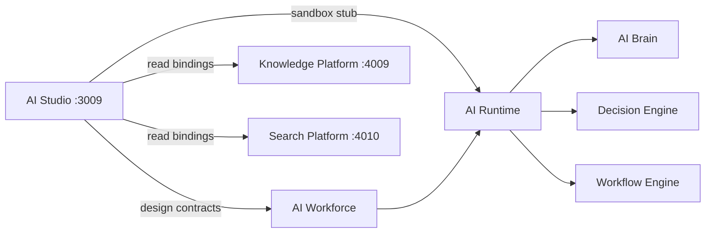

# AI Studio Architecture

**Architecture v1.0 (locked)** · Epic 31

## Purpose

AI Studio is the design-time surface for AI Workers. It composes configuration contracts that downstream platform services consume at runtime.

## System Context

## Layering

| Layer | Responsibility |
| ----- | -------------- |
| UI (Next.js) | 17 sections, Worker Designer, Prompt Studio, Testing, Analytics |
| BFF (`/api/*`) | Mock/stub responses, no domain mutation |
| Contracts (`src/lib/types/studio.ts`) | WorkerDesign, PromptDesign, DeploymentRecord, etc. |

## Non-Goals

- No LLM SDK or provider calls
- No worker execution or scheduling
- No decision approval logic
- No modifications to AI Runtime, AI Workforce, AI Brain, Decision Engine, Workflow Engine

## Worker Designer Tabs

General · Role · Goal · Description · Instructions · Temperature · Reasoning · Memory · Business DNA · Institutional Memory · Knowledge · Decision · Tools · Connectors · Runtime Limits · Budget · Retry · Fallback

## Deployment Lifecycle

`draft` → `published` → `archived` with version and rollback contracts (stub in BFF).

## Related Docs

- [WORKER_DESIGNER.md](./WORKER_DESIGNER.md)
- [PROMPT_STUDIO.md](./PROMPT_STUDIO.md)
- [DEPLOYMENT.md](./DEPLOYMENT.md)
