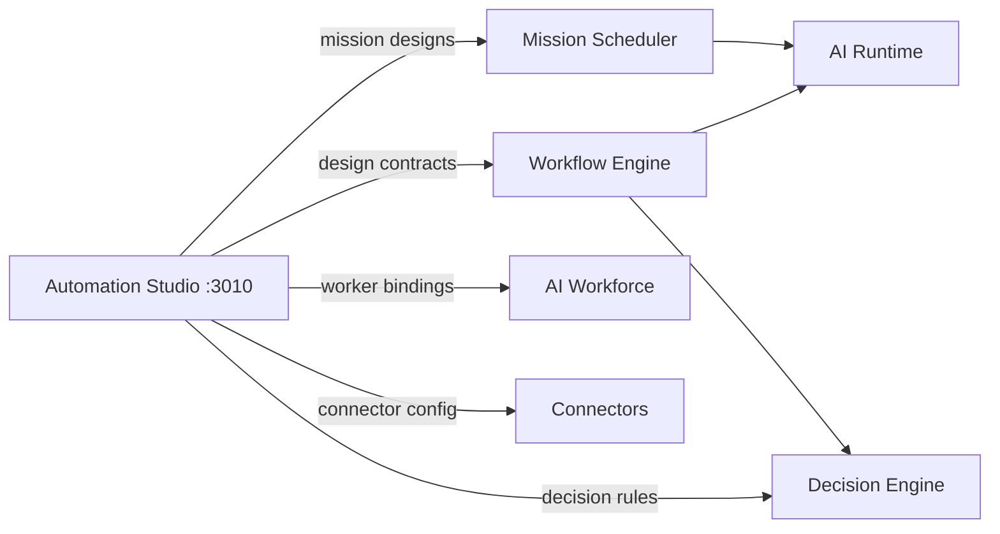

# Automation Studio Architecture

**Architecture v1.0 (locked)** · Epic 32

## Purpose

Automation Studio is the design-time surface for enterprise automations. It composes visual workflows that downstream platform services execute at runtime.

## System Context

## Layering

| Layer | Responsibility |
| ----- | -------------- |
| UI (Next.js) | 17 sections, Workflow Builder, Mission/Decision builders, Execution view |
| BFF (`/api/*`) | Mock/stub responses, design-time validation |
| Contracts (`src/lib/types/automation.ts`) | AutomationDesign, ExecutionRecord, etc. |

## Non-Goals

- No workflow execution or scheduling
- No LLM or AI Runtime invocation
- No decision approval logic
- No modifications to Workflow Engine, Mission Scheduler, AI Runtime, AI Workforce, Decision Engine, AI Brain

## Node Types (21)

Trigger · Condition · Decision · Workflow · Mission · AI Worker · Human Task · Approval · Notification · Email · Webhook · Connector · Business DNA · Knowledge Search · Enterprise Search · Delay · Loop · Switch · Parallel · Merge · Script

## Related Docs

- [WORKFLOW_BUILDER.md](./WORKFLOW_BUILDER.md)
- [MISSION_BUILDER.md](./MISSION_BUILDER.md)
- [AUTOMATION_MODEL.md](./AUTOMATION_MODEL.md)
