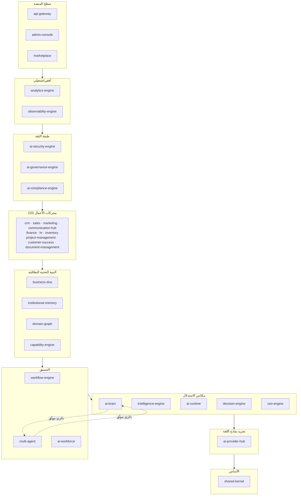
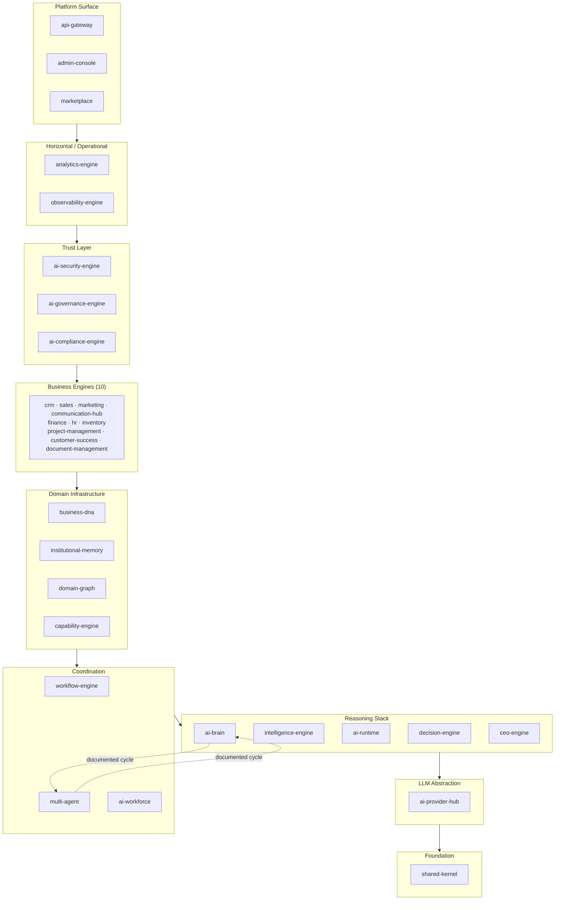

# العربية

## نموذج الاعتماديات

### 1. القواعد الحقيقية للرسم البياني

- **رسم بياني أحادي الاتجاه (DAG)**: تُبنى الاعتماديات بين حزم `packages/*` وتُفحص عبر بحث DFS برمجي على 39 ملف `package.json`، ويُطابَق ذلك مع تحذيرات `pnpm install` وأخطاء `turbo run build` الخاصة بها — ثلاث طرق مستقلة، متطابقة تمامًا (`docs/certification/DEPENDENCY_AUDIT.md`).
- **`shared-kernel` هو الطبقة صفر**: صفر اعتماديات صادرة على أي حزمة أخرى في المنصة — تحقّقنا من `packages/shared-kernel/package.json`: الاعتماديات الوحيدة هي `@opentelemetry/api` و`pino` (حزم خارجية، لا حزم `@lateen-os/*`).
- **`business-dna` هو المصدر الوحيد لـ `OrganizationId`**: كل حزمة تحتاج نوع المؤسسة تستورده من `@lateen-os/business-dna` (إعادة تصدير من `@lateen-os/shared-kernel/tenant`، وليس نوعًا جديدًا يُعرَّف محليًا) — تحقّقنا من `packages/business-dna/src/shared/identifiers.ts`.
- **صفر تسرّب مستودعات (Repository)** عبر أي حزمة — لا حزمة تستورد `repository.ts`/`repository.impl.ts` لحزمة أخرى؛ الاستيراد الوحيد المتكرر عبر الحزم هو الدالة المساعدة العامة `createInMemoryRepository` من `@lateen-os/shared-kernel/repository`.
- **صفر إعلانات اعتمادية مكررة** — لا حزمة تُعلن نفس الاسم مرتين أو في كلٍّ من `dependencies` و`devDependencies`.

### 2. الاستثناء الدائري الحقيقي الوحيد: `ai-brain` ⇄ `multi-agent`

موثّق بالكامل في `docs/certification/DEPENDENCY_AUDIT.md` F1، ومُعاد التحقق منه هنا مباشرة عبر قراءة `package.json` الفعلي لكل من الحزمتين:

- `packages/ai-brain/package.json` يُعلن اعتمادية على `@lateen-os/multi-agent`.
- `packages/multi-agent/package.json` يُعلن اعتمادية على `@lateen-os/ai-brain`.

كلا الجانبين حقيقي ومُستخدم فعليًا في الكود المصدري، لا مجرد إعلان متروك:

- `ai-brain/src/context/types.ts` و`ai-brain/src/shared/identifiers.ts` يستوردان النوع `MissionId` من `@lateen-os/multi-agent`.
- `multi-agent/src/runtime.ts` و`multi-agent/src/escalation/service.impl.ts` يستوردان النوع `Brain` من `@lateen-os/ai-brain` لحقن متعاون تصعيد اختياري.

**الأثر التجريبي**: `pnpm install` ينجح مع تحذير دورة عمل مساحة العمل؛ `turbo run build` (ومن ثمّ `typecheck`/`test`/`lint` على مستوى الجذر) يفشل فورًا برسالة "Cyclic dependency detected" ويرفض حساب أي رسم بناء — لا لهاتين الحزمتين فقط، بل لكامل مساحة العمل. الحل البديل الموثّق هو التحقق حزمة-بحزمة (`pnpm --filter <pkg> run <task>`)، وهو ما استُخدم فعليًا في التزام 35.

**التصرّف**: **لم يُصلَح** — هذا مستند بحقيقته فقط، دون أي محاولة إصلاح، بناءً على تعليمات هذه المهمة الصريحة بعدم لمس أي كود مصدري. المعالجة المقترحة رسميًا (ADR [`0003-no-cyclic-dependencies.md`](../adr/0003-no-cyclic-dependencies.md)) هي استخراج المفهوم المشترك (`Brain` بالنسبة لـ`multi-agent`، `MissionId` بالنسبة لـ`ai-brain`) إلى أسفل، ضمن `shared-kernel` أو وحدة معرّفات مشتركة جديدة — يتطلب التزامًا مخصصًا يمس كلا الحزمتين معًا.

### 3. مخطط الاعتماديات على مستوى الطبقة

هذا المخطط تجميعي على مستوى الطبقة (39 حزمة مجمّعة، لا مخطط حزمة-بحزمة كامل — كثافة الرسم الحزمي الكامل غير مفيدة قرائيًا). للتفاصيل الدقيقة حزمة-بحزمة، انظر عمود "Dependency Matrix" في [PACKAGE_CATALOG](./PACKAGE_CATALOG.md).

### 4. مركزية الاعتماديات (معلوماتي)

`shared-kernel` و`business-dna` هما الحزمتان الأعلى مركزية في الرسم البياني (صفر و1 اعتمادية صادرة على التوالي، وأعلى عدد اعتماديات واردة من أي حزمة). `analytics-engine` هو أوسع مستهلك فردي (15 اعتمادية `@lateen-os/*` معلنة، تحقّقنا منها مباشرة في `packages/analytics-engine/package.json`).

---

# English

## Dependency Model

### 1. Real Graph Rules

- **Single-direction graph (DAG)**: dependencies between `packages/*` are built and searched via a programmatic DFS over 39 `package.json` files, cross-checked against `pnpm install`'s own warnings and `turbo run build`'s own errors — three independent methods, in full agreement (`docs/certification/DEPENDENCY_AUDIT.md`).
- **`shared-kernel` is Layer Zero**: zero outbound dependencies on any other platform package — verified directly in `packages/shared-kernel/package.json`: its only dependencies are `@opentelemetry/api` and `pino` (external packages, no `@lateen-os/*` entries).
- **`business-dna` is the sole source of `OrganizationId`**: every package that needs the tenancy type imports it from `@lateen-os/business-dna` (a re-export from `@lateen-os/shared-kernel/tenant`, not a locally redefined type) — verified in `packages/business-dna/src/shared/identifiers.ts`.
- **Zero repository leakage** across any package — no package imports another package's `repository.ts`/`repository.impl.ts`; the one recurring cross-package import is the generic `createInMemoryRepository` helper from `@lateen-os/shared-kernel/repository`.
- **Zero duplicate dependency declarations** — no package declares the same name twice or in both `dependencies` and `devDependencies`.

### 2. The One Real Circular Exception: `ai-brain` ⇄ `multi-agent`

Fully documented in `docs/certification/DEPENDENCY_AUDIT.md` F1, re-verified here directly by reading both packages' real `package.json`:

- `packages/ai-brain/package.json` declares a dependency on `@lateen-os/multi-agent`.
- `packages/multi-agent/package.json` declares a dependency on `@lateen-os/ai-brain`.

Both sides are real and genuinely exercised in source, not a stale declaration:

- `ai-brain/src/context/types.ts` and `ai-brain/src/shared/identifiers.ts` import the type `MissionId` from `@lateen-os/multi-agent`.
- `multi-agent/src/runtime.ts` and `multi-agent/src/escalation/service.impl.ts` import the type `Brain` from `@lateen-os/ai-brain` for an optional injected escalation collaborator.

**Empirical impact**: `pnpm install` succeeds with a cyclic-workspace warning; `turbo run build` (and therefore root-level `typecheck`/`test`/`lint`) fails immediately with "Cyclic dependency detected" and refuses to compute a build order at all — not just for these two packages, but for the entire workspace. The documented workaround is per-package validation (`pnpm --filter <pkg> run <task>`), which is exactly what was used to produce Commit 35's own results.

**Disposition**: **not fixed here** — this document records the fact only, with no attempt at a code fix, per this task's explicit instruction not to touch any source. The prescribed remedy (ADR [`0003-no-cyclic-dependencies.md`](../adr/0003-no-cyclic-dependencies.md)) is to extract the shared concept (`Brain` for `multi-agent`'s side; `MissionId` for `ai-brain`'s side) downward into `shared-kernel` or a new shared identifiers module — this requires a dedicated commit touching both packages.

### 3. Layer-Level Dependency Diagram

This diagram is aggregated at the layer level (39 packages grouped, not a full package-by-package graph — the full graph's density is not legible at this scale). For exact package-by-package detail, see the "Dependency Matrix" column in [PACKAGE_CATALOG](./PACKAGE_CATALOG.md).

### 4. Dependency Centrality (Informational)

`shared-kernel` and `business-dna` are the highest-centrality packages in the graph (zero and one outbound dependency respectively, and the largest fan-in of any package). `analytics-engine` is the widest single consumer (15 declared `@lateen-os/*` dependencies, verified directly in `packages/analytics-engine/package.json`).

---

## Related Documents

- [../AI_PROJECT_CONTEXT.md](../AI_PROJECT_CONTEXT.md)
- [../certification/DEPENDENCY_AUDIT.md](../certification/DEPENDENCY_AUDIT.md)
- [../adr/0003-no-cyclic-dependencies.md](../adr/0003-no-cyclic-dependencies.md)
- [LAYERED_ARCHITECTURE.md](./LAYERED_ARCHITECTURE.md)
- [PACKAGE_CATALOG.md](./PACKAGE_CATALOG.md)

## Related Engines

All 39 `packages/*` engines; `ai-brain` and `multi-agent` specifically for the documented cycle.

## Related Commits

Commit 35 — Enterprise Platform Certification & Stabilization, and the subsequent documentation sprint.
