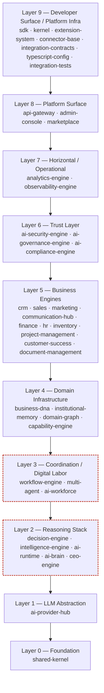

# العربية

## العمارة الطبقية

### 1. القاعدة: الاعتماديات تتجه دائمًا للأسفل

وفق `docs/handbook/03_CONSTITUTION.md` §1.2: "الاعتماديات تتجه دائمًا من الطبقات العليا نحو الطبقات الدنيا، أبدًا العكس." هذه القاعدة مفروضة بنيويًا عبر رسم بياني `pnpm`/`turbo` أحادي الاتجاه (DAG)، وموثّقة في ADR [`0003-no-cyclic-dependencies.md`](../adr/0003-no-cyclic-dependencies.md). الاستثناء الحقيقي الوحيد المسجّل اليوم هو التبعية الدائرية بين `ai-brain` و`multi-agent` (انظر [DEPENDENCY_MODEL](./DEPENDENCY_MODEL.md)) — استثناء موثّق فعليًا، لا نمط مقصود يُحتذى به.

### 2. الجدول الطبقي (39 حزمة، محقق مقابل `docs/AI_PROJECT_CONTEXT.md` §3)

| الطبقة | الحزم | العدد |
| --- | --- | --- |
| الأساس | `shared-kernel` | 1 |
| تجريد نماذج اللغة | `ai-provider-hub` | 1 |
| مكدّس الاستدلال | `decision-engine`, `intelligence-engine`, `ai-runtime`, `ai-brain`, `ceo-engine` | 5 |
| التنسيق / العمل الرقمي | `workflow-engine`, `multi-agent`, `ai-workforce` | 3 |
| البنية التحتية النطاقية | `business-dna`, `institutional-memory`, `domain-graph`, `capability-engine` | 4 |
| محركات الأعمال | `crm-engine`, `sales-engine`, `marketing-engine`, `communication-hub`, `finance-engine`, `hr-engine`, `inventory-engine`, `project-management-engine`, `customer-success-engine`, `document-management-engine` | 10 |
| طبقة الثقة | `ai-security-engine`, `ai-governance-engine`, `ai-compliance-engine` | 3 |
| أفقي / تشغيلي | `analytics-engine`, `observability-engine` | 2 |
| سطح المنصة | `api-gateway`, `admin-console`, `marketplace` (`@lateen-os/marketplace-engine`) | 3 |
| سطح المطوّر / بنية تحتية | `sdk`, `kernel`, `extension-system`, `connector-base`, `integration-contracts`, `typescript-config`, `integration-tests` | 7 |
| **الإجمالي** | | **39** |

تم التحقق من هذا الجدول مقابل قائمة `ls packages` الفعلية (39 مجلدًا، باستثناء `README.md`) — مطابق تمامًا لجدول `AI_PROJECT_CONTEXT.md` §3.

### 3. مخطط الطبقات واتجاه الاعتماديات

اتجاه الأسهم يعكس "يعتمد على" (depends on) — كل طبقة تعتمد فقط على الطبقات الأدنى منها، أبدًا العكس. الإطاران المحدّدان بخط متقطع (مكدّس الاستدلال والتنسيق) يشيران إلى موقع الاستثناء الدائري الوحيد الموثّق (`ai-brain` ⇄ `multi-agent`)، الذي يعبر فعليًا حدود هاتين الطبقتين — موثّق بالكامل في [DEPENDENCY_MODEL](./DEPENDENCY_MODEL.md).

### 4. ملاحظة حول الترتيب الداخلي لكل طبقة

الترتيب داخل الطبقة الواحدة ليس بالضرورة اعتماديًا خطيًا صارمًا — على سبيل المثال، ضمن "محركات الأعمال"، تعتمد `finance-engine` على `crm-engine` و`sales-engine`، بينما `crm-engine` لا يعتمد على أي محرك أعمال آخر (انظر [DEPENDENCY_MODEL](./DEPENDENCY_MODEL.md) للرسم البياني الفعلي حزمة-بحزمة).

---

# English

## Layered Architecture

### 1. The Rule: Dependencies Always Flow Downward

Per `docs/handbook/03_CONSTITUTION.md` §1.2: "Dependencies always flow from higher layers to lower layers, never the reverse." This rule is structurally enforced through a single-direction `pnpm`/`turbo` dependency graph (DAG), documented in ADR [`0003-no-cyclic-dependencies.md`](../adr/0003-no-cyclic-dependencies.md). The one real, currently-recorded exception is the circular dependency between `ai-brain` and `multi-agent` (see [DEPENDENCY_MODEL](./DEPENDENCY_MODEL.md)) — a documented defect, not an intentional pattern to be replicated.

### 2. The Layer Table (39 Packages, Verified Against `docs/AI_PROJECT_CONTEXT.md` §3)

| Layer | Packages | Count |
| --- | --- | --- |
| Foundation | `shared-kernel` | 1 |
| LLM abstraction | `ai-provider-hub` | 1 |
| Reasoning stack | `decision-engine`, `intelligence-engine`, `ai-runtime`, `ai-brain`, `ceo-engine` | 5 |
| Coordination / digital labor | `workflow-engine`, `multi-agent`, `ai-workforce` | 3 |
| Domain infrastructure | `business-dna`, `institutional-memory`, `domain-graph`, `capability-engine` | 4 |
| Business engines | `crm-engine`, `sales-engine`, `marketing-engine`, `communication-hub`, `finance-engine`, `hr-engine`, `inventory-engine`, `project-management-engine`, `customer-success-engine`, `document-management-engine` | 10 |
| Trust layer | `ai-security-engine`, `ai-governance-engine`, `ai-compliance-engine` | 3 |
| Horizontal / operational | `analytics-engine`, `observability-engine` | 2 |
| Platform surface | `api-gateway`, `admin-console`, `marketplace` (`@lateen-os/marketplace-engine`) | 3 |
| Developer surface / platform infra | `sdk`, `kernel`, `extension-system`, `connector-base`, `integration-contracts`, `typescript-config`, `integration-tests` | 7 |
| **Total** | | **39** |

This table was verified against the actual `ls packages` output (39 directories, excluding `README.md`) — it matches `AI_PROJECT_CONTEXT.md` §3 exactly.

### 3. Layer Diagram and Dependency Direction

Arrow direction reflects "depends on" — each layer depends only on the layers below it, never the reverse. The two dashed-outline boxes (Reasoning Stack and Coordination) mark where the one documented circular exception (`ai-brain` ⇄ `multi-agent`) actually crosses these two layers' boundary — fully documented in [DEPENDENCY_MODEL](./DEPENDENCY_MODEL.md).

### 4. A Note on Intra-Layer Ordering

Ordering within a single layer is not necessarily a strict linear dependency chain — for example, within "Business Engines", `finance-engine` depends on `crm-engine` and `sales-engine`, while `crm-engine` depends on no other business engine (see [DEPENDENCY_MODEL](./DEPENDENCY_MODEL.md) for the real package-by-package graph).

---

## Related Documents

- [../AI_PROJECT_CONTEXT.md](../AI_PROJECT_CONTEXT.md)
- [../handbook/03_CONSTITUTION.md](../handbook/03_CONSTITUTION.md)
- [../adr/0003-no-cyclic-dependencies.md](../adr/0003-no-cyclic-dependencies.md)
- [SYSTEM_OVERVIEW.md](./SYSTEM_OVERVIEW.md)
- [DEPENDENCY_MODEL.md](./DEPENDENCY_MODEL.md)
- [PACKAGE_MAP.md](./PACKAGE_MAP.md)

## Related Engines

All 39 `packages/*` engines.

## Related Commits

Commit 35 — Enterprise Platform Certification & Stabilization, and the subsequent documentation sprint.
