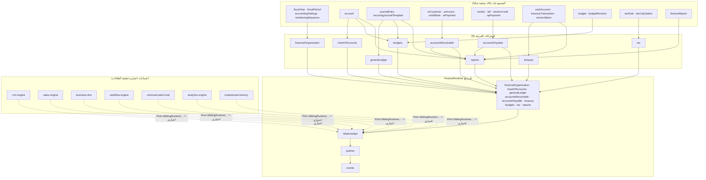
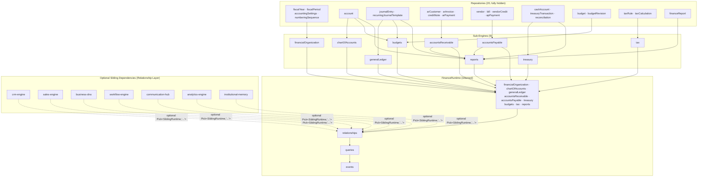

# العربية

## نموذج وقت التشغيل

### 1. القاعدة: السطح العام لا يُصدّر مستودعًا أبدًا

كل حزمة تُشكّل سطحها العام (Runtime) بحيث لا يُرجع أبدًا مستودعًا (`*Repository`/`*Repo`) — يُرجع فقط خدمات، استعلامات (`queries`)، وناقل أحداث (`events`). تحقّق `docs/certification/RUNTIME_AUDIT.md` من هذا عبر فحص كل واجهة `XRuntime` سطرًا-بسطر عبر الحزم الـ39 — صفر استثناءات. المستودعات تُبنى فقط داخل `runtime.ts`، وتُحقن بالإغلاق (closure) داخل الخدمات — لا تُعاد للمستدعي أبدًا.

### 2. مثال حقيقي: التركيب الداخلي لـ `finance-engine`

`packages/finance-engine/src/runtime.ts` هو المثال الأوضح لحزمة عصر ثانٍ ناضجة: يُنشئ 20 مستودعًا في-الذاكرة (سنوات مالية، فترات مالية، إعدادات محاسبة، تسلسلات ترقيم، حسابات، قيود يومية، قوالب قيود متكررة، عملاء الذمم، فواتير، إشعارات دائنة، مدفوعات، موردون، فواتير شراء، إشعارات مدينة، حسابات نقدية، معاملات خزينة، تسويات، ميزانيات، مراجعات ميزانية، قواعد ضريبية، حسابات ضريبية، تقارير مالية) — كلها محجوبة تمامًا خلف 9 محركات فرعية (`financialOrganization`, `chartOfAccounts`, `generalLedger`, `accountsReceivable`, `accountsPayable`, `treasury`, `budgets`, `tax`, `reports`)، ثم `relationships` (طبقة العلاقات مع `crm`, `sales`, `businessDna`, `workflow`, `communicationHub`, `analytics`, `institutionalMemory`)، و`queries`، و`events` — مُجمَّعة في كائن `FinanceRuntime` واحد يُرجعه `createFinanceRuntime(deps = {})`.

### 3. مخطط تركيب `finance-engine` الفعلي

لاحظ: أي مستودع (`Repos`) لا يظهر أبدًا في `Runtime` (المُرجَع) — فقط المحركات المبنية فوقه.

### 4. الضمان العام

هذا النمط مطابق حرفيًا عبر الحزم الـ39 (بالتفاوتات الموثّقة في [COMPOSITION_ROOTS](./COMPOSITION_ROOTS.md)) — أي مستهلك لحزمة `finance-engine` (مثل `api-gateway` أو `admin-console`) يستدعي `createFinanceRuntime()` ويحصل على `FinanceRuntime` فقط، دون أي وصول ممكن لأي مستودع من الـ20 المذكورة أعلاه.

---

# English

## Runtime Model

### 1. The Rule: The Public Surface Never Exports a Repository

Every package shapes its public Runtime surface so it never returns a repository (`*Repository`/`*Repo`) — only services, queries, and an event bus. `docs/certification/RUNTIME_AUDIT.md` verified this by inspecting every `XRuntime` interface line-by-line across all 39 packages — zero exceptions. Repositories are constructed only inside `runtime.ts` and injected by closure into services — never returned to the caller.

### 2. A Real Example: `finance-engine`'s Internal Composition

`packages/finance-engine/src/runtime.ts` is the clearest example of a mature Era-2 package: it constructs 20 in-memory repositories (fiscal years, fiscal periods, accounting settings, numbering sequences, accounts, journal entries, recurring journal templates, AR customers, AR invoices, credit notes, AR payments, vendors, bills, vendor credits, AP payments, cash accounts, treasury transactions, reconciliations, budgets, budget revisions, tax rules, tax calculations, finance reports) — all fully hidden behind 9 sub-engines (`financialOrganization`, `chartOfAccounts`, `generalLedger`, `accountsReceivable`, `accountsPayable`, `treasury`, `budgets`, `tax`, `reports`), then `relationships` (the Relationship Layer with `crm`, `sales`, `businessDna`, `workflow`, `communicationHub`, `analytics`, `institutionalMemory`), `queries`, and `events` — all assembled into one `FinanceRuntime` object returned by `createFinanceRuntime(deps = {})`.

### 3. `finance-engine`'s Real Composition Diagram

Note: no repository (`Repos`) ever appears in `Runtime` (the returned surface) — only the engines built on top of them.

### 4. The Platform-Wide Guarantee

This pattern is byte-for-byte consistent across all 39 packages (with the documented variances in [COMPOSITION_ROOTS](./COMPOSITION_ROOTS.md)) — any consumer of `finance-engine` (e.g. `api-gateway` or `admin-console`) calls `createFinanceRuntime()` and receives only a `FinanceRuntime` — with no possible access to any of the 20 repositories listed above.

---

## Related Documents

- [../AI_PROJECT_CONTEXT.md](../AI_PROJECT_CONTEXT.md)
- [../handbook/03_CONSTITUTION.md](../handbook/03_CONSTITUTION.md)
- [../certification/RUNTIME_AUDIT.md](../certification/RUNTIME_AUDIT.md)
- [COMPOSITION_ROOTS.md](./COMPOSITION_ROOTS.md)

## Related Engines

`finance-engine` (worked example); the runtime-shape rule applies to all 39 `packages/*`.

## Related Commits

Commit 35 — Enterprise Platform Certification & Stabilization, and the subsequent documentation sprint.
