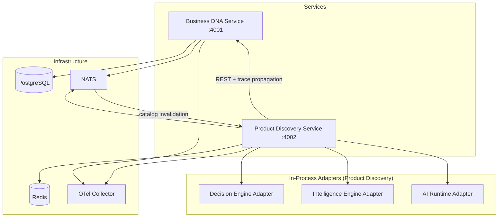
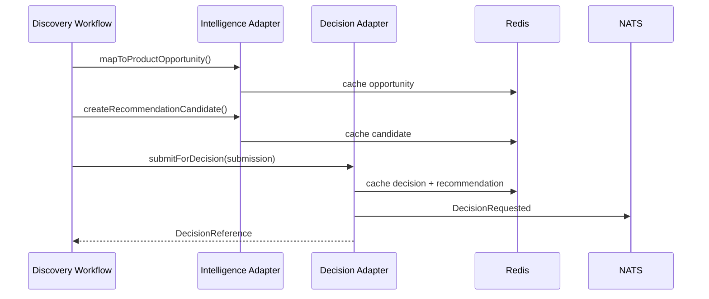
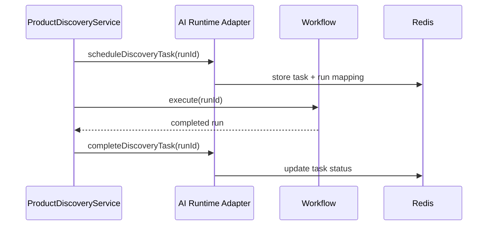

# Platform Integration Report v1.0

> Epic 5 — Platform Integration  
> Architecture v1.0 (Locked)

## Summary

Epic 5 integrates the existing Lateen OS platform into one coherent runtime without new domain models, packages, or services. All in-memory stubs in Product Discovery are replaced with platform adapters wired to Business DNA, Decision Engine, Intelligence Engine, AI Runtime, Redis, NATS, and OpenTelemetry.

## Integration Map



## Replacements

| Stub | Replacement | Storage |
| ---- | ----------- | ------- |
| Mock catalog loading | `BusinessDnaHttpClient.loadCatalog()` | Redis `catalog:{orgId}:*` |
| In-memory Decision Engine | `createDecisionEngineAdapter()` | Redis `decision:{orgId}:*` |
| In-memory Intelligence Engine | `createIntelligenceEngineAdapter()` | Redis `intelligence:*` |
| No-op AI Runtime | `createAiRuntimeAdapter()` | Redis `ai-runtime:*` |
| In-memory cache (dev) | `RedisCacheStore` via `USE_REDIS=true` | Redis |
| No-op NATS publisher | `NatsDiscoveryEventPublisher` | NATS |
| — | `startNatsIntegration()` subscriber | Cache invalidation |

## Decision Flow



## AI Runtime Flow



## Observability

- Product Discovery exports traces and metrics via OTLP when `OTEL_EXPORTER_OTLP_ENDPOINT` is set
- Business DNA HTTP client injects W3C trace context on outbound requests
- Auto-instrumentation enabled for HTTP, Fastify, and fetch

## Health Endpoints

| Endpoint | Service | Purpose |
| -------- | ------- | ------- |
| `GET /health` | Each service | Liveness |
| `GET /platform/health` | Product Discovery | Unified platform status |

Run `./infrastructure/scripts/platform-health.ps1` for scripted validation.

## Configuration

Shared environment loader: `infrastructure/platform/env.ts` (mirrored in each service as `platform-env.ts`).

Key variables:

| Variable | Default |
| -------- | ------- |
| `LATEEN_BUSINESS_DNA_BASE_URL` | `http://localhost:4001` |
| `LATEEN_PRODUCT_DISCOVERY_BASE_URL` | `http://localhost:4002` |
| `LATEEN_REDIS_URL` | `redis://:lateen_dev_redis@localhost:6379/0` |
| `LATEEN_NATS_URL` | `nats://localhost:4222` |
| `USE_REDIS` | `true` (dev/prod), `false` (test) |
| `USE_NATS` | `true` (dev/prod), `false` (test) |

## Verification

```bash
pnpm build
pnpm test
pnpm typecheck
docker compose up -d
./infrastructure/scripts/platform-health.ps1
```

## Constraints Honored

- No new domain models
- No new packages
- No new services
- Integration only — no new business functionality
