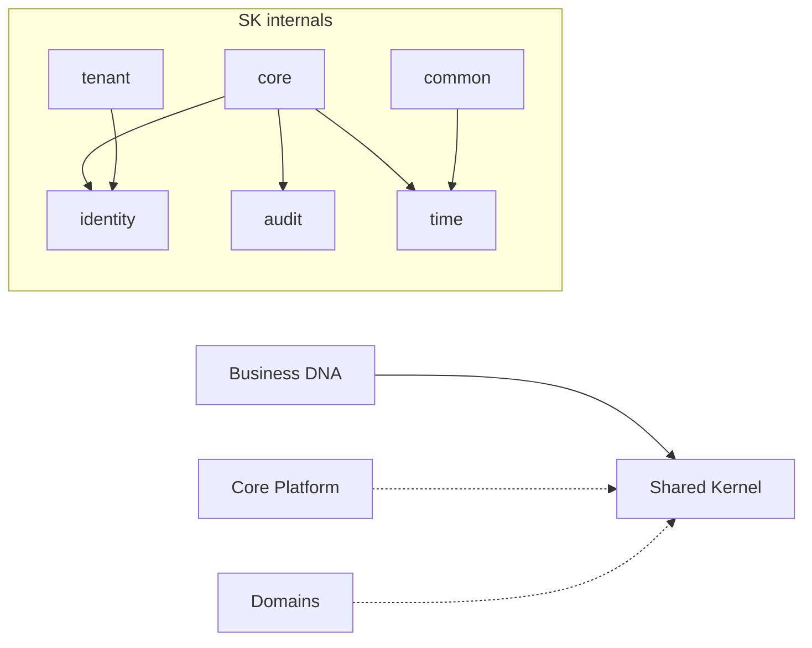

# Shared Kernel — Architecture Report (Sprint 2)

> **Date:** 2026-07-18  
> **Status:** Complete  
> **Architecture:** Lateen OS v1.0 (Locked)

## Executive summary

Sprint 2 introduces `@lateen-os/shared-kernel`, the cross-cutting DDD foundation for Lateen OS. The package provides six documented modules with a clean public API, zero upstream monorepo dependencies, and safe integration into Business DNA without breaking existing exports.

## Deliverables

| Item | Status |
| ---- | ------ |
| `packages/shared-kernel` package | Done |
| `core/` module (8 concepts) | Done |
| `identity/` module | Done |
| `common/` module (7 value objects) | Done |
| `audit/` module | Done |
| `tenant/` module | Done |
| `time/` module | Done |
| Module documentation | Done |
| Public API (root + subpaths) | Done |
| Business DNA integration | Done |
| Backward compatibility | Verified |
| Typecheck | Passed |

## Package structure

```
packages/shared-kernel/
├── ARCHITECTURE.md
├── README.md
├── package.json
├── tsconfig.json
└── src/
    ├── index.ts              # Public API
    ├── core/                 # Entity, AggregateRoot, ValueObject, …
    ├── identity/             # UUID, Identifier
    ├── common/               # Money, Address, Email, …
    ├── audit/                # AuditInfo, VersionInfo
    ├── tenant/               # TenantId, OrganizationId, BranchId
    └── time/                 # Timestamp, Clock
```

## Module inventory

### Core (`core/`)

Foundational DDD patterns:

- **Entity** — identity-based object root
- **AggregateRoot** — consistency boundary with optional audit/version
- **ValueObject** — structural equality marker
- **DomainEvent** — `{aggregate}.{action}` event envelope
- **DomainError** — typed failure structure
- **Result** — explicit `Ok` / `Err` outcomes
- **Guard** — precondition contracts and generic type predicates
- **Specification** — composable business rule interface

### Identity (`identity/`)

- **UUID** — opaque string identifier primitive
- **Identifier** — semantic alias for entity IDs
- **BrandedIdentifier** — optional branded ID factory type

### Common (`common/`)

Shared value objects: **Money**, **Address**, **Email**, **Phone**, **Percentage**, **TimeRange**, **GeoLocation**.

### Audit (`audit/`)

- **AuditInfo** — creation/modification metadata
- **VersionInfo** — optimistic concurrency version

### Tenant (`tenant/`)

- **TenantId**, **OrganizationId**, **BranchId**

### Time (`time/`)

- **Timestamp**, **DateOnly**
- **Clock** — read-only time port for infrastructure implementations

## Dependency graph



**Circular dependencies:** None. Shared Kernel is the root of the internal dependency tree.

## Business DNA integration

Changes were limited to `packages/business-dna/src/shared/`:

| File | Change |
| ---- | ------ |
| `primitives.ts` | Re-exports `Money`, `Address`, `CurrencyCode`; `ISODateTime` aliases `Timestamp`; `Auditable` derived from `AuditInfo` |
| `entity.ts` | Re-exports `Entity` from shared-kernel |
| `domain-event.ts` | Extends shared-kernel `DomainEvent`; adds `organizationId` |
| `identifiers.ts` | Re-exports `OrganizationId`, `BranchId`; `EntityId` aliases `Identifier` |
| `package.json` | Adds `@lateen-os/shared-kernel` workspace dependency |

All existing Business DNA public exports remain unchanged. No aggregate modules were modified.

## Public API

```typescript
// Root import
import { core, common, type Entity, ok, err } from '@lateen-os/shared-kernel';

// Subpath import
import type { Clock } from '@lateen-os/shared-kernel/time';
```

Subpath exports: `/core`, `/identity`, `/common`, `/audit`, `/tenant`, `/time`.

## Constraints honored

- Pure TypeScript
- No frameworks, persistence, HTTP, or UI
- No business logic (only generic guards and result factories)
- DDD best practices (entities, VOs, events, specifications, ports)

## Verification

- `pnpm --filter @lateen-os/shared-kernel typecheck` — pass
- `pnpm --filter @lateen-os/business-dna typecheck` — pass
- Backward compatibility — all prior Business DNA exports preserved via re-exports

## Next steps (out of scope for Sprint 2)

- Adopt shared-kernel in Core Platform (Layer 2) when that package is created
- Consider branded identifiers for stricter compile-time safety in new packages
- Implement `Clock` in infrastructure for testable time access

## References

- [Lateen OS Architecture v1.0](./lateen-os-v1.md)
- [Business DNA Package Architecture](../packages/business-dna/ARCHITECTURE.md)
- [Shared Kernel Package Architecture](../packages/shared-kernel/ARCHITECTURE.md)
