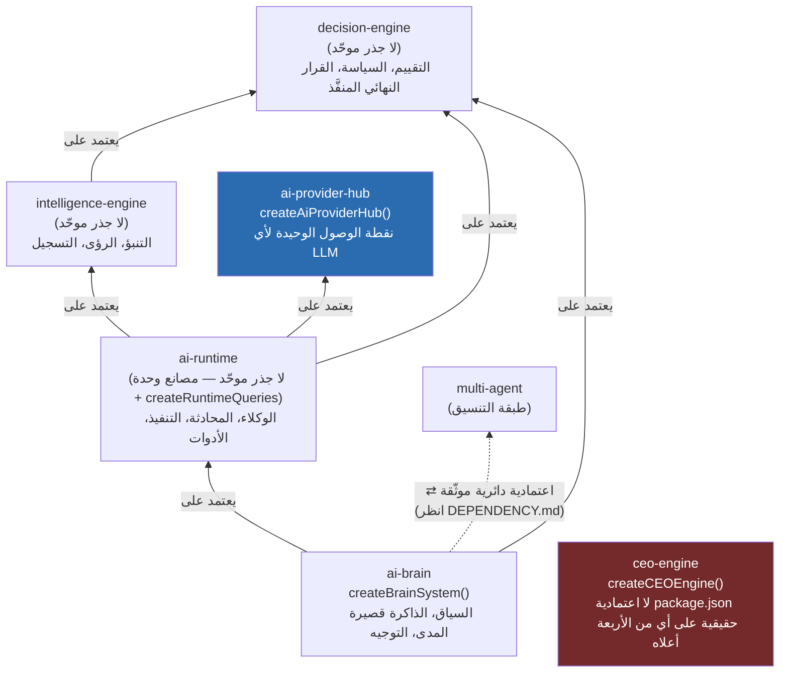
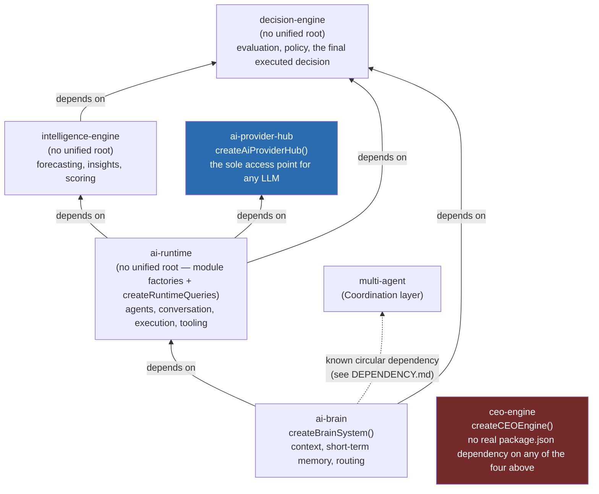

# العربية

## طبقة الاستدلال: من الإشارة إلى القرار المنفَّذ

المبدأ التأسيسي للمنصة (`docs/handbook/00_MASTER_PLAN.md`): **الذكاء الاصطناعي يُنتج توصيات؛ محرك القرار وحده مخوَّل بتحويلها إلى قرار منفَّذ.** يضع `AI_PROJECT_CONTEXT.md` §3 خمس حزم في طبقة "Reasoning stack": `decision-engine`, `intelligence-engine`, `ai-runtime`, `ai-brain`, `ceo-engine`. الرسم أدناه **لا يرسم هذا الترتيب كسلسلة افتراضية** — بل يعرض اعتماديات `package.json` الحقيقية بين الحزم الخمس، كما تم التحقق منها مباشرة، لأن الترتيب الفعلي يحمل تفصيلًا مهمًا لا يظهر في الجدول المختصر لـ `AI_PROJECT_CONTEXT.md`.

### قراءة الرسم — بما فيها ملاحظة حقيقية غير متوقعة

- الأسهم أعلاه هي اتجاه "يعتمد على" الحقيقي كما يظهر في `dependencies` الفعلية لكل `package.json`: `intelligence-engine` يستورد من `decision-engine`؛ `ai-runtime` يستورد من `decision-engine` و`intelligence-engine` و`ai-provider-hub`؛ `ai-brain` يستورد من `ai-runtime` و`decision-engine` (إضافة إلى `multi-agent`, `ai-workforce`, `workflow-engine` من طبقة التنسيق، غير معروضة هنا بالكامل — انظر `DEPENDENCY.md` لتفاصيل الدائرة `ai-brain ⇄ multi-agent`).
- **ملاحظة حقيقية مهمة**: `ceo-engine/package.json` **لا يُصرّح بأي اعتمادية** على `ai-brain` أو `ai-runtime` أو `decision-engine` أو `intelligence-engine` — فقط على `shared-kernel`. تم التحقق من هذا مباشرة من `package.json` ومن عدم وجود أي `import` من هذه الحزم داخل `packages/ceo-engine/src/`. أي أن ترتيب `ceo-engine` كـ"أعلى" الطبقة في جدول `AI_PROJECT_CONTEXT.md` §3 هو **تصنيف مفاهيمي/وظيفي** (تفويض المهام والتخطيط رفيع المستوى ضمن قصة "من التوصية إلى القرار")، وليس اعتمادية حزمة موصولة فعليًا في رسم بياني الاعتماديات الحالي. هذا الرسم يوضّح ذلك صراحةً بدلًا من رسم سهم غير موجود.
- `ai-provider-hub` تبقى **الحزمة الوحيدة** التي تلمس أي SDK لمزوّد LLM فعليًا — راجع ADR `0002-openai-compatible-providers.md`. لا حزمة عمل واحدة (`crm-engine`, `finance-engine`, ...) تستورد `ai-provider-hub` مباشرة أو أي مزوّد LLM آخر.

---

# English

## The Reasoning Stack: from signal to executed decision

The platform's founding principle (`docs/handbook/00_MASTER_PLAN.md`): **AI produces recommendations; only the Decision Engine is authorized to turn one into an executed decision.** `AI_PROJECT_CONTEXT.md` §3 places five packages in the "Reasoning stack" layer: `decision-engine`, `intelligence-engine`, `ai-runtime`, `ai-brain`, `ceo-engine`. The diagram below **does not draw this as a hypothetical chain** — it shows the real `package.json` dependencies between the five packages, directly verified, because the actual wiring carries an important detail not visible in `AI_PROJECT_CONTEXT.md`'s summary table.

### Reading the diagram — including a genuine, non-obvious finding

- The arrows above are the real "depends on" direction as it appears in each package's actual `dependencies`: `intelligence-engine` imports from `decision-engine`; `ai-runtime` imports from `decision-engine`, `intelligence-engine`, and `ai-provider-hub`; `ai-brain` imports from `ai-runtime` and `decision-engine` (plus `multi-agent`, `ai-workforce`, `workflow-engine` from the Coordination layer, not fully shown here — see `DEPENDENCY.md` for the `ai-brain ⇄ multi-agent` cycle detail).
- **An important, genuine finding**: `ceo-engine/package.json` **declares no dependency at all** on `ai-brain`, `ai-runtime`, `decision-engine`, or `intelligence-engine` — only on `shared-kernel`. This was verified directly from `package.json` and from the complete absence of any `import` from these packages inside `packages/ceo-engine/src/`. `ceo-engine`'s placement at the "top" of the stack in `AI_PROJECT_CONTEXT.md` §3's table is a **conceptual/functional classification** (mission delegation and high-level planning, within the "recommendation to decision" narrative), not a wired package dependency in the current dependency graph. This diagram states that explicitly rather than drawing an arrow that does not exist.
- `ai-provider-hub` remains the **only** package that actually touches any LLM provider SDK — see ADR `0002-openai-compatible-providers.md`. No business-capability engine (`crm-engine`, `finance-engine`, ...) imports `ai-provider-hub` or any other LLM provider directly.

---

## Related Documents

- [AI_PROJECT_CONTEXT](../AI_PROJECT_CONTEXT.md)
- [ADR 0002 — OpenAI-Compatible Providers](../adr/0002-openai-compatible-providers.md)
- [COMPOSITION_ROOTS](./COMPOSITION_ROOTS.md)
- [DEPENDENCY](./DEPENDENCY.md)

## Related Engines

`decision-engine`, `intelligence-engine`, `ai-runtime`, `ai-brain`, `ceo-engine`, `ai-provider-hub`.

## Related Commits

Commit 35 (`d9616a0` and the certification/documentation sprint that followed it).
