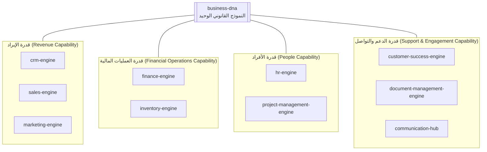
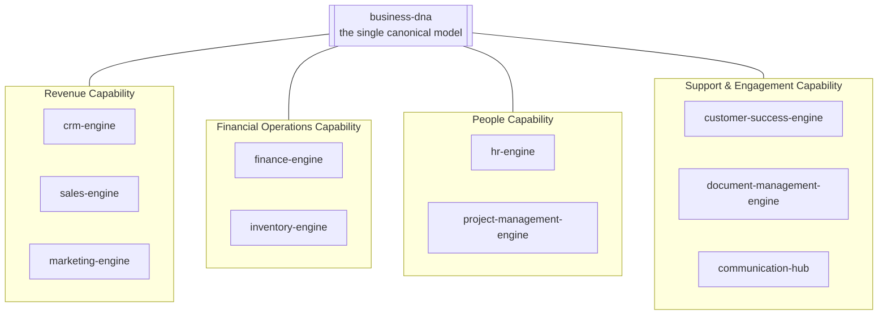

# العربية

## نفس العشر حزم — بزاوية القدرة التجارية بدلًا من تناظر ERP

`ERP_LAYER.md` يعرض هذه الحزم العشر نفسها كمكافئ لنظام ERP تقليدي منظَّم حسب الوحدات الوظيفية الكلاسيكية. هذا المستند يعرض **نفس الحزم الحقيقية العشر** لكن مُجمَّعة حسب **القدرة التجارية** (business capability) — وهي زاوية تصنيف مختلفة، وليست تكرارًا حرفيًا: بدلًا من "وحدات ERP"، الحزم هنا مُجمَّعة حسب الدور الذي تلعبه في دورة حياة العميل والعملية التشغيلية.

### لماذا هذا التصنيف مختلف عن `ERP_LAYER.md`

- **قدرة الإيراد**: `crm-engine` + `sales-engine` + `marketing-engine` تُمثّل معًا خط أنابيب اكتساب العميل وتحويله — من الاهتمام الأول إلى الصفقة المُغلقة.
- **قدرة العمليات المالية**: `finance-engine` + `inventory-engine` تُمثّلان تدفق القيمة المادية والمالية للمؤسسة (المخزون كأصل، والمالية كنظام تسجيل).
- **قدرة الأفراد**: `hr-engine` + `project-management-engine` تُمثّلان تنظيم القوى العاملة وتوزيعها على المبادرات.
- **قدرة الدعم والتواصل**: `customer-success-engine` + `document-management-engine` + `communication-hub` تُمثّل الحفاظ على العميل بعد البيع، وإدارة المعرفة الوثائقية، وقناة التواصل الموحّدة.
- هذا التجميع **تصنيف توثيقي فقط** لأغراض هذا الرسم — لا يُغيّر أي اعتمادية حقيقية بين الحزم؛ اعتماديات `package.json` الفعلية (مثل `sales-engine → crm-engine`) موثّقة بدقة في `ERP_LAYER.md` و`DEPENDENCY.md`.

---

# English

## The Same Ten Packages — a Business-Capability Angle Instead of the ERP Analogy

`ERP_LAYER.md` presents these same ten packages as an ERP-equivalent, organized around classic functional modules. This document presents **the same ten real packages** but grouped by **business capability** — a different classification angle, not a verbatim repeat: instead of "ERP modules," the packages here are grouped by the role they play across the customer lifecycle and the operating process.

### Why this classification differs from `ERP_LAYER.md`

- **Revenue Capability**: `crm-engine` + `sales-engine` + `marketing-engine` together represent the customer acquisition-and-conversion pipeline — from first interest to closed deal.
- **Financial Operations Capability**: `finance-engine` + `inventory-engine` represent the organization's material and financial value flow (inventory as an asset, finance as the system of record).
- **People Capability**: `hr-engine` + `project-management-engine` represent organizing the workforce and allocating it to initiatives.
- **Support & Engagement Capability**: `customer-success-engine` + `document-management-engine` + `communication-hub` represent post-sale customer retention, documentary knowledge management, and the unified communication channel.
- This grouping is **a documentation-only classification** for the purposes of this diagram — it changes no real dependency between packages; the actual `package.json` dependencies (e.g. `sales-engine → crm-engine`) are precisely documented in `ERP_LAYER.md` and `DEPENDENCY.md`.

---

## Related Documents

- [AI_PROJECT_CONTEXT](../AI_PROJECT_CONTEXT.md)
- [ERP_LAYER](./ERP_LAYER.md)
- [KNOWLEDGE_LAYER](./KNOWLEDGE_LAYER.md)

## Related Engines

`crm-engine`, `sales-engine`, `marketing-engine`, `finance-engine`, `inventory-engine`, `hr-engine`, `project-management-engine`, `customer-success-engine`, `document-management-engine`, `communication-hub`, `business-dna`.

## Related Commits

Commit 35 (`d9616a0` and the certification/documentation sprint that followed it).
