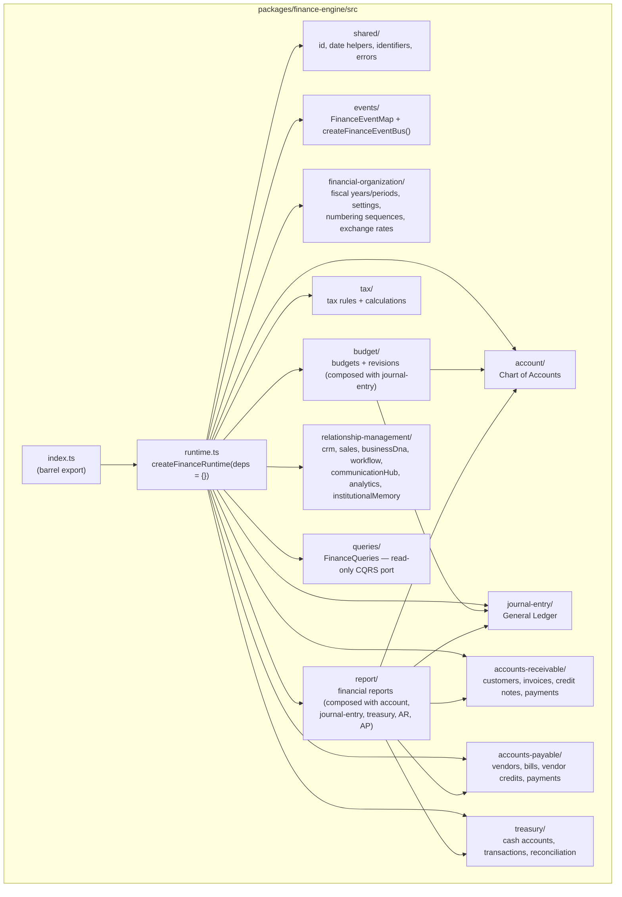

# العربية

## رسم المكوّنات (C4 — Component): `finance-engine`

هذا هو المستوى الثالث من نموذج C4: تكبير داخل حاوية واحدة فقط من طبقة "محركات الأعمال" (`Business Engines`) — تم اختيار `packages/finance-engine` كنموذج تمثيلي حقيقي، بقراءة `packages/finance-engine/src/` مباشرة (وليس تخمينًا). البنية المعروضة هي **البنية الفعلية للمجلدات** كما تُقرأ من `runtime.ts` وقائمة المجلدات الحقيقية:

`shared/`, `events/`, `financial-organization/`, `account/` (دفتر الحسابات — Chart of Accounts)، `journal-entry/` (دفتر الأستاذ العام — General Ledger)، `accounts-receivable/`, `accounts-payable/`, `treasury/`, `budget/`, `tax/`, `report/`, `relationship-management/`, `queries/`, `runtime.ts`, `index.ts`.

### قراءة الرسم

- `runtime.ts` هو **جذر التركيب** الوحيد — كل مستودع (`*Repository`) يُنشأ داخله فقط، ثم يُحقن في المحرك المناظر؛ لا مستودع يظهر في سطح `FinanceRuntime` العام (راجع `RUNTIME.md`).
- `budget/` و`report/` هما وحدتا التركيب الوحيدتان اللتان تعتمدان على وحدات فرعية أخرى داخل نفس الحزمة (`budget` يعتمد على `journal-entry` و`account`؛ `report` يعتمد على أربع وحدات) — وهذا اعتماد **داخلي** ضمن الحزمة نفسها، لا يخرق قاعدة "لا اعتماد مباشر على مستودع حزمة أخرى".
- `relationship-management/` هي نقطة التكامل الوحيدة مع الأشقاء الخارجيين (`crm-engine`, `sales-engine`, `business-dna`, `workflow-engine`, `communication-hub`, `analytics-engine`, `institutional-memory`) — كل واحد منهم اختياري ويتدهور إلى `null`/`[]` عند عدم الحقن.

---

# English

## Component Diagram (C4 — Component): `finance-engine`

This is C4 Level 3: zooming inside a single container from the "Business Engines" layer — `packages/finance-engine` was chosen as a real, representative example, read directly from `packages/finance-engine/src/` (not guessed). The structure shown is the **actual folder structure**, as read from `runtime.ts` and the real directory listing:

`shared/`, `events/`, `financial-organization/`, `account/` (Chart of Accounts), `journal-entry/` (General Ledger), `accounts-receivable/`, `accounts-payable/`, `treasury/`, `budget/`, `tax/`, `report/`, `relationship-management/`, `queries/`, `runtime.ts`, `index.ts`.

### Reading the diagram

- `runtime.ts` is the **only** composition root — every repository (`*Repository`) is constructed inside it and injected into the matching engine; no repository ever appears on the public `FinanceRuntime` surface (see `RUNTIME.md`).
- `budget/` and `report/` are the only two modules composed over other subdomains within the same package (`budget` depends on `journal-entry` and `account`; `report` depends on four modules) — this is an **internal** dependency within the package itself, and does not violate the "never depend directly on another package's repository" rule.
- `relationship-management/` is the only integration point with external siblings (`crm-engine`, `sales-engine`, `business-dna`, `workflow-engine`, `communication-hub`, `analytics-engine`, `institutional-memory`) — each one optional, degrading to `null`/`[]` when not injected.

---

## Related Documents

- [AI_PROJECT_CONTEXT](../AI_PROJECT_CONTEXT.md)
- [CONTAINER](./CONTAINER.md)
- [RUNTIME](./RUNTIME.md)
- [finance-engine ARCHITECTURE](../../packages/finance-engine/ARCHITECTURE.md)

## Related Engines

`finance-engine` (representative Era-2 package).

## Related Commits

Commit 35 (`d9616a0` and the certification/documentation sprint that followed it).
