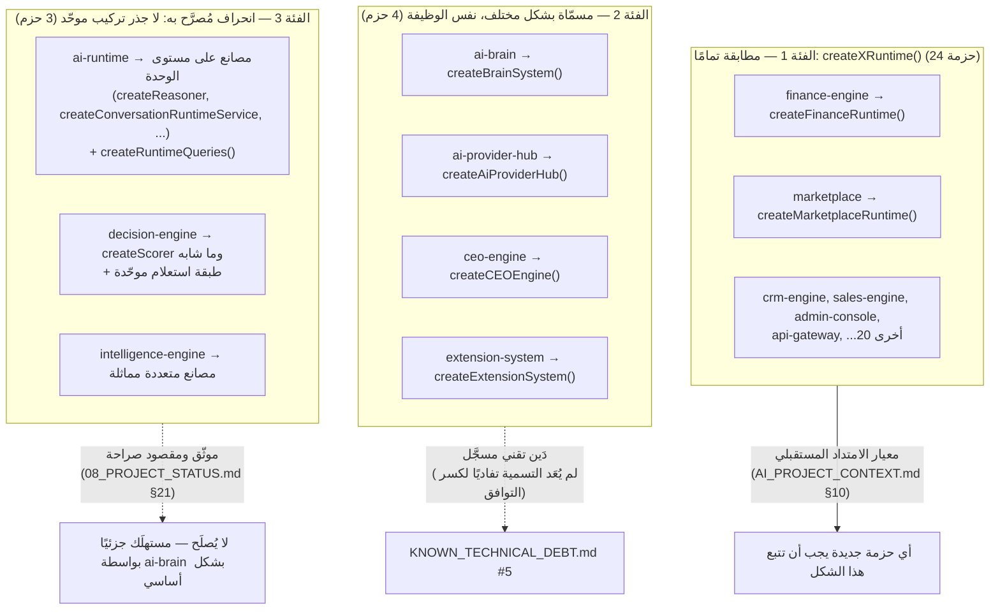
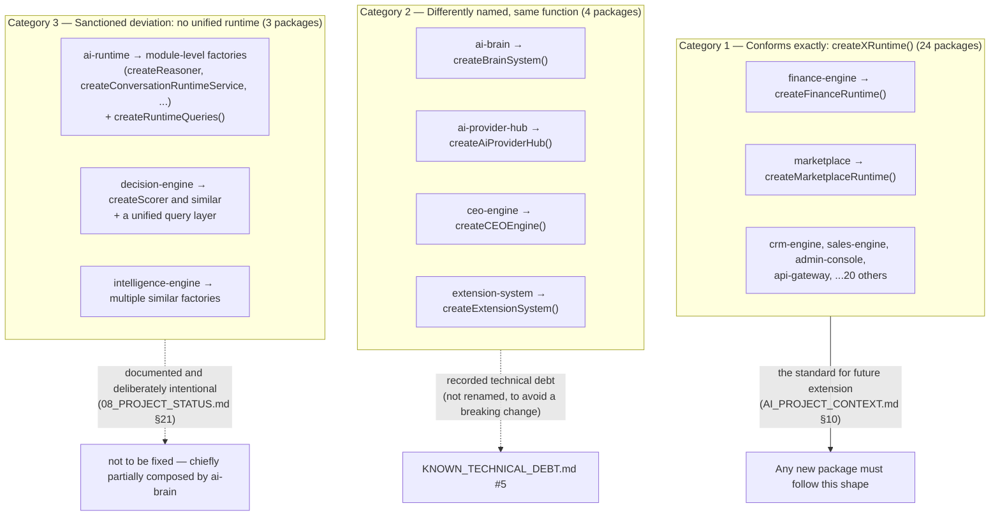

# العربية

## ثلاث فئات حقيقية لجذر التركيب عبر 39 حزمة

`docs/certification/RUNTIME_AUDIT.md` يُصنّف كل حزمة من 39 حسب شكل جذر تركيبها الفعلي. هذا الرسم يقارن الفئات الثلاث ذات الصلة (باستثناء الحزم البنيوية التي لا تحتاج جذرًا إطلاقًا: `capability-engine`, `kernel`, `sdk`, `shared-kernel`, `typescript-config`, `connector-base`, `integration-contracts`, `integration-tests`).

### الفرق الجوهري بين الفئة 2 والفئة 3

- **الفئة 2** ترجع كائنًا واحدًا يجمّع كل خدمات/استعلامات/أحداث الحزمة — تمامًا كـ `createXRuntime()` وظيفيًا، فقط باسم مختلف يسبق توحيد اصطلاح التسمية في العصر الثاني.
- **الفئة 3** لا ترجع كائنًا موحّدًا إطلاقًا بتصميم متعمَّد — الفكرة أن يُركِّب المستهلك (غالبًا `ai-brain`) أجزاءً مختارة من هذه الحزم الثلاث بنفسه، بدلًا من فرض غلاف Runtime واحد عليها. محاولة "إصلاح" هذا بفرض غلاف Runtime تُعتبر مخالفة توجيه صريح في `AI_PROJECT_CONTEXT.md` §2.

---

# English

## Three real composition-root categories across 39 packages

`docs/certification/RUNTIME_AUDIT.md` classifies every one of the 39 packages by the actual shape of its composition root. This diagram contrasts the three categories that matter here (excluding structural packages that need no root at all: `capability-engine`, `kernel`, `sdk`, `shared-kernel`, `typescript-config`, `connector-base`, `integration-contracts`, `integration-tests`).

### The essential difference between Category 2 and Category 3

- **Category 2** returns a single object that aggregates all of that package's services/queries/events — functionally identical to `createXRuntime()`, just under a name that predates the Era-2 naming convention.
- **Category 3** deliberately returns no unified object at all — the intent is that a consumer (chiefly `ai-brain`) composes selected pieces of these three packages itself, rather than a Runtime wrapper being imposed on them. Attempting to "fix" this by forcing a Runtime wrapper is explicitly against the guidance in `AI_PROJECT_CONTEXT.md` §2.

---

## Related Documents

- [AI_PROJECT_CONTEXT](../AI_PROJECT_CONTEXT.md)
- [RUNTIME_AUDIT](../certification/RUNTIME_AUDIT.md)
- [ARCHITECTURE_AUDIT](../certification/ARCHITECTURE_AUDIT.md)
- [RUNTIME](./RUNTIME.md)

## Related Engines

`ai-brain`, `ai-provider-hub`, `ceo-engine`, `extension-system` (Category 2); `ai-runtime`, `decision-engine`, `intelligence-engine` (Category 3).

## Related Commits

Commit 35 (`d9616a0` and the certification/documentation sprint that followed it).
