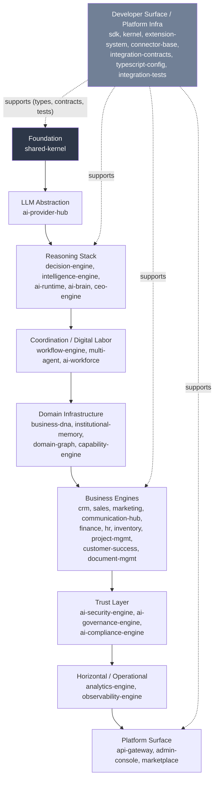

# العربية

## رسم الحاويات (C4 — Container)

هذا هو المستوى الثاني من نموذج C4: تكبير داخل صندوق "Lateen OS" الوحيد في `SYSTEM_CONTEXT.md` لإظهار طبقاته (containers) العشر، كما وردت حرفيًا في جدول `AI_PROJECT_CONTEXT.md` §3. كل طبقة هنا هي مجموعة حزم حقيقية من `packages/*` — وليست حزمة واحدة — وتُبنى دائمًا فوق الطبقة التي تحتها (اتجاه الاعتماد لأسفل فقط، بلا استثناء موثّق سوى ما هو مذكور في `DEPENDENCY.md`).

### ملاحظات معمارية

- كل طبقة "حاوية" هنا تُبنى فعليًا فوق الطبقات التي تسبقها — وليس بالضرورة أن تعتمد كل حزمة داخل الطبقة على كل حزمة في الطبقة السابقة مباشرة؛ التفاصيل الدقيقة على مستوى الحزمة الواحدة في `DEPENDENCY.md` و`PACKAGE.md`.
- طبقة **Developer Surface / Platform Infra** ليست في سلسلة الاعتماد الخطية؛ هي بنية تحتية أفقية (أنواع، عقود، إعدادات TypeScript، اختبارات تكامل) تخدم عدة طبقات في آنٍ واحد — ولهذا رُسمت بخط متقطع (dashed) وليس كجزء من التسلسل الرأسي.
- التفصيل الكامل لكل حزمة داخل كل طبقة موجود في `docs/architecture/PACKAGE_CATALOG.md` (يُنشأ بالتوازي في مسار توثيقي آخر) وفي `PACKAGE.md` من هذا المجلد.

---

# English

## Container Diagram (C4 — Container)

This is C4 Level 2: zooming inside the single "Lateen OS" box from `SYSTEM_CONTEXT.md` to show its ten layers, taken verbatim from `AI_PROJECT_CONTEXT.md` §3's layer table. Each layer here is a real group of `packages/*` packages — not a single package — and is always built on top of the layer beneath it (dependencies point downward only, with no exception other than the one documented in `DEPENDENCY.md`).

### Architectural notes

- Each "container" layer here is genuinely built on the layers before it — this does not mean every package in a layer directly depends on every package in the layer below; the exact per-package detail lives in `DEPENDENCY.md` and `PACKAGE.md`.
- The **Developer Surface / Platform Infra** layer is not part of the linear dependency chain; it is horizontal infrastructure (types, contracts, TypeScript config, integration tests) serving several layers at once — drawn with a dashed line rather than as part of the vertical sequence.
- Full per-package detail within each layer lives in `docs/architecture/PACKAGE_CATALOG.md` (being produced in parallel by another documentation track) and in `PACKAGE.md` in this folder.

---

## Related Documents

- [AI_PROJECT_CONTEXT](../AI_PROJECT_CONTEXT.md)
- [SYSTEM_CONTEXT](./SYSTEM_CONTEXT.md)
- [PACKAGE](./PACKAGE.md)
- [DEPENDENCY](./DEPENDENCY.md)

## Related Engines

All 39 `packages/*`, grouped by layer.

## Related Commits

Commit 35 (`d9616a0` and the certification/documentation sprint that followed it).
