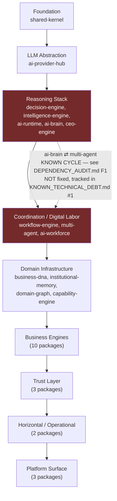

# العربية

## رسم اعتماديات الطبقات (DAG) — بما فيه الاستثناء الموثّق الوحيد

الاتجاه المسموح به لكل اعتماديات المستودع هو **للأسفل فقط** (Directed Acyclic Graph حقيقي) — تم التحقق من هذا برمجيًا (DFS عبر 39 حزمة) وبواسطة `pnpm install` و`turbo run build` نفسيهما، بحسب `DEPENDENCY_AUDIT.md`. النتيجة: **اعتمادية دائرية واحدة فقط موجودة فعليًا** بين `ai-brain` (طبقة الاستدلال) و`multi-agent` (طبقة التنسيق/العمالة الرقمية) — وهي موثّقة، معروفة، **وليست مُصلحة** في هذا الالتزام (تُصلح عبر التزام مخصص يستخرج النوع المشترك `Brain`/`MissionId` إلى طبقة أدنى، بحسب ADR `0003`).

هذا الرسم **لا يُخفي** هذا الاستثناء ولا "يُصلحه" بصمت — يُظهره بخط متقطع أحمر مع علامة تحذير صريحة، تمامًا كما توجّه المهمة.

### قراءة الرسم

- كل سهم صلب يمثّل اتجاه اعتماد فعليًا مؤكدًا، متجهًا للأسفل دائمًا — بلا استثناء عبر 37 من 39 حزمة.
- الخط المتقطع الأحمر هو الاستثناء الوحيد المسجَّل في كل المستودع: `ai-brain/src/context/types.ts` يستورد `MissionId` من `@lateen-os/multi-agent`، بينما `multi-agent/src/runtime.ts` يستورد `Brain` من `@lateen-os/ai-brain` — استيراد نوع في كل الاتجاهين، وليس بقايا غير مستخدمة.
- **الأثر الحقيقي**: `turbo run build`/`typecheck`/`test`/`lint` على مستوى الجذر يفشل فورًا بسبب هذه الدائرة، فيما تعمل الأوامر لكل حزمة على حدة (`pnpm --filter <pkg> run <task>`) بلا مشكلة.
- هذا ليس خطأً في هذا الرسم أو تبسيطًا زائدًا — إنه انعكاس حرفي لحالة الكود الحقيقية، كما وثّقتها `DEPENDENCY_AUDIT.md` §F1 و`ARCHITECTURE_AUDIT.md` §F7.

---

# English

## Layer Dependency Graph (DAG) — including the one documented exception

The allowed direction for every workspace dependency is **downward only** (a genuine Directed Acyclic Graph) — verified programmatically (a DFS over all 39 packages) and independently by `pnpm install` and `turbo run build` themselves, per `DEPENDENCY_AUDIT.md`. The result: **exactly one circular dependency exists in reality**, between `ai-brain` (Reasoning Stack) and `multi-agent` (Coordination / Digital Labor) — it is documented, known, and **not fixed** in this commit (the remedy requires a dedicated commit extracting the shared `Brain`/`MissionId` type downward, per ADR `0003`).

This diagram does **not** hide this exception, nor silently "fix" it — it is shown as a dashed red edge with an explicit warning label, exactly as instructed.

### Reading the diagram

- Every solid arrow is a real, verified dependency direction, always pointing downward — with no exception across 37 of 39 packages.
- The dashed red edge is the single exception recorded anywhere in the repository: `ai-brain/src/context/types.ts` imports `MissionId` from `@lateen-os/multi-agent`, while `multi-agent/src/runtime.ts` imports `Brain` from `@lateen-os/ai-brain` — a type import in both directions, not leftover cruft.
- **Real impact**: root-level `turbo run build`/`typecheck`/`test`/`lint` fails immediately because of this cycle, while per-package commands (`pnpm --filter <pkg> run <task>`) work without issue.
- This is not an error in this diagram or an oversimplification — it is a literal reflection of the real state of the code, as documented in `DEPENDENCY_AUDIT.md` F1 and `ARCHITECTURE_AUDIT.md` F7.

---

## Related Documents

- [AI_PROJECT_CONTEXT](../AI_PROJECT_CONTEXT.md)
- [DEPENDENCY_AUDIT](../certification/DEPENDENCY_AUDIT.md)
- [ADR 0003 — No Cyclic Dependencies](../adr/0003-no-cyclic-dependencies.md)
- [CONTAINER](./CONTAINER.md)

## Related Engines

All 39 `packages/*`; the flagged exception involves `ai-brain` and `multi-agent` specifically.

## Related Commits

Commit 35 (`d9616a0` and the certification/documentation sprint that followed it).
