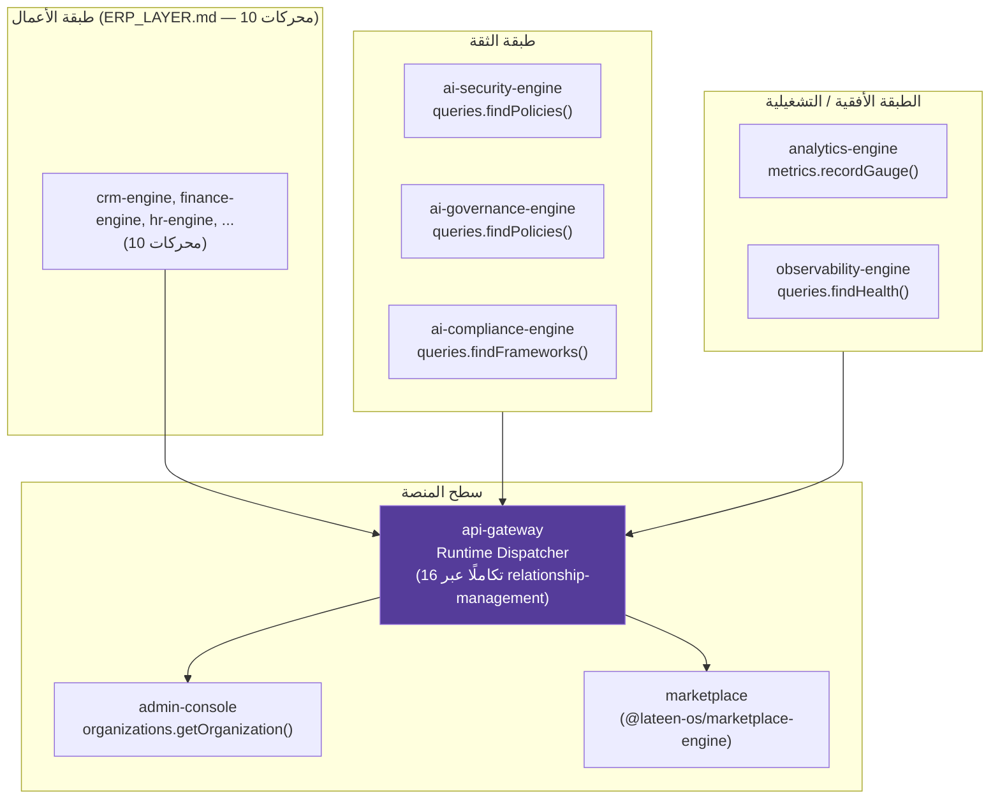
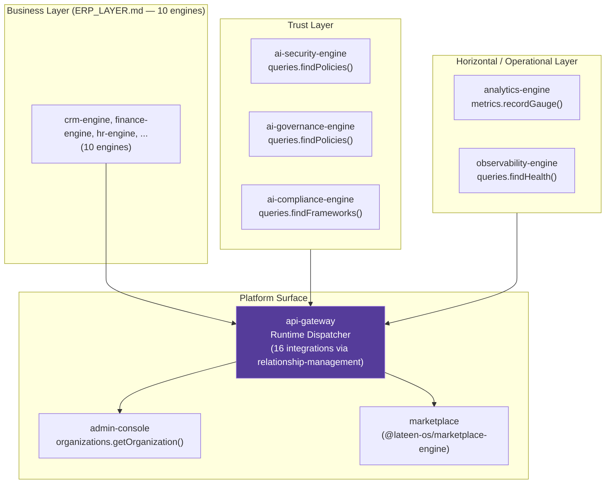

# العربية

## كيف تُغلِّف طبقة المؤسسة طبقة الأعمال للتشغيل على مستوى مؤسسي

ثلاث طبقات من `AI_PROJECT_CONTEXT.md` §3 — **طبقة الثقة** (`ai-security-engine`, `ai-governance-engine`, `ai-compliance-engine`)، **الطبقة الأفقية/التشغيلية** (`analytics-engine`, `observability-engine`)، و**سطح المنصة** (`api-gateway`, `admin-console`, `marketplace`) — تُشكّل معًا ما يجعل طبقة محركات الأعمال (`ERP_LAYER.md`) صالحة للتشغيل على مستوى مؤسسة حقيقية: أمان، حوكمة، امتثال، رصد، وواجهة تشغيل/توزيع موحّدة.

المثال الملموس هنا حقيقي: `api-gateway/src/relationship-management/types.ts` يُصرّح فعليًا بـ16 اعتمادية شقيق — من بينها الثلاث حزم من طبقة الثقة (`aiSecurity`, `aiGovernance`, `aiCompliance` — كل واحدة مكتوبة كـ`Pick<Runtime, 'queries'>`) والحزمتان الأفقيتان (`analytics`, `observability`)، إلى جانب محركات الأعمال نفسها.

### قراءة الرسم

- `api-gateway` هو **نقطة الاختناق المتعمَّدة** (single dispatch point) — كل طلب خارجي (من `apps/*` أو `extensions/*`، انظر `SYSTEM_CONTEXT.md`) يمر عبر مُرسِله (Dispatcher) قبل الوصول إلى أي محرك أعمال أو خدمة ثقة/تشغيل.
- الأسهم من `TRUST` و`HORIZ` إلى `GW` تمثّل تكاملات `relationship-management/` الحقيقية في `api-gateway` — وليست بوابات وسيطة منفصلة؛ كل حزمة ثقة/تشغيل تبقى حزمة مستقلة تُستدعى فقط عبر سطحها العام.
- `marketplace` هنا هو الحزمة الخلفية (`@lateen-os/marketplace-engine`) لا واجهة `apps/marketplace` — وهي نفسها تتكامل عائديًا مع `api-gateway` و`admin-console` و7 حزم أخرى (انظر `RELATIONSHIP_FLOW.md`)، فالعلاقة بين سطح المنصة وطبقة الثقة/الأفقية ذات اتجاهين حسب الحزمة، وليست تسلسلًا هرميًا صارمًا أحادي الاتجاه.

---

# English

## How the Enterprise Layer Wraps the Business Layer for Enterprise-Grade Operation

Three layers from `AI_PROJECT_CONTEXT.md` §3 — the **Trust Layer** (`ai-security-engine`, `ai-governance-engine`, `ai-compliance-engine`), the **Horizontal/Operational layer** (`analytics-engine`, `observability-engine`), and the **Platform Surface** (`api-gateway`, `admin-console`, `marketplace`) — together are what makes the business-engines layer (`ERP_LAYER.md`) operable at genuine enterprise scale: security, governance, compliance, observability, and a unified operating/distribution surface.

The concrete example here is real: `api-gateway/src/relationship-management/types.ts` genuinely declares 16 sibling dependencies — among them the three Trust-layer packages (`aiSecurity`, `aiGovernance`, `aiCompliance` — each typed as `Pick<Runtime, 'queries'>`) and the two horizontal packages (`analytics`, `observability`), alongside the business engines themselves.

### Reading the diagram

- `api-gateway` is the **deliberate single dispatch point** — every external request (from `apps/*` or `extensions/*`, see `SYSTEM_CONTEXT.md`) passes through its Dispatcher before reaching any business engine or trust/operational service.
- The arrows from `TRUST` and `HORIZ` into `GW` represent `api-gateway`'s real `relationship-management/` integrations — not separate intermediary gateways; each trust/operational package remains an independent package, called only through its own public surface.
- `marketplace` here is the backend package (`@lateen-os/marketplace-engine`), not the `apps/marketplace` frontend — and it itself integrates back with `api-gateway`, `admin-console`, and 7 other packages (see `RELATIONSHIP_FLOW.md`), so the relationship between the platform surface and the trust/horizontal layers is bidirectional per-package, not a strict one-directional hierarchy.

---

## Related Documents

- [AI_PROJECT_CONTEXT](../AI_PROJECT_CONTEXT.md)
- [ERP_LAYER](./ERP_LAYER.md)
- [CONTAINER](./CONTAINER.md)
- [api-gateway GATEWAY_MODEL](../../packages/api-gateway/GATEWAY_MODEL.md)

## Related Engines

`ai-security-engine`, `ai-governance-engine`, `ai-compliance-engine`, `analytics-engine`, `observability-engine`, `api-gateway`, `admin-console`, `marketplace`.

## Related Commits

Commit 35 (`d9616a0` and the certification/documentation sprint that followed it).
