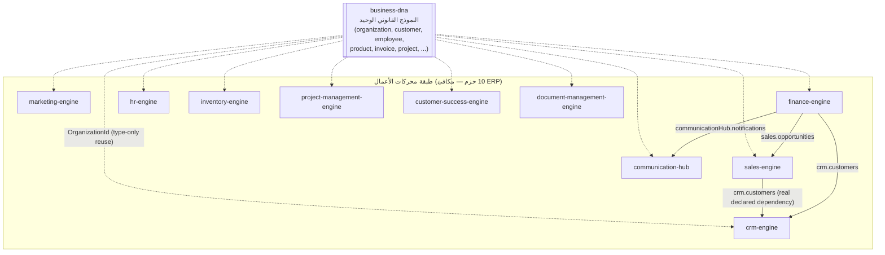

# العربية

## طبقة محركات الأعمال — مكافئ ERP كامل فوق نموذج عمل واحد

الطبقة السادسة في `AI_PROJECT_CONTEXT.md` §3 (Business Engines) تضم 10 حزم، وهي — مجتمعة — تُغطي بالضبط نطاق نظام ERP تقليدي (إدارة علاقات العملاء، المبيعات، التسويق، الاتصالات، المالية، الموارد البشرية، المخزون، إدارة المشاريع، نجاح العملاء، إدارة الوثائق). الفرق الجوهري عن ERP تقليدي: **لا نموذج بيانات خاص بكل محرك** — الجميع يستهلك `business-dna` كنموذج العمل القانوني الوحيد (`AI_PROJECT_CONTEXT.md` §4، البند 9)، بدلًا من أن يحتفظ كل نظام فرعي بنسخته الخاصة من "الحقيقة".

### ملاحظات

- الأسهم المتقطعة من `business-dna` تمثّل إعادة استخدام النوع (`OrganizationId`) فقط — وهي إعادة استخدام على مستوى النوع لا تبعية بيانات وقت التشغيل، لأن `OrganizationId` مجرد اسم مستعار من نوع `string`.
- الأسهم الصلبة أحادية الاتجاه بين `sales-engine → crm-engine` و`finance-engine → crm-engine/sales-engine/communication-hub` حقيقية ومُتحقَّق منها مباشرة من `package.json` لكل حزمة (`dependencies`) — وليست ثنائية الاتجاه: لا `crm-engine` ولا `sales-engine` يعتمدان على `finance-engine` رجوعًا، حفاظًا على اتجاه الاعتماد للأسفل فقط. التفصيل الكامل لكل تكامل في `INTEGRATION.md`.
- لكل محرك من هذه العشرة `relationship-management/` خاص به يربطه بأشقاء آخرين خارج هذه الطبقة أيضًا (`workflow-engine`, `institutional-memory`, `analytics-engine`, ...) — غير معروضة هنا للحفاظ على وضوح الرسم.

---

# English

## The Business Engines Layer — a full ERP-equivalent over one business model

Layer 6 in `AI_PROJECT_CONTEXT.md` §3 (Business Engines) has 10 packages that, together, cover exactly the scope of a traditional ERP system (CRM, sales, marketing, communications, finance, HR, inventory, project management, customer success, document management). The essential difference from a traditional ERP: **no engine keeps its own data model** — every one consumes `business-dna` as the single canonical business model (`AI_PROJECT_CONTEXT.md` §4, item 9), instead of each subsystem keeping its own version of "the truth."

### Notes

- The dashed arrows from `business-dna` represent type reuse (`OrganizationId`) only — a type-level reuse, not a runtime data dependency, since `OrganizationId` is a plain `string` alias.
- The one-directional solid arrows `sales-engine → crm-engine` and `finance-engine → crm-engine/sales-engine/communication-hub` are real, verified directly against each package's own `package.json` `dependencies` — they are not bidirectional: neither `crm-engine` nor `sales-engine` depends back on `finance-engine`, preserving the downward-only dependency direction. Full integration detail is in `INTEGRATION.md`.
- Each of these ten engines has its own `relationship-management/` connecting it to siblings outside this layer too (`workflow-engine`, `institutional-memory`, `analytics-engine`, ...) — not shown here to keep the diagram readable.

---

## Related Documents

- [AI_PROJECT_CONTEXT](../AI_PROJECT_CONTEXT.md)
- [BUSINESS_LAYER](./BUSINESS_LAYER.md)
- [KNOWLEDGE_LAYER](./KNOWLEDGE_LAYER.md)
- [CONTAINER](./CONTAINER.md)

## Related Engines

`crm-engine`, `sales-engine`, `marketing-engine`, `communication-hub`, `finance-engine`, `hr-engine`, `inventory-engine`, `project-management-engine`, `customer-success-engine`, `document-management-engine`, `business-dna`.

## Related Commits

Commit 35 (`d9616a0` and the certification/documentation sprint that followed it).
