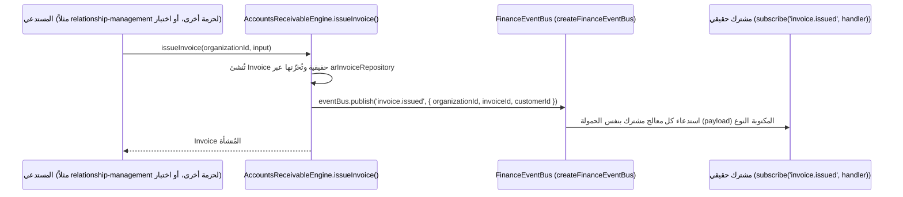
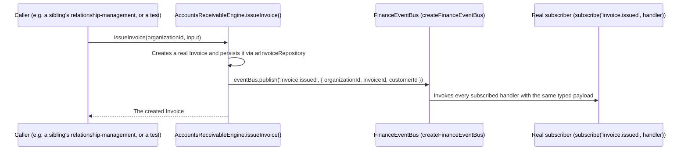

# العربية

## تدفق حدث نطاق مكتوب النوع: `invoice.issued` في `finance-engine`

بحسب `AI_PROJECT_CONTEXT.md` §8، كل حزمة فيها أحداث نطاق (31 من 39) تبني ناقل أحداثها فوق `createEventBus<TEventMap>()` العام من `shared-kernel`، ملفوفًا بـ `createXEventBus()` خاص بالحزمة وخريطة `type XEventMap`. الحدث المستخدم هنا **حقيقي وليس افتراضيًا** — تم التحقق من موقع نشره الفعلي في `packages/finance-engine/src/accounts-receivable/engine.impl.ts`.

- **تعريف الحدث** — `events/finance-event-bus.ts`: `'invoice.issued': { organizationId: string; invoiceId: string; customerId: string }` ضمن `FinanceEventMap`.
- **مصدر النشر الحقيقي** — `accounts-receivable/engine.impl.ts`، داخل عملية إصدار الفاتورة: `eventBus?.publish('invoice.issued', { organizationId, invoiceId, customerId: invoice.customerId })`.
- **المشترك** — أي مستهلك حقيقي مشترك في `FinanceEventBus` (على سبيل المثال طبقة تكامل تستمع لأحداث المالية لإشعار `communication-hub` أو تسجيل مؤشر في `analytics-engine` — الاشتراك نفسه خارج نطاق `finance-engine`، لكن الناقل يوفّر آلية `subscribe()` العامة من `shared-kernel`).

### لماذا هذا المثال يثبت الانضباط المعماري

- الحمولة (`payload`) مكتوبة بالكامل عبر `FinanceEventMap` — لا `any`، ولا حقل غير معرَّف مسبقًا.
- الاسم `invoice.issued` يتبع اصطلاح `noun.verb` بصيغة الماضي، تمامًا كما يفرض `AI_PROJECT_CONTEXT.md` §8.
- تم التحقق (في `RUNTIME_AUDIT.md`) أن كل حدث مُعلَن في خريطة أي حزمة **يُنشر فعليًا** من مسار كود حقيقي — لا إعلانات طموحة غير مستخدمة؛ هذا الحدث بالذات جزء من تلك العينة التي تم التحقق منها.

---

# English

## Typed Domain Event Flow: `invoice.issued` in `finance-engine`

Per `AI_PROJECT_CONTEXT.md` §8, every package with domain events (31 of 39) builds its event bus on `shared-kernel`'s generic `createEventBus<TEventMap>()`, wrapped in a package-specific `createXEventBus()` and a `type XEventMap` map. The event used here is **real, not hypothetical** — its actual publish site was verified in `packages/finance-engine/src/accounts-receivable/engine.impl.ts`.

- **Event definition** — `events/finance-event-bus.ts`: `'invoice.issued': { organizationId: string; invoiceId: string; customerId: string }` within `FinanceEventMap`.
- **Real publish site** — `accounts-receivable/engine.impl.ts`, inside the invoice-issuing operation: `eventBus?.publish('invoice.issued', { organizationId, invoiceId, customerId: invoice.customerId })`.
- **Subscriber** — any real consumer subscribed to `FinanceEventBus` (for example an integration layer that listens for finance events to notify `communication-hub` or record a metric in `analytics-engine` — the subscription itself is outside `finance-engine`'s own scope, but the bus provides `shared-kernel`'s generic `subscribe()` mechanism).

### Why this example demonstrates the architectural discipline

- The payload is fully typed via `FinanceEventMap` — no `any`, no undeclared field.
- The name `invoice.issued` follows the `noun.verb`, past-tense convention mandated by `AI_PROJECT_CONTEXT.md` §8.
- `RUNTIME_AUDIT.md` verified that every event declared in any package's map is **genuinely published** by a real code path — no aspirational, unused declarations; this specific event was part of that verified sample.

---

## Related Documents

- [AI_PROJECT_CONTEXT](../AI_PROJECT_CONTEXT.md)
- [RUNTIME_AUDIT](../certification/RUNTIME_AUDIT.md)
- [COMPONENT](./COMPONENT.md)

## Related Engines

`finance-engine` (concrete example; pattern applies to 31 of 39 packages).

## Related Commits

Commit 35 (`d9616a0` and the certification/documentation sprint that followed it).
