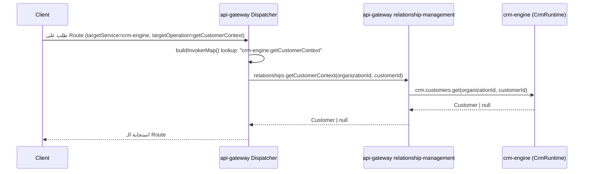
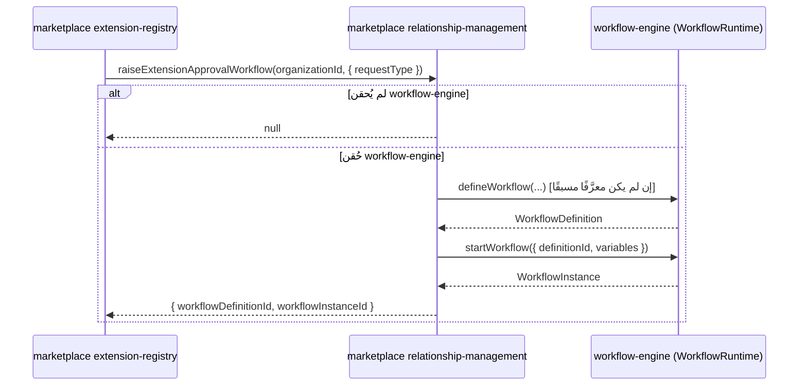
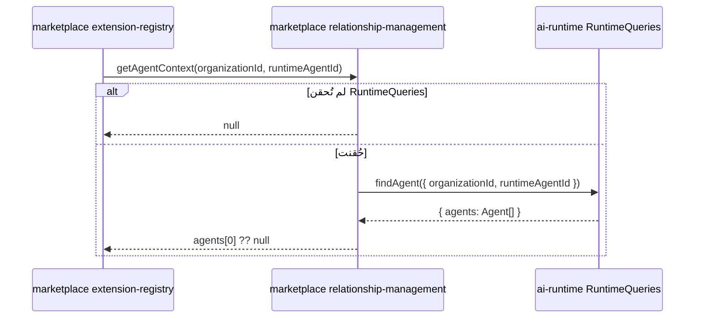
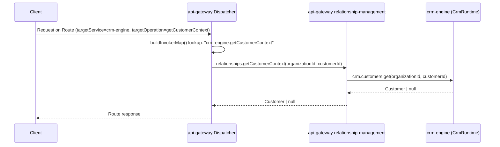
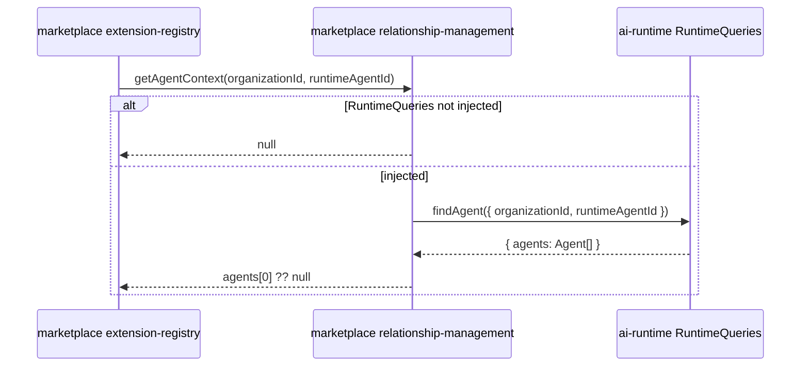

# العربية

## كيف تتكامل الحزم فعليًا — عبر طبقة العلاقات (Relationship Layer) فقط

القاعدة غير القابلة للتفاوض (`AI_PROJECT_CONTEXT.md` §4، البند 4): **التكامل بين الحزم يمر فقط عبر سطح Runtime العام لحزمة الشقيق**، أبدًا عبر مستودع (repository)، أبدًا عبر وحدة داخلية. الأمثلة الثلاثة أدناه حقيقية ومُتحقَّق منها مباشرة من الكود ومن `INTEGRATION_AUDIT.md`.

### مثال 1 — `api-gateway` يوجّه طلبًا إلى `crm-engine` عبر Runtime Dispatcher

`packages/api-gateway/src/dispatcher/invoker-map.ts`'s `buildInvokerMap()` يربط كل مفتاح `${targetService}:${targetOperation}` بدالة واحدة ثابتة. عندما يُسجَّل `Route` بـ `targetService: 'crm-engine'` و`targetOperation: 'getCustomerContext'`، فإن الاستدعاء الفعلي عند التوجيه هو `relationships.getCustomerContext()` — التي بدورها تستدعي `CrmRuntime.customers.get()` الحقيقية. **لا انعكاس (reflection)، لا استدعاء ديناميكي بالاسم** — جدول ثابت يُفحص وقت الترجمة.

### مثال 2 — `marketplace` يرفع سير عمل موافقة حقيقيًا عبر `workflow-engine`

`packages/marketplace/src/relationship-management/service.impl.ts`'s `raiseExtensionApprovalWorkflow()` تستدعي `workflow.defineWorkflow()` (بذاكرة تخزين مؤقت idempotent لكل `(organizationId, requestType)`) ثم `workflow.startWorkflow()` — وكلاهما استدعاءان حقيقيان على `WorkflowRuntime` العام لحزمة `workflow-engine`، لا أكثر.

### مثال 3 — `marketplace` يستعلم عن وكيل حقيقي من `ai-runtime` (حالة خاصة موثّقة)

`ai-runtime` لا يُصدّر `createXRuntime()` موحّدًا (انظر `RUNTIME_AUDIT.md` F3)، لذلك تُكتب اعتمادية `aiRuntime` في `RelationshipManagementDeps` مباشرة كـ `Pick<RuntimeQueries, 'findAgent'>` بدلًا من نوع Runtime كامل — نفس النمط الموثّق المتكرر في كل حزمة تتكامل مع `ai-runtime` عبر المنصة بأكملها.

---

# English

## How packages actually integrate — through the Relationship Layer only

The non-negotiable rule (`AI_PROJECT_CONTEXT.md` §4, item 4): **cross-package integration happens only through a sibling's public runtime surface**, never a repository, never an internal module. The three examples below are real and directly verified against the source and `INTEGRATION_AUDIT.md`.

### Example 1 — `api-gateway` routes a request into `crm-engine` via the Runtime Dispatcher

`packages/api-gateway/src/dispatcher/invoker-map.ts`'s `buildInvokerMap()` binds each `${targetService}:${targetOperation}` key to one fixed function. When a `Route` is registered with `targetService: 'crm-engine'` and `targetOperation: 'getCustomerContext'`, the real call made on dispatch is `relationships.getCustomerContext()` — which in turn calls the real `CrmRuntime.customers.get()`. **No reflection, no string-based dynamic invocation** — a compile-time-checked, fixed table.

### Example 2 — `marketplace` genuinely raises an approval workflow via `workflow-engine`

`packages/marketplace/src/relationship-management/service.impl.ts`'s `raiseExtensionApprovalWorkflow()` calls `workflow.defineWorkflow()` (idempotently cached per `(organizationId, requestType)`) then `workflow.startWorkflow()` — both real calls on `workflow-engine`'s public `WorkflowRuntime`, nothing more.

### Example 3 — `marketplace` queries a real agent from `ai-runtime` (a documented special case)

`ai-runtime` exposes no unified `createXRuntime()` (see `RUNTIME_AUDIT.md` F3), so the `aiRuntime` dependency in `RelationshipManagementDeps` is typed directly as `Pick<RuntimeQueries, 'findAgent'>` rather than a full Runtime type — the same documented, repeated pattern used by every package across the platform that integrates with `ai-runtime`.

---

## Related Documents

- [AI_PROJECT_CONTEXT](../AI_PROJECT_CONTEXT.md)
- [INTEGRATION_AUDIT](../certification/INTEGRATION_AUDIT.md)
- [marketplace ARCHITECTURE](../../packages/marketplace/ARCHITECTURE.md)
- [api-gateway GATEWAY_MODEL](../../packages/api-gateway/GATEWAY_MODEL.md)
- [RELATIONSHIP_FLOW](./RELATIONSHIP_FLOW.md)

## Related Engines

`api-gateway`, `crm-engine`, `marketplace`, `workflow-engine`, `ai-runtime`.

## Related Commits

Commit 35 (`d9616a0` and the certification/documentation sprint that followed it).
