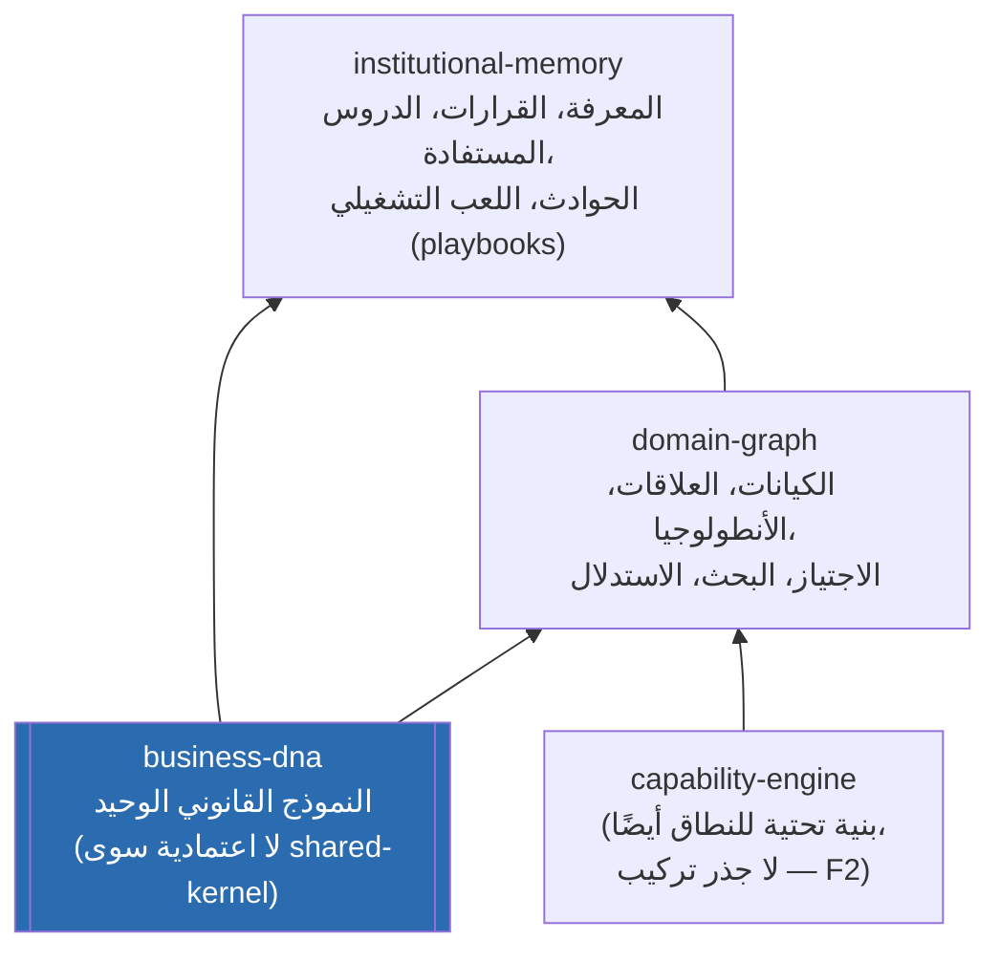
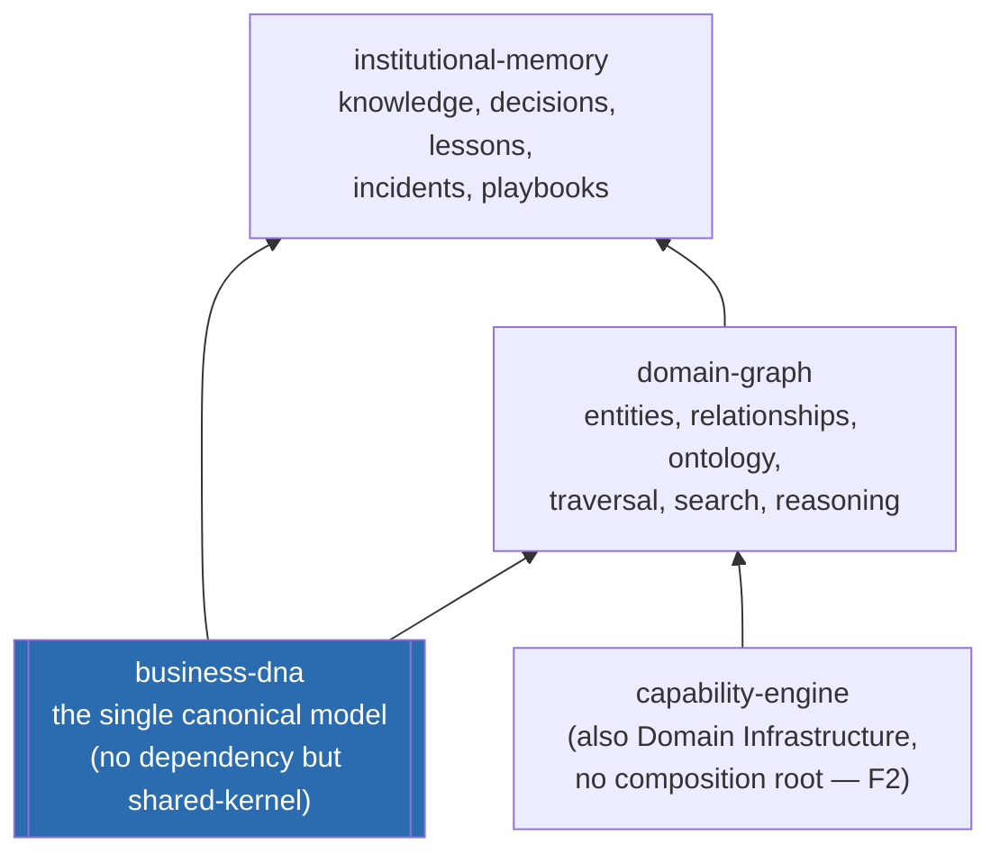

# العربية

## طبقة المعرفة القانونية للمنصة: `business-dna` → `domain-graph` → `institutional-memory`

هذه الحزم الثلاث تشكّل معًا "طبقة البنية التحتية للنطاق" (Domain Infrastructure) في `AI_PROJECT_CONTEXT.md` §3 (إلى جانب `capability-engine`). الترتيب أدناه **حقيقي ومُتحقَّق منه مباشرة من `package.json`** لكل حزمة، وليس افتراضًا:

- **`business-dna`** — لا يُصرّح بأي اعتمادية `@lateen-os/*` سوى `shared-kernel` — إنه الحزمة الأكثر مركزية (leaf) في الرسم البياني بأكمله (`DEPENDENCY_AUDIT.md` §F4)، ومصدر `OrganizationId` الوحيد للمنصة كلها.
- **`domain-graph`** — يعتمد فعليًا على `business-dna` و`capability-engine`.
- **`institutional-memory`** — يعتمد فعليًا على `business-dna` و`domain-graph` (أي أنه أعلى الثلاثة في السلسلة).

### قراءة الرسم

- `business-dna` هي الأساس الحقيقي: لا اعتمادية عليها بالمقابل (لا تعتمد على أي حزمة أعمال أخرى) — هذا يجعلها الأعلى مركزية في `DEPENDENCY_AUDIT.md`.
- `domain-graph` يبني رسمًا بيانيًا للكيانات والعلاقات **فوق** نموذج `business-dna`، مضيفًا التصنيف الأنطولوجي (ontology) والاستدلال (reasoning) والبحث.
- `institutional-memory` يبني **فوق كليهما**: يستهلك نموذج `business-dna` وبنية `domain-graph` لتسجيل قرارات ودروس ومعرفة مؤسسية قابلة للاستدعاء لاحقًا — وهي نفسها المستهلكة من طرف حزم أخرى عبر `relationship-management/` (مثل `logMarketplaceDecisionToMemory()` في `marketplace`، و`lifecycle.create()` المُستخدمة من `finance-engine`).
- الحزم الثلاث معًا هي ما يجعل الاستدلال (`decision-engine`, `intelligence-engine`, ...) وطبقة الأعمال (`crm-engine`, `finance-engine`, ...) تعملان على **حقيقة واحدة مشتركة** بدلًا من نسخ منفصلة من نموذج العمل.

---

# English

## The Platform's Canonical-Knowledge Layer: `business-dna` → `domain-graph` → `institutional-memory`

These three packages together form the "Domain Infrastructure" layer in `AI_PROJECT_CONTEXT.md` §3 (alongside `capability-engine`). The chain below is **real, directly verified from each package's own `package.json`**, not assumed:

- **`business-dna`** — declares no `@lateen-os/*` dependency other than `shared-kernel` — it is the most central (leaf) package in the entire graph (`DEPENDENCY_AUDIT.md` F4), and the platform's single source of `OrganizationId`.
- **`domain-graph`** — genuinely depends on `business-dna` and `capability-engine`.
- **`institutional-memory`** — genuinely depends on `business-dna` and `domain-graph` (i.e. it sits highest of the three in the chain).

### Reading the diagram

- `business-dna` is the real foundation: nothing depends *it* on any other business package (it depends on nothing beyond `shared-kernel`) — this is what makes it the most central package in `DEPENDENCY_AUDIT.md`.
- `domain-graph` builds an entity/relationship graph **on top of** the `business-dna` model, adding ontology classification, reasoning, and search.
- `institutional-memory` builds **on top of both**: it consumes `business-dna`'s model and `domain-graph`'s structure to record decisions, lessons, and institutional knowledge that can be recalled later — the same knowledge later consumed by other packages via `relationship-management/` (e.g. `marketplace`'s `logMarketplaceDecisionToMemory()`, or the `lifecycle.create()` method used by `finance-engine`).
- Together, these three packages are what let the reasoning stack (`decision-engine`, `intelligence-engine`, ...) and the business layer (`crm-engine`, `finance-engine`, ...) operate on **one shared truth** instead of separate copies of the business model.

---

## Related Documents

- [AI_PROJECT_CONTEXT](../AI_PROJECT_CONTEXT.md)
- [DEPENDENCY](./DEPENDENCY.md)
- [ERP_LAYER](./ERP_LAYER.md)

## Related Engines

`business-dna`, `institutional-memory`, `domain-graph`, `capability-engine`.

## Related Commits

Commit 35 (`d9616a0` and the certification/documentation sprint that followed it).
