# العربية

## خريطة الحزم الكاملة — 39 حزمة تحت `packages/*`

هذا الرسم يضع **كل حزمة حقيقية واحدة** (تم التحقق منها عبر `ls packages` مع استبعاد `README.md`) داخل الطبقة الصحيحة، بحسب جدول `AI_PROJECT_CONTEXT.md` §3. لا حزمة مُخترعة، ولا حزمة مفقودة — العدد الإجمالي 39، وهو الرقم الصحيح بعد تصحيح الخطأ السردي السابق ("38 حزمة") في تقارير الشهادة.

### ملاحظات

- الترقيم `P01`…`P39` تسلسلي لأغراض العد المرئي فقط — ليس ترتيب بناء أو أولوية.
- `marketplace` في `packages/*` اسمه في `package.json` هو `@lateen-os/marketplace-engine` (وليس `@lateen-os/marketplace`) — بعد إصلاح تعارض الاسم الموثّق في `AI_PROJECT_CONTEXT.md` §9.
- التفاصيل الدقيقة لكل حزمة (الوصف، الاعتماديات، حالة التوثيق) موجودة في `docs/architecture/PACKAGE_CATALOG.md` — هذا الرسم يعرض فقط التصنيف حسب الطبقة.

---

# English

## Full Package Map — 39 Packages Under `packages/*`

This diagram places **every single real package** (verified via `ls packages`, excluding `README.md`) into its correct layer, per `AI_PROJECT_CONTEXT.md` §3's table. No invented package, no missing package — the total is 39, the correct figure after the prior "38 packages" narrative miscount in the certification reports was corrected.

```mermaid
flowchart TB
  subgraph L1["Foundation"]
    P01["shared-kernel"]
  end

  subgraph L2["LLM Abstraction"]
    P02["ai-provider-hub"]
  end

  subgraph L3["Reasoning Stack"]
    P03["decision-engine"]
    P04["intelligence-engine"]
    P05["ai-runtime"]
    P06["ai-brain"]
    P07["ceo-engine"]
  end

  subgraph L4["Coordination / Digital Labor"]
    P08["workflow-engine"]
    P09["multi-agent"]
    P10["ai-workforce"]
  end

  subgraph L5["Domain Infrastructure"]
    P11["business-dna"]
    P12["institutional-memory"]
    P13["domain-graph"]
    P14["capability-engine"]
  end

  subgraph L6["Business Engines"]
    P15["crm-engine"]
    P16["sales-engine"]
    P17["marketing-engine"]
    P18["communication-hub"]
    P19["finance-engine"]
    P20["hr-engine"]
    P21["inventory-engine"]
    P22["project-management-engine"]
    P23["customer-success-engine"]
    P24["document-management-engine"]
  end

  subgraph L7["Trust Layer"]
    P25["ai-security-engine"]
    P26["ai-governance-engine"]
    P27["ai-compliance-engine"]
  end

  subgraph L8["Horizontal / Operational"]
    P28["analytics-engine"]
    P29["observability-engine"]
  end

  subgraph L9["Platform Surface"]
    P30["api-gateway"]
    P31["admin-console"]
    P32["marketplace (@lateen-os/marketplace-engine)"]
  end

  subgraph L10["Developer Surface / Platform Infra"]
    P33["sdk"]
    P34["kernel"]
    P35["extension-system"]
    P36["connector-base"]
    P37["integration-contracts"]
    P38["typescript-config"]
    P39["integration-tests"]
  end

  L1 --> L2 --> L3 --> L4 --> L5 --> L6 --> L7 --> L8 --> L9
  L10 -.-> L1
  L10 -.-> L3
  L10 -.-> L6
  L10 -.-> L9
```

### Notes

- The `P01`…`P39` numbering is sequential purely for visual counting — it is not a build order or priority ranking.
- `marketplace`'s `package.json` name is `@lateen-os/marketplace-engine` (not `@lateen-os/marketplace`) — after the name-collision fix documented in `AI_PROJECT_CONTEXT.md` §9.
- Exact per-package detail (description, dependencies, documentation status) lives in `docs/architecture/PACKAGE_CATALOG.md` — this diagram only shows layer classification.

---

## Related Documents

- [AI_PROJECT_CONTEXT](../AI_PROJECT_CONTEXT.md)
- [ARCHITECTURE_AUDIT](../certification/ARCHITECTURE_AUDIT.md)
- [CONTAINER](./CONTAINER.md)
- [DEPENDENCY](./DEPENDENCY.md)

## Related Engines

All 39 `packages/*`.

## Related Commits

Commit 35 (`d9616a0` and the certification/documentation sprint that followed it).
