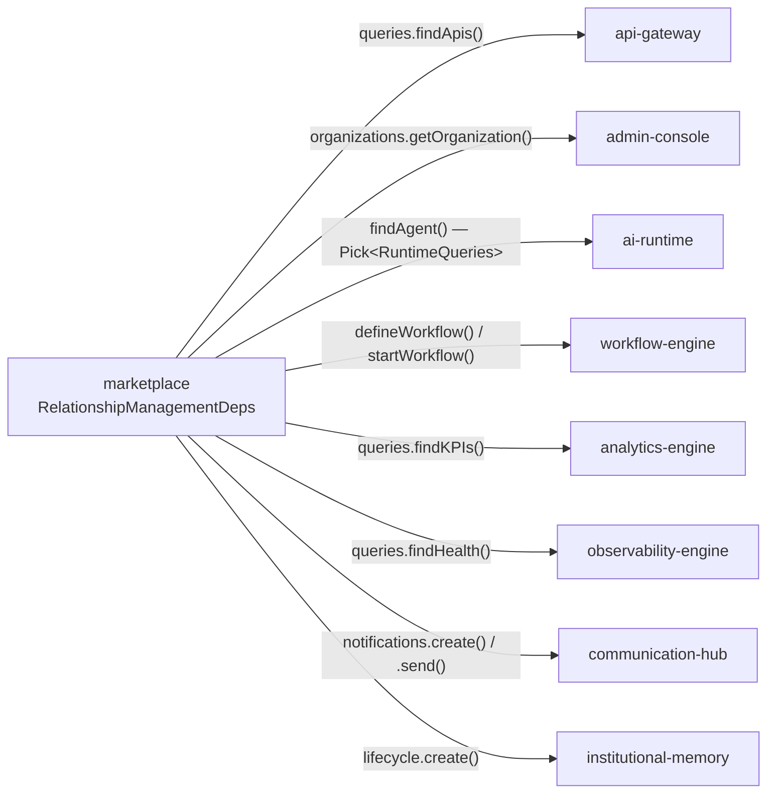
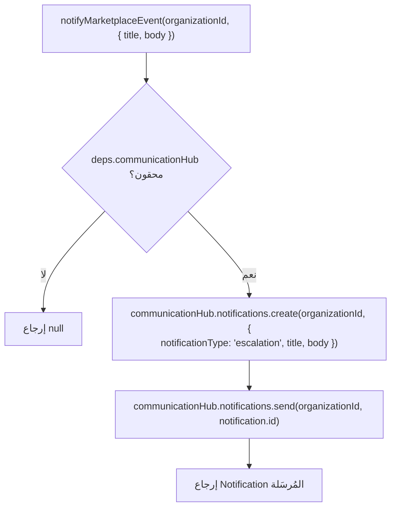
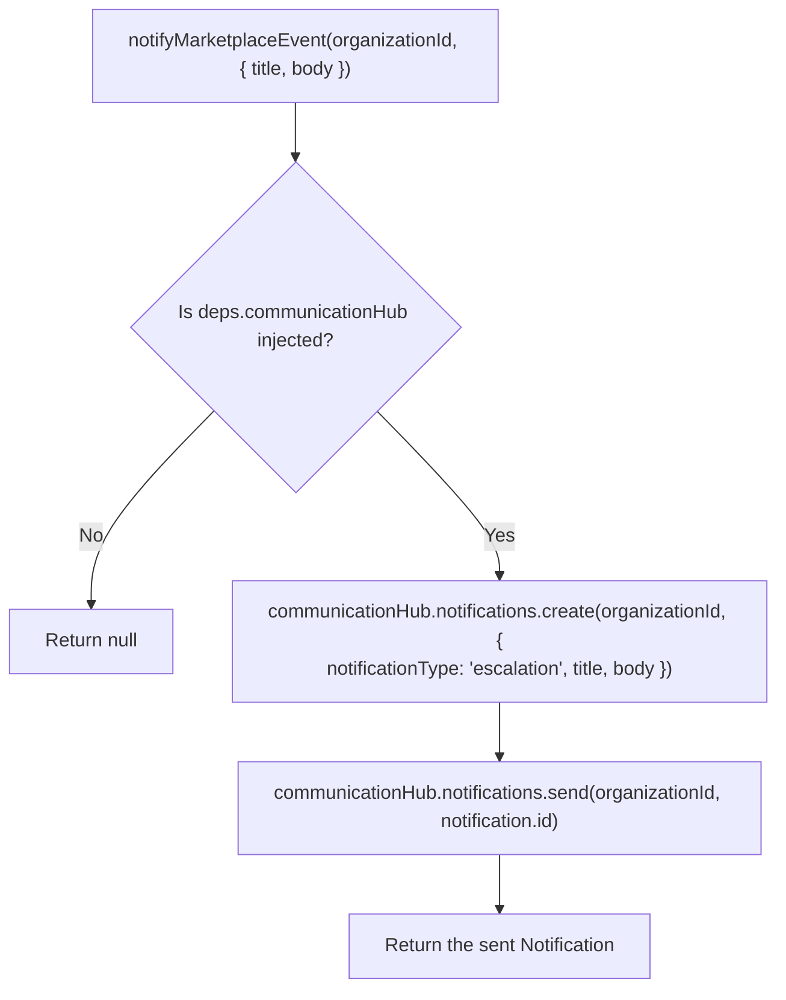

# العربية

## طبقة إدارة العلاقات: طريقة واحدة لكل شقيق، تدهور موثّق دائمًا

`packages/marketplace/src/relationship-management/` هي القائمة المركزية الوحيدة والشاملة لكل تكامل مع الأشقاء في حزمة `marketplace` — **8 تكاملات حقيقية**، كل واحدة عبر طريقة واحدة مسمّاة على السطح العام لتلك الحزمة الشقيقة، لا أكثر. هذا الرسم يعرض الشكل العام لكل الثمانية، ثم يُفصّل واحدًا منها (`notifyMarketplaceEvent` مع `communication-hub`) بمنطق التدهور الكامل.

### تفصيل: `notifyMarketplaceEvent()` مع `communication-hub`

كل طريقة في `RelationshipManagement` تأخذ فقط بيانات بسيطة (`organizationId` + كائن مدخل صغير)، تستدعي طريقة عامة واحدة مسمّاة على الشقيق المحقون، وتُعيد `null`/`[]` بدقة عندما لا يكون ذلك الشقيق محقونًا — أبدًا استثناءً غير متوقع.

### لماذا هذا مهم معماريًا

- `RelationshipManagementDeps` (في `types.ts`) تُصرّح كل شقيق كـ `Pick<SiblingRuntime, '...'>` ضيّق — أبدًا نوع Runtime كامل.
- كل الثمانية اختيارية بشكل مستقل — تعمل `marketplace` وتُختبر بالكامل دون شبكة حتى لو لم يُحقن أي شقيق إطلاقًا.
- `ai-runtime` هي الحالة الخاصة الموثّقة: بما أنها لا تُصدّر `createXRuntime()` موحّدًا، تُكتب اعتماديتها مباشرة كـ `Pick<RuntimeQueries, 'findAgent'>` بدلًا من نوع Runtime لحزمة.

---

# English

## The Relationship-Management Layer: one method per sibling, always degrading in a documented way

`packages/marketplace/src/relationship-management/` is the single, centralized, exhaustive list of every sibling integration `marketplace` performs — **8 real integrations**, each through exactly one named method on that sibling's public surface, nothing more. This diagram shows the overall shape of all eight, then details one of them (`notifyMarketplaceEvent` with `communication-hub`) with its full degrade logic.

### Detail: `notifyMarketplaceEvent()` with `communication-hub`

Every method on `RelationshipManagement` takes only plain data (`organizationId` + a small input object), calls exactly one named public method on the injected sibling, and returns `null`/`[]` precisely when that sibling was not injected — never an unexpected exception.

### Why this matters architecturally

- `RelationshipManagementDeps` (in `types.ts`) types every collaborator as a narrow `Pick<SiblingRuntime, '...'>` — never a full Runtime type.
- All eight are independently optional — `marketplace` runs and is fully tested completely offline even if no sibling is ever injected.
- `ai-runtime` is the documented special case: since it exposes no unified `createXRuntime()`, its dependency is typed directly as `Pick<RuntimeQueries, 'findAgent'>` rather than a package Runtime type.

---

## Related Documents

- [AI_PROJECT_CONTEXT](../AI_PROJECT_CONTEXT.md)
- [INTEGRATION_AUDIT](../certification/INTEGRATION_AUDIT.md)
- [marketplace ARCHITECTURE](../../packages/marketplace/ARCHITECTURE.md)
- [INTEGRATION](./INTEGRATION.md)

## Related Engines

`marketplace` (8 real sibling integrations).

## Related Commits

Commit 35 (`d9616a0` and the certification/documentation sprint that followed it).
