# العربية

## نمط جذر التركيب: كيف يبني `createXRuntime(deps = {})` سطحه العام

جذر التركيب (composition root) هو، بحسب `AI_PROJECT_CONTEXT.md` §5، **المكان الوحيد** في الحزمة الذي يُنشأ فيه كل مستودع، وتُركّب فيه كل خدمة داخلية مع اعتمادياتها، ويُجمّع فيه السطح العام النهائي ويُعاد. المثال الملموس أدناه هو **الكود الحقيقي** لـ `packages/finance-engine/src/runtime.ts`'s `createFinanceRuntime()` — وليس نمطًا مصطنعًا.

```mermaid
flowchart LR
  subgraph INPUT["المدخلات (اختيارية كلها)"]
    D1["deps.now?"]
    D2["deps.eventBus?"]
    D3["deps.exchangeRateProvider?"]
    D4["deps.crm / sales / businessDna /\nworkflow / communicationHub /\nanalytics / institutionalMemory?"]
  end

  subgraph ROOT["createFinanceRuntime(deps = {})"]
    STEP1["1. now = deps.now ?? nowIso\neventBus = deps.eventBus ?? createFinanceEventBus()"]
    STEP2["2. إنشاء كل مستودع\n(fiscalYearRepository, accountRepository,\njournalEntryRepository, arInvoiceRepository, ...)"]
    STEP3["3. تركيب كل محرك بحقن مستودعاته + eventBus + now\n(createFinancialOrganizationEngine, createChartOfAccountsEngine,\ncreateGeneralLedgerEngine, ...)"]
    STEP4["4. createRelationshipManagement({ crm, sales, businessDna,\nworkflow, communicationHub, analytics, institutionalMemory })"]
    STEP5["5. createFinanceQueries({ accountRepository,\njournalEntryRepository, arInvoiceRepository, ... })"]
    STEP6["6. تجميع وإرجاع FinanceRuntime\n(بلا أي مستودع في السطح العام)"]
  end

  subgraph OUTPUT["FinanceRuntime (السطح العام)"]
    O1["financialOrganization, chartOfAccounts,\ngeneralLedger, accountsReceivable,\naccountsPayable, treasury, budgets, tax, reports"]
    O2["relationships: RelationshipManagement"]
    O3["queries: FinanceQueries"]
    O4["events: FinanceEventBus"]
  end

  INPUT --> STEP1 --> STEP2 --> STEP3 --> STEP4 --> STEP5 --> STEP6 --> OUTPUT
```

### القواعد التي يفرضها هذا النمط

1. **المستودعات لا تُصدَّر أبدًا** — تُنشأ في الخطوة 2 وتبقى مغلقة (closure) داخل الخطوة 3؛ لا تظهر في `FinanceRuntime` النهائي إطلاقًا.
2. **كل اعتمادية اختيارية وتتدهور بشكل موثّق** — إذا لم تُحقن `deps.crm`، فإن `relationships.getCustomerContext()`-النظير (أو مكافئه) يُعيد `null`/`[]` بدلًا من الانهيار.
3. **الحتمية أولًا** — `now` قابل للحقن دائمًا، ولا استدعاء مباشر لـ `Date.now()`/`new Date()` داخل منطق الأعمال.
4. **نفس النمط، حزم مختلفة، أسماء مختلفة أحيانًا** — أربع حزم من العصر الأول تستخدم اسمًا مختلفًا لنفس الفكرة (`createBrain`, `createProviderHub`, `createCeoEngine`, `createExtensionSystem`) وثلاث حزم لا تُصدّر جذرًا موحّدًا إطلاقًا (`ai-runtime`, `decision-engine`, `intelligence-engine`) — التفصيل الكامل في `COMPOSITION_ROOTS.md`.

---

# English

## The Composition-Root Runtime Pattern: how `createXRuntime(deps = {})` builds its public surface

A composition root is, per `AI_PROJECT_CONTEXT.md` §5, the **only** place in a package where every repository is constructed, every internal service is wired with its dependencies, and the final public surface is assembled and returned. The concrete example below is the **real code** of `packages/finance-engine/src/runtime.ts`'s `createFinanceRuntime()` — not a synthetic pattern.

```mermaid
flowchart LR
  subgraph INPUT["Inputs (all optional)"]
    D1["deps.now?"]
    D2["deps.eventBus?"]
    D3["deps.exchangeRateProvider?"]
    D4["deps.crm / sales / businessDna /\nworkflow / communicationHub /\nanalytics / institutionalMemory?"]
  end

  subgraph ROOT["createFinanceRuntime(deps = {})"]
    STEP1["1. now = deps.now ?? nowIso\neventBus = deps.eventBus ?? createFinanceEventBus()"]
    STEP2["2. Construct every repository\n(fiscalYearRepository, accountRepository,\njournalEntryRepository, arInvoiceRepository, ...)"]
    STEP3["3. Wire every engine, injecting its repositories + eventBus + now\n(createFinancialOrganizationEngine, createChartOfAccountsEngine,\ncreateGeneralLedgerEngine, ...)"]
    STEP4["4. createRelationshipManagement({ crm, sales, businessDna,\nworkflow, communicationHub, analytics, institutionalMemory })"]
    STEP5["5. createFinanceQueries({ accountRepository,\njournalEntryRepository, arInvoiceRepository, ... })"]
    STEP6["6. Assemble and return FinanceRuntime\n(no repository anywhere on the public surface)"]
  end

  subgraph OUTPUT["FinanceRuntime (public surface)"]
    O1["financialOrganization, chartOfAccounts,\ngeneralLedger, accountsReceivable,\naccountsPayable, treasury, budgets, tax, reports"]
    O2["relationships: RelationshipManagement"]
    O3["queries: FinanceQueries"]
    O4["events: FinanceEventBus"]
  end

  INPUT --> STEP1 --> STEP2 --> STEP3 --> STEP4 --> STEP5 --> STEP6 --> OUTPUT
```

### Rules this pattern enforces

1. **Repositories are never exported** — created in step 2, kept in closure through step 3; they never appear in the final `FinanceRuntime`.
2. **Every dependency is optional and degrades in a documented way** — if `deps.crm` is not injected, the corresponding relationship method returns `null`/`[]` instead of throwing.
3. **Determinism first** — `now` is always injectable; no direct `Date.now()`/`new Date()` call inside business logic.
4. **Same pattern, different packages, sometimes different names** — four Era-1 packages use a differently-named entry point for the same idea (`createBrain`, `createProviderHub`, `createCEOEngine`, `createExtensionSystem`), and three packages expose no unified root at all (`ai-runtime`, `decision-engine`, `intelligence-engine`) — full detail in `COMPOSITION_ROOTS.md`.

---

## Related Documents

- [AI_PROJECT_CONTEXT](../AI_PROJECT_CONTEXT.md)
- [COMPONENT](./COMPONENT.md)
- [COMPOSITION_ROOTS](./COMPOSITION_ROOTS.md)
- [RUNTIME_AUDIT](../certification/RUNTIME_AUDIT.md)

## Related Engines

`finance-engine` (concrete example); pattern applies to 24 of 39 packages exactly, per `RUNTIME_AUDIT.md`.

## Related Commits

Commit 35 (`d9616a0` and the certification/documentation sprint that followed it).
