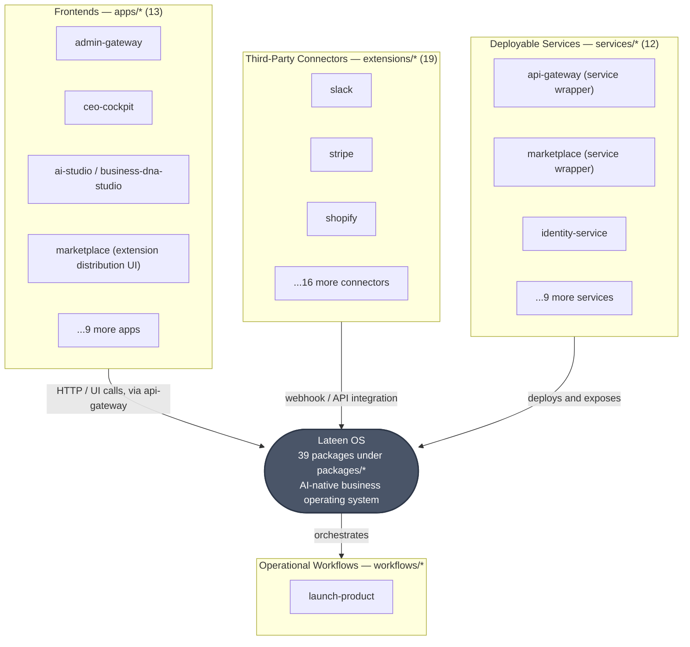

# العربية

## رسم سياق النظام (C4 — System Context)

يوضّح هذا الرسم **Lateen OS** كنظام واحد (Level 1 في نموذج C4)، مع الجهات الخارجية الثلاث التي تتعامل معه فعليًا في هذا المستودع: واجهات المستخدم الأمامية (`apps/*`)، الموصلات الخارجية من أطراف ثالثة (`extensions/*`)، والخدمات القابلة للنشر (`services/*`). هذه الجهات الثلاث **مستهلكة** (consumers) للنظام، وليست جزءًا من انضباط بناء `packages/*` نفسه — كما ينص `AI_PROJECT_CONTEXT.md` §3.

لأن Mermaid لا يدعم `C4Context` بشكل موثوق عبر كل عارض Markdown يُستخدم في هذا المستودع، اخترنا `flowchart TB` كصيغة أكثر استقرارًا مع الحفاظ على دلالة "سياق النظام" نفسها: صندوق واحد يمثّل النظام بأكمله، وصناديق محيطة تمثّل الجهات الخارجية.

القوائم أدناه **حقيقية** ومأخوذة من المجلدات الفعلية في هذا المستودع (`ls apps`, `ls extensions`, `ls services`)، وليست تقديرًا:

- **`apps/*` (13 واجهة)**: `admin-gateway`, `ai-product-manager`, `ai-studio`, `analytics-center`, `automation-studio`, `business-dna-studio`, `ceo-cockpit`, `cloud-console`, `customer-portal`, `lateen-assistant`, `marketplace`, `search-center`, `setup-wizard`.
- **`extensions/*` (19 موصلًا)**: `dropbox`, `erpnext`, `gmail`, `google-drive`, `google-workspace`, `hubspot`, `microsoft-365`, `odoo`, `onedrive`, `outlook`, `paypal`, `printing-industry`, `quickbooks`, `shopify`, `slack`, `stripe`, `teams`, `whatsapp-business`, `woocommerce`.
- **`services/*` (12 خدمة قابلة للنشر)**: `analytics-platform`, `api-gateway`, `business-dna-service`, `cloud-control-plane`, `identity-service`, `integration-hub`, `knowledge-platform`, `marketplace`, `mission-scheduler`, `product-discovery`, `provisioning`, `search-platform`.
- **`workflows/*`**: `launch-product` — عملية تشغيلية مستهلكة أيضًا لسطح المنصة العام.

ملاحظة مهمة: `apps/marketplace` (واجهة توزيع الإضافات) و`packages/marketplace` (`@lateen-os/marketplace-engine`، المحرك الخلفي) و`services/marketplace` (`@lateen-os/marketplace-service`) ثلاث حزم منفصلة الهوية تشترك فقط في اسم المجلد — راجع `AI_PROJECT_CONTEXT.md` §9 لتفاصيل حادثة تعارض الأسماء التي وقعت وتم إصلاحها.

### قراءة الرسم

- **الصندوق المركزي** يمثّل كامل انضباط `packages/*` (39 حزمة) كنظام واحد — التفاصيل الداخلية (الطبقات) في `CONTAINER.md`.
- الأسهم من `apps/*` و`extensions/*` تمر عمليًا عبر `api-gateway` (طبقة سطح المنصة) لا مباشرة إلى المحركات الداخلية — راجع `packages/api-gateway/GATEWAY_MODEL.md` لآلية الإرسال (Runtime Dispatcher).
- `services/*` هي أغلفة نشر (deployment wrappers) حول حزم `packages/*` المقابلة (`api-gateway`, `marketplace`, ...) — وليست حزمًا منفصلة معماريًا.

---

# English

## System Context Diagram (C4 — System Context)

This diagram shows **Lateen OS** as a single system (C4 Level 1), together with the three real classes of external actor that interact with it in this repository: frontend applications (`apps/*`), third-party connectors (`extensions/*`), and deployable services (`services/*`). All three are **consumers** of the system, not part of the `packages/*` engine-construction discipline itself — per `AI_PROJECT_CONTEXT.md` §3.

Mermaid's `C4Context` diagram type does not render reliably across every Markdown renderer used in this repository, so a `flowchart TB` was used instead to preserve the same "system context" semantics: one box for the whole system, surrounded by boxes for each external actor group.

The lists below are **real**, taken directly from this repository's actual directories (`ls apps`, `ls extensions`, `ls services`), not estimated:

- **`apps/*` (13 frontends)**: `admin-gateway`, `ai-product-manager`, `ai-studio`, `analytics-center`, `automation-studio`, `business-dna-studio`, `ceo-cockpit`, `cloud-console`, `customer-portal`, `lateen-assistant`, `marketplace`, `search-center`, `setup-wizard`.
- **`extensions/*` (19 connectors)**: `dropbox`, `erpnext`, `gmail`, `google-drive`, `google-workspace`, `hubspot`, `microsoft-365`, `odoo`, `onedrive`, `outlook`, `paypal`, `printing-industry`, `quickbooks`, `shopify`, `slack`, `stripe`, `teams`, `whatsapp-business`, `woocommerce`.
- **`services/*` (12 deployable services)**: `analytics-platform`, `api-gateway`, `business-dna-service`, `cloud-control-plane`, `identity-service`, `integration-hub`, `knowledge-platform`, `marketplace`, `mission-scheduler`, `product-discovery`, `provisioning`, `search-platform`.
- **`workflows/*`**: `launch-product` — an operational process that also consumes the platform's public surface.

Important note: `apps/marketplace` (extension-distribution frontend), `packages/marketplace` (`@lateen-os/marketplace-engine`, the backend engine), and `services/marketplace` (`@lateen-os/marketplace-service`) are three separately-identified packages that only share a directory basename — see `AI_PROJECT_CONTEXT.md` §9 for the real name-collision incident this once caused, and how it was fixed.

### Reading the diagram

- The **center box** represents the entire `packages/*` discipline (39 packages) as one system — internal detail (layers) is in `CONTAINER.md`.
- Arrows from `apps/*` and `extensions/*` pass, in practice, through `api-gateway` (the platform-surface layer) rather than reaching internal engines directly — see `packages/api-gateway/GATEWAY_MODEL.md` for the dispatch mechanism (the Runtime Dispatcher).
- `services/*` are deployment wrappers around the corresponding `packages/*` package (`api-gateway`, `marketplace`, ...) — not architecturally separate packages.

---

## Related Documents

- [AI_PROJECT_CONTEXT](../AI_PROJECT_CONTEXT.md)
- [ARCHITECTURE_AUDIT](../certification/ARCHITECTURE_AUDIT.md)
- [INTEGRATION_AUDIT](../certification/INTEGRATION_AUDIT.md)
- [CONTAINER](./CONTAINER.md)

## Related Engines

All 39 `packages/*` (as one system).

## Related Commits

Commit 35 (`d9616a0` and the certification/documentation sprint that followed it).
