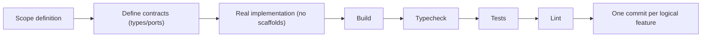

# العربية

## الخطة الرئيسية لنظام Lateen OS

### 1. رؤية المشروع

Lateen OS هو نظام تشغيل أعمال أصيل الذكاء الاصطناعي (AI-native Business Operating System). لا يُقصد به أن يكون تطبيقًا واحدًا، بل طبقة تشغيلية كاملة تُدير الشركة: نموذج العمل، الذاكرة المؤسسية، الاستدلال، اتخاذ القرار، وفرق العمل الرقمية (AI Workforce) التي تنفّذ العمل ضمن صلاحيات محددة.

المبدأ التأسيسي: **الذكاء الاصطناعي يُنتج توصيات؛ محرك القرار (Decision Engine) هو الجهة الوحيدة المخوّلة لتحويل التوصية إلى قرار تنفيذي.** هذا الفصل بين "التفكير" و"القرار" هو ما يجعل النظام قابلًا للتدقيق، والحوكمة، والامتثال على مستوى المؤسسة.

### 2. المهمة (Mission)

بناء طبقة تشغيل موحّدة تجمع بين:

- **نموذج عمل قانوني واحد** (Business DNA) يستهلكه كل مكوّن آخر، بدلًا من أن يحتفظ كل نظام فرعي بنسخته الخاصة من الحقيقة.
- **استدلال حتمي وقابل للتفسير** حيثما أمكن، مع اقتصار الاستدعاءات غير الحتمية (نماذج اللغة الكبيرة) على الطبقات التي تحتاجها فعليًا.
- **حوكمة وأمن وامتثال مدمجة في البنية**، لا مضافة كطبقة لاحقة.

### 3. الأهداف

#### 3.1 الأهداف التجارية

| الهدف | الوصف |
| --- | --- |
| تسريع القرار المؤسسي | تقليص الفجوة الزمنية بين حدوث إشارة عمل وبين اتخاذ قرار مدروس بشأنها |
| تشغيل مستمر غير تفاعلي فقط | تمكين النظام من العمل في **الوضع الاستباقي** (مراقبة مستمرة، اقتراحات غير مطلوبة) وليس فقط الوضع التفاعلي |
| خفض تكلفة التنسيق البشري | نقل التنسيق الروتيني بين الفرق (تسويق، مبيعات، عمليات) إلى طبقة تنسيق آلية قابلة للتدقيق |
| قابلية التوسّع التجاري | دعم نطاقات أعمال متعددة (مبيعات، تسويق، CRM، اتصالات) دون إعادة بناء الأساس |

#### 3.2 الأهداف التقنية

| الهدف | الوصف |
| --- | --- |
| حزمة أساس واحدة | جميع الحزم تُبنى فوق `shared-kernel` دون استثناء |
| صفر اعتماديات دائرية | يُفرض بنيويًا عبر رسم بياني حزم أحادي الاتجاه (DAG) — انظر [03_CONSTITUTION](./03_CONSTITUTION.md) |
| عزل مزوّدي نماذج اللغة | كل استدعاء لنموذج لغة كبير يمر عبر `ai-provider-hub` فقط |
| قابلية اختبار كاملة دون شبكة | كل منطق أعمال قابل للاختبار بمستودعات في-الذاكرة، دون اعتماد على خدمة حية |

#### 3.3 أهداف العمارة

- الحفاظ على العمارة النظيفة (Clean Architecture): الاعتماديات تتجه دائمًا نحو الداخل.
- كل حزمة تُصدّر عقودًا (types/ports) قبل أي تنفيذ (implementation).
- جذر تركيب (composition root) واحد لكل محرك عبر دالة `createXRuntime()`.

#### 3.4 الأهداف الهندسية

- كل التزام (commit) يمثل ميزة منطقية واحدة مكتملة الإنتاج — لا سقالات (scaffolds)، لا تنفيذ جزئي.
- التحقق يسير دائمًا بالترتيب: بناء → فحص الأنواع → اختبارات → linting.
- التوثيق جزء من المنتج، لا ملحق له.

### 4. المعلم الحالي (Current Milestone)

**المرحلة 1 — الأساس المنصّي (Platform Foundation)**: مكتملة عبر 25 التزامًا (Commit 1 → Commit 25)، من `ea48fe6` (`shared-kernel`) إلى `d9616a0` (`observability-engine`). التفاصيل الكاملة في [09_COMMIT_HISTORY](./09_COMMIT_HISTORY.md) و[08_PROJECT_STATUS](./08_PROJECT_STATUS.md).

### 5. المعالم المكتملة

23 محركًا/منصة تم تنفيذها فعليًا (تنفيذ حقيقي، لا سقالات) — القائمة الكاملة وحالة كل محرك في [08_PROJECT_STATUS](./08_PROJECT_STATUS.md) ضمن "مصفوفة المحركات".

### 6. المعالم المتبقية

انظر قسم "خارطة الطريق المستقبلية" في [08_PROJECT_STATUS](./08_PROJECT_STATUS.md) — المرحلة 2 تشمل تطبيقات المؤسسة (المالية، الموارد البشرية، المخزون، المشاريع، نجاح العملاء، لوحة الإدارة، بوابة API، السوق).

### 7. مقاييس النجاح

| المقياس | التعريف |
| --- | --- |
| تغطية العقود | نسبة الحزم التي تُصدّر أنواعًا/منافذ (ports) قبل أي تنفيذ |
| نظافة الرسم البياني | صفر اعتماديات دائرية بين الحزم (مفروض عبر `turbo` و`pnpm workspace`) |
| قابلية الاختبار دون اتصال | نسبة الاختبارات التي تعمل دون مزوّد حي لنموذج لغة |
| اكتمال جذر التركيب | كل محرك يُصدّر `createXRuntime()` واحدًا وواضحًا |

### 8. تعريف الجاهزية (Definition of Ready)

تُعتبر مهمة "جاهزة" للتنفيذ عندما:

- تم تحديد الحزمة (الحزم) المتأثرة ونطاقها بدقة.
- العقود (الأنواع، أحداث النطاق، منافذ المستودع) معروفة أو يمكن اشتقاقها من `business-dna`/`shared-kernel`.
- لا تعارض مع قواعد [03_CONSTITUTION](./03_CONSTITUTION.md) (خاصة قاعدة اللادورية وقاعدة مزوّد الذكاء الاصطناعي الموحّد).

### 9. تعريف الاكتمال (Definition of Done)

تُعتبر مهمة "مكتملة" فقط عندما:

- البناء (build) ينجح لكل الحزم المتأثرة والحزم التابعة لها.
- فحص الأنواع (typecheck) يمر دون أخطاء.
- الاختبارات (tests) تمر، بما فيها اختبارات `integration-tests` إن كانت الحزمة ضمن `createLateen()`.
- الـ linting نظيف.
- لا TODO، لا placeholder، لا تنفيذ جزئي.
- التوثيق ذو الصلة محدّث (هذا الكتيّب أو تقارير `docs/architecture/`).

### 10. سير عمل التطوير

### 11. سير عمل العمارة

كل تغيير معماري جوهري (إضافة حزمة، تغيير اتجاه اعتمادية، كسر عقد) يجب أن يُوثَّق كـ ADR جديد ضمن `docs/adr/`، متبوعًا بتحديث [03_CONSTITUTION](./03_CONSTITUTION.md) إذا أضاف قاعدة دائمة.

### 12. سير عمل التوثيق

1. كل حزمة جديدة تُحدّث `packages/README.md` وجدول المحركات في [08_PROJECT_STATUS](./08_PROJECT_STATUS.md).
2. كل التزام مهم يُضاف كصفّ جديد في مصفوفة الالتزامات ([09_COMMIT_HISTORY](./09_COMMIT_HISTORY.md)).
3. التوثيق ثنائي اللغة (عربي/إنجليزي) إلزامي لكل مستند في `docs/handbook/`.

### 13. الرؤية المستقبلية

توسيع المنصة من "أساس منصّي" إلى "نظام تشغيل أعمال كامل" عبر تطبيقات مؤسسية فوق المحركات الحالية، مع الحفاظ على نفس الانضباط المعماري: لا اعتماديات دائرية، لا منطق أعمال خارج المنافذ المحددة، لا وصول مباشر لنماذج اللغة خارج `ai-provider-hub`.

### 14. خارج النطاق

- لا واجهات مستخدم (UI/UX) ضمن نطاق هذا الكتيّب — التوثيق يغطي طبقة المحركات (`packages/`) فقط.
- لا تغيير في السلوك البرمجي — هذا الكتيّب توثيقي بحت.
- لا قرارات تسعير أو نموذج عمل تجاري (business model canvas) — هذه مسؤولية وثائق منفصلة.

---

# English

## Master Plan — Lateen OS

### 1. Project Vision

Lateen OS is an AI-native Business Operating System. It is not intended to be a single application, but a full operating layer for a company: the business model, institutional memory, reasoning, decision-making, and the digital workforce (AI Workforce) that executes work within defined authority.

Founding principle: **AI produces recommendations; the Decision Engine is the sole authority that turns a recommendation into an executable decision.** This separation between "thinking" and "deciding" is what makes the system auditable, governable, and compliant at enterprise scale.

### 2. Mission

Build a unified operating layer that combines:

- **One canonical business model** (Business DNA) consumed by every other component, instead of each subsystem keeping its own version of the truth.
- **Deterministic, explainable reasoning** wherever possible, with non-deterministic calls (LLMs) confined to the layers that genuinely need them.
- **Governance, security, and compliance built into the architecture**, not bolted on afterward.

### 3. Goals

#### 3.1 Business Goals

| Goal | Description |
| --- | --- |
| Accelerate enterprise decisions | Shrink the time between a business signal occurring and a deliberate decision being made about it |
| Non-request-only operation | Enable **proactive mode** (continuous monitoring, unsolicited recommendations) alongside reactive mode |
| Reduce human coordination cost | Move routine cross-team coordination (marketing, sales, operations) into an auditable automated coordination layer |
| Commercial extensibility | Support multiple business domains (sales, marketing, CRM, communication) without rebuilding the foundation |

#### 3.2 Technical Goals

| Goal | Description |
| --- | --- |
| One foundation package | Every package builds on `shared-kernel`, without exception |
| Zero cyclic dependencies | Structurally enforced through a single-direction package dependency graph (DAG) — see [03_CONSTITUTION](./03_CONSTITUTION.md) |
| Isolate LLM providers | Every LLM call goes through `ai-provider-hub` only |
| Fully offline-testable | All business logic is testable with in-memory repositories, with no dependency on a live service |

#### 3.3 Architecture Goals

- Preserve Clean Architecture: dependencies always point inward.
- Every package exports contracts (types/ports) before any implementation.
- One composition root per engine via a `createXRuntime()` factory.

#### 3.4 Engineering Goals

- Every commit represents one complete, production-ready logical feature — no scaffolds, no partial implementations.
- Validation always runs in order: build → typecheck → tests → lint.
- Documentation is part of the product, not an appendix to it.

### 4. Current Milestone

**Phase 1 — Platform Foundation**: complete across 25 commits (Commit 1 → Commit 25), from `ea48fe6` (`shared-kernel`) to `d9616a0` (`observability-engine`). Full detail in [09_COMMIT_HISTORY](./09_COMMIT_HISTORY.md) and [08_PROJECT_STATUS](./08_PROJECT_STATUS.md).

### 5. Completed Milestones

23 engines/platforms have been implemented for real (production implementations, not scaffolds) — the full list and status per engine is in [08_PROJECT_STATUS](./08_PROJECT_STATUS.md) under "Engine Matrix".

### 6. Remaining Milestones

See "Future Roadmap" in [08_PROJECT_STATUS](./08_PROJECT_STATUS.md) — Phase 2 covers enterprise applications (finance, HR, inventory, projects, customer success, admin console, API gateway, marketplace).

### 7. Success Metrics

| Metric | Definition |
| --- | --- |
| Contract coverage | Share of packages that export types/ports before any implementation |
| Graph cleanliness | Zero cyclic dependencies between packages (enforced by `turbo` and the `pnpm` workspace) |
| Offline testability | Share of tests that run without a live LLM provider |
| Composition-root completeness | Every engine exports exactly one clear `createXRuntime()` |

### 8. Definition of Ready

A task is "ready" for implementation when:

- The affected package(s) and their scope are precisely identified.
- Contracts (types, domain events, repository ports) are known or derivable from `business-dna`/`shared-kernel`.
- There is no conflict with [03_CONSTITUTION](./03_CONSTITUTION.md) (especially the no-cycles rule and the single-provider-hub rule).

### 9. Definition of Done

A task is "done" only when:

- Build succeeds for all affected packages and their dependents.
- Typecheck passes without errors.
- Tests pass, including `integration-tests` if the package participates in `createLateen()`.
- Lint is clean.
- No TODOs, no placeholders, no partial implementations.
- Relevant documentation is updated (this handbook or `docs/architecture/` reports).

### 10. Development Workflow

### 11. Architecture Workflow

Every significant architectural change (new package, dependency-direction change, contract break) must be documented as a new ADR under `docs/adr/`, followed by an update to [03_CONSTITUTION](./03_CONSTITUTION.md) if it introduces a permanent rule.

### 12. Documentation Workflow

1. Every new package updates `packages/README.md` and the engine table in [08_PROJECT_STATUS](./08_PROJECT_STATUS.md).
2. Every significant commit is added as a new row in the commit matrix ([09_COMMIT_HISTORY](./09_COMMIT_HISTORY.md)).
3. Bilingual documentation (Arabic/English) is mandatory for every document under `docs/handbook/`.

### 13. Future Vision

Grow the platform from a "platform foundation" into a complete business operating system through enterprise applications layered on the current engines, while preserving the same architectural discipline: no cyclic dependencies, no business logic outside defined ports, no direct LLM access outside `ai-provider-hub`.

### 14. Out of Scope

- No UI/UX within this handbook's scope — documentation covers the engine layer (`packages/`) only.
- No behavioral/runtime changes — this handbook is documentation-only.
- No pricing or business-model-canvas decisions — those belong to separate documents.

---

## Related Documents

- [01_VISION](./01_VISION.md)
- [02_PHILOSOPHY](./02_PHILOSOPHY.md)
- [03_CONSTITUTION](./03_CONSTITUTION.md)
- [08_PROJECT_STATUS](./08_PROJECT_STATUS.md)
- [09_COMMIT_HISTORY](./09_COMMIT_HISTORY.md)

## Related Engines

All 23 implemented engines — see the Engine Matrix in [08_PROJECT_STATUS](./08_PROJECT_STATUS.md).

## Related Commits

Commit 1 (`ea48fe6`) through Commit 25 (`d9616a0`) — see [09_COMMIT_HISTORY](./09_COMMIT_HISTORY.md).
