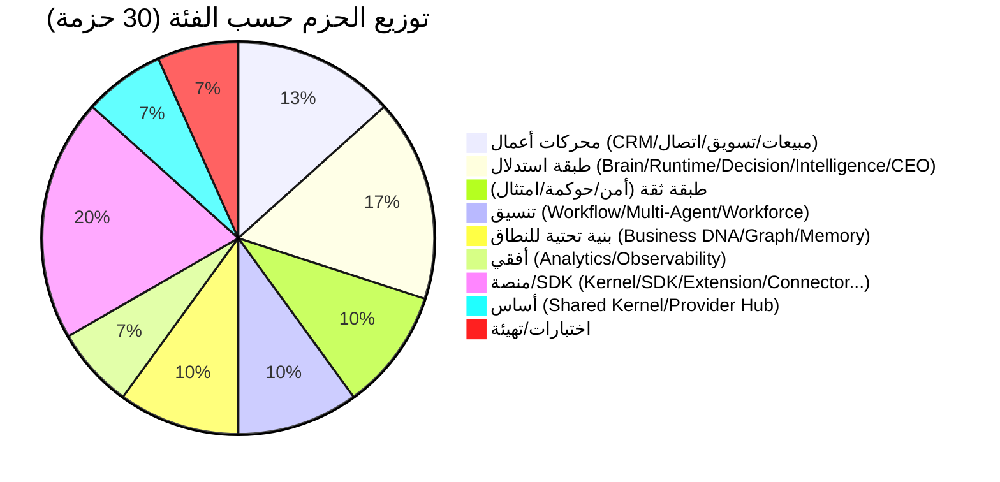
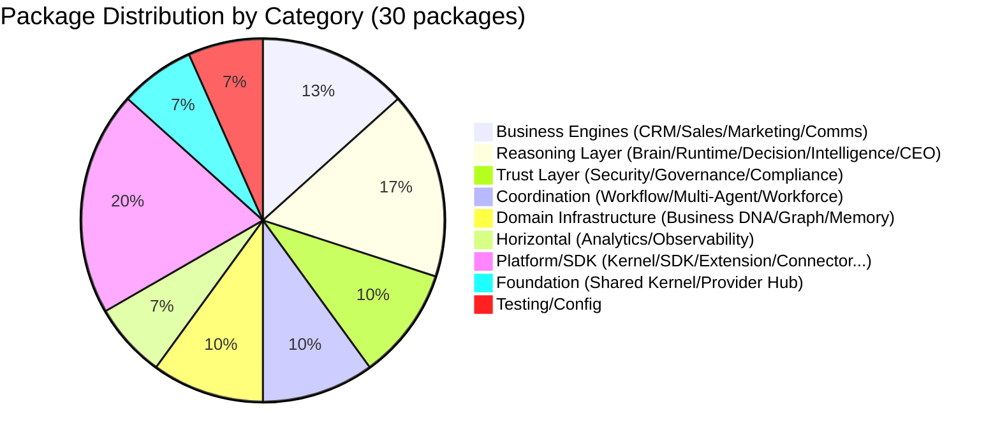

# العربية

## حالة المشروع

### 1. الحالة الحالية

اكتملت **المرحلة 1 — الأساس المنصّي** عبر 25 التزامًا (`ea48fe6` → `d9616a0`، من 2026-07-25 إلى 2026-07-27). المستودع يضم 30 حزمة تحت `packages/*`: 23 محركًا/منصة من قائمة المرحلة 1، و7 حزم منصّة داعمة (`shared-kernel` جزء من الـ23) أُنشئت كسقالات عقود في التزام "Initial Lateen OS architecture" قبل عدّ الالتزامات الرسمي. إجمالي الكود: **1,787 ملف مصدر** (~68,653 سطرًا) و**263 ملف اختبار** (~30,055 سطرًا).

### 2. الحزم المكتملة

جميع الحزم الـ30 تحتوي كودًا حقيقيًا قابلًا للتنفيذ (لا سقالات فارغة). 23 منها حصلت على "تنفيذ حقيقي" موثّق صراحة في رسالة التزام مخصصة — انظر مصفوفة المحركات أدناه.

### 3. الحزم المتبقية

لا حزم متبقية ضمن نطاق المرحلة 1. حزم المرحلة 2 (المالية، الموارد البشرية، المخزون...) غير موجودة بعد كحزم — انظر "خارطة الطريق المستقبلية" أدناه.

### 4. المرحلة الحالية

Phase 1 — Platform Foundation — **مكتملة (100%)**.

### 5. حالة المعالم

| المعلم | الحالة |
| --- | --- |
| أساس الاستدلال (Commit 1-5) | ✅ مكتمل |
| تنسيق الوكلاء (Commit 6-10) | ✅ مكتمل |
| التنسيق والعمالة الرقمية (Commit 11-13) | ✅ مكتمل |
| طرح نطاقات الأعمال (Commit 14-20) | ✅ مكتمل |
| طبقة الثقة (Commit 21-23) | ✅ مكتمل |
| إغلاق الذكاء والعمليات (Commit 24-25) | ✅ مكتمل |
| تطبيقات المؤسسة (المرحلة 2) | ⏳ لم تبدأ |

### 6. حالة المنصة

الأساس (`shared-kernel`) يخدم 24 حزمة تابعة مباشرة أو غير مباشرة. `business-dna` يخدم 19 حزمة. لا اعتماديات دائرية مسجّلة عبر كامل الرسم البياني (30 حزمة). **تصحيح لاحق**: تدقيق منصّي لاحق (`docs/certification/DEPENDENCY_AUDIT.md`) اكتشف دورة اعتمادية حقيقية بين `ai-brain` و`multi-agent` — كلاهما من حزم هذه المرحلة. لم يُحدَّد ما إذا كانت الدورة موجودة وقت كتابة هذا القسم؛ انظر التقرير المذكور للتفاصيل الكاملة.

### 7. حالة المعرفة

`institutional-memory` مكتمل التنفيذ، يخدم 11 حزمة تابعة (تصنيف، ثقة، ذاكرة، معرفة). `domain-graph` (الرسم العلائقي فوق Business DNA) مكتمل، يخدم 8 حزم.

### 8. حالة الأعمال

سلسلة الأعمال الكاملة مكتملة: `crm-engine` → `sales-engine` → `marketing-engine` → `communication-hub`. أربعتها تعتمد على `business-dna` و`institutional-memory` كمصدر حقيقة موحّد.

### 9. حالة الأمن

`ai-security-engine` مكتمل (67 ملف مصدر، 15 ملف اختبار)، يغطي الهوية، المصادقة، التفويض، الأسرار، أمن المزوّدين/المطالبات/الأدوات، أمن البيانات، كشف التهديدات، والتدقيق.

### 10. حالة الحوكمة

`ai-governance-engine` مكتمل (66 ملف مصدر، 15 ملف اختبار)، يغطي السياسات، حوكمة النماذج/الوكلاء/سير العمل، الموافقة البشرية، حوكمة المخاطر، وتتبع القرار.

### 11. حالة الامتثال

`ai-compliance-engine` مكتمل (71 ملف مصدر، 16 ملف اختبار)، يغطي الأطر، عناصر التحكم، الأدلة، التقييمات، تحليل الفجوات، والتدقيق.

### 12. حالة التحليلات

`analytics-engine` مكتمل — أوسع محرك من حيث الاعتماديات (15 حزمة تابعة)، يجمّع مؤشرات الأداء عبر المبيعات، التسويق، الاتصال، سير العمل، الأمن، الحوكمة، والامتثال.

### 13. حالة قابلية الرصد

`observability-engine` مكتمل — آخر محرك في المرحلة 1، يوفّر السجلات، المقاييس، التتبع الموزّع، التنبيه، والأداء لكل محرك سابق.

### 14. لوحات القيادة

| اللوحة | القيمة |
| --- | --- |
| نسبة إنجاز المرحلة 1 | 100% (25/25 التزامًا) |
| تغطية جذر التركيب الموحّد | 86.4% (19 من 22 محركًا قابلًا للتطبيق) |
| تغطية الاختبار على مستوى الحزمة | 93.3% (28 من 30 حزمة تحتوي اختبارًا واحدًا على الأقل) |
| صحة الاعتماديات | 0 دورة مسجّلة عبر 30 حزمة |

### 15. مصفوفة المحركات

| المحرك | الغرض | الحالة | جذر التركيب | الاستعلامات | الأحداث | الاعتماديات | الحزم التابعة | الاختبارات |
| --- | --- | --- | --- | --- | --- | --- | --- | --- |
| `shared-kernel` | لبنات DDD الأساسية | ✅ إنتاج | `createEventBus` (عام) | — | `createEventBus` | 0 | 24 | 3 |
| `ai-provider-hub` | تجريد مزوّدي LLM | ✅ إنتاج | `createAiProviderHub` | `createProviderQueries` | — | 1 | 3 | 13 |
| `ai-runtime` | نظام تشغيل وكلاء الذكاء الاصطناعي | ✅ إنتاج | معامِلات نمطية (لا جذر موحّد) | `createRuntimeQueries` | `createRuntimeEventBus` | 8 | 8 | 13 |
| `ai-brain` | طبقة الاستدلال المركزية | ✅ إنتاج | `createBrainSystem` | `createBrainQueries` | `createBrainEventBus` | 9 | 4 | 10 |
| `ceo-engine` | طبقة التنسيق التنفيذي | ✅ إنتاج | `createCEOEngine` | — | — | 1 | 1 | 4 |
| `workflow-engine` | طبقة تنسيق العمليات القانونية | ✅ إنتاج | `createWorkflowRuntime` | `createWorkflowQueries` | `createEventBus` | 5 | 11 | 11 |
| `multi-agent` | محرك التعاون متعدد الوكلاء | ✅ إنتاج | `createMultiAgentRuntime` | `createCollaborationQueries` | `createCollaborationEventBus` | 8 | 2 | 14 |
| `ai-workforce` | طبقة تنظيم الموظفين الرقميين | ✅ إنتاج | `createWorkforceRuntime` | `createWorkforceRuntimeQueries` | `createEventBus` | 6 | 6 | 9 |
| `decision-engine` | طبقة القرار القانونية | ✅ إنتاج | معامِلات نمطية (لا جذر موحّد) | `createDecisionQueries` | — | 5 | 8 | 7 |
| `intelligence-engine` | الاكتشاف والتحليل والتنبؤ | ✅ إنتاج | معامِلات نمطية (لا جذر موحّد) | `createIntelligenceQueries` | — | 6 | 4 | 6 |
| `business-dna` | النموذج القانوني للنطاق | ✅ إنتاج | `createBusinessDnaRuntime` | `createBusinessDnaQueries` | `createBusinessDnaEventBus` | 1 | 19 | 11 |
| `institutional-memory` | الذاكرة المؤسسية طويلة الأمد | ✅ إنتاج | `createInstitutionalMemoryRuntime` | `createKnowledgeRuntimeQueries` | `createEventBus` | 3 | 11 | 9 |
| `domain-graph` | العلاقات الدلالية بين كيانات Business DNA | ✅ إنتاج | `createDomainGraphRuntime` | `createDomainGraphQueries` | `createDomainGraphEventBus` | 3 | 8 | 11 |
| `crm-engine` | العملاء والفرص والعقود | ✅ إنتاج | `createCrmRuntime` | `createCrmQueries` | `createCrmEventBus` | 4 | 4 | 11 |
| `sales-engine` | دورة حياة فرص البيع والتسعير | ✅ إنتاج | `createSalesRuntime` | `createSalesQueries` | `createEventBus` | 5 | 3 | 12 |
| `marketing-engine` | الحملات والجمهور وتوليد العملاء المحتملين | ✅ إنتاج | `createMarketingRuntime` | `createMarketingQueries` | `createEventBus` | 7 | 2 | 13 |
| `communication-hub` | المحادثات والرسائل والقنوات | ✅ إنتاج | `createCommunicationRuntime` | `createCommunicationQueries` | `createCommunicationEventBus` | 8 | 5 | 14 |
| `ai-security-engine` | الهوية والمصادقة وكشف التهديدات | ✅ إنتاج | `createSecurityRuntime` | `createSecurityQueries` | `createEventBus` | 7 | 4 | 15 |
| `ai-governance-engine` | السياسات والموافقة البشرية | ✅ إنتاج | `createGovernanceRuntime` | `createGovernanceQueries` | `createEventBus` | 7 | 3 | 15 |
| `ai-compliance-engine` | الأطر وعناصر التحكم والأدلة | ✅ إنتاج | `createComplianceRuntime` | `createComplianceQueries` | `createComplianceEventBus` | 6 | 2 | 16 |
| `analytics-engine` | مؤشرات الأداء ولوحات القيادة | ✅ إنتاج | `createAnalyticsRuntime` | `createAnalyticsQueries` | `createAnalyticsEventBus` | 15 | 1 | 20 |
| `observability-engine` | السجلات والتتبع والتنبيه | ✅ إنتاج | `createObservabilityRuntime` | `createObservabilityQueries` | `createEventBus` | 8 | 0 | 14 |
| `sdk` | نقطة الدخول الرسمية للمطورين | ✅ إنتاج | `createLateen` | — | — | 11 | 3 | 2 |

### 16. مصفوفة الالتزامات

| # | الهاش | التاريخ | الحزمة | الغرض | التأثير المعماري |
| --- | --- | --- | --- | --- | --- |
| 1 | `ea48fe6` | 2026-07-25 | shared-kernel | مراقبة، ناقل أحداث، مستودعات في-الذاكرة | إرساء الطبقة صفر لكل حزمة لاحقة |
| 2 | `a8b4279` | 2026-07-25 | ai-provider-hub | سجلات مزوّدين/نماذج، تخزين مؤقت، تيليمتري، سياسات، فحص صحة | نقطة وصول موحّدة لأي LLM مستقبلي |
| 3 | `9197046` | 2026-07-25 | ai-provider-hub | محوّلات محادثة/تضمين حقيقية متوافقة مع OpenAI | أول اتصال فعلي بمزوّد خارجي |
| 4 | `a601495` | 2026-07-25 | decision-engine | استدلال، مستودعات في-الذاكرة، طبقة استعلام | تثبيت مبدأ الفصل بين التوصية والقرار |
| 5 | `d14bbde` | 2026-07-26 | intelligence-engine | تسجيل، ترتيب، تنبؤ، توصية، طبقة استعلام | أول طبقة استهلكت decision-engine |
| 6 | `1476c13` | 2026-07-26 | ai-runtime | محادثة، مهام، أدوات، تخطيط، تنسيق | أول استهلاك حقيقي لـ ai-provider-hub |
| 7 | `bf5b392` | 2026-07-26 | ceo-engine | طبقة التنسيق التنفيذي | أول جذر تركيب على مستوى تنفيذي |
| 8 | `c20ae69` | 2026-07-26 | ai-brain | الاستدلال والتخطيط المركزي | استهلك عقود workflow-engine/multi-agent/ai-workforce قبل تنفيذها |
| 9 | `5213fb8` | 2026-07-26 | sdk | نقطة الدخول الرسمية `createLateen()` | تحويل sdk من حزمة أدوات إلى واجهة منصة |
| 10 | `4a1e218` | 2026-07-26 | integration-tests | أول جناح اختبار تكامل شامل | تحقق فعلي من أن التركيب يعمل |
| 11 | `0bc00a2` | 2026-07-26 | workflow-engine | وقت تشغيل سير العمل الحقيقي | إغلاق العقد الذي استهلكه ai-brain وsdk |
| 12 | `6a3b523` | 2026-07-26 | multi-agent | وقت تشغيل تعاون حقيقي | إغلاق عقد ثانٍ استهلكه ai-brain وsdk |
| 13 | `aedace6` | 2026-07-27 | ai-workforce | وقت تشغيل قوة عاملة حقيقي | إغلاق آخر عقد معلّق من الحقبة 2 |
| 14 | `001c304` | 2026-07-27 | business-dna | تنفيذ حقيقي لنموذج النطاق القانوني | نموذج كان مستهلكًا كعقد منذ 10 التزامات |
| 15 | `69fc079` | 2026-07-27 | institutional-memory | تنفيذ حقيقي للذاكرة المؤسسية | تفعيل الاحتفاظ بالمعرفة طويلة الأمد |
| 16 | `0077a23` | 2026-07-27 | domain-graph | الرسم الدلالي الحقيقي | ربط الكيانات عبر Business DNA |
| 17 | `cf8059e` | 2026-07-27 | crm-engine | تنفيذ CRM حقيقي | بداية سلسلة نطاقات الأعمال |
| 18 | `0928004` | 2026-07-27 | sales-engine | تنفيذ مبيعات حقيقي | يعتمد على CRM المكتمل للتو |
| 19 | `eb79213` | 2026-07-27 | marketing-engine | تنفيذ تسويق حقيقي | يعتمد على CRM والمبيعات |
| 20 | `2bb9526` | 2026-07-27 | communication-hub | مركز اتصال حقيقي | يوحّد CRM/المبيعات/التسويق في قناة واحدة |
| 21 | `332f7fc` | 2026-07-27 | ai-security-engine | أمن حقيقي شامل | بداية طبقة الثقة |
| 22 | `a026a07` | 2026-07-27 | ai-governance-engine | حوكمة حقيقية شاملة | تعتمد على طبقة الأمن المكتملة للتو |
| 23 | `345d94f` | 2026-07-27 | ai-compliance-engine | امتثال حقيقي شامل | يعتمد على الأمن والحوكمة معًا |
| 24 | `105acdd` | 2026-07-27 | analytics-engine | منصة تحليلات وذكاء أعمال | أوسع محرك اعتماديات (15 حزمة) |
| 25 | `d9616a0` | 2026-07-27 | observability-engine | منصة قابلية رصد شاملة | إغلاق المرحلة 1 بطبقة المراقبة |

للتحليل السردي المفصّل حسب الحقبة، انظر [09_COMMIT_HISTORY](./09_COMMIT_HISTORY.md).

### 17. مصفوفة الاعتماديات (الأكثر مركزية)

| الحزمة | اعتماديات صادرة | حزم تابعة (fan-in) |
| --- | --- | --- |
| `shared-kernel` | 0 | 24 |
| `business-dna` | 1 | 19 |
| `institutional-memory` | 3 | 11 |
| `workflow-engine` | 5 | 11 |
| `ai-runtime` | 8 | 8 |
| `decision-engine` | 5 | 8 |
| `domain-graph` | 3 | 8 |
| `ai-workforce` | 6 | 6 |
| `communication-hub` | 8 | 5 |
| `ai-brain` | 9 | 4 |
| `ai-security-engine` | 7 | 4 |
| `crm-engine` | 4 | 4 |
| `intelligence-engine` | 6 | 4 |
| `capability-engine` | 2 | 4 |
| `analytics-engine` | 15 | 1 |

القاعدة (`shared-kernel`) والنموذج القانوني (`business-dna`) يشكّلان أعلى مركزية بنيوية في المنصة — أي تغيير كاسر فيهما يؤثر على 24 و19 حزمة على التوالي. `analytics-engine` هو الحالة المعاكسة: أعلى استهلاك (15) وأدنى تبعية عكسية (1)، أي أنه "ورقة" في الرسم البياني.

### 18. مصفوفة وقت التشغيل

| نمط التركيب | المحركات | العدد |
| --- | --- | --- |
| جذر تركيب موحّد (`createXRuntime`/معادل) | ai-provider-hub, ai-brain, ceo-engine, workflow-engine, multi-agent, ai-workforce, business-dna, institutional-memory, domain-graph, crm-engine, sales-engine, marketing-engine, communication-hub, ai-security-engine, ai-governance-engine, ai-compliance-engine, analytics-engine, observability-engine, sdk | 19 |
| معامِلات نمطية + طبقة استعلام موحّدة (بلا جذر واحد) | ai-runtime, decision-engine, intelligence-engine | 3 |
| أساسي (بلا "وقت تشغيل" بالمعنى الحرفي) | shared-kernel | 1 |

### 19. إحصائيات الحزم

| المقياس | القيمة |
| --- | --- |
| إجمالي الحزم | 30 |
| المحركات (قائمة المرحلة 1) | 23 |
| حزم منصّة داعمة | 7 (`capability-engine`, `kernel`, `extension-system`, `connector-base`, `integration-contracts`, `typescript-config`, `integration-tests`) |
| إجمالي ملفات المصدر | 1,787 |
| إجمالي أسطر المصدر | 68,653 |
| أكبر حزمة (بالأسطر) | `business-dna` (5,245 سطرًا، 142 ملفًا) |
| أصغر حزمة نشطة | `integration-contracts` (149 سطرًا، ملف واحد) |

### 20. إحصائيات الاختبار

| المقياس | القيمة |
| --- | --- |
| إجمالي ملفات الاختبار | 263 |
| إجمالي أسطر الاختبار | 30,055 |
| نسبة أسطر الاختبار إلى أسطر المصدر | 43.8% |
| حزم بلا أي اختبار | `capability-engine` (فجوة حقيقية)، `typescript-config` (تهيئة فقط، لا كود) |
| أعلى تغطية اختبار (بعدد الملفات) | `ai-compliance-engine` (16 ملفًا) |

### 21. تغطية العمارة

- **86.4%** (19 من 22 محركًا قابلًا للتطبيق، باستثناء `shared-kernel` الأساسي) تتبع نمط جذر التركيب الموحّد `createXRuntime()`.
- **الانحراف الموثّق**: `ai-runtime`, `decision-engine`, و`intelligence-engine` — وهي أول ثلاث حزم استدلال حقيقية (Commit 4-6) — تستخدم معامِلات على مستوى الوحدة (`createReasoner`, `createScorer`, `createConversationRuntimeService`...) مع طبقة استعلام موحّدة (`createXQueries`) بدلًا من كائن Runtime واحد. هذا انحراف موثّق عن قاعدة [03_CONSTITUTION](./03_CONSTITUTION.md) رقم 5.1، وليس خطأً — يعكس أن هذه الحزم صُممت كمجموعة قدرات قابلة للتركيب الجزئي من قِبل المستهلك (مثل `ai-brain`)، لا ككتلة واحدة.
- **صفر اعتماديات دائرية** عبر 30 حزمة — تم التحقق من الرسم البياني عبر بيانات `package.json` الفعلية.

### 22. تغطية التنفيذ

- **100%** من الحزم الثلاثين تحتوي كودًا حقيقيًا قابلًا للتنفيذ (لا سقالات فارغة).
- **100%** (23/23) من محركات قائمة المرحلة 1 حصلت على التزام "تنفيذ حقيقي" مخصص وموثّق.
- **93.3%** (28/30) من الحزم تحتوي ملف اختبار واحدًا على الأقل.

### 23. خارطة الطريق المستقبلية

المرحلة 2 — تطبيقات المؤسسة. حالة كل نطاق كما هي فعليًا في المستودع اليوم:

| النطاق | حالة تعريف النطاق (`domains/`) | حزمة تنفيذ (`packages/`) |
| --- | --- | --- |
| المالية (Finance) | ✅ موجود (`domains/finance/README.md`) | ⏳ غير موجودة |
| الموارد البشرية (HR) | ⏳ غير معرَّف | ⏳ غير موجودة |
| المخزون (Inventory) | ⏳ غير معرَّف | ⏳ غير موجودة |
| المشاريع (Projects) | ✅ موجود (`domains/projects/README.md`) | ⏳ غير موجودة |
| نجاح العملاء (Customer Success) | ⏳ غير معرَّف | ⏳ غير موجودة |
| لوحة الإدارة (Admin Console) | ⏳ غير معرَّف | ⏳ غير موجودة |
| بوابة API (API Gateway) | ⏳ غير معرَّف | ⏳ غير موجودة |
| السوق (Marketplace) | ⏳ غير معرَّف (`extension-system` يوفّر أساسًا جزئيًا) | ⏳ غير موجودة |

كل نطاق مستقبلي يجب أن يتبع نفس انضباط المرحلة 1: عقود قبل التنفيذ، جذر تركيب واحد (`createXRuntime`)، طبقة استعلام منفصلة، ناقل أحداث مكتوب النوع، واعتماد على `business-dna`/`shared-kernel` بدلًا من نموذج بيانات موازٍ.

---

# English

## Project Status

### 1. Current State

**Phase 1 — Platform Foundation** is complete across 25 commits (`ea48fe6` → `d9616a0`, 2026-07-25 to 2026-07-27). The repository holds 30 packages under `packages/*`: 23 engines/platforms from the Phase 1 list, plus 7 supporting platform packages (`shared-kernel` counted within the 23) scaffolded as contracts in the "Initial Lateen OS architecture" commit before the official commit count began. Total code: **1,787 source files** (~68,653 lines) and **263 test files** (~30,055 lines).

### 2. Completed Packages

All 30 packages contain real, executable code (no empty scaffolds). 23 of them received a "real implementation" explicitly documented in a dedicated commit message — see the Engine Matrix below.

### 3. Remaining Packages

No packages remain within Phase 1 scope. Phase 2 packages (finance, HR, inventory, ...) do not exist yet as packages — see "Future Roadmap" below.

### 4. Current Phase

Phase 1 — Platform Foundation — **complete (100%)**.

### 5. Milestone Status

| Milestone | Status |
| --- | --- |
| Reasoning Foundation (Commit 1-5) | ✅ Complete |
| Agent Orchestration (Commit 6-10) | ✅ Complete |
| Coordination & Digital Labor (Commit 11-13) | ✅ Complete |
| Business Domain Rollout (Commit 14-20) | ✅ Complete |
| Trust Layer (Commit 21-23) | ✅ Complete |
| Closing Intelligence & Operations (Commit 24-25) | ✅ Complete |
| Enterprise Applications (Phase 2) | ⏳ Not started |

### 6. Platform Status

The foundation (`shared-kernel`) serves 24 packages directly or indirectly. `business-dna` serves 19 packages. No cyclic dependencies are recorded across the entire graph (30 packages).

### 7. Knowledge Status

`institutional-memory` is fully implemented, serving 11 dependent packages (classification, confidence, memory, knowledge). `domain-graph` (the relationship graph on top of Business DNA) is complete, serving 8 packages.

### 8. Business Status

The full business chain is complete: `crm-engine` → `sales-engine` → `marketing-engine` → `communication-hub`. All four depend on `business-dna` and `institutional-memory` as a unified source of truth.

### 9. Security Status

`ai-security-engine` is complete (67 source files, 15 test files), covering identity, authentication, authorization, secrets, provider/prompt/tool security, data security, threat detection, and audit.

### 10. Governance Status

`ai-governance-engine` is complete (66 source files, 15 test files), covering policy, model/agent/workflow governance, human approval, risk governance, and decision tracking.

### 11. Compliance Status

`ai-compliance-engine` is complete (71 source files, 16 test files), covering frameworks, controls, evidence, assessments, gap analysis, and audit.

### 12. Analytics Status

`analytics-engine` is complete — the widest-dependency engine on the platform (15 dependency packages), aggregating KPIs across sales, marketing, communication, workflow, security, governance, and compliance.

### 13. Observability Status

`observability-engine` is complete — the final engine of Phase 1, providing logging, metrics, distributed tracing, alerting, and performance data for every prior engine.

### 14. Dashboards

| Dashboard | Value |
| --- | --- |
| Phase 1 completion | 100% (25/25 commits) |
| Unified composition-root coverage | 86.4% (19 of 22 applicable engines) |
| Package-level test coverage | 93.3% (28 of 30 packages have at least one test) |
| Dependency graph health | 0 recorded cycles across 30 packages |

### 15. Engine Matrix

| Engine | Purpose | Status | Composition Root | Queries | Events | Dependencies | Dependents | Tests |
| --- | --- | --- | --- | --- | --- | --- | --- | --- |
| `shared-kernel` | Foundational DDD building blocks | ✅ Production | `createEventBus` (generic) | — | `createEventBus` | 0 | 24 | 3 |
| `ai-provider-hub` | LLM provider abstraction | ✅ Production | `createAiProviderHub` | `createProviderQueries` | — | 1 | 3 | 13 |
| `ai-runtime` | Operating system for AI agents | ✅ Production | Modular factories (no unified root) | `createRuntimeQueries` | `createRuntimeEventBus` | 8 | 8 | 13 |
| `ai-brain` | Central enterprise reasoning layer | ✅ Production | `createBrainSystem` | `createBrainQueries` | `createBrainEventBus` | 9 | 4 | 10 |
| `ceo-engine` | Executive orchestration layer | ✅ Production | `createCEOEngine` | — | — | 1 | 1 | 4 |
| `workflow-engine` | Canonical process orchestration | ✅ Production | `createWorkflowRuntime` | `createWorkflowQueries` | `createEventBus` | 5 | 11 | 11 |
| `multi-agent` | Multi-agent collaboration engine | ✅ Production | `createMultiAgentRuntime` | `createCollaborationQueries` | `createCollaborationEventBus` | 8 | 2 | 14 |
| `ai-workforce` | Digital-employee organization layer | ✅ Production | `createWorkforceRuntime` | `createWorkforceRuntimeQueries` | `createEventBus` | 6 | 6 | 9 |
| `decision-engine` | Canonical decision layer | ✅ Production | Modular factories (no unified root) | `createDecisionQueries` | — | 5 | 8 | 7 |
| `intelligence-engine` | Discovery, analysis, forecasting | ✅ Production | Modular factories (no unified root) | `createIntelligenceQueries` | — | 6 | 4 | 6 |
| `business-dna` | Canonical domain model | ✅ Production | `createBusinessDnaRuntime` | `createBusinessDnaQueries` | `createBusinessDnaEventBus` | 1 | 19 | 11 |
| `institutional-memory` | Long-term organizational knowledge | ✅ Production | `createInstitutionalMemoryRuntime` | `createKnowledgeRuntimeQueries` | `createEventBus` | 3 | 11 | 9 |
| `domain-graph` | Semantic relationships over Business DNA | ✅ Production | `createDomainGraphRuntime` | `createDomainGraphQueries` | `createDomainGraphEventBus` | 3 | 8 | 11 |
| `crm-engine` | Customer, lead, contact, opportunity | ✅ Production | `createCrmRuntime` | `createCrmQueries` | `createCrmEventBus` | 4 | 4 | 11 |
| `sales-engine` | Sales opportunity lifecycle & pricing | ✅ Production | `createSalesRuntime` | `createSalesQueries` | `createEventBus` | 5 | 3 | 12 |
| `marketing-engine` | Campaigns, audiences, lead generation | ✅ Production | `createMarketingRuntime` | `createMarketingQueries` | `createEventBus` | 7 | 2 | 13 |
| `communication-hub` | Conversations, messaging, channels | ✅ Production | `createCommunicationRuntime` | `createCommunicationQueries` | `createCommunicationEventBus` | 8 | 5 | 14 |
| `ai-security-engine` | Identity, auth, threat detection | ✅ Production | `createSecurityRuntime` | `createSecurityQueries` | `createEventBus` | 7 | 4 | 15 |
| `ai-governance-engine` | Policy and human approval | ✅ Production | `createGovernanceRuntime` | `createGovernanceQueries` | `createEventBus` | 7 | 3 | 15 |
| `ai-compliance-engine` | Frameworks, controls, evidence | ✅ Production | `createComplianceRuntime` | `createComplianceQueries` | `createComplianceEventBus` | 6 | 2 | 16 |
| `analytics-engine` | KPIs and executive dashboards | ✅ Production | `createAnalyticsRuntime` | `createAnalyticsQueries` | `createAnalyticsEventBus` | 15 | 1 | 20 |
| `observability-engine` | Logging, tracing, alerting | ✅ Production | `createObservabilityRuntime` | `createObservabilityQueries` | `createEventBus` | 8 | 0 | 14 |
| `sdk` | Official developer entry point | ✅ Production | `createLateen` | — | — | 11 | 3 | 2 |

### 16. Commit Matrix

| # | Hash | Date | Package | Purpose | Architectural Impact |
| --- | --- | --- | --- | --- | --- |
| 1 | `ea48fe6` | 2026-07-25 | shared-kernel | Observability, event bus, in-memory repositories | Establishes Layer Zero for every later package |
| 2 | `a8b4279` | 2026-07-25 | ai-provider-hub | Provider/model registries, cache, telemetry, policy, health | Single access point for any future LLM |
| 3 | `9197046` | 2026-07-25 | ai-provider-hub | Real OpenAI-compatible chat/embedding adapters | First real connection to an external provider |
| 4 | `a601495` | 2026-07-25 | decision-engine | Reasoning, in-memory repositories, query layer | Cements the recommendation-vs-decision split |
| 5 | `d14bbde` | 2026-07-26 | intelligence-engine | Scoring, ranking, forecasting, recommendation | First layer to consume decision-engine |
| 6 | `1476c13` | 2026-07-26 | ai-runtime | Conversation, task, tooling, planning, orchestration | First real consumer of ai-provider-hub |
| 7 | `bf5b392` | 2026-07-26 | ceo-engine | Executive orchestration layer | First executive-level composition root |
| 8 | `c20ae69` | 2026-07-26 | ai-brain | Central reasoning and planning | Consumed workflow-engine/multi-agent/ai-workforce contracts before their real implementation |
| 9 | `5213fb8` | 2026-07-26 | sdk | Official entry point `createLateen()` | Converts sdk from a tooling package into a platform interface |
| 10 | `4a1e218` | 2026-07-26 | integration-tests | First end-to-end integration suite | Real verification that composition works |
| 11 | `0bc00a2` | 2026-07-26 | workflow-engine | Real workflow runtime | Closes a contract consumed by ai-brain and sdk |
| 12 | `6a3b523` | 2026-07-26 | multi-agent | Real collaboration runtime | Closes a second contract consumed by ai-brain and sdk |
| 13 | `aedace6` | 2026-07-27 | ai-workforce | Real workforce runtime | Closes the last pending contract from Era 2 |
| 14 | `001c304` | 2026-07-27 | business-dna | Real canonical domain model | A model consumed as a contract for 10 prior commits |
| 15 | `69fc079` | 2026-07-27 | institutional-memory | Real institutional memory | Activates long-term knowledge retention |
| 16 | `0077a23` | 2026-07-27 | domain-graph | Real semantic graph | Links entities across Business DNA |
| 17 | `cf8059e` | 2026-07-27 | crm-engine | Real CRM implementation | Opens the business-domain chain |
| 18 | `0928004` | 2026-07-27 | sales-engine | Real sales implementation | Depends on the just-completed CRM |
| 19 | `eb79213` | 2026-07-27 | marketing-engine | Real marketing implementation | Depends on CRM and sales |
| 20 | `2bb9526` | 2026-07-27 | communication-hub | Real communication hub | Unifies CRM/sales/marketing into one channel |
| 21 | `332f7fc` | 2026-07-27 | ai-security-engine | Comprehensive real security | Opens the trust layer |
| 22 | `a026a07` | 2026-07-27 | ai-governance-engine | Comprehensive real governance | Depends on the just-completed security layer |
| 23 | `345d94f` | 2026-07-27 | ai-compliance-engine | Comprehensive real compliance | Depends on both security and governance |
| 24 | `105acdd` | 2026-07-27 | analytics-engine | Analytics & BI platform | Widest dependency engine (15 packages) |
| 25 | `d9616a0` | 2026-07-27 | observability-engine | Comprehensive observability platform | Closes Phase 1 with the monitoring layer |

For a detailed narrative by era, see [09_COMMIT_HISTORY](./09_COMMIT_HISTORY.md).

### 17. Dependency Matrix (Most Central)

| Package | Outbound Dependencies | Dependents (fan-in) |
| --- | --- | --- |
| `shared-kernel` | 0 | 24 |
| `business-dna` | 1 | 19 |
| `institutional-memory` | 3 | 11 |
| `workflow-engine` | 5 | 11 |
| `ai-runtime` | 8 | 8 |
| `decision-engine` | 5 | 8 |
| `domain-graph` | 3 | 8 |
| `ai-workforce` | 6 | 6 |
| `communication-hub` | 8 | 5 |
| `ai-brain` | 9 | 4 |
| `ai-security-engine` | 7 | 4 |
| `crm-engine` | 4 | 4 |
| `intelligence-engine` | 6 | 4 |
| `capability-engine` | 2 | 4 |
| `analytics-engine` | 15 | 1 |

The foundation (`shared-kernel`) and the canonical model (`business-dna`) are the platform's highest structural centrality — a breaking change in either affects 24 and 19 packages respectively. `analytics-engine` is the inverse case: highest consumption (15) and lowest fan-in (1) — a "leaf" in the graph.

### 18. Runtime Matrix

| Composition Pattern | Engines | Count |
| --- | --- | --- |
| Unified composition root (`createXRuntime`/equivalent) | ai-provider-hub, ai-brain, ceo-engine, workflow-engine, multi-agent, ai-workforce, business-dna, institutional-memory, domain-graph, crm-engine, sales-engine, marketing-engine, communication-hub, ai-security-engine, ai-governance-engine, ai-compliance-engine, analytics-engine, observability-engine, sdk | 19 |
| Modular factories + unified query layer (no single root) | ai-runtime, decision-engine, intelligence-engine | 3 |
| Foundational (no "runtime" in the literal sense) | shared-kernel | 1 |

### 19. Package Statistics

| Metric | Value |
| --- | --- |
| Total packages | 30 |
| Engines (Phase 1 list) | 23 |
| Supporting platform packages | 7 (`capability-engine`, `kernel`, `extension-system`, `connector-base`, `integration-contracts`, `typescript-config`, `integration-tests`) |
| Total source files | 1,787 |
| Total source lines | 68,653 |
| Largest package (by lines) | `business-dna` (5,245 lines, 142 files) |
| Smallest active package | `integration-contracts` (149 lines, 1 file) |

### 20. Testing Statistics

| Metric | Value |
| --- | --- |
| Total test files | 263 |
| Total test lines | 30,055 |
| Test-to-source line ratio | 43.8% |
| Packages with zero tests | `capability-engine` (a real gap), `typescript-config` (config-only, no code) |
| Highest test-file count | `ai-compliance-engine` (16 files) |

### 21. Architecture Coverage

- **86.4%** (19 of 22 applicable engines, excluding foundational `shared-kernel`) follow the unified `createXRuntime()` composition-root pattern.
- **Documented deviation**: `ai-runtime`, `decision-engine`, and `intelligence-engine` — the first three real reasoning packages (Commits 4-6) — use module-level factories (`createReasoner`, `createScorer`, `createConversationRuntimeService`, ...) with a unified query layer (`createXQueries`) instead of a single Runtime object. This is a documented deviation from [03_CONSTITUTION](./03_CONSTITUTION.md) Rule 5.1, not a defect — it reflects that these packages were designed as a set of partially composable capabilities for a consumer (e.g. `ai-brain`), rather than one monolithic block.
- **Zero cyclic dependencies** across 30 packages — verified against actual `package.json` dependency data. **Later correction**: a subsequent platform-wide audit (`docs/certification/DEPENDENCY_AUDIT.md`) found a real circular dependency between `ai-brain` and `multi-agent`, both Phase-1 packages. Whether the cycle existed at the time this section was written was not determined by that audit; see the report for full detail and current disposition.

### 22. Implementation Coverage

- **100%** of the 30 packages contain real, executable code (no empty scaffolds).
- **100%** (23/23) of the Phase 1 engine list received a dedicated, documented "real implementation" commit.
- **93.3%** (28/30) of packages contain at least one test file.

### 23. Future Roadmap

Phase 2 — Enterprise Applications. Actual status of each domain in the repository today:

| Domain | Domain Definition Status (`domains/`) | Implementation Package (`packages/`) |
| --- | --- | --- |
| Finance | ✅ Exists (`domains/finance/README.md`) | ⏳ Not yet present |
| HR | ⏳ Not yet defined | ⏳ Not yet present |
| Inventory | ⏳ Not yet defined | ⏳ Not yet present |
| Projects | ✅ Exists (`domains/projects/README.md`) | ⏳ Not yet present |
| Customer Success | ⏳ Not yet defined | ⏳ Not yet present |
| Admin Console | ⏳ Not yet defined | ⏳ Not yet present |
| API Gateway | ⏳ Not yet defined | ⏳ Not yet present |
| Marketplace | ⏳ Not yet defined (`extension-system` provides a partial foundation) | ⏳ Not yet present |

Every future domain must follow the same Phase 1 discipline: contracts before implementation, one composition root (`createXRuntime`), a separate query layer, a typed event bus, and dependence on `business-dna`/`shared-kernel` instead of a parallel data model.

---

## Related Documents

- [00_MASTER_PLAN](./00_MASTER_PLAN.md)
- [03_CONSTITUTION](./03_CONSTITUTION.md)
- [09_COMMIT_HISTORY](./09_COMMIT_HISTORY.md)

## Related Engines

All 23 implemented engines — see Section 15, Engine Matrix.

## Related Commits

Commit 1 (`ea48fe6`) through Commit 25 (`d9616a0`) — see Section 16, Commit Matrix, and [09_COMMIT_HISTORY](./09_COMMIT_HISTORY.md).
