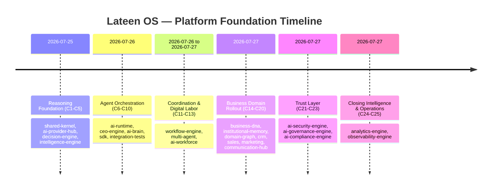

# العربية

## تاريخ الالتزامات — تطور العمارة

هذا المستند **ليس** سجل git الخام. الغرض منه شرح كيف تطورت عمارة Lateen OS عبر 25 التزامًا (Commit 1 → Commit 25)، ولماذا جاءت بهذا الترتيب تحديدًا. للحصول على مصفوفة تفصيلية عمودًا-بعمود لكل التزام، انظر "مصفوفة الالتزامات" في [08_PROJECT_STATUS](./08_PROJECT_STATUS.md).

### 0. التكوين (قبل Commit 1)

قبل أن يبدأ عد الالتزامات الرسمي، أرسى التزامان تأسيسيان (`3d1cf9f` "Initial commit" و`7d19c39` "Initial Lateen OS architecture") **كامل الرسم البياني للعقود** عبر الحزم الثلاثين: الأنواع، أحداث النطاق، منافذ المستودع، وهياكل الحزم — دون أي منطق تنفيذي حقيقي. تبعهما التزاما إصلاح (`35ea94e`, `90eb9b1`) لضبط دورة اعتمادية بين kernel/sdk/extension-system واستقرار بيئة التطوير.

هذا التأسيس المسبق للعقود هو ما يفسّر ظاهرة مهمة تتكرر عبر كل الالتزامات التالية: **حزمة يمكن أن "تستهلك" عقود حزمة أخرى لم تُنفَّذ فعليًا بعد**، لأن الاستهلاك يتم عبر النوع (type) لا عبر التنفيذ (implementation).

### 1. الحقبة 1 — أساس الاستدلال (Commit 1 → 5، 2026-07-25 إلى 2026-07-26)

`shared-kernel` (C1) ← `ai-provider-hub` مرتين (C2, C3) ← `decision-engine` (C4) ← `intelligence-engine` (C5).

بُني الأساس الحتمي أولًا: القدرة على المراقبة (`shared-kernel`)، ثم الوصول الموحّد لنماذج اللغة (`ai-provider-hub` — سجلات المزوّدين في C2، ثم المحوّلات الفعلية المتوافقة مع OpenAI في C3)، ثم طبقة القرار الحتمية (`decision-engine`)، ثم طبقة الذكاء التي تستهلك القرار (`intelligence-engine`). هذا الترتيب يعكس فلسفة "الأولوية للحتمية" — بُني كل ما هو قابل للحتمية قبل أي طبقة تعتمد على LLM.

### 2. الحقبة 2 — تنسيق الوكلاء (Commit 6 → 10، 2026-07-26)

`ai-runtime` (C6) ← `ceo-engine` (C7) ← `ai-brain` (C8) ← `sdk` (C9) ← `integration-tests` (C10).

هنا يظهر النمط المذكور في القسم 0 بوضوح: `ai-brain` (C8) يعتمد رسميًا على `ai-workforce`, `multi-agent`, و`workflow-engine` — وهي حزم لم تحصل على "تنفيذها الحقيقي" إلا لاحقًا (C11-C13). كان هذا ممكنًا لأن `ai-brain` بُني ضد عقود تلك الحزم المُنشأة في Commit 0، لا ضد تنفيذها. `sdk` (C9) كرّر النمط نفسه، محوّلًا نفسه إلى نقطة الدخول الرسمية للمطورين (`createLateen()`) قبل اكتمال كل المحركات التي يجمعها. أُغلقت الحقبة بأول حزمة اختبار تكامل شامل (`integration-tests`, C10) للتحقق من أن التركيب يعمل فعليًا رغم هذا الترتيب غير الخطي.

### 3. الحقبة 3 — التنسيق والعمالة الرقمية (Commit 11 → 13، 2026-07-26 إلى 2026-07-27)

`workflow-engine` (C11) ← `multi-agent` (C12) ← `ai-workforce` (C13).

أُكملت الحلقة المفقودة: الحزم الثلاث التي استهلكها `ai-brain` و`sdk` كعقود فقط حصلت الآن على تنفيذها الحقيقي. هذه الحقبة تثبت عمليًا أن فصل العقد عن التنفيذ (Clean Architecture، ADR 0001) لم يكن مجرد مبدأ نظري — بل الآلية الفعلية التي سمحت ببناء طبقة تنسيق معقدة (CEO Engine → AI Brain → SDK) قبل اكتمال الطبقات التي تُنسّقها.

### 4. الحقبة 4 — طرح نطاقات الأعمال (Commit 14 → 20، 2026-07-27)

`business-dna` الحقيقي (C14) ← `institutional-memory` (C15) ← `domain-graph` (C16) ← `crm-engine` (C17) ← `sales-engine` (C18) ← `marketing-engine` (C19) ← `communication-hub` (C20).

لافت أن "تنفيذ business-dna الحقيقي" جاء في C14 — بعد أن استهلكته بالفعل عشر حزم سابقة (`ai-runtime`, `ai-brain`, `decision-engine`...) كعقد فقط. هذه الحقبة هي الأطول (7 التزامات) لأنها تبني سلسلة نطاق الأعمال الكاملة: الهوية المؤسسية → الذاكرة → الرسم العلائقي → CRM → المبيعات → التسويق → قناة الاتصال الموحّدة التي تربط الثلاثة الأخيرة.

### 5. الحقبة 5 — طبقة الثقة (Commit 21 → 23، 2026-07-27)

`ai-security-engine` (C21) ← `ai-governance-engine` (C22) ← `ai-compliance-engine` (C23).

جاءت طبقة الثقة (أمن → حوكمة → امتثال) بعد اكتمال محركات الأعمال، بترتيب متعمّد: الحوكمة تعتمد على الأمن، والامتثال يعتمد على كليهما — يعكس مبدأ "الأمن أولًا، ثم القواعد المبنية فوقه".

### 6. الحقبة 6 — إغلاق الذكاء والعمليات (Commit 24 → 25، 2026-07-27)

`analytics-engine` (C24) ← `observability-engine` (C25).

أُغلقت المرحلة 1 بمحركين أفقيين يقرآن من كل ما سبق دون أن يُقرأ منهما: `analytics-engine` يجمّع مقاييس عبر 15 حزمة تابعة (أوسع مصفوفة اعتماديات في المنصة)، و`observability-engine` يوفّر السجلات والتتبع والتنبيه لكل ما سبق — وهو آخر التزام في المرحلة 1 لأنه الطبقة التي "تراقب" النظام الذي بُني للتو.

### 7. الدروس المستفادة عبر المرحلة كاملة

- **العقد يسبق التنفيذ فعليًا، لا شعاريًا**: تسلسل الالتزامات يثبت أن حزمًا استهلكت عقود حزم أخرى قبل تنفيذها الحقيقي بعدة التزامات — دليل ملموس على أن ADR 0001 مُطبَّق لا مُعلَن فقط.
- **لا اعتماديات دائرية رغم التعقيد**: رغم أن 30 حزمة تشكّل رسمًا بيانيًا كثيفًا، لم يُسجَّل أي كسر في ترتيب `turbo` — التزام `35ea94e` وحده عالج دورة محتملة، ومبكرًا جدًا (قبل بدء عد الالتزامات الرسمي).
- **الحقبة الأطول هي نطاقات الأعمال**: 7 من أصل 25 التزامًا (28%) خُصصت لسلسلة CRM → المبيعات → التسويق → الاتصال، ما يعكس أنها الطبقة الأكثر تعقيدًا من حيث عدد الكيانات والعلاقات.

---

# English

## Commit History — Architecture Evolution

This document is **not** raw git history. Its purpose is to explain how the Lateen OS architecture evolved across 25 commits (Commit 1 → Commit 25), and why that specific order. For a detailed column-by-column matrix of every commit, see the "Commit Matrix" in [08_PROJECT_STATUS](./08_PROJECT_STATUS.md).

### 0. Genesis (Before Commit 1)

Before the official commit count began, two foundational commits (`3d1cf9f` "Initial commit" and `7d19c39` "Initial Lateen OS architecture") laid down **the entire contract graph** across all thirty packages: types, domain events, repository ports, and package scaffolding — with no real executable logic yet. Two fix commits followed (`35ea94e`, `90eb9b1`) resolving a kernel/sdk/extension-system dependency cycle and stabilizing the dev environment.

This up-front contract foundation explains an important pattern repeated across every subsequent commit: **a package can "consume" another package's contract before that package has a real implementation yet**, because consumption happens through the type, not the implementation.

### 1. Era 1 — Reasoning Foundation (Commit 1 → 5, 2026-07-25 to 2026-07-26)

`shared-kernel` (C1) ← `ai-provider-hub` twice (C2, C3) ← `decision-engine` (C4) ← `intelligence-engine` (C5).

The deterministic foundation was built first: observability primitives (`shared-kernel`), then unified LLM access (`ai-provider-hub` — provider registries in C2, then real OpenAI-compatible adapters in C3), then the deterministic decision layer (`decision-engine`), then the intelligence layer that consumes decisions (`intelligence-engine`). This order reflects the "deterministic-first" philosophy — everything that can be deterministic was built before any LLM-dependent layer.

### 2. Era 2 — Agent Orchestration (Commit 6 → 10, 2026-07-26)

`ai-runtime` (C6) ← `ceo-engine` (C7) ← `ai-brain` (C8) ← `sdk` (C9) ← `integration-tests` (C10).

The pattern from Section 0 becomes visible here: `ai-brain` (C8) formally depends on `ai-workforce`, `multi-agent`, and `workflow-engine` — packages that did not receive their "real implementation" until later (C11-C13). This was possible because `ai-brain` was built against those packages' contracts from Commit 0, not against their implementations. `sdk` (C9) repeated the same pattern, becoming the official developer entry point (`createLateen()`) before every engine it composes was complete. The era closed with the first full integration test suite (`integration-tests`, C10), verifying the composition actually worked despite this non-linear order.

### 3. Era 3 — Coordination and Digital Labor (Commit 11 → 13, 2026-07-26 to 2026-07-27)

`workflow-engine` (C11) ← `multi-agent` (C12) ← `ai-workforce` (C13).

The missing piece closed: the three packages `ai-brain` and `sdk` had consumed as contracts-only now received their real implementations. This era is the practical proof that separating contract from implementation (Clean Architecture, ADR 0001) was not just theoretical — it was the actual mechanism that allowed a complex orchestration stack (CEO Engine → AI Brain → SDK) to be built before the layers it orchestrates were complete.

### 4. Era 4 — Business Domain Rollout (Commit 14 → 20, 2026-07-27)

Real `business-dna` (C14) ← `institutional-memory` (C15) ← `domain-graph` (C16) ← `crm-engine` (C17) ← `sales-engine` (C18) ← `marketing-engine` (C19) ← `communication-hub` (C20).

Notably, the "real `business-dna` implementation" landed at C14 — after ten prior packages (`ai-runtime`, `ai-brain`, `decision-engine`, ...) had already consumed it as a contract only. This is the longest era (7 commits) because it builds the full business-domain chain: canonical identity → memory → relationship graph → CRM → sales → marketing → the unified communication channel tying the last three together.

### 5. Era 5 — Trust Layer (Commit 21 → 23, 2026-07-27)

`ai-security-engine` (C21) ← `ai-governance-engine` (C22) ← `ai-compliance-engine` (C23).

The trust layer (security → governance → compliance) arrived after business engines were complete, in a deliberate order: governance depends on security, and compliance depends on both — reflecting "security first, rules on top of it."

### 6. Era 6 — Closing Intelligence and Operations (Commit 24 → 25, 2026-07-27)

`analytics-engine` (C24) ← `observability-engine` (C25).

Phase 1 closed with two horizontal engines that read from everything before them without being read from in turn: `analytics-engine` aggregates metrics across 15 dependency packages (the widest dependency fan-in on the platform), and `observability-engine` provides logging, tracing, and alerting for everything preceding it — the final commit of Phase 1, because it is the layer that "watches" the system just built.

### 7. Lessons Learned Across the Phase

- **Contract-before-implementation is real, not aspirational**: the commit sequence proves packages consumed other packages' contracts multiple commits before those packages had real implementations — concrete evidence that ADR 0001 was enforced, not just declared.
- **No cyclic dependencies despite density**: even with 30 packages forming a dense graph, `turbo`'s build ordering was never broken — commit `35ea94e` alone addressed a potential cycle, and did so very early (before the official commit count began).
- **The longest era is business domains**: 7 of 25 commits (28%) were dedicated to the CRM → sales → marketing → communication chain, reflecting that it is the most complex layer in terms of entity and relationship count.

---

## Related Documents

- [00_MASTER_PLAN](./00_MASTER_PLAN.md)
- [03_CONSTITUTION](./03_CONSTITUTION.md)
- [08_PROJECT_STATUS](./08_PROJECT_STATUS.md)

## Related Engines

All 23 implemented engines, in the order documented above.

## Related Commits

Commit 1 (`ea48fe6`) through Commit 25 (`d9616a0`).
