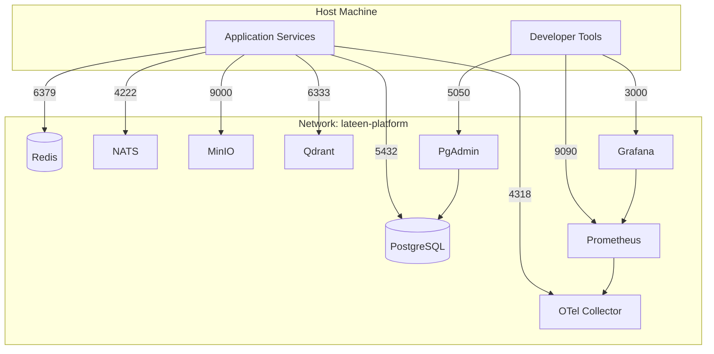

# Network Topology

> Lateen OS local platform network

## Docker network

All platform services connect to a dedicated bridge network:

| Property | Value |
| -------- | ----- |
| Network name | `lateen-platform` (configurable via `LATEEN_NETWORK_NAME`) |
| Driver | `bridge` |
| Compose project | `lateen-os` |

## Topology diagram



## Internal DNS

Docker Compose provides automatic DNS resolution by service name:

| Hostname | Service |
| -------- | ------- |
| `postgres` | PostgreSQL |
| `redis` | Redis |
| `nats` | NATS |
| `minio` | MinIO |
| `qdrant` | Qdrant |
| `prometheus` | Prometheus |
| `otel-collector` | OpenTelemetry Collector |
| `grafana` | Grafana |
| `pgadmin` | PgAdmin |

Application services running **inside** the compose network should use internal hostnames (e.g. `postgres:5432`).

Application services running on the **host** should use `localhost` with mapped ports (e.g. `localhost:5432`).

## Port mapping

Host ports are configurable via `*_HOST_PORT` environment variables to avoid conflicts.

Default mappings:

| Service | Container port | Host port |
| ------- | -------------- | --------- |
| PostgreSQL | 5432 | 5432 |
| Redis | 6379 | 6379 |
| NATS client | 4222 | 4222 |
| NATS monitoring | 8222 | 8222 |
| MinIO API | 9000 | 9000 |
| MinIO console | 9001 | 9001 |
| Qdrant HTTP | 6333 | 6333 |
| Qdrant gRPC | 6334 | 6334 |
| Grafana | 3000 | 3000 |
| Prometheus | 9090 | 9090 |
| OTel gRPC | 4317 | 4317 |
| OTel HTTP | 4318 | 4318 |
| OTel health | 13133 | 13133 |
| OTel metrics | 8888 | 8888 |
| PgAdmin | 80 | 5050 |

## Service dependencies

```
postgres ──▶ pgadmin
prometheus ──▶ grafana
```

All other services start independently with health checks.

## Volumes

Named volumes persist data outside containers:

| Volume | Service |
| ------ | ------- |
| `lateen-postgres-data` | PostgreSQL |
| `lateen-redis-data` | Redis |
| `lateen-nats-data` | NATS JetStream |
| `lateen-minio-data` | MinIO |
| `lateen-qdrant-data` | Qdrant |
| `lateen-grafana-data` | Grafana |
| `lateen-prometheus-data` | Prometheus |
| `lateen-pgadmin-data` | PgAdmin |

Volumes survive `docker compose down` but are removed by `reset.ps1` / `reset.sh`.

## Security notes

- Default passwords are for **local development only**
- Never use development credentials in production
- The `lateen-platform` network is isolated from other Docker networks by default
- No services expose TLS in local development — use a reverse proxy in production
