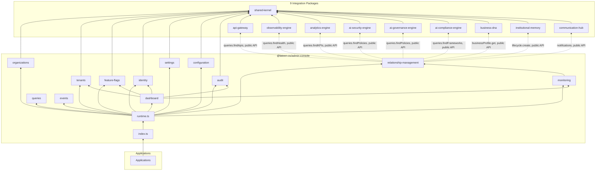

# Admin Console — Package Architecture

> **Lateen OS Architecture v1.0 (Locked)**

## Purpose

`@lateen-os/admin-console` is the platform administration layer for Lateen OS — Organizations, Tenants, Environments, Feature Flags, Identity Administration, System Settings, Configuration Management, the Audit Center, System Monitoring, and the Administration Dashboard. Every capability is a **real, deterministic, in-memory implementation** — there is no contracts-only scaffold in this package; it was built directly as a real runtime (see `runtime.ts`'s `createAdminConsoleRuntime()`).

---

## Design principles

1. **DI only, no hidden state** — every `create*` factory takes its dependencies (repositories, event bus, `now()`) explicitly. No module-level singletons.
2. **Repositories stay internal** — `createAdminConsoleRuntime()` constructs every repository and injects it into the relevant service; only services, the query layer, and the event bus are returned.
3. **Organizations are platform-wide, not organization-scoped** — an `Organization` record IS the tenancy boundary (`Organization.id === organizationId`), so `organizations/repository.ts` is deliberately the one repository in this package that is not partitioned by `organizationId` the usual way; `findAll()` lists every platform organization.
4. **Settings can be genuinely global** — a `Setting` at `'global'` scope has no `organizationId` at all. `settings/repository.ts` uses the same global-store pattern as `organizations/`, with scope/organization/tenant filtering performed in the engine, not the repository.
5. **Identity Administration never duplicates authentication** — Users/Groups/Roles/Permissions here are administrative RBAC bookkeeping only. Credential verification, tokens, and the authentication pipeline live in AI Security Engine; this package's only link to it is `relationship-management`'s read-only `getSecurityPolicyContext()`.
6. **System Monitoring owns no monitoring logic of its own** — `monitoring/engine.impl.ts` is a pure aggregation over `relationship-management`'s Observability/Analytics/Security/Governance/Compliance methods. It computes no health scores, runs no checks, and stores nothing — every number it reports is read live from a sibling package's own query layer.
7. **The Administration Dashboard is intra-package composition, never a new source of truth** — `dashboard/engine.impl.ts` composes the Tenant, Feature Flag, Identity, and Audit engines plus the Monitoring engine; every KPI is a real, currently-stored count, never a placeholder or sampled estimate.
8. **Feature flags resolve by deterministic most-specific-match precedence** — environment override → tenant override → organization-wide default → `false`. Never randomized rollout percentages.
9. **A narrow, explicit integration surface across 9 sibling packages** — each is wired to exactly one meaningful Relationship Layer method (see below), always through the sibling's public runtime API, never a repository, never a modification to that package.
10. **Deterministic everywhere** — guarded lifecycle state machines (Organization, Tenant, Environment), versioned settings with full change history, fixed field-level configuration validation, fixed system-status banding. **No LLM or AI inference anywhere in this package.**

---

## Module map

| Module | Responsibility | Key exports |
| ------ | -------------- | ------------ |
| `shared/` | IDs, date arithmetic, primitives, entity/domain-event/repository bases, 15 typed errors | — |
| `organizations/` | Organization Registry (platform-wide) | `OrganizationEngine`, `canTransitionOrganization` |
| `tenants/` | Tenant Registry, Environment Registry | `TenantEngine`, `canTransitionTenant` |
| `feature-flags/` | Feature Flag Registry | `FeatureFlagEngine` |
| `identity/` | Users, Groups, Roles, Permissions | `IdentityAdministrationEngine` |
| `settings/` | Versioned global/tenant/organization settings | `SettingsEngine` |
| `configuration/` | Runtime configuration, environment overrides, validation | `ConfigurationEngine`, `validateConfigPayload` |
| `audit/` | Immutable audit timeline | `AuditCenterEngine` |
| `monitoring/` | Pure aggregation over the Relationship Layer | `MonitoringEngine` |
| `dashboard/` | Administration Dashboard | `DashboardEngine`, `computeSystemStatus` |
| `relationship-management/` | 9-collaborator integration | `RelationshipManagement` |
| `queries/` | Read-side query port | `AdminQueries` |
| `events/` | Typed event bus | `AdminEventBus`, `AdminEventMap` |

Each aggregate module follows: `types.ts`, `repository.ts` (port), `repository.impl.ts` (real in-memory implementation), a `*.impl.ts` service/engine file, and `index.ts`.

---

## Dependency rules

### Allowed dependencies

- `shared-kernel` — `Entity`, `Identifier`, `Timestamp`, `EventBus`, `InMemoryRepository`, `AuditInfo`
- `business-dna` — `OrganizationId` (type-only reuse); `businessProfile.get()` (optional, injected via Relationship Layer)
- `api-gateway` — `queries.findApis()` (optional, injected via Relationship Layer)
- `observability-engine` — `queries.findHealth()` (optional, injected via Relationship Layer)
- `analytics-engine` — `queries.findKPIs()` (optional, injected via Relationship Layer)
- `ai-security-engine` — `queries.findPolicies()` (optional, injected via Relationship Layer)
- `ai-governance-engine` — `queries.findPolicies()` (optional, injected via Relationship Layer)
- `ai-compliance-engine` — `queries.findFrameworks()` (optional, injected via Relationship Layer)
- `institutional-memory` — `lifecycle.create()` (optional, injected via Relationship Layer)
- `communication-hub` — `notifications` service (optional, injected via Relationship Layer)

### Forbidden

- Persistence, ORM, or any real database/storage backend
- AI/ML frameworks or LLM SDKs of any kind
- Importing a repository from any integration package (their public runtime APIs only)
- Modifying any integration package to accommodate the Admin Console
- Upstream packages importing `admin-console` (no inversion)
- Implementing password hashing, token issuance/verification, or any authentication pipeline — that is AI Security Engine's exclusive responsibility
- Re-implementing health checks, alerting, or scoring inside `monitoring/` — every number must be read from a sibling's own query layer

---

## Dependency diagram



---

## Public API

```typescript
import {
  createAdminConsoleRuntime,
  organizations,
  tenants,
  featureFlags,
  identity,
  settings,
  configuration,
  audit,
  monitoring,
  dashboard,
  relationshipManagement,
  queries,
  events,
  type AdminConsoleRuntime,
  type Organization,
  type Tenant,
  type User,
  type AuditEntry,
  type DashboardSnapshot,
} from '@lateen-os/admin-console';
```

Namespace exports for each module; root re-exports for aggregate interfaces, service ports, pure functions, and the composition root. Repositories are exported as **types only** (for advanced/testing use) — never as constructed instances outside `createAdminConsoleRuntime()`.

---

## Version alignment

| Artifact | Count |
| -------- | ----- |
| Lateen OS Architecture | v1.0 Locked |
| Organization statuses | 3 (active, suspended, archived) |
| Tenant statuses | 3 (active, suspended, archived) |
| Environment types | 3 (development, staging, production) |
| Setting scopes | 3 (global, tenant, organization) |
| Query methods | 8 (`AdminQueries`) |
| Runtime events | 10 (`AdminEventMap`) |
| External integrations | 9 (API Gateway, Observability Engine, Analytics Engine, AI Security Engine, AI Governance Engine, AI Compliance Engine, Business DNA, Institutional Memory, Communication Hub) — all via public API |
