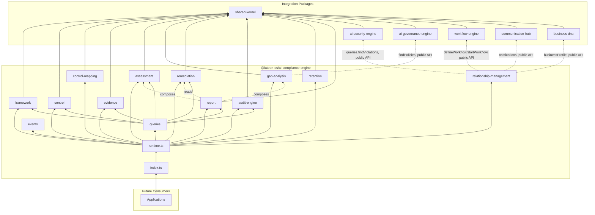
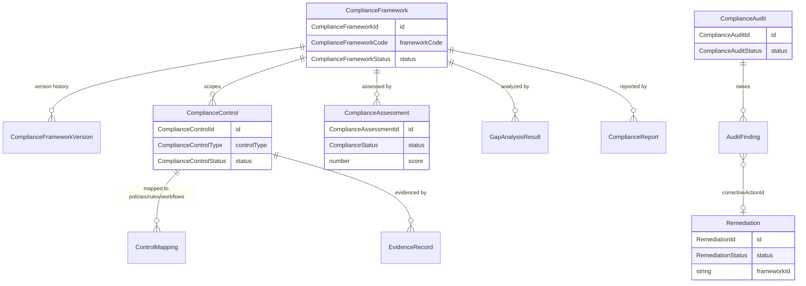

# AI Compliance Engine — Package Architecture

> **Lateen OS Architecture v1.0 (Locked)**

## Purpose

`@lateen-os/ai-compliance-engine` is the canonical compliance layer for Lateen OS — the Compliance Framework Registry, Compliance Controls, Control Mapping, Evidence Management, the Assessment Engine, Gap Analysis, the Remediation Engine, the Audit Engine, the Retention Engine, and Compliance Reports. Every capability is a **real, deterministic, in-memory implementation** — there is no contracts-only scaffold in this package; it was created directly as a real runtime (see `runtime.ts`'s `createComplianceRuntime()`).

---

## Design principles

1. **DI only, no hidden state** — every `create*` factory takes its dependencies (repositories, event bus, `now()`, and — for `gap-analysis` and `relationship-management` — the optional external collaborators) explicitly. No module-level singletons.
2. **Repositories stay internal** — `createComplianceRuntime()` constructs every repository and injects it into the relevant service; only services and the query layer are returned.
3. **Archiving and restoring are distinct from ordinary transitions** — a Compliance Framework's `archived` status has no outgoing edges in `FRAMEWORK_TRANSITIONS`; `activate()`/`deactivate()` cannot be used to bypass `restore()`. `restore()` is a dedicated operation that returns a framework to the status it held immediately before archiving (`statusBeforeArchive`), independent of the shared transitions table — the same fix pattern proven in AI Governance Engine's Governance Policy engine.
4. **A narrow, distributed integration surface** — of the 5 required sibling packages, AI Governance Engine is integrated exactly where it's needed (Gap Analysis's "orphaned policies" check), and AI Security Engine/Business DNA/Workflow Engine/Communication Hub are integrated by the Relationship Layer. Always through the sibling's public runtime API — never a repository, never a modification to that package.
5. **Reports compose, they don't duplicate** — `report`'s `generateReport()` calls this package's own Assessment Engine and Gap Analysis fresh on every call (intra-package composition, wired together in `runtime.ts`), and reads Remediation Engine data directly, rather than re-implementing scoring or gap detection.
6. **Evidence and Decision-adjacent history are immutable** — Evidence Management exposes no update or delete method; every collection call is a new, timestamped record. `getHistory()` is the append-only view.
7. **Deterministic everywhere** — guarded lifecycle state machines, fixed control-classification rules (status × implementation status × expiry × evidence presence), fixed retention-window arithmetic. **No LLM anywhere in this package.**

---

## Module map

| Module | Responsibility | Key exports |
| ------ | -------------- | ------------ |
| `shared/` | IDs (reusing Business DNA's/AI Security Engine's/AI Governance Engine's canonical ids), primitives, entity/domain-event/repository bases, `id.ts` helpers | — |
| `framework/` | Compliance Framework Registry — 8 frameworks, full lifecycle, version history | `ComplianceFrameworkEngine`, `ComplianceFrameworkRepository` |
| `control/` | Compliance Controls — 4 types, create/update/approve/retire | `ComplianceControlService`, `ComplianceControlRepository` |
| `control-mapping/` | Deterministic mappings to policies/rules/security controls/workflows/processes | `ControlMappingService`, `ControlMappingRepository` |
| `evidence/` | Immutable, append-only evidence management | `EvidenceService`, `EvidenceRepository` |
| `assessment/` | Deterministic per-control classification and per-framework scoring | `AssessmentEngine`, `ComplianceAssessmentRepository` |
| `gap-analysis/` | Missing/expired controls, missing evidence, orphaned policies, remediation plan | `GapAnalysisEngine`, `GapAnalysisRepository` |
| `remediation/` | Guarded remediation status lifecycle | `RemediationEngine`, `RemediationRepository` |
| `audit-engine/` | Audit plans, execution, findings | `AuditEngine`, `ComplianceAuditRepository` |
| `retention/` | Deterministic retention rules | `RetentionEngine`, `ComplianceRetentionRuleRepository` |
| `report/` | Deterministic per-framework compliance reports | `ReportEngine`, `ComplianceReportRepository` |
| `relationship-management/` | AI Security Engine / Business DNA / Workflow Engine / Communication Hub integration | `RelationshipManagement` |
| `queries/` | Read-side query port | `ComplianceQueries` |
| `events/` | Typed event bus | `ComplianceEventBus`, `ComplianceEventMap` |

Each aggregate module follows: `types.ts`, `repository.ts` (port), `repository.impl.ts` (real in-memory implementation), a `*.impl.ts` service/engine file, and `index.ts`.

---

## Dependency rules

```
┌──────────────────────────────────────────────┐
│      Applications, future consumers          │
└────────────────────┬─────────────────────────┘
                     │
                     ▼
┌────────────────────────────────────────────────────┐
│           @lateen-os/ai-compliance-engine           │
└──┬───────────┬────────────┬──────────┬─────────────┘
   │           │            │          │
   ▼           ▼            ▼          ▼
┌─────────┐┌──────────┐┌──────────┐┌────────┐
│ai-      ││ai-       ││workflow- ││communi-│
│security-││governance││engine    ││cation- │
│engine   ││-engine   ││(relat-   ││hub     │
│(relat-  ││(gap-     ││ionship-  ││(relat- │
│ionship- ││analysis) ││mgmt)     ││ionship-│
│mgmt)    ││          ││          ││mgmt)   │
└─────────┘└──────────┘└──────────┘└────────┘
        │                              │
        ▼                              ▼
              @lateen-os/business-dna (relationship-mgmt)
                            │
                            ▼
                 @lateen-os/shared-kernel
```

### Allowed dependencies

- `shared-kernel` — `Entity`, `Identifier`, `Timestamp`, `EventBus`, `InMemoryRepository`, `AuditInfo`
- `business-dna` — `OrganizationId`, `EmployeeId` (type-only reuse); `createBusinessDnaRuntime`'s public `businessProfile` service (optional, injected via Relationship Layer)
- `ai-security-engine` — `IdentityId` (type-only reuse); `createSecurityRuntime`'s public `queries` (optional, injected via Relationship Layer)
- `ai-governance-engine` — `GovernancePolicyId` (type-only reuse); `GovernanceQueries.findPolicies()` (optional, injected via Gap Analysis)
- `workflow-engine` — `createWorkflowRuntime`'s public `defineWorkflow` / `startWorkflow` operations (optional, injected via Relationship Layer)
- `communication-hub` — `createCommunicationRuntime`'s public `notifications` service (optional, injected via Relationship Layer)

### Forbidden

- Persistence, ORM, vector DB, embedding libraries, real file/object storage (evidence attachments are metadata only)
- AI/ML frameworks or LLM SDKs of any kind
- Importing a repository from any integration package (their public runtime APIs only)
- Modifying any integration package to accommodate the AI Compliance Engine
- Upstream packages importing `ai-compliance-engine` (no inversion)

---

## Dependency diagram



---

## Aggregate relationship diagram



---

## Public API

```typescript
import {
  createComplianceRuntime,
  framework,
  control,
  controlMapping,
  evidence,
  assessment,
  gapAnalysis,
  remediation,
  auditEngine,
  retention,
  report,
  relationshipManagement,
  queries,
  events,
  type ComplianceRuntime,
  type ComplianceFramework,
  type ComplianceAssessment,
  type ComplianceReport,
} from '@lateen-os/ai-compliance-engine';
```

Namespace exports for each module; root re-exports for aggregate interfaces, service ports, pure classification/scoring functions, and the composition root. Repositories are exported as **types only** (for advanced testing) — never as constructed instances outside `createComplianceRuntime()`.

---

## Version alignment

| Artifact | Count |
| -------- | ----- |
| Lateen OS Architecture | v1.0 Locked |
| Compliance frameworks | 8 (GDPR, ISO27001, SOC2, HIPAA, PCI DSS, NIST CSF, ISO42001, EU AI Act) |
| Control types | 4 (administrative, technical, operational, physical) |
| Mapped record types | 5 (policy, governance_rule, security_control, workflow, business_process) |
| Compliance statuses | 4 (compliant, partially_compliant, non_compliant, not_assessed) |
| Remediation statuses | 5 (open, in_progress, blocked, completed, cancelled) |
| Retention data categories | 4 (audit_evidence, compliance_report, assessment_history, policy_history) |
| Query methods | 9 (`ComplianceQueries`) |
| Runtime events | 11 (`ComplianceEventMap`) |
| External integrations | 5 (AI Security Engine, AI Governance Engine, Business DNA, Workflow Engine, Communication Hub) — all via public API |
