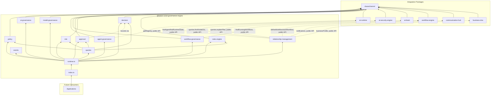
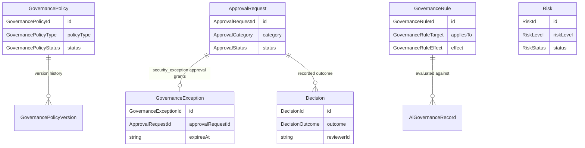

# AI Governance Engine — Package Architecture

> **Lateen OS Architecture v1.0 (Locked)**

## Purpose

`@lateen-os/ai-governance-engine` is the canonical governance layer for Lateen OS's AI surface — Governance Policies, AI Governance, Model Governance, Agent Governance, Workflow Governance, the Human Approval Engine, Risk Governance, Decision Tracking, and the Governance Rules Engine. Every capability is a **real, deterministic, in-memory implementation** — there is no contracts-only scaffold in this package; it was created directly as a real runtime (see `runtime.ts`'s `createGovernanceRuntime()`).

---

## Design principles

1. **DI only, no hidden state** — every `create*` factory takes its dependencies (repositories, event bus, `now()`, and — for `agent-governance`, `workflow-governance`, and `relationship-management` — the optional external collaborators) explicitly. No module-level singletons.
2. **Repositories stay internal** — `createGovernanceRuntime()` constructs every repository and injects it into the relevant service; only services and the query layer are returned.
3. **Archiving and restoring are distinct from ordinary transitions** — a Governance Policy's `archived` status has no outgoing edges in `POLICY_TRANSITIONS`; `activate()`/`deactivate()` cannot be used to bypass `restore()`. `restore()` is a dedicated operation that returns a policy to the status it held immediately before archiving (`statusBeforeArchive`), independent of the shared transitions table.
4. **A narrow, distributed integration surface** — each of the 6 required sibling packages is integrated exactly where it's needed: AI Runtime by Agent Governance (and the Relationship Layer), Workflow Engine by Workflow Governance (and the Relationship Layer), and AI Security Engine/AI Brain/Business DNA/Communication Hub by the Relationship Layer. Always through the sibling's public runtime API — never a repository, never a modification to that package.
5. **Decision Tracking is the single, immutable ledger** — the Human Approval Engine records every completed decision (approve or reject) through the injected Decision Tracking service rather than keeping its own history; `getHistory()` exposes no update or delete method by design.
6. **Deterministic everywhere** — guarded lifecycle state machines, deny-wins policy/rule evaluation, attribute-based rule conditions (`eq` / `neq` / `in`). **No LLM anywhere in this package** — the Governance Rules Engine is fixed conditional logic, not model inference.

---

## Module map

| Module | Responsibility | Key exports |
| ------ | -------------- | ------------ |
| `shared/` | IDs (reusing Business DNA's/AI Runtime's/AI Security Engine's canonical ids), primitives, entity/domain-event/repository bases, `id.ts` helpers | — |
| `policy/` | Governance Policies — 7 types, full lifecycle, version history | `GovernancePolicyEngine`, `GovernancePolicyRepository` |
| `ai-governance/` | Uniform governance ledger over AI Providers/Models/Agents/Workers/Brain/Runtime | `AiGovernanceService`, `AiGovernanceRecordRepository` |
| `model-governance/` | Approved/blocked/deprecated model lifecycle + version tracking | `ModelGovernanceService`, `ModelGovernanceRecordRepository` |
| `agent-governance/` | Registration approval, suspension, retirement, capability/permission control, composed with AI Runtime | `AgentGovernanceService`, `AgentGovernanceRecordRepository` |
| `workflow-governance/` | Approval, version policy, execution policy, composed with Workflow Engine | `WorkflowGovernanceService`, `WorkflowGovernanceRecordRepository` |
| `approval/` | Human Approval Engine + granted `GovernanceException` records | `ApprovalEngine`, `ApprovalRequestRepository`, `GovernanceExceptionRepository` |
| `risk/` | Risk register — levels, mitigation, acceptance, escalation | `RiskRegister`, `RiskRepository` |
| `decision/` | Immutable Decision Tracking audit history | `DecisionTrackingService`, `DecisionRepository` |
| `rules-engine/` | Deny/flag/allow deterministic rule evaluation | `GovernanceRulesEngine`, `GovernanceRuleRepository` |
| `relationship-management/` | AI Security Engine / AI Runtime / AI Brain / Workflow Engine / Business DNA / Communication Hub integration | `RelationshipManagement` |
| `queries/` | Read-side query port | `GovernanceQueries` |
| `events/` | Typed event bus | `GovernanceEventBus`, `GovernanceEventMap` |

Each aggregate module follows: `types.ts`, `repository.ts` (port), `repository.impl.ts` (real in-memory implementation), a `*.impl.ts` service/engine file, and `index.ts`.

---

## Dependency rules

```
┌──────────────────────────────────────────────┐
│      Applications, future consumers          │
└────────────────────┬─────────────────────────┘
                     │
                     ▼
┌────────────────────────────────────────────────────┐
│           @lateen-os/ai-governance-engine           │
└──┬──────────┬───────────┬──────────┬────────┬─────┬─┘
   │          │           │          │        │     │
   ▼          ▼           ▼          ▼        ▼     ▼
┌────────┐┌─────────┐┌──────────┐┌────────┐┌───────┐┌────────┐
│ai-     ││ai-      ││workflow- ││ai-     ││busine-││communi-│
│runtime ││security-││engine    ││brain   ││ss-dna ││cation- │
│(agent- ││engine   ││(workflow-││(relat- ││(relat-││hub     │
│govern.,││(relat-  ││govern.,  ││ionship-││ionship││(relat- │
│relat-  ││ionship- ││relation- ││mgmt)   ││-mgmt) ││ionship-│
│ionship)││mgmt)    ││ship-mgmt)││        ││       ││mgmt)   │
└────────┘└─────────┘└──────────┘└────────┘└───────┘└────────┘
                     │
                     ▼
            @lateen-os/shared-kernel
```

### Allowed dependencies

- `shared-kernel` — `Entity`, `Identifier`, `Timestamp`, `EventBus`, `InMemoryRepository`, `AuditInfo`
- `business-dna` — `OrganizationId`, `EmployeeId` (type-only reuse); `createBusinessDnaRuntime`'s public `businessProfile` service (optional, injected via Relationship Layer)
- `ai-security-engine` — `IdentityId` (type-only reuse); `createSecurityRuntime`'s public `queries` (optional, injected via Relationship Layer)
- `ai-runtime` — `RuntimeAgentId` (type-only reuse); the real, exported `AgentRegistryService.getRegistry()` (optional, injected via Agent Governance); `RuntimeQueries.findAgent()` / `findRuntimeState()` (optional, injected via Relationship Layer)
- `ai-brain` — `createBrainSystem()`'s public `queries.explainPlan()` (optional, injected via Relationship Layer)
- `workflow-engine` — `WorkflowQueries.findRunningWorkflows()` (optional, injected via Workflow Governance); `createWorkflowRuntime`'s public `defineWorkflow` / `startWorkflow` operations (optional, injected via Relationship Layer)
- `communication-hub` — `createCommunicationRuntime`'s public `notifications` service (optional, injected via Relationship Layer)

### Forbidden

- Persistence, ORM, vector DB, embedding libraries
- AI/ML frameworks or LLM SDKs of any kind
- Importing a repository from any integration package (their public runtime APIs only)
- Modifying any integration package to accommodate the AI Governance Engine
- Upstream packages importing `ai-governance-engine` (no inversion)

---

## Dependency diagram



---

## Aggregate relationship diagram



---

## Public API

```typescript
import {
  createGovernanceRuntime,
  policy,
  aiGovernance,
  modelGovernance,
  agentGovernance,
  workflowGovernance,
  approval,
  risk,
  decision,
  rulesEngine,
  relationshipManagement,
  queries,
  events,
  type GovernanceRuntime,
  type GovernancePolicy,
  type Risk,
  type Decision,
} from '@lateen-os/ai-governance-engine';
```

Namespace exports for each module; root re-exports for aggregate interfaces, service ports, pure rule-matching functions, and the composition root. Repositories are exported as **types only** (for advanced testing) — never as constructed instances outside `createGovernanceRuntime()`.

---

## Version alignment

| Artifact | Count |
| -------- | ----- |
| Lateen OS Architecture | v1.0 Locked |
| Governance Policy types | 7 (security, workflow, ai, communication, business, approval, runtime) |
| AI Governance target types | 6 (provider, model, agent, worker, brain, runtime) |
| Approval categories | 5 (policy_change, security_exception, workflow_publication, model_approval, provider_approval) |
| Risk levels | 4 (low, medium, high, critical) |
| Governance Rule targets | 5 (runtime_action, workflow_execution, provider_usage, communication_request, business_operation) |
| Query methods | 7 (`GovernanceQueries`) |
| Runtime events | 10 (`GovernanceEventMap`) |
| External integrations | 6 (AI Security Engine, AI Runtime, AI Brain, Workflow Engine, Business DNA, Communication Hub) — all via public API |
