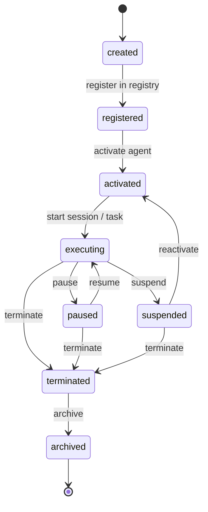
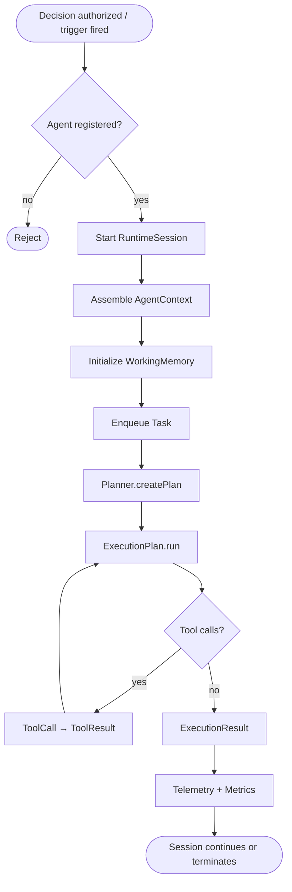
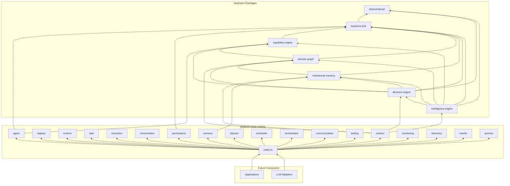

# AI Runtime — Package Architecture

> **Lateen OS Architecture v1.0 (Locked)** — Layer 4: AI Workforce

## Purpose

`@lateen-os/ai-runtime` is the **canonical operating system for AI agents** in Lateen OS. It manages agent registration, sessions, tasks, execution, conversation, working memory, orchestration, tooling, permissions, and telemetry.

The package defines models and ports only — no LLM integration, persistence, UI, API, or business logic.

---

## Architectural rule

```
Business DNA Agent (identity)
        │
        ▼
   Agent Registry ──▶ Runtime Session ──▶ Task ──▶ Execution
        │                    │              │
        ▼                    ▼              ▼
   Permissions          Working Memory   Planner / Scheduler
        │                    │              │
        ▼                    ▼              ▼
   Orchestrator ◀──── Communication ──▶ Tooling
        │
        ▼
   Telemetry & Monitoring
```

Every AI agent **must execute inside AI Runtime**. Runtime agents link to Business DNA via `businessDnaAgentId`.

---

## Module map

| Module | Types | Events | Repository / Port |
| ------ | ----- | ------ | ----------------- |
| `agent` | Agent, AgentProfile, AgentRole, AgentCapability, AgentStatus, AgentLifecycle | ✓ | AgentRepository |
| `registry` | AgentRegistry, AgentRegistration, AgentDescriptor | ✓ | AgentRegistryRepository |
| `runtime` | RuntimeSession, RuntimeState, RuntimeContext | ✓ | RuntimeSessionRepository |
| `task` | Task, TaskQueue, TaskPriority, TaskStatus, TaskResult | ✓ | TaskRepository |
| `execution` | ExecutionPlan, ExecutionContext, ExecutionResult | ✓ | ExecutionPlanRepository, ExecutionResultRepository |
| `conversation` | Conversation, ConversationMessage, ConversationThread | ✓ | ConversationRepository |
| `memory` | WorkingMemory, MemoryReference, ContextWindow | ✓ | WorkingMemoryRepository |
| `context` | AgentContext, BusinessContext, DecisionContextReference | ✓ | AgentContextRepository |
| `planner` | Planner (port), Plan, PlanStep | ✓ | PlanRepository |
| `scheduler` | Scheduler (port), Schedule, Trigger | ✓ | ScheduleRepository |
| `orchestrator` | Orchestrator (port), AgentCoordinator, MultiAgentWorkflow | ✓ | MultiAgentWorkflowRepository |
| `communication` | AgentMessage, MessageType, Channel | ✓ | AgentMessageRepository |
| `tooling` | Tool, ToolCall, ToolResult, ToolDescriptor | ✓ | ToolRepository, ToolCallRepository |
| `permissions` | RuntimePermission, AgentPermission, CapabilityPermission | ✓ | AgentPermissionRepository |
| `monitoring` | HealthStatus, RuntimeMetrics, ExecutionMetrics | ✓ | RuntimeMetricsRepository |
| `telemetry` | TelemetryEvent, Trace, Span | ✓ | TelemetryEventRepository, TraceRepository |
| `events` | AiRuntimeDomainEvent union | — | — |
| `queries` | RuntimeQueries | — | — |

---

## Dependency rules

```
┌──────────────────────────────────────────────┐
│  Applications, Adapters (future)             │
└────────────────────┬─────────────────────────┘
                     │
                     ▼
┌──────────────────────────────────────────────┐
│           @lateen-os/ai-runtime              │
└──┬────┬────┬────┬────┬────┬────┬────────────┘
   │    │    │    │    │    │    │
   ▼    ▼    ▼    ▼    ▼    ▼    ▼
  SK   BD   CE   DG   IM   DE   IE
```

SK = shared-kernel, BD = business-dna, CE = capability-engine, DG = domain-graph, IM = institutional-memory, DE = decision-engine, IE = intelligence-engine

### Forbidden

- LLM / OpenAI / Claude SDK in this package
- Persistence, ORM, UI, HTTP
- Business logic or decision execution
- Upstream packages importing ai-runtime

---

## Agent lifecycle diagram



---

## Execution flow diagram



---

## Dependency diagram



---

## Query port

`RuntimeQueries`:

- `findAgent`
- `findTasks`
- `findSessions`
- `findConversations`
- `findRuntimeState`
- `findExecutionHistory`

---

## Relationship to other layers

| Layer | Role |
| ----- | ---- |
| Intelligence Engine | Produces recommendations |
| Decision Engine | Approves / authorizes actions |
| **AI Runtime** | Executes authorized agent work |
| Business DNA | Defines agent identity & workforce type |

Runtime `Agent` ≠ Business DNA `Agent`. They are linked via `businessDnaAgentId`.
