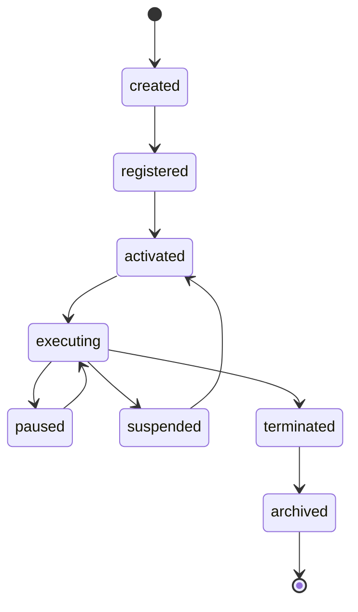
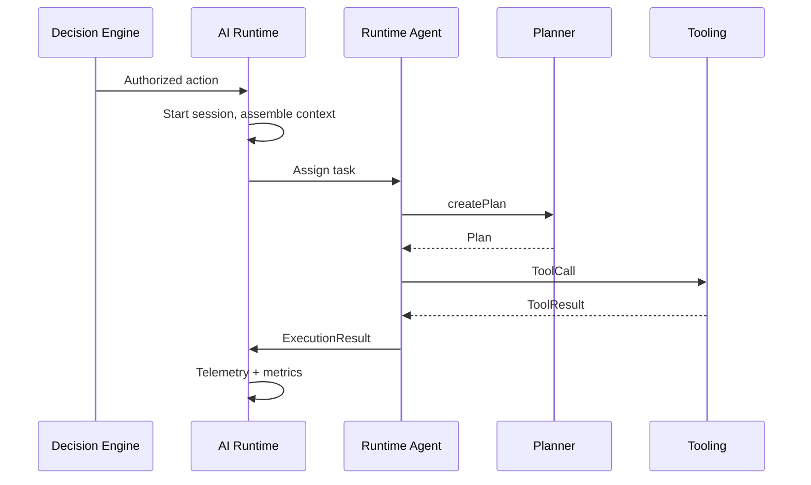
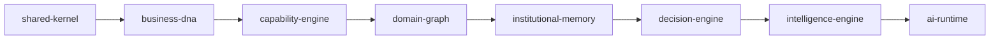

# Runtime Model

> Canonical AI Runtime model for Lateen OS v1.0

## Principle

**Intelligence analyzes; Decision Engine decides; AI Runtime executes.**

The AI Runtime orchestrates agent lifecycle, sessions, tasks, and execution. It never embeds LLM providers or business decision logic.

## Position in the stack

```
Intelligence Engine ──▶ Decision Engine ──▶ AI Runtime ──▶ (Adapters / Tools)
     (recommend)           (authorize)         (execute)
```

## Agent model

| Type | Description |
| ---- | ----------- |
| `Agent` | Runtime aggregate — every agent executes here |
| `AgentProfile` | Display name, workforce type, proactive/reactive flags |
| `AgentRole` | Role binding from Business DNA |
| `AgentCapability` | Capability binding from Capability Engine |
| `AgentStatus` | registered, idle, running, paused, suspended, terminated, archived |
| `AgentLifecycle` | created → registered → activated → executing → … |

Runtime agents reference Business DNA via `businessDnaAgentId`.

## Registry model

| Type | Description |
| ---- | ----------- |
| `AgentRegistry` | One registry per organization |
| `AgentRegistration` | Registration record with descriptor |
| `AgentDescriptor` | Runtime agent identity snapshot at registration |

## Runtime session model

| Type | Description |
| ---- | ----------- |
| `RuntimeSession` | Active execution session for an agent |
| `RuntimeState` | initializing, ready, busy, waiting, paused, shutting_down, terminated |
| `RuntimeContext` | Session-scoped context (agent context, active task) |

## Task & execution model

| Type | Description |
| ---- | ----------- |
| `Task` | Unit of work with priority and status |
| `TaskQueue` | Ordered task IDs per agent or organization |
| `TaskPriority` | critical, high, normal, low, background |
| `TaskStatus` | queued, assigned, running, completed, failed, cancelled |
| `TaskResult` | Success/failure output |
| `ExecutionPlan` | Steps to execute a task |
| `ExecutionContext` | Session + task binding during execution |
| `ExecutionResult` | Outcome of a completed plan |

## Conversation & memory model

| Type | Description |
| ---- | ----------- |
| `Conversation` | Runtime-scoped conversation (not institutional memory) |
| `ConversationMessage` | Single message with role |
| `ConversationThread` | Ordered messages |
| `WorkingMemory` | Short-lived session memory |
| `MemoryReference` | Pointer to institutional or runtime artifact |
| `ContextWindow` | Bounded memory window for active execution |

## Context model

| Type | Description |
| ---- | ----------- |
| `AgentContext` | Assembled context for execution |
| `BusinessContext` | Reference to Business DNA / graph entity |
| `DecisionContextReference` | Reference to Decision Engine outcome (not full aggregate) |

## Planning, scheduling & orchestration

| Type | Description |
| ---- | ----------- |
| `Planner` | Port — create/refine plans |
| `Plan` / `PlanStep` | Structured execution plan |
| `Scheduler` | Port — schedule and trigger tasks |
| `Schedule` / `Trigger` | Cron, interval, event, or manual triggers |
| `Orchestrator` | Port — multi-agent workflows |
| `AgentCoordinator` | Lead + participant agents |
| `MultiAgentWorkflow` | Coordinated multi-agent execution |

## Communication & tooling

| Type | Description |
| ---- | ----------- |
| `AgentMessage` | Inter-agent or runtime message |
| `MessageType` | command, query, response, notification, handoff, heartbeat |
| `Channel` | direct, broadcast, workflow, system |
| `Tool` / `ToolDescriptor` | Registered callable tool |
| `ToolCall` / `ToolResult` | Invocation and outcome |

## Permissions

| Type | Description |
| ---- | ----------- |
| `RuntimePermission` | Runtime-scoped permission |
| `AgentPermission` | Permissions granted to an agent |
| `CapabilityPermission` | Capability ↔ permission binding |

## Monitoring & telemetry

| Type | Description |
| ---- | ----------- |
| `HealthStatus` | healthy, degraded, unhealthy, unknown |
| `RuntimeMetrics` | Organization-wide runtime snapshot |
| `ExecutionMetrics` | Per-execution duration and tool counts |
| `TelemetryEvent` | Domain telemetry event |
| `Trace` / `Span` | Distributed tracing primitives |

## Query port

`RuntimeQueries`:

- `findAgent` — discover runtime agents
- `findTasks` — list tasks by agent or status
- `findSessions` — list active or historical sessions
- `findConversations` — list agent conversations
- `findRuntimeState` — organization runtime state summary
- `findExecutionHistory` — execution results history

## Proactive & reactive modes

Architecture v1.0 supports both modes via `AgentProfile`:

- `proactiveEnabled` — agent may initiate work from intelligence signals
- `reactiveEnabled` — agent responds to tasks and messages

Both modes still require Decision Engine authorization for business actions.

## Agent lifecycle diagram



## Execution flow diagram



## Dependency diagram



All upstream packages are type-only dependencies for identifiers and cross-layer references.
