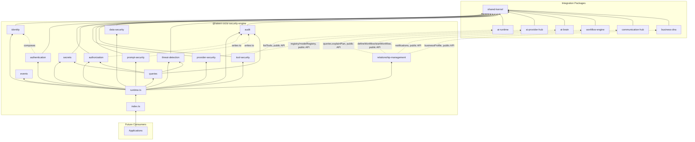
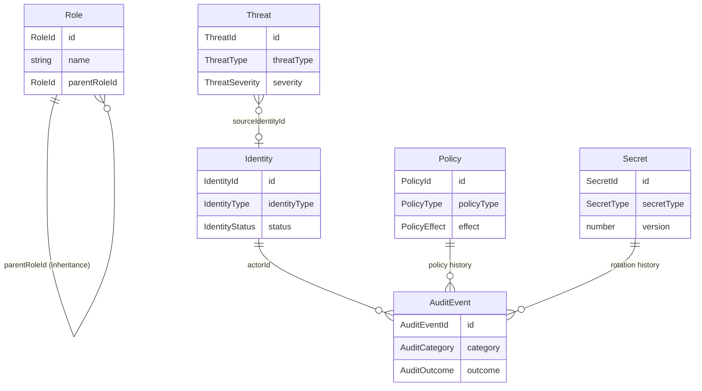

# AI Security Engine — Package Architecture

> **Lateen OS Architecture v1.0 (Locked)**

## Purpose

`@lateen-os/ai-security-engine` is the canonical security layer for Lateen OS's AI surface — Identity, Authentication, Authorization, Secrets, Provider Security, Prompt Security, Tool Security, Data Security, Threat Detection, and Audit. Every capability is a **real, deterministic, in-memory implementation** — there is no contracts-only scaffold in this package; it was created directly as a real runtime (see `runtime.ts`'s `createSecurityRuntime()`).

---

## Design principles

1. **DI only, no hidden state** — every `create*` factory takes its dependencies (repositories, event bus, `now()`, and — for `provider-security`, `tool-security`, and `relationship-management` — the optional external collaborators) explicitly. No module-level singletons.
2. **Repositories stay internal** — `createSecurityRuntime()` constructs every repository and injects it into the relevant service; only services and the query layer are returned.
3. **Real cryptography everywhere it matters** — session tokens, API keys, secrets, and prompt signatures all use Node's built-in `node:crypto` (SHA-256, AES-256-GCM, HMAC-SHA256). No mock, no placeholder hash. Randomness is injectable (mirroring the `now()` clock convention) so tests are deterministic without weakening production behavior.
4. **A narrow, distributed integration surface** — each of the 6 required sibling packages is integrated exactly where it's needed: AI Runtime by Tool Security, AI Provider Hub by Provider Security, and AI Brain/Workflow Engine/Communication Hub/Business DNA by the Relationship Layer. Always through the sibling's public runtime API — never a repository, never a modification to that package.
5. **One shared audit sink** — every subsystem that produces a security-relevant event (authentication, authorization, policy changes, prompt handling) writes to the single `audit` module rather than keeping its own log, so Security Audit Log / Access History / Policy History / Violations are just filtered views over one real, immutable stream.
6. **Deterministic everywhere** — guarded lifecycle state machines, deterministic RBAC/ABAC policy evaluation, deterministic regex-based threat/PII detection. No AI/LLM anywhere in this package — Threat Detection and Data Security are fixed rules, not model inference.

---

## Module map

| Module | Responsibility | Key exports |
| ------ | -------------- | ------------ |
| `shared/` | IDs (reusing Business DNA's/AI Runtime's canonical ids), primitives, entity/domain-event/repository bases, `id.ts` helpers, **real crypto** (`crypto.ts`) | — |
| `identity/` | Identity — AI/Service/Session/API-Key | `IdentityService`, `IdentityRepository` |
| `authentication/` | Token/Session/API-Key validation | `AuthenticationService` |
| `authorization/` | RBAC + ABAC + policy-based access + tenant isolation | `AuthorizationService`, `RoleRepository`, `PolicyRepository` |
| `secrets/` | Secret Store, Rotation, Provider Credentials, Encryption Keys | `SecretsService`, `SecretRepository` |
| `provider-security/` | Provider/Model allow lists, composed with AI Provider Hub | `ProviderSecurityService`, `ProviderSecurityPolicyRepository` |
| `prompt-security/` | Validation, sanitization, HMAC signatures, audit | `PromptSecurityService` |
| `tool-security/` | Tool allow/deny lists, composed with AI Runtime | `ToolSecurityService`, `ToolPolicyRepository` |
| `data-security/` | PII detection, classification, masking, redaction, retention | `DataSecurityService`, `RetentionRuleRepository` |
| `threat-detection/` | Prompt injection, jailbreak, secret leakage, tool/rate abuse | `ThreatDetectionEngine`, `ThreatRepository` |
| `audit/` | The shared audit sink | `AuditService`, `AuditEventRepository` |
| `relationship-management/` | AI Brain / Workflow Engine / Communication Hub / Business DNA integration | `RelationshipManagement` |
| `queries/` | Read-side query port | `SecurityQueries` |
| `events/` | Typed event bus | `SecurityEventBus`, `SecurityEventMap` |

Each aggregate module follows: `types.ts`, `repository.ts` (port), `repository.impl.ts` (real in-memory implementation), a `*.impl.ts` service/engine file, and `index.ts`.

---

## Dependency rules

```
┌──────────────────────────────────────────────┐
│      Applications, future consumers          │
└────────────────────┬─────────────────────────┘
                     │
                     ▼
┌──────────────────────────────────────────────────┐
│            @lateen-os/ai-security-engine           │
└──┬──────────┬───────────┬──────────┬────────┬────┬─┘
   │          │           │          │        │    │
   ▼          ▼           ▼          ▼        ▼    ▼
┌────────┐┌────────┐┌──────────┐┌────────┐┌───────┐┌────────┐
│ai-     ││ai-     ││workflow- ││communi-││busine-││ai-     │
│runtime ││provider││engine    ││cation- ││ss-dna ││brain   │
│(tool-  ││-hub    ││(relation-││hub     ││(relat-││(relat- │
│security)│(prov.  ││ship-mgmt)││(relat- ││ionship││ionship)│
│         │security)│           │ionship-││-mgmt) │-mgmt)  │
│         │         │           │mgmt)   │        │        │
└────────┘└────────┘└──────────┘└────────┘└───────┘└────────┘
                     │
                     ▼
            @lateen-os/shared-kernel
```

### Allowed dependencies

- `shared-kernel` — `Entity`, `Identifier`, `Timestamp`, `EventBus`, `InMemoryRepository`, `AuditInfo`
- `business-dna` — `OrganizationId`, `EmployeeId` (type-only reuse); `createBusinessDnaRuntime`'s public `businessProfile` service (optional, injected via Relationship Layer)
- `ai-runtime` — `RuntimeAgentId` (type-only reuse); the real, exported `createToolExecutionFramework()`'s `listTools()` (optional, injected via Tool Security)
- `ai-provider-hub` — `ProviderKind`, `ModelId`, `ProviderCapability` (type-only reuse); the real, exported `createProviderRegistry()` / `createModelRegistry()` (optional, injected via Provider Security)
- `ai-brain` — `createBrainSystem()`'s public `queries.explainPlan()` (optional, injected via Relationship Layer)
- `workflow-engine` — `createWorkflowRuntime`'s public `defineWorkflow` / `startWorkflow` operations (optional, injected via Relationship Layer)
- `communication-hub` — `createCommunicationRuntime`'s public `notifications` service (optional, injected via Relationship Layer)

### Forbidden

- Persistence, ORM, vector DB, embedding libraries
- AI/ML frameworks or LLM SDKs
- Third-party cryptography libraries (Node's built-in `node:crypto` covers every real need in this package)
- Importing a repository from any integration package (their public runtime APIs only)
- Modifying any integration package to accommodate the AI Security Engine
- Upstream packages importing `ai-security-engine` (no inversion)

---

## Dependency diagram



---

## Aggregate relationship diagram



---

## Public API

```typescript
import {
  createSecurityRuntime,
  identity,
  authentication,
  authorization,
  secrets,
  providerSecurity,
  promptSecurity,
  toolSecurity,
  dataSecurity,
  threatDetection,
  audit,
  relationshipManagement,
  queries,
  events,
  type SecurityRuntime,
  type Identity,
  type Threat,
  type AuditEvent,
} from '@lateen-os/ai-security-engine';
```

Namespace exports for each module; root re-exports for aggregate interfaces, service ports, pure crypto/detection functions, and the composition root. Repositories are exported as **types only** (for advanced testing) — never as constructed instances outside `createSecurityRuntime()`.

---

## Version alignment

| Artifact | Count |
| -------- | ----- |
| Lateen OS Architecture | v1.0 Locked |
| Identity types | 4 (ai_identity, service_identity, session_identity, api_key) |
| Authorization models | 3 (RBAC, ABAC, custom/policy-based) |
| Secret types | 3 (generic, provider_credential, encryption_key) |
| PII types detected | 4 (email, phone, ssn, credit_card) |
| Threat types detected | 5 (prompt_injection, jailbreak, secret_leakage, tool_abuse, rate_abuse) |
| Query methods | 6 (`SecurityQueries`) |
| Runtime events | 8 (`SecurityEventMap`) |
| External integrations | 6 (AI Runtime, AI Brain, Workflow Engine, Communication Hub, Business DNA, AI Provider Hub) — all via public API |
