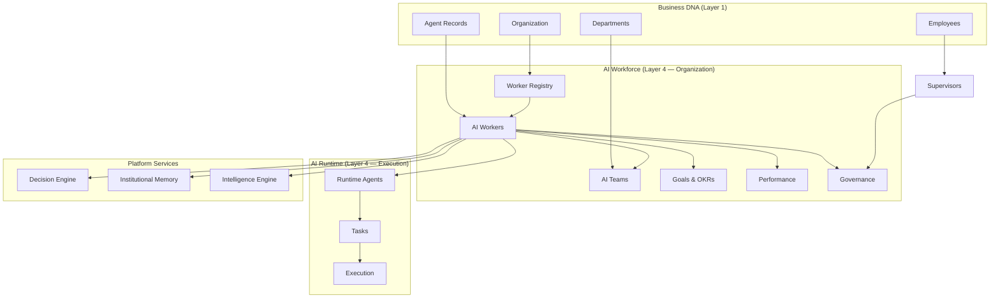
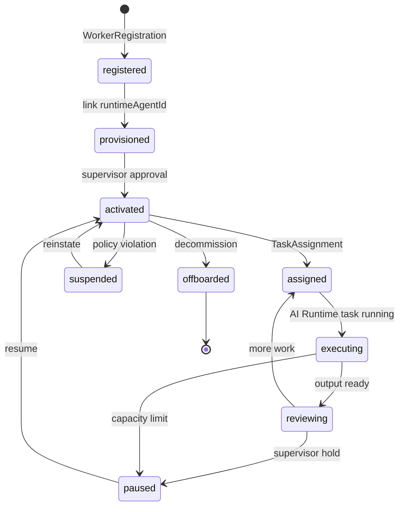
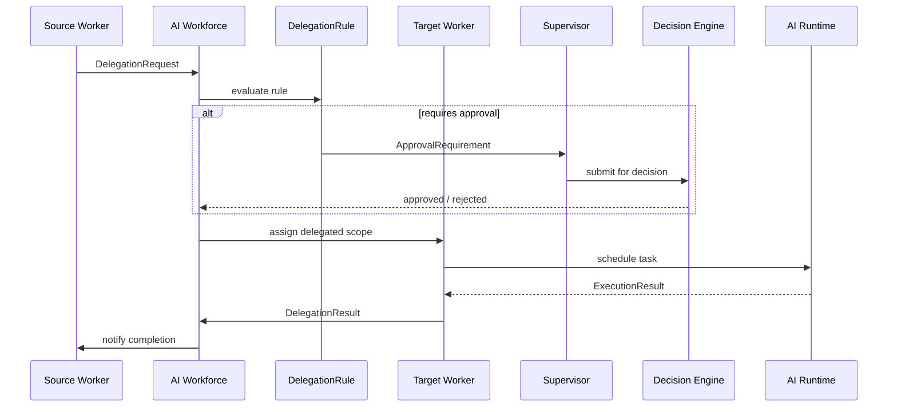

# AI Workforce Model

> Contracts for the organizational layer above AI Runtime.

---

## Organization Diagram



---

## Worker Lifecycle



### Lifecycle stages

| Stage | Description |
| ----- | ----------- |
| `registered` | Worker record created in registry |
| `provisioned` | Linked to Business DNA agent and AI Runtime agent |
| `activated` | Available for task assignment |
| `assigned` | Task or goal assigned |
| `executing` | AI Runtime running a task |
| `reviewing` | Output pending supervisor review |
| `paused` | Temporarily unavailable |
| `suspended` | Governance hold |
| `offboarded` | Removed from active workforce |

### Real implementation: `WorkerLifecycleService`

`worker/lifecycle.impl.ts`'s `createWorkerLifecycle()` implements this as a real, guarded state machine over `WorkerStatus` (the diagram above is the conceptual model; `WorkerStatus` is the concrete, persisted field it drives):

```
draft ──(hire)──> onboarding ──(activate)──> active ──(suspend)──> suspended ──(resume)──> active
active ──> busy / away / paused ──(retire, from any non-terminal state)──> offboarded ──> archived
```

Five guarded operations — `hire`, `activate`, `suspend`, `resume`, `retire` — each reject a transition the table above doesn't allow, throwing `InvalidWorkerTransitionError`. `canTransitionWorker(from, to)` is exported standalone for inspection. Every transition publishes its corresponding `worker.*` event on `WorkforceEventBus`.

---

## Delegation Flow



### Delegation scopes

| Scope | Description |
| ----- | ----------- |
| `task` | Single runtime task handoff |
| `decision` | Decision preparation (not finalization) |
| `goal` | Objective or key result ownership |
| `conversation` | Collaborative thread ownership |
| `full_handoff` | Complete responsibility transfer |

---

## Key aggregates

### AIWorker

The central aggregate. Links organizational identity to runtime execution:

```typescript
interface AIWorker {
  businessDnaAgentId: AgentId;   // Business DNA
  runtimeAgentId: RuntimeAgentId; // AI Runtime
  profile: WorkerProfile;
  roles: WorkerRole[];
  capabilities: WorkerCapability[];
  skills: WorkerSkill[];
  availability: WorkerAvailability;
  status: WorkerStatus;
  lifecycle: WorkerLifecycle;
}
```

### AITeam

Collaborative unit of workers with a lead and shared objectives.

### DelegationRequest

Formal handoff between workers, governed by `DelegationRule` and optionally requiring supervisor approval via Decision Engine.

### TaskAssignment

Workforce-level binding of an AI Runtime `TaskId` to a `WorkerId`.

### Goal → Objective → KeyResult

OKR hierarchy for measuring worker and team outcomes over defined periods.

---

## Query port

`WorkforceQueries` is the original contract for read-side access:

| Method | Returns |
| ------ | ------- |
| `findWorkers()` | Active and filtered workers |
| `findTeams()` | Teams and membership |
| `findGoals()` | Goals, objectives, key results |
| `findPerformance()` | Metrics, scores, task statistics |
| `findAssignments()` | Task assignments by worker or task |
| `findAvailability()` | Capacity snapshots for scheduling |

### Real implementation: `WorkforceRuntimeQueries`

`queries/runtime-queries.impl.ts`'s `createWorkforceRuntimeQueries()` is the real query layer exposed by `createWorkforceRuntime()` — composed purely over repositories and engines, never returning a repository itself:

| Method | Returns |
| ------ | ------- |
| `findWorkers()` | Workers filtered by status / workforce type / department |
| `findAvailableWorkers()` | Workers with `available` capacity, optionally filtered by role |
| `findAssignments()` | Real `TaskAssignment` records by worker / task / status |
| `findCapabilities()` | The organization's skill catalog |
| `findPerformance()` | Real `PerformanceMetrics` snapshots + computed `WorkerScore` + `TaskStatistics` |
| `findCapacity()` | Real-time `AvailabilitySnapshot`s from the Capacity Engine |

---

## Constraints

- No UI, API, LLM, or persistence in this package
- Workers recommend — Decision Engine decides
- All future AI worker apps consume this package
