# Analytics & Business Intelligence Platform — Package Architecture

> **Lateen OS Architecture v1.0 (Locked)**

## Purpose

`@lateen-os/analytics-engine` is the canonical business-intelligence layer for Lateen OS — the KPI Engine, the Metrics Engine, the Executive Dashboard, the Trend Engine, the Aggregation Engine, the Report Engine, and 8 category analytics engines. Every capability is a **real, deterministic, in-memory implementation** — there is no contracts-only scaffold in this package; it was created directly as a real runtime (see `runtime.ts`'s `createAnalyticsRuntime()`).

This package is unique among Lateen OS engines in one respect: it is a **read-only aggregator**. It never mutates any of the 14 integrated packages — every category analytics engine only calls `find*` query methods and persists its own summarized snapshot locally.

---

## Design principles

1. **DI only, no hidden state** — every `create*` factory takes its dependencies (repositories, event bus, `now()`, and the optional sibling-package query ports) explicitly. No module-level singletons.
2. **Repositories stay internal** — `createAnalyticsRuntime()` constructs every repository and injects it into the relevant service; only services and the query layer are returned.
3. **Category engines own their integration; the Relationship Layer owns the rest** — of the 14 required packages, 8 have a natural category-engine home (CRM/Sales → Revenue Analytics, Sales → Sales Analytics, Marketing → Marketing Analytics, Communication Hub → Communication Analytics, Workflow Engine → Workflow Analytics, AI Security Engine → Security Analytics, AI Governance Engine → Governance Analytics, AI Compliance Engine → Compliance Analytics). The remaining 6 (Institutional Memory, Domain Graph, Decision Engine, Intelligence Engine, AI Workforce, Business DNA) are integrated by `relationship-management`, following the same distributed-integration precedent established in AI Security Engine, AI Governance Engine, and AI Compliance Engine.
4. **Pure calculators, independently testable** — every formula (conversion rate, win rate, CAC, CLV, marketing ROI, sales velocity, moving/rolling averages, trend bucketing, PDF page counts, …) is exported as a standalone pure function, decoupled from any repository or event bus.
5. **Snapshots, not live views** — every category analytics engine computes a point-in-time snapshot on demand (`computeSnapshot()`) and persists it; the Query Layer reads persisted snapshots, it does not re-query sibling packages itself.
6. **Deterministic everywhere** — calendar-bucket arithmetic (ISO week numbering for `week` granularity), fixed classification thresholds, no randomness. **No LLM anywhere in this package.**

---

## Module map

| Module | Responsibility | Key exports |
| ------ | -------------- | ------------ |
| `shared/` | IDs (reusing Business DNA's canonical `OrganizationId`), primitives, entity/domain-event/repository bases, `id.ts` helpers | — |
| `kpi/` | 12 deterministic KPIs, snapshot persistence | `KpiEngine`, `KpiSnapshotRepository` |
| `metrics/` | Counters/gauges/ratios/percentages/trends/averages | `MetricsEngine`, `MetricSnapshotRepository` |
| `dashboard/` | 7 configurable executive dashboards | `DashboardEngine`, `DashboardRepository` |
| `trend/` | Deterministic day/week/month/quarter/year bucketing | `TrendEngine`, `TrendResultRepository` |
| `aggregation/` | Generic group-by/filter/rollup/drill-down/comparison | `AggregationEngine`, `AggregationResultRepository` |
| `revenue-analytics/` | Real CRM Engine + Sales Engine integration | `RevenueAnalyticsEngine` |
| `sales-analytics/` | Real Sales Engine integration | `SalesAnalyticsEngine` |
| `marketing-analytics/` | Real Marketing Engine integration | `MarketingAnalyticsEngine` |
| `communication-analytics/` | Real Communication Hub integration | `CommunicationAnalyticsEngine` |
| `workflow-analytics/` | Real Workflow Engine integration | `WorkflowAnalyticsEngine` |
| `security-analytics/` | Real AI Security Engine integration | `SecurityAnalyticsEngine` |
| `governance-analytics/` | Real AI Governance Engine integration | `GovernanceAnalyticsEngine` |
| `compliance-analytics/` | Real AI Compliance Engine integration | `ComplianceAnalyticsEngine` |
| `report/` | Deterministic PDF/CSV/JSON report models | `ReportEngine`, `AnalyticsReportRepository` |
| `relationship-management/` | Institutional Memory / Domain Graph / Decision Engine / Intelligence Engine / AI Workforce / Business DNA integration | `RelationshipManagement` |
| `queries/` | Read-side query port | `AnalyticsQueries` |
| `events/` | Typed event bus | `AnalyticsEventBus`, `AnalyticsEventMap` |

Each aggregate module follows: `types.ts`, `repository.ts` (port), `repository.impl.ts` (real in-memory implementation), a `*.impl.ts` service/engine file, and `index.ts`.

---

## Dependency rules

```
┌──────────────────────────────────────────────┐
│      Applications, future consumers          │
└────────────────────┬─────────────────────────┘
                     │
                     ▼
┌────────────────────────────────────────────────────┐
│              @lateen-os/analytics-engine            │
└──┬────┬────┬────┬────┬────┬────┬────┬────┬────┬────┬┘
   │    │    │    │    │    │    │    │    │    │    │
   ▼    ▼    ▼    ▼    ▼    ▼    ▼    ▼    ▼    ▼    ▼
 crm  sales mktg comm  wf  aisec aigov aicmp  im   dg  ...
                                                (institutional-memory,
                                                 domain-graph, decision-engine,
                                                 intelligence-engine, ai-workforce,
                                                 business-dna — relationship-mgmt)
                     │
                     ▼
            @lateen-os/shared-kernel
```

### Allowed dependencies

- `shared-kernel` — `Entity`, `Identifier`, `Timestamp`, `EventBus`, `InMemoryRepository`, `AuditInfo`
- `business-dna` — `OrganizationId` (type-only reuse); `businessProfile` service (optional, Relationship Layer)
- `crm-engine` — `CrmQueries.findAccounts()` (optional, Revenue Analytics)
- `sales-engine` — `SalesQueries.findOpportunities()` / `findQuotes()` / `findPipeline()` (optional, Revenue Analytics + Sales Analytics)
- `marketing-engine` — `MarketingQueries.findMetrics()` / `findLeads()` (optional, Marketing Analytics)
- `communication-hub` — `CommunicationQueries.findMessages()` / `findNotifications()` (optional, Communication Analytics)
- `workflow-engine` — `WorkflowQueries.findRunningWorkflows()` / `findWaitingTasks()` (optional, Workflow Analytics)
- `ai-security-engine` — `SecurityQueries.findViolations()` / `findThreats()` (optional, Security Analytics)
- `ai-governance-engine` — `GovernanceQueries.findPolicies()` / `findApprovals()` / `findGovernanceEvents()` / `findRisks()` (optional, Governance Analytics)
- `ai-compliance-engine` — `ComplianceQueries.findComplianceStatus()` / `findAssessments()` / `findRemediations()` / `findFrameworks()` (optional, Compliance Analytics)
- `institutional-memory`, `domain-graph`, `decision-engine`, `intelligence-engine`, `ai-workforce` — narrow query-port slices (optional, Relationship Layer)

### Forbidden

- Persistence, ORM, vector DB, embedding libraries, real file/report generation
- AI/ML frameworks or LLM SDKs of any kind
- Importing a repository from any integration package (their public runtime/query APIs only)
- Writing to (mutating) any integrated package — this package is strictly read-only over sibling data
- Modifying any integration package to accommodate the Analytics Platform
- Upstream packages importing `analytics-engine` (no inversion)

---

## Dependency diagram

```mermaid
flowchart BT
  subgraph consumers [Future Consumers]
    APP[Applications]
  end

  subgraph an ["@lateen-os/analytics-engine"]
    IDX[index.ts]
    RT[runtime.ts]
    KPI[kpi]
    MET[metrics]
    DASH[dashboard]
    TREND[trend]
    AGG[aggregation]
    REV[revenue-analytics]
    SAL[sales-analytics]
    MKT[marketing-analytics]
    COMM[communication-analytics]
    WF[workflow-analytics]
    SEC[security-analytics]
    GOV[governance-analytics]
    CMP[compliance-analytics]
    REP[report]
    REL[relationship-management]
    Q[queries]
    EV[events]
  end

  subgraph deps [14 Integrated Packages]
    CRME[crm-engine]
    SALE[sales-engine]
    MKTE[marketing-engine]
    CHUB[communication-hub]
    WFE[workflow-engine]
    AISEC[ai-security-engine]
    AIGOV[ai-governance-engine]
    AICMP[ai-compliance-engine]
    IM[institutional-memory]
    DGRAPH[domain-graph]
    DECE[decision-engine]
    INTE[intelligence-engine]
    WORK[ai-workforce]
    BD[business-dna]
    SK[shared-kernel]
  end

  APP --> IDX
  IDX --> RT
  RT --> KPI & MET & DASH & TREND & AGG & REV & SAL & MKT & COMM & WF & SEC & GOV & CMP & REP & REL & Q & EV

  Q --> KPI & MET & DASH & REP & REV & SAL & MKT & WF & SEC & CMP

  REV -.->|findOpportunities/findQuotes, public API| SALE
  REV -.->|findAccounts, public API| CRME
  SAL -.->|findPipeline/findOpportunities, public API| SALE
  MKT -.->|findMetrics/findLeads, public API| MKTE
  COMM -.->|findMessages/findNotifications, public API| CHUB
  WF -.->|findRunningWorkflows/findWaitingTasks, public API| WFE
  SEC -.->|findViolations/findThreats, public API| AISEC
  GOV -.->|findPolicies/findApprovals/findRisks, public API| AIGOV
  CMP -.->|findComplianceStatus/findAssessments, public API| AICMP
  REL -.->|findKnowledge, public API| IM
  REL -.->|graphStatistics, public API| DGRAPH
  REL -.->|findPendingApprovals, public API| DECE
  REL -.->|findBusinessOpportunities, public API| INTE
  REL -.->|findWorkers, public API| WORK
  REL -.->|businessProfile, public API| BD

  KPI & MET & DASH & TREND & AGG & REV & SAL & MKT & COMM & WF & SEC & GOV & CMP & REP --> SK

  CRME --> SK
  SALE --> SK
  MKTE --> SK
  CHUB --> SK
  WFE --> SK
  AISEC --> SK
  AIGOV --> SK
  AICMP --> SK
  IM --> SK
  DGRAPH --> SK
  DECE --> SK
  INTE --> SK
  WORK --> SK
  BD --> SK
```



---

## Public API

```typescript
import {
  createAnalyticsRuntime,
  kpi,
  metrics,
  dashboard,
  trend,
  aggregation,
  revenueAnalytics,
  salesAnalytics,
  marketingAnalytics,
  communicationAnalytics,
  workflowAnalytics,
  securityAnalytics,
  governanceAnalytics,
  complianceAnalytics,
  report,
  relationshipManagement,
  queries,
  events,
  type AnalyticsRuntime,
  type KpiSnapshot,
  type Dashboard,
  type AnalyticsReport,
} from '@lateen-os/analytics-engine';
```

Namespace exports for each module; root re-exports for aggregate interfaces, service ports, pure calculator functions, and the composition root. Repositories are exported as **types only** (for advanced testing) — never as constructed instances outside `createAnalyticsRuntime()`.

---

## Version alignment

| Artifact | Count |
| -------- | ----- |
| Lateen OS Architecture | v1.0 Locked |
| Deterministic KPIs | 12 |
| Metric primitives | 7 (counter, gauge, ratio, percentage, trend, moving_average, rolling_average) |
| Executive dashboard types | 7 (CEO, Sales, Marketing, Operations, Security, Governance, Compliance) |
| Trend granularities | 5 (day, week, month, quarter, year) |
| Report formats | 3 (PDF, CSV, JSON — metadata models only) |
| Category analytics engines | 8 |
| Query methods | 11 (`AnalyticsQueries`) |
| Runtime events | 8 (`AnalyticsEventMap`) |
| External integrations | 14 — all via public API |

Note: Governance Analytics and Communication Analytics snapshots are computed and persisted like every other category, but the fixed 11-method query list does not include a dedicated `findGovernanceAnalytics` / `findCommunicationAnalytics` — both remain reachable via `runtime.governanceAnalytics` / `runtime.communicationAnalytics` directly, a deliberate scope decision (see [ANALYTICS_MODEL.md](./ANALYTICS_MODEL.md)).
