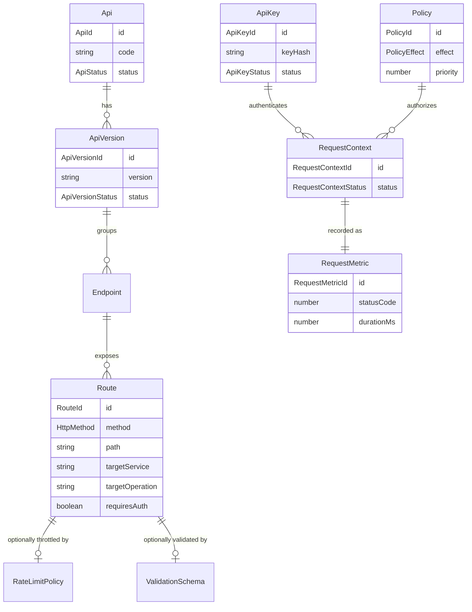

# API Gateway — Package Architecture

> **Lateen OS Architecture v1.0 (Locked)**

## Purpose

`@lateen-os/api-gateway` is the single, deterministic front door for every other engine in Lateen OS — the API Registry, Route Registry, Endpoint Registry, Version Registry, the Middleware Pipeline, Authentication, Authorization, Rate Limiting, Quota Management, Validation, Request Context, Metrics, Service Discovery, an OpenAPI/documentation model, and the Runtime Dispatcher that ties them all together. Every capability is a **real, deterministic, in-memory implementation** — there is no contracts-only scaffold in this package; it was built directly as a real runtime (see `runtime.ts`'s `createApiGatewayRuntime()`).

---

## Design principles

1. **Framework agnostic, no HTTP server** — no Express, Fastify, NestJS, or any other HTTP framework import anywhere in `src/`. `DispatchRequestInput`/`DispatchResult` are plain data objects; a real HTTP adapter outside this package performs the translation to/from an actual HTTP request/response.
2. **DI only, no hidden state** — every `create*` factory takes its dependencies (repositories, event bus, `now()`) explicitly. No module-level singletons.
3. **Repositories stay internal** — `createApiGatewayRuntime()` constructs every repository and injects it into the relevant service; only services, the dispatcher, the query layer, and the event bus are returned.
4. **A four-level registry hierarchy, one guarded lifecycle each** — `Api` (`active ⇄ deprecated → retired`) and `ApiVersion` (`draft → published → deprecated → retired`, strictly linear) each have their own pure transition-guard function (`canTransitionApi`, `canTransitionApiVersion`); `Endpoint` and `Route` are unstatused child aggregates scoped to their parent version/endpoint.
5. **The Runtime Dispatcher never uses reflection** — `dispatcher/invoker-map.ts`'s `buildInvokerMap()` is a fixed, exhaustive `Record<string, TargetInvoker>` keyed by `${targetService}:${targetOperation}`, mapping to one curated, named `RelationshipManagement` method per collaborator. A route that targets an operation outside this fixed table is rejected with `502 unknown_target_operation` — it is never dynamically dispatched onto an arbitrary object.
6. **JWT is real, not a stub, and adds no dependency** — `authentication/jwt.ts`'s `signToken`/`verifyToken` implement genuine HS256 signing and constant-time verification (`crypto.createHmac`, `crypto.timingSafeEqual`) using only Node's built-in `crypto` module.
7. **API keys are never stored in recoverable form** — `issueApiKey()` generates a raw key (`crypto.randomBytes(24)`, prefixed `lgw_`) and returns it to the caller exactly once; only `crypto.createHash('sha256')`'s digest is persisted. `verifyApiKey()`/`authenticateRequest()` re-hash the presented key and compare hashes.
8. **Rate limiting and quotas are fixed-window arithmetic, never token buckets** — `ratelimit/engine.impl.ts`'s `isWindowExpired()` (pure) compares elapsed seconds against a fixed `windowSeconds`/`periodDays`; there is no jitter, no leaky bucket, no probabilistic throttling.
9. **Validation is a minimal, hand-rolled field check, never an external library** — `validation/engine.impl.ts`'s `validateAgainstSchema()` (pure) checks only `required` presence and primitive `type` per declared `FieldSchema`; it is deliberately not a full JSON Schema implementation.
10. **Documentation is derived, never hand-maintained** — `documentation/engine.impl.ts`'s `buildOpenApiDocument()` and `buildApiDocumentationModel()` (both pure) are projections computed entirely from live Registry data (`Api`, `ApiVersion`, `Endpoint`, `Route`); there is no separately-maintained OpenAPI spec file anywhere in this package.
11. **A narrow, explicit integration surface across 16 sibling packages** — each is wired to exactly one meaningful Relationship Layer method (see below), always through the sibling's public runtime API, never a repository, never a modification to that package. AI Runtime has no single `createXRuntime()` composition root, so its Relationship Layer dependency is typed directly against `Pick<RuntimeQueries, 'findAgent'>` rather than a runtime slice — a deliberate, documented special case.
12. **Deterministic everywhere** — guarded lifecycle state machines, fixed elapsed-time arithmetic for rate limits/quotas, fixed field-level validation, fixed OpenAPI projection. **No LLM or AI inference anywhere in this package.**

---

## Module map

| Module | Responsibility | Key exports |
| ------ | -------------- | ------------ |
| `shared/` | IDs, date arithmetic (including `secondsBetweenIso`/`addSecondsIso` for rate-limit/quota windows), primitives, entity/domain-event/repository bases, 15 typed errors | — |
| `registry/` | API / Version / Endpoint / Route registries | `RegistryEngine`, `canTransitionApi`, `canTransitionApiVersion` |
| `middleware/` | Middleware Pipeline — ordered, enable/disable-able steps | `MiddlewarePipelineEngine`, `orderSteps` |
| `authentication/` | API Key Registry, JWT abstraction, Authentication Pipeline | `AuthenticationEngine`, `signToken`, `verifyToken` |
| `authorization/` | Authorization Pipeline, Policy Evaluation | `AuthorizationEngine`, `matchesPattern`, `evaluatePolicies` |
| `ratelimit/` | Rate Limiting, Quota Management | `RateLimitEngine`, `isWindowExpired` |
| `validation/` | Request/Response Validation, Response Normalization | `ValidationEngine`, `validateAgainstSchema`, `normalizeResponse` |
| `context/` | Request Context, Correlation IDs | `RequestContextEngine`, `generateCorrelationId` |
| `metrics/` | Request Metrics, Health Endpoints | `MetricsEngine`, `computeAverageDurationMs`, `computeErrorRate` |
| `discovery/` | Service Discovery | `ServiceDiscoveryEngine` |
| `documentation/` | OpenAPI Model, API Documentation Model | `DocumentationEngine`, `buildOpenApiDocument`, `buildApiDocumentationModel` |
| `dispatcher/` | Runtime Dispatcher — the 12-step request pipeline | `DispatcherEngine`, `buildInvokerMap` |
| `relationship-management/` | 16-collaborator integration | `RelationshipManagement` |
| `queries/` | Read-side query port | `GatewayQueries` |
| `events/` | Typed event bus | `GatewayEventBus`, `GatewayEventMap` |

Each aggregate module follows: `types.ts`, `repository.ts` (port), `repository.impl.ts` (real in-memory implementation), a `*.impl.ts` service/engine file, and `index.ts`.

---

## Dependency rules

```
┌──────────────────────────────────────────────┐
│      Applications, real HTTP adapters        │
└────────────────────┬─────────────────────────┘
                     │
                     ▼
┌───────────────────────────────────────────────────────────────┐
│                  @lateen-os/api-gateway                       │
│  registry · middleware · authentication · authorization ·     │
│  ratelimit · validation · context · metrics · discovery ·     │
│  documentation · dispatcher · relationship-management ·       │
│  queries · events                                             │
└──┬───┬───┬───┬───┬───┬───┬───┬───┬───┬───┬───┬───┬───┬───┬───┘
   ▼   ▼   ▼   ▼   ▼   ▼   ▼   ▼   ▼   ▼   ▼   ▼   ▼   ▼   ▼
 ai-  work- crm- sales marke communi finance hr-  inven proj- custo analy obser ai-  ai-
 run- flow  eng- -eng- ting- cation- -eng-  eng- tory- man-  mer-  tics- vabi- sec- gov-
 time -eng- ine  ine   engine hub    ine    ine  eng-  age-  succe -eng- lity- urity ern-
      ine                                        ine   ment  ss                 -eng- ance
                                                        -eng-       -eng- -eng- ine   -eng-
                                                        ine                          ine
                                                              ai-compliance-engine
                            │
                            ▼
                 @lateen-os/shared-kernel
```

### Allowed dependencies

- `shared-kernel` — `Entity`, `Identifier`, `Timestamp`, `EventBus`, `InMemoryRepository`, `AuditInfo`, `DomainEvent`
- `ai-runtime` — `RuntimeQueries.findAgent()` (optional, injected via Relationship Layer; no composition-root wrapper exists for this package, so the raw `RuntimeQueries` slice is injected directly)
- `workflow-engine` — `defineWorkflow()` / `startWorkflow()` (optional, injected via Relationship Layer)
- `crm-engine` — `customers.get()` (optional, injected via Relationship Layer)
- `sales-engine` — `opportunities.get()` (optional, injected via Relationship Layer)
- `marketing-engine` — `queries.findCampaigns()` (optional, injected via Relationship Layer)
- `communication-hub` — `notifications` service (optional, injected via Relationship Layer)
- `finance-engine` — `chartOfAccounts.list()` (optional, injected via Relationship Layer)
- `hr-engine` — `employees.get()` (optional, injected via Relationship Layer)
- `inventory-engine` — `catalog.get()` (optional, injected via Relationship Layer)
- `project-management-engine` — `projects.get()` (optional, injected via Relationship Layer)
- `customer-success-engine` — `customers.findByCustomer()` (optional, injected via Relationship Layer)
- `analytics-engine` — `metrics.recordGauge()` (optional, injected via Relationship Layer)
- `observability-engine` — `queries.findHealth()` (optional, injected via Relationship Layer)
- `ai-security-engine` — `queries.findPolicies()` (optional, injected via Relationship Layer)
- `ai-governance-engine` — `queries.findPolicies()` (optional, injected via Relationship Layer)
- `ai-compliance-engine` — `queries.findFrameworks()` (optional, injected via Relationship Layer)
- `business-dna` — type-only reuse

### Forbidden

- Any HTTP server framework (Express, Fastify, NestJS) or raw `http`/`net` server code
- Persistence, ORM, or any real database/storage backend
- AI/ML frameworks or LLM SDKs of any kind
- Importing a repository from any integration package (their public runtime APIs only)
- Modifying any integration package to accommodate the API Gateway
- Upstream packages importing `api-gateway` (no inversion)
- Dynamic/reflective dispatch onto an arbitrary sibling object — the Runtime Dispatcher's invoker table is fixed and exhaustive, never generated at runtime from strings
- An external JWT library or an external JSON Schema validation library — both are real, hand-rolled, dependency-free implementations in this package

---

## Dependency diagram

```mermaid
flowchart BT
  subgraph consumers [Applications / HTTP Adapters]
    APP[Applications]
  end

  subgraph gw ["@lateen-os/api-gateway"]
    IDX[index.ts]
    RT[runtime.ts]
    REG[registry]
    MW[middleware]
    AUTHN[authentication]
    AUTHZ[authorization]
    RL[ratelimit]
    VAL[validation]
    CTX[context]
    MET[metrics]
    DISC[discovery]
    DOC[documentation]
    DISP[dispatcher]
    REL[relationship-management]
    Q[queries]
    EV[events]
  end

  subgraph deps [16 Integration Packages]
    AIR[ai-runtime]
    WF[workflow-engine]
    CRM[crm-engine]
    SALES[sales-engine]
    MKT[marketing-engine]
    CH[communication-hub]
    FIN[finance-engine]
    HR[hr-engine]
    INV[inventory-engine]
    PM[project-management-engine]
    CSE[customer-success-engine]
    ANA[analytics-engine]
    OBS[observability-engine]
    SEC[ai-security-engine]
    GOV[ai-governance-engine]
    COMP[ai-compliance-engine]
    SK[shared-kernel]
  end

  APP --> IDX
  IDX --> RT
  RT --> REG & MW & AUTHN & AUTHZ & RL & VAL & CTX & MET & DISC & DOC & DISP & REL & Q & EV

  DOC --> REG
  DISP --> REG & DISC & AUTHN & AUTHZ & RL & VAL & CTX & MET & REL
  Q --> REG & AUTHN & AUTHZ & CTX & MET & DISC

  REL -.->|findAgent, public API| AIR
  REL -.->|defineWorkflow/startWorkflow, public API| WF
  REL -.->|customers.get, public API| CRM
  REL -.->|opportunities.get, public API| SALES
  REL -.->|queries.findCampaigns, public API| MKT
  REL -.->|notifications, public API| CH
  REL -.->|chartOfAccounts.list, public API| FIN
  REL -.->|employees.get, public API| HR
  REL -.->|catalog.get, public API| INV
  REL -.->|projects.get, public API| PM
  REL -.->|customers.findByCustomer, public API| CSE
  REL -.->|metrics.recordGauge, public API| ANA
  REL -.->|queries.findHealth, public API| OBS
  REL -.->|queries.findPolicies, public API| SEC
  REL -.->|queries.findPolicies, public API| GOV
  REL -.->|queries.findFrameworks, public API| COMP

  REG & MW & AUTHN & AUTHZ & RL & VAL & CTX & MET & DISC --> SK
  AIR & WF & CRM & SALES & MKT & CH & FIN & HR & INV & PM & CSE & ANA & OBS & SEC & GOV & COMP --> SK
```



---

## Aggregate relationship diagram



---

## Public API

```typescript
import {
  createApiGatewayRuntime,
  registry,
  middleware,
  authentication,
  authorization,
  ratelimit,
  validation,
  context,
  metrics,
  discovery,
  documentation,
  dispatcher,
  relationshipManagement,
  queries,
  events,
  type ApiGatewayRuntime,
  type Api,
  type Route,
  type ApiKey,
  type Policy,
  type RequestMetric,
} from '@lateen-os/api-gateway';
```

Namespace exports for each module; root re-exports for aggregate interfaces, service ports, pure functions, and the composition root. Repositories are exported as **types only** (for advanced/testing use) — never as constructed instances outside `createApiGatewayRuntime()`.

---

## Version alignment

| Artifact | Count |
| -------- | ----- |
| Lateen OS Architecture | v1.0 Locked |
| Api statuses | 3 (active, deprecated, retired) |
| ApiVersion statuses | 4 (draft, published, deprecated, retired) |
| Middleware step kinds | 5 (authentication, authorization, validation, rateLimit, custom) |
| Dispatch pipeline guard points | 6 (route not found, service unavailable, auth failure, authz denial, rate limit exceeded, validation failure) |
| Query methods | 9 (`GatewayQueries`) |
| Runtime events | 10 (`GatewayEventMap`) |
| External integrations | 16 (AI Runtime, Workflow Engine, CRM Engine, Sales Engine, Marketing Engine, Communication Hub, Finance Engine, HR Engine, Inventory Engine, Project Management Engine, Customer Success Engine, Analytics Engine, Observability Engine, AI Security Engine, AI Governance Engine, AI Compliance Engine) — all via public API |
