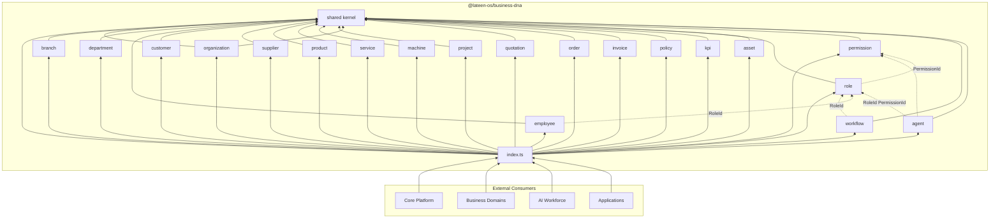
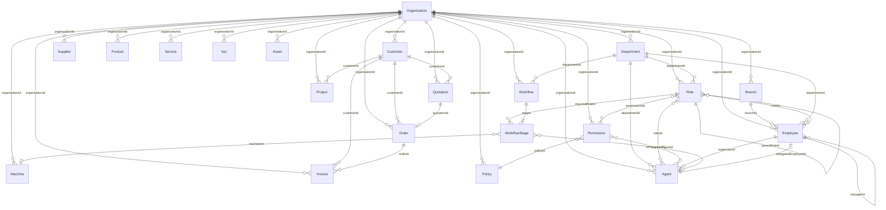

# Business DNA — Package Architecture

> Aligned with **Lateen OS Architecture v1.0 (Locked)**.  
> Schema source: `domains/business-dna/schema/`

## Package purpose

`@lateen-os/business-dna` is the **canonical Business DNA SDK** for Lateen OS — Layer 1 of the architecture. It defines the single source of truth for the business model.

The Organization Lifecycle, Business Profile, Vision & Mission Engine, Business DNA Engine (ICP/personas/positioning/etc.), Market Model, Competitor Registry, Product Catalog, Policy Engine, query layer, and event bus are **real, deterministic, in-memory implementations** — see `runtime.ts`'s `createBusinessDnaRuntime()` for the composition root, and each module's `*.impl.ts` files. The remaining 18 aggregates (branch, department, employee, customer, supplier, service, machine, project, quotation, order, invoice, workflow, kpi, asset, agent, role, permission) remain:

- **Aggregate interfaces** — entity shapes, status enums, and lifecycle states
- **Value object interfaces** — composable, immutable domain concepts where applicable
- **Domain event types** — typed `{entity}.{action}` events for integration
- **Repository ports** — persistence contracts with no implementations

It deliberately excludes UI, APIs, databases, ORM mappings, and LLM integration. Downstream layers (Core, Intelligence, AI Workforce, Business Domains, Applications) consume this package; Business DNA never depends on them.

---

## Shared kernel

Location: `src/shared/`

The shared kernel holds cross-cutting building blocks used by all aggregates:

| Module | Responsibility |
| ------ | -------------- |
| `identifiers.ts` | Branded entity ID types (`OrganizationId`, `RoleId`, `PermissionId`, …) |
| `primitives.ts` | `TenantScoped`, `Auditable`, `BusinessCode`, date/time primitives |
| `entity.ts` | Base `Entity<TId>` interface |
| `domain-event.ts` | `DomainEvent`, `DomainEventName` helpers |
| `repository.ts` | Generic `Repository<TEntity, TId>` port |
| `enums.ts` | Cross-aggregate enums (`SlaTier`, `RegionCoverage`) |
| `commercial.ts` | Shared commercial value types (money, line items) |
| `id.ts` | Dependency-free `generateId`/`nowIso` helpers used by every real `*.impl.ts` |
| `errors.ts` | Typed errors thrown by the real engines/services |

**Rule:** Aggregates import from `shared/` freely. `shared/` never imports from aggregate modules.

---

## Aggregate list

All 20 Business DNA schema entities are implemented as aggregate modules, plus 5 new modules added by the real runtime (`business-profile`, `vision-mission`, `dna`, `market`, `competitor`) and 2 cross-cutting modules (`queries`, `events`):

| Module | Schema entity | Value objects | Enrichment | Real? |
| ------ | ------------- | ------------- | ---------- | ----- |
| `organization` | Organization | Yes | v1 | ✅ `OrganizationLifecycle` |
| `branch` | Branch | — | — | contracts only |
| `department` | Department | — | — | contracts only |
| `employee` | Employee | — | — | contracts only |
| `role` | Role | Yes | — | contracts only |
| `permission` | Permission | Yes | — | contracts only |
| `customer` | Customer | Yes | v1 | contracts only |
| `supplier` | Supplier | — | — | contracts only |
| `product` | Product | Yes | v1 | ✅ `ProductCatalogService` (+ `ProductBundle`) |
| `service` | Service | — | — | contracts only |
| `machine` | Machine | Yes | v1 | contracts only |
| `project` | Project | Yes | v1 | contracts only |
| `quotation` | Quotation | — | — | contracts only |
| `order` | Order | — | — | contracts only |
| `invoice` | Invoice | — | — | contracts only |
| `workflow` | Workflow | Yes | — | contracts only |
| `policy` | Policy | — | — | ✅ `PolicyEngine` |
| `kpi` | KPI | — | — | contracts only |
| `asset` | Asset | — | — | contracts only |
| `agent` | AI Agent | Yes | — | contracts only |
| `business-profile` | *(new)* | Yes (`LegalEntity`) | — | ✅ `BusinessProfileService` |
| `vision-mission` | *(new)* | — | — | ✅ `VisionMissionEngine` |
| `dna` | *(new)* | — | — | ✅ `DnaEngine` |
| `market` | *(new)* | — | — | ✅ `MarketEngine` |
| `competitor` | *(new)* | — | — | ✅ `CompetitorRegistry` |
| `queries` | — | — | — | ✅ `BusinessDnaQueries` |
| `events` | — | — | — | ✅ `BusinessDnaEventBus` |

`runtime.ts` is the composition root: `createBusinessDnaRuntime()` wires every real in-memory repository into the services above and exposes only `organization`, `businessProfile`, `visionMission`, `dna`, `market`, `competitors`, `products`, `policies`, `queries`, and `events` — repositories are never part of the returned surface.

Each aggregate module follows the same DDD file layout:

```
{aggregate}/
├── types.ts          # Aggregate root interface, enums, re-exported ID type
├── value-objects.ts  # Composable VOs (where applicable)
├── events.ts         # Typed domain events
├── repository.ts     # Repository port interface
└── index.ts          # Barrel export
```

---

## Value object strategy

- Value objects are **interfaces** (not classes) — immutable, side-effect free shapes.
- They live in `value-objects.ts` when an aggregate has composable concepts beyond the root entity (e.g. `RolePermissionGrant`, `PermissionDescriptor`, `WorkflowStage` is embedded in `Workflow` types).
- Shared commercial and enum types live in `shared/` when reused across aggregates.
- No validation or factory logic — types only.

---

## Domain event strategy

- Events follow the **`{entity}.{action}`** naming convention aligned with schema specs.
- Exception: AI Agent events use the **`ai_agent.*`** prefix per schema (module folder: `agent`).
- Each aggregate defines:
  - `{Entity}EventName` — union of event name literals
  - `{Entity}DomainEvent` — discriminated union with typed payloads
- Payloads use aggregate ID types (`RoleId`, `PermissionId`) and primitives — never full entity graphs.
- Events are types only; no dispatch, handlers, or serialization.

---

## Repository port strategy

- All repository ports extend `Repository<TEntity, TId>` from `shared/repository.ts`:
  - `findById(id)` → entity or null
  - `save(entity)` → void
  - `delete(id)` → void
- Tenant-scoped aggregates add query methods with `organizationId` as the first parameter.
- Code-based lookups use `findByCode(organizationId, code)` except `OrganizationRepository.findByCode(code)` (tenant root).
- No SQL, ORM, or adapter implementations in this package.

---

## Dependency rules

```
┌─────────────────────────────────────────┐
│  Package consumers (Core, Domains, …)   │
└──────────────────┬──────────────────────┘
                   │ imports
                   ▼
┌─────────────────────────────────────────┐
│  src/index.ts  (public API)             │
└──────────────────┬──────────────────────┘
                   │
       ┌───────────┴───────────┐
       ▼                       ▼
┌──────────────┐       ┌──────────────┐
│  Aggregates  │──────▶│    shared/   │
│  (20 modules)│       │   (kernel)   │
└──────────────┘       └──────────────┘
```

### Allowed

| From | To | Notes |
| ---- | -- | ----- |
| Aggregate | `shared/` | IDs, primitives, base types |
| Aggregate | Another aggregate's `types.ts` | **Type-only** cross-references (FK IDs) |
| Package root | Any public module | Re-exports only |
| External packages | `@lateen-os/business-dna` | Public API |

### Forbidden

| From | To | Reason |
| ---- | -- | ------ |
| `shared/` | Aggregate | Kernel must stay dependency-free |
| Aggregate | Another aggregate's `repository.ts` / `events.ts` | Coupling beyond ID references |
| Business DNA | Core, Infrastructure, Applications | Layer inversion |
| Any module | Runtime / DB / HTTP libraries | Types-only package |

### Cross-aggregate type references (current)

| Consumer | References |
| -------- | ---------- |
| `workflow/types` | `RoleId` from `role/types` |
| `employee/types`, `employee/events` | `RoleId` from `role/types` |
| `agent/types` | `RoleId` from `role/types`, `PermissionId` from `permission/types` |
| `role/events` | `PermissionId` from `permission/types` |
| `business-profile/types` | `IndustryVertical` from `organization/types` (type-only enum reuse) |
| `queries/*` | `Organization`/`OrganizationStatus` (`organization`), `BusinessProfile` (`business-profile`), `Product`/`ProductCategory`/`ProductStatus` (`product`), `Competitor`/`CompetitorStatus` (`competitor`), `Policy`/`PolicyType`/`PolicyStatus` (`policy`), `MarketModel` (`market`) — the query layer is a read-side composition over repositories, not an aggregate, so it may reference every aggregate's `types.ts` |

All other aggregates reference related entities **by ID** through `shared/identifiers.ts` only — no aggregate-to-aggregate module imports. No cycle is introduced: `organization/types` does not import `business-profile/types`, and none of the new modules (`business-profile`, `vision-mission`, `dna`, `market`, `competitor`) import each other.

---

## Public API conventions

### Namespace imports (preferred for module-scoped access)

```typescript
import { role, permission, type Organization } from '@lateen-os/business-dna';

const r: role.Role = { /* … */ };
const events: role.RoleDomainEvent = { /* … */ };
```

### Root re-exports (backward-compatible convenience)

The package root re-exports:

- All `shared/` kernel types
- Namespace exports: `export * as {aggregate}` for all 20 modules
- Aggregate interfaces: `Organization`, `Role`, `Permission`, `Agent`, …
- Repository ports: `OrganizationRepository`, `RoleRepository`, …
- Alias: `AiAgent` → `Agent` (schema-aligned name)

New aggregates and types are **appended** to root re-exports; existing exports are never removed or renamed.

### ID types

- Canonical ID definitions live in `shared/identifiers.ts`.
- Each aggregate's `types.ts` re-exports its own ID type (e.g. `export type { RoleId }`).
- Cross-aggregate FK fields import the owning aggregate's `types.ts` where semantic coupling exists.

---

## Dependency diagram



---

## Aggregate relationship diagram

Relationships are expressed by **ID references** on aggregate interfaces (many-to-many assignment tables are out of scope for this types-only SDK).



---

## Circular dependency verification

Verified import graph (Sprint 1.2):

- **`shared/`** imports nothing from aggregate modules.
- **Aggregate modules** do not import each other's `repository.ts`, `events.ts`, or `index.ts`.
- **Type-only cross-imports** form a directed acyclic graph:
  - `permission` → (none)
  - `role` → `permission/types` (PermissionId in events)
  - `workflow`, `employee`, `agent` → `role/types` and/or `permission/types`
- No cycle exists: `permission` does not import `role`.

---

## Version alignment

| Artifact | Version |
| -------- | ------- |
| Lateen OS Architecture | v1.0 Locked |
| Business DNA schema entities | 20 / 20 |
| Package aggregates | 20 / 20 (+ 5 real-runtime modules: `business-profile`, `vision-mission`, `dna`, `market`, `competitor`) |
