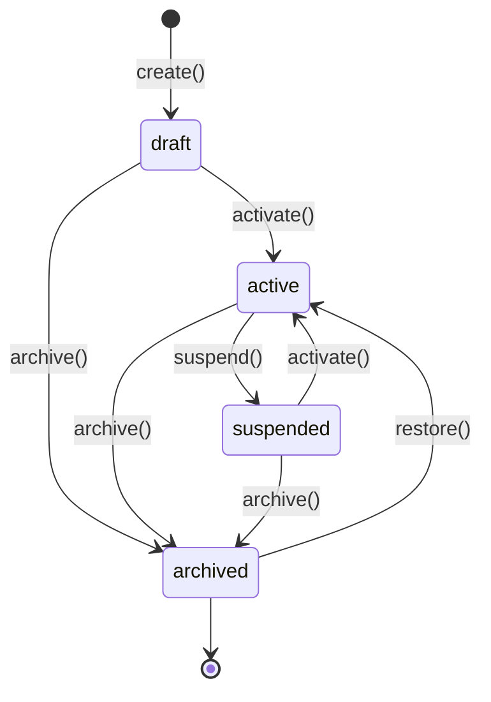
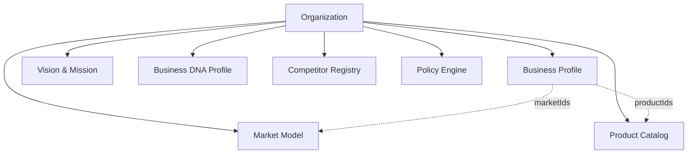
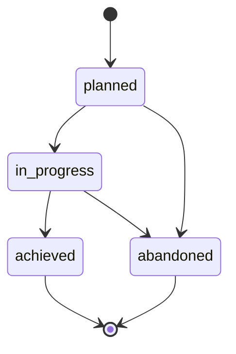

# Business DNA Model

> Real, implemented model for the organization's canonical identity — see [README.md](./README.md) for the runtime and [ARCHITECTURE.md](./ARCHITECTURE.md) for the module map.

---

## Organization lifecycle

`organization/lifecycle.impl.ts`'s `createOrganizationLifecycle()` implements this as a real, guarded state machine. `create()` rejects a duplicate `code` with `OrganizationCodeConflictError`; every other guarded transition rejects a disallowed move with `InvalidOrganizationTransitionError`. `canTransitionOrganization(from, to)` is exported standalone for inspection. Organization is the tenant root — its repository is scoped to itself (`findById(organizationId, id)` only resolves when `organizationId === id`); `findByCode`, `findByDomain`, `findByStatus`, and `findAll` are unscoped lookups across every organization.

---

## Business identity model

`Business Profile`, `Vision & Mission`, and the `Business DNA Profile` are each a **singleton per organization** — their aggregate id is literally the owning `OrganizationId`, so `findById(organizationId, organizationId)` always resolves the one record for that organization. Each engine's `getOrCreate` pattern means the first write implicitly creates the singleton.

### Business Profile

Company metadata, industry classification (reusing `IndustryVertical` from `organization/types.ts`), legal entity details, and references (by id) to the organization's operating markets, catalog products, and services.

### Vision & Mission Engine

Vision and mission statements, core values, and a guarded strategic-objective state machine:

### Business DNA Engine

The organization's market identity — additive collections and singleton facets, each set independently via `dna/engine.impl.ts`'s `createDnaEngine()`:

| Facet | Shape | Operation |
| ----- | ----- | --------- |
| Ideal Customer Profiles | `IdealCustomerProfile[]` | `addIcp` / `removeIcp` |
| Personas | `Persona[]` | `addPersona` / `removePersona` |
| Buyer Journey | `BuyerJourneyTouchpoint[]` | `addBuyerJourneyTouchpoint` |
| Positioning | `Positioning` (singleton) | `setPositioning` |
| Value Proposition | `ValueProposition` (singleton) | `setValueProposition` |
| Tone of Voice | `ToneOfVoice` (singleton) | `setToneOfVoice` |
| Brand Rules | `BrandRule[]` | `addBrandRule` |
| Competitive Advantages | `CompetitiveAdvantage[]` | `addCompetitiveAdvantage` |

### Market Model

A single `operatingMarkets: OperatingMarket[]` collection per organization; `market/engine.impl.ts`'s `createMarketEngine()` derives countries, regions, languages, and currencies **deterministically** from that collection (deduplicated, sorted) rather than maintaining separate reference catalogs. Adding a market with a `countryCode` already present throws `DuplicateOperatingMarketError`.

### Competitor Registry

`add` / `update` / `archive` over a real in-memory `CompetitorRepository`, plus deterministic helpers with no AI/LLM involved:

- `compare(competitorA, competitorB)` — shared/unique strengths and weaknesses, and a relative price position (`cheaper` / `similar` / `pricier`) when both report a `priceIndex`, using a ±5% similarity band.
- `compareToOwnPricing(competitor, ourPriceIndex = '1.00')` — the same price-position logic against our own pricing.
- `rankByMarketShare(organizationId)` — active competitors sorted by `marketShareEstimatePct` descending, tie-broken by name ascending.

### Product Catalog

Builds on the pre-existing `Product` aggregate (Enrichment v1: manufacturing, profitability, trend, and AI-metadata fields — all still typed, none of that metadata is written by this package). `product/catalog.impl.ts`'s `createProductCatalogService()` adds:

- **Guarded lifecycle** — `draft → active → seasonal → discontinued → archived` (see `canTransitionProduct`).
- **Deterministic margin calculation** — `updatePricing()` computes `actualMarginPct = (basePrice - costPrice) / basePrice * 100` and derives `marginStatus` (`above_target` / `on_target` / `below_target` / `loss`) against `targetMarginPct` with a ±2-point band.
- **Bundles** — `ProductBundle` (own repository) prices itself as the sum of `unitPrice × quantity` across its line items when no explicit `bundlePrice` is given.

### Policy Engine

`PolicyType` now covers `business`, `approval`, `communication`, and `sales` (the four types this commit requires) alongside the pre-existing `compliance`, `financial`, `operational`, `security`, and `hr`. `policy/engine.impl.ts`'s `createPolicyEngine()` provides a guarded `draft → active ⇄ suspended → archived` lifecycle plus `approve()` (stamps `approvedById`/`approvedAt` without forcing a status change). Every mutation publishes `policy.updated` — the only Policy event the runtime event bus requires.

---

## Query port

`BusinessDnaQueries` (`queries/business-dna-queries.ts`) is the real, read-only query layer exposed by `createBusinessDnaRuntime()` — composed purely over repositories, never returning one:

| Method | Returns |
| ------ | ------- |
| `findOrganizations()` | Organizations filtered by code / domain / status, or all |
| `findBusinessProfile()` | The organization's Business Profile singleton |
| `findProducts()` | Products filtered by category / status |
| `findCompetitors()` | Competitors filtered by status |
| `findPolicies()` | Policies filtered by type / status |
| `findMarkets()` | The organization's Market Model singleton |

---

## Constraints

- No UI, API, LLM, or persistence-adapter implementation in this package — every repository is in-memory and internal to `createBusinessDnaRuntime()`.
- Deterministic and offline: every `create*` factory accepts an injectable `now()`; no randomness or wall-clock coupling in business logic.
- 18 of the original 20 schema-aligned aggregates (all but `organization` and `product`) remain contracts only — see [ARCHITECTURE.md](./ARCHITECTURE.md) for the full module table.
