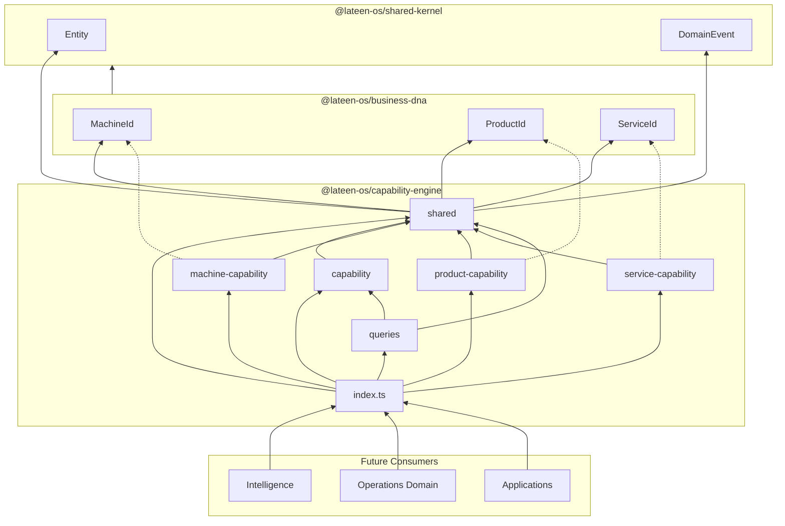
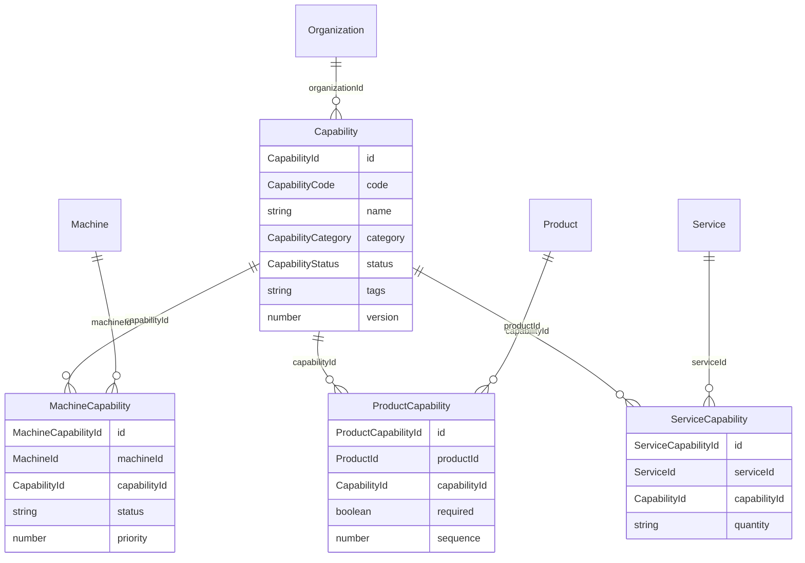

# Capability Engine — Package Architecture

> **Lateen OS Architecture v1.0 (Locked)**

## Purpose

`@lateen-os/capability-engine` models **what the organization is capable of doing**, independent of any specific machine. It sits as a dedicated bounded context that links abstract capabilities to Business DNA entities:

| Relation | Direction | Meaning |
| -------- | --------- | ------- |
| `MachineCapability` | Machine → Capability | A machine **provides** a capability |
| `ProductCapability` | Product → Capability | A product **requires** a capability |
| `ServiceCapability` | Service → Capability | A service **consumes** a capability |

The package is pure TypeScript DDD — types, value objects, domain events, repository ports, and query ports only. No UI, API, database, ORM, HTTP, frameworks, business logic, or persistence implementations.

---

## Bounded context overview

```
                    ┌─────────────────┐
                    │   Capability    │  Aggregate root
                    │  (what we can   │
                    │      do)        │
                    └────────┬────────┘
           provides │        │ requires        │ consumes
                    │        │                 │
         ┌──────────┘        └────────┐   ┌────┘
         ▼                            ▼   ▼
┌─────────────────┐          ┌─────────────────┐
│ MachineCapability│          │ProductCapability│
│  (MachineId)     │          │  (ProductId)    │
└────────┬─────────┘          └────────┬────────┘
         │                             │
         ▼                             ▼
   Business DNA                   Business DNA
     Machine                       Product

                    ┌─────────────────┐
                    │ServiceCapability│
                    │  (ServiceId)    │
                    └────────┬────────┘
                             ▼
                       Business DNA
                         Service
```

---

## Module reference

### `shared/`

Cross-cutting types for the bounded context.

| Module | Exports |
| ------ | ------- |
| `identifiers.ts` | `CapabilityId`, relation IDs; re-exports `MachineId`, `ProductId`, `ServiceId`, `OrganizationId` from Business DNA |
| `primitives.ts` | `CapabilityCode`, `Auditable`, `TenantScoped` |
| `entity.ts` | `Entity` (from shared-kernel), `TenantAuditableEntity` |
| `domain-event.ts` | `DomainEvent`, `DomainEventName` |
| `repository.ts` | `Repository`, `Page`, `OrganizationScopedQuery` |

### `capability/` — Aggregate root

**Capability** fields:

| Field | Type | Description |
| ----- | ---- | ----------- |
| `id` | `CapabilityId` | Stable identifier |
| `organizationId` | `OrganizationId` | Tenant scope |
| `code` | `CapabilityCode` | Unique code within organization |
| `name` | `string` | Display name |
| `description` | `string?` | Optional description |
| `category` | `CapabilityCategory` | Production category |
| `status` | `CapabilityStatus` | Lifecycle state |
| `tags` | `readonly string[]` | Discovery labels |
| `version` | `number` | Definition version |
| `createdAt` / `updatedAt` | `Timestamp` | Audit timestamps |

**Categories:** `printing`, `cutting`, `engraving`, `finishing`, `bending`, `assembly`, `packaging`, `installation`, `shipping`, `design`

**Lifecycle:** `draft` → `active` → `inactive` → `archived`

**Events:** `capability.created`, `capability.activated`, `capability.deactivated`, `capability.archived`, `capability.tag_added`, `capability.tag_removed`, `capability.updated`

**Value objects:** `CapabilityTag`, `CapabilityVersion`, `CapabilityCategoryGroup`

### `machine-capability/` — Provides relation

Links a Business DNA `MachineId` to a `CapabilityId`.

| Field | Type |
| ----- | ---- |
| `machineId` | `MachineId` |
| `capabilityId` | `CapabilityId` |
| `status` | `active` \| `inactive` \| `archived` |
| `priority` | `number?` |
| `notes` | `string?` |

**Events:** `machine_capability.linked`, `machine_capability.unlinked`, `machine_capability.activated`, `machine_capability.deactivated`, `machine_capability.updated`

### `product-capability/` — Requires relation

Links a Business DNA `ProductId` to a required `CapabilityId`.

| Field | Type |
| ----- | ---- |
| `productId` | `ProductId` |
| `capabilityId` | `CapabilityId` |
| `required` | `boolean` |
| `sequence` | `number?` |
| `status` | `active` \| `inactive` \| `archived` |

**Events:** `product_capability.required`, `product_capability.removed`, `product_capability.activated`, `product_capability.deactivated`, `product_capability.updated`

### `service-capability/` — Consumes relation

Links a Business DNA `ServiceId` to a consumed `CapabilityId`.

| Field | Type |
| ----- | ---- |
| `serviceId` | `ServiceId` |
| `capabilityId` | `CapabilityId` |
| `quantity` | `string?` |
| `status` | `active` \| `inactive` \| `archived` |

**Events:** `service_capability.linked`, `service_capability.unlinked`, `service_capability.activated`, `service_capability.deactivated`, `service_capability.updated`

### `queries/` — Read-side ports

**`CapabilityQueries`** port (implementations in infrastructure):

| Method | Returns | Purpose |
| ------ | ------- | ------- |
| `findCapabilitiesByMachine` | `Capability[]` | Capabilities a machine provides |
| `findCapabilitiesByProduct` | `Capability[]` | Capabilities a product requires |
| `findProductsByCapability` | `ProductId[]` | Products needing a capability |
| `findMachinesByCapability` | `MachineId[]` | Machines providing a capability |
| `findServicesByCapability` | `ServiceId[]` | Services consuming a capability |
| `findUnusedCapabilities` | `Capability[]` | Capabilities with no links |
| `findMissingCapabilities` | `MissingCapability[]` | Required but unprovisioned |
| `findHighDemandCapabilities` | `HighDemandCapability[]` | Demand exceeds supply |

---

## Dependency rules

```
┌──────────────────────────────────────────────┐
│  Intelligence, Operations, Applications      │
└────────────────────┬─────────────────────────┘
                     │
                     ▼
┌──────────────────────────────────────────────┐
│         @lateen-os/capability-engine         │
│  capability, relations, queries              │
└──────────────┬───────────────┬───────────────┘
               │               │
               ▼               ▼
┌──────────────────────┐  ┌──────────────────────┐
│  @lateen-os/         │  │  @lateen-os/         │
│  business-dna        │  │  shared-kernel       │
│  (Machine, Product,  │  │  (Entity, Event, …)  │
│   Service IDs)       │  │                      │
└──────────────────────┘  └──────────────────────┘
```

### Allowed

- Capability Engine imports from `shared-kernel` and `business-dna` (ID types only at relation boundaries).
- External packages import `@lateen-os/capability-engine`.

### Forbidden

- Capability Engine importing UI, HTTP, ORM, or database libraries.
- Business DNA importing Capability Engine (no upward dependency).
- Query implementations inside this package.

---

## Dependency diagram



---

## Capability relationship diagram



---

## Public API conventions

### Namespace exports

```typescript
import { capability, machineCapability, queries } from '@lateen-os/capability-engine';
```

### Root re-exports

Aggregate types, relation types, repository ports, query port, and read-model types are re-exported at the package root for convenience.

### Event naming

All events use `{entity}.{action}` with snake_case entity names for relations (`machine_capability`, `product_capability`, `service_capability`).

---

## Design decisions

1. **Capabilities are machine-independent** — hardware links live in `MachineCapability`, not on the Capability aggregate.
2. **Business DNA IDs at boundaries** — relations reference `MachineId`, `ProductId`, `ServiceId` from Business DNA; Capability Engine owns `CapabilityId` and relation IDs.
3. **Queries as ports** — analytical methods (`findMissingCapabilities`, `findHighDemandCapabilities`) are read-side contracts; evaluation logic belongs in infrastructure or Intelligence layer.
4. **Tenant-scoped** — every entity carries `organizationId` for multi-tenant isolation.
5. **Types only** — no factories, validators, or persistence; keeps the package framework-agnostic.

---

## Version alignment

| Artifact | Status |
| -------- | ------ |
| Lateen OS Architecture | v1.0 Locked |
| Capability aggregate | Defined |
| Relation entities | 3 / 3 |
| Query port methods | 8 / 8 |
