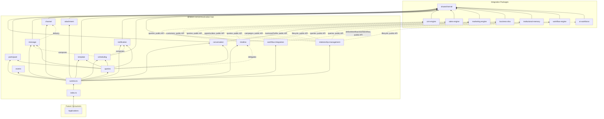
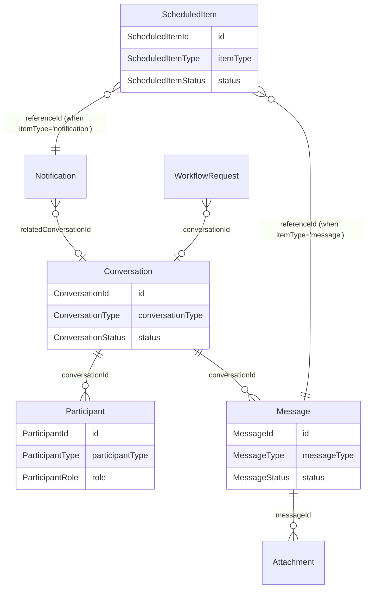

# Communication Hub — Package Architecture

> **Lateen OS Architecture v1.0 (Locked)**

## Purpose

`@lateen-os/communication-hub` is the canonical cross-domain communication layer for Lateen OS — the Conversation Engine, Participants, Messaging, Channels, Attachments, the unified Communication Timeline, Templates, Notifications, and Scheduling. Every capability is a **real, deterministic, in-memory implementation** — there is no contracts-only scaffold in this package; it was created directly as a real runtime (see `runtime.ts`'s `createCommunicationRuntime()`).

---

## Design principles

1. **DI only, no hidden state** — every `create*` factory takes its dependencies (repositories, event bus, `now()`, and — for `timeline`, `relationship-management`, and `workflow-integration` — the optional external collaborators) explicitly. No module-level singletons.
2. **Repositories stay internal** — `createCommunicationRuntime()` constructs every repository and injects it into the relevant service; only services and the query layer are returned.
3. **A narrow, named integration surface** — CRM Engine, Sales Engine, Marketing Engine, Business DNA, Institutional Memory, Workflow Engine, and AI Workforce are consumed only where a capability explicitly names them, and only through each package's public runtime API (never their repositories, never a modification to those packages).
4. **Channels are internal, not external** — Email/SMS/WhatsApp/Internal Chat/Webhook are a first-class capability of this package (always present, real, deterministic), not an optional cross-package integration. Only the underlying real sender per channel is optionally configurable.
5. **Deterministic everywhere** — guarded lifecycle state machines, deterministic template rendering/scheduling/timeline composition, deterministic search ranking. No AI/LLM, no embeddings, no wall-clock coupling in business logic.
6. **Composition over duplication** — `queries.findTimeline()` delegates to the `timeline` module rather than re-implementing timeline composition; `scheduling` composes the real `message` and `notification` services rather than duplicating their delivery logic.

---

## Module map

| Module | Responsibility | Key exports |
| ------ | -------------- | ------------ |
| `shared/` | IDs (reusing Business DNA's, CRM Engine's, and AI Workforce's canonical ids), primitives, entity/domain-event/repository bases, `id.ts`/`errors.ts` helpers | — |
| `conversation/` | Conversation Engine | `ConversationLifecycle`, `ConversationRepository`, `ConversationType` |
| `participant/` | Participants | `ParticipantService`, `ParticipantRepository` |
| `message/` | Messaging | `MessageLifecycle`, `MessageRepository` |
| `channel/` | Channels | `ChannelRegistry`, `ChannelProvider` |
| `attachment/` | Attachments | `AttachmentService`, `AttachmentRepository` |
| `timeline/` | Communication Timeline | `TimelineService`, `TimelineEntry` |
| `template/` | Templates | `TemplateEngine`, `TemplateRepository`, `TemplateVersionRepository`, `renderTemplate()` (pure) |
| `notification/` | Notifications | `NotificationService`, `NotificationRepository` |
| `scheduling/` | Scheduling | `SchedulingService`, `ScheduledItemRepository`, `computeNextOccurrence()` (pure) |
| `workflow-integration/` | Workflow Integration, composed with Workflow Engine | `WorkflowIntegrationService`, `WorkflowRequestRepository` |
| `relationship-management/` | CRM/Sales/Marketing/Business DNA/Institutional Memory/Workflow Engine/AI Workforce integration | `RelationshipManagement` |
| `queries/` | Read-side query port | `CommunicationQueries` |
| `events/` | Typed event bus | `CommunicationEventBus`, `CommunicationEventMap` |

Each aggregate module follows: `types.ts`, `repository.ts` (port), `repository.impl.ts` (real in-memory implementation), a `*.impl.ts` lifecycle/service/engine file, and `index.ts`.

---

## Dependency rules

```
┌──────────────────────────────────────────────┐
│      Applications, future consumers          │
└────────────────────┬─────────────────────────┘
                     │
                     ▼
┌──────────────────────────────────────────────────┐
│            @lateen-os/communication-hub           │
└──┬─────────┬─────────┬────────┬────────┬────────┬─┘
   │         │         │        │        │        │
   ▼         ▼         ▼        ▼        ▼        ▼
┌───────┐┌───────┐┌────────┐┌──────┐┌────────┐┌─────────┐
│crm-   ││sales- ││marketing││busin-││institu-││workflow-│
│engine ││engine ││-engine  ││ess-  ││tional- ││engine   │
└───────┘└───────┘└────────┘│dna   ││memory  │└─────────┘
                             └──────┘└────────┘
        (ai-workforce consumed by relationship-management too)
                     │
                     ▼
            @lateen-os/shared-kernel
```

### Allowed dependencies

- `shared-kernel` — `Entity`, `Identifier`, `Timestamp`, `EventBus`, `InMemoryRepository`, `AuditInfo`
- `business-dna` — `OrganizationId`, `EmployeeId` (type-only reuse); `createBusinessDnaRuntime`'s public `businessProfile` service (optional, injected)
- `crm-engine` — `AccountId`, `ContactId` (type-only reuse); `createCrmRuntime`'s public `customers` and `queries` services (optional, injected)
- `sales-engine` — `createSalesRuntime`'s public `opportunities` and `queries` services (optional, injected)
- `marketing-engine` — `createMarketingRuntime`'s public `campaigns` and `queries` services (optional, injected)
- `institutional-memory` — `createInstitutionalMemoryRuntime`'s public `lifecycle` service (optional, injected)
- `workflow-engine` — `createWorkflowRuntime`'s public `queries`, `defineWorkflow`, and `startWorkflow` operations (optional, injected)
- `ai-workforce` — `WorkerId` (type-only reuse); `createWorkforceRuntime`'s public `lifecycle` service (optional, injected)

### Forbidden

- Persistence, ORM, vector DB, embedding libraries
- AI/ML frameworks or LLM SDKs
- Importing a repository from any integration package (their public runtime APIs only)
- Modifying any integration package to accommodate the Communication Hub
- Upstream packages importing `communication-hub` (no inversion)

---

## Dependency diagram



---

## Aggregate relationship diagram



---

## Public API

```typescript
import {
  createCommunicationRuntime,
  conversation,
  participant,
  message,
  channel,
  attachment,
  timeline,
  template,
  notification,
  scheduling,
  workflowIntegration,
  relationshipManagement,
  queries,
  events,
  type CommunicationRuntime,
  type Conversation,
  type Message,
  type ConversationType,
} from '@lateen-os/communication-hub';
```

Namespace exports for each module; root re-exports for aggregate interfaces, lifecycle/service ports, and the composition root. Repositories are exported as **types only** (for advanced testing) — never as constructed instances outside `createCommunicationRuntime()`.

---

## Version alignment

| Artifact | Count |
| -------- | ----- |
| Lateen OS Architecture | v1.0 Locked |
| Conversation types | 7 (customer, internal, sales, marketing, support, workflow, ai) |
| Conversation Engine actions | 6 (create, archive, reopen, assign, transfer, close) |
| Participant types | 4 (user, ai_worker, external_contact, organization) |
| Message types | 8 (text, email, sms, whatsapp, system, workflow, ai, notification) |
| Message lifecycle states | 7 (draft, queued, sent, delivered, read, failed, archived) |
| Channel providers | 5 (email, sms, whatsapp, internal_chat, webhook) |
| Attachment types | 5 (document, image, audio, video, generic) |
| Template types | 4 (email, sms, whatsapp, notification) |
| Notification types | 5 (user, team, workflow, reminder, escalation) |
| Communication workflow request types | 4 (approval_reminder, follow_up_reminder, overdue_notification, escalation_notification) |
| Query methods | 8 (`CommunicationQueries`) |
| Runtime events | 10 (`CommunicationEventMap`) |
| External integrations | 7 (CRM Engine, Sales Engine, Marketing Engine, Business DNA, Institutional Memory, Workflow Engine, AI Workforce) — all via public API |
