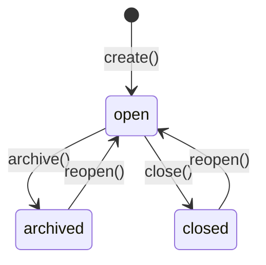
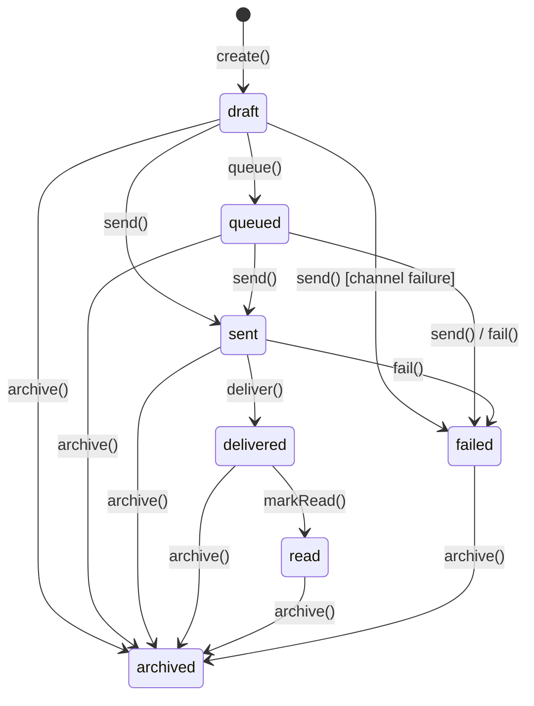
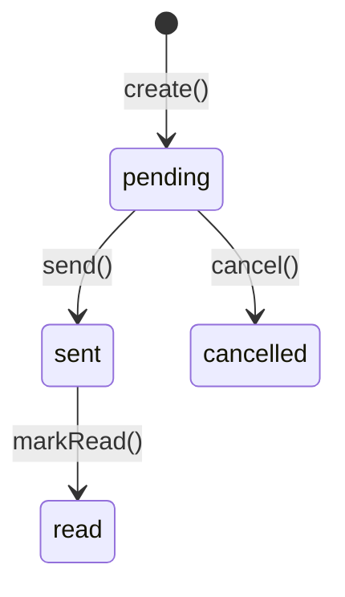

# Communication Model

> Real, implemented model for the Communication Hub — see [README.md](./README.md) for the runtime and [ARCHITECTURE.md](./ARCHITECTURE.md) for the module map.

---

## Conversation Engine

`conversation/lifecycle.impl.ts`'s `createConversationLifecycle()` implements the required 6 actions atop a guarded status state machine (`canTransitionConversation()`), over the 7 required deterministic conversation types (`customer`, `internal`, `sales`, `marketing`, `support`, `workflow`, `ai`):

- **`create()`** — status `'open'`. Publishes `conversation.created`.
- **`archive()`** — `'open'` → `'archived'`, stamps `archivedAt`.
- **`reopen()`** — `'archived'` or `'closed'` → `'open'`, clearing `archivedAt`/`closedAt`.
- **`assign(assigneeId)`** — sets the first owner of an unassigned, open conversation.
- **`transfer(toAssigneeId)`** — reassigns an already-assigned, open conversation, recording every prior owner in `previousAssigneeIds`.
- **`close()`** — `'open'` → `'closed'`, stamps `closedAt`. Publishes `conversation.closed`.

`assign()` and `transfer()` are deliberately distinct: `assign()` only succeeds on a conversation with no current owner; `transfer()` only succeeds on one that already has an owner — together they form a complete, unambiguous ownership handoff mechanism.

---

## Participants

`participant/service.impl.ts`'s `createParticipantService()` supports the 4 required participant kinds — `user`, `ai_worker`, `external_contact`, `organization` — each identified by an optional `referenceId` pointing at the real external record (an Employee, an AI Workforce Worker, a CRM Contact, or a CRM Account). `join()` publishes `participant.joined`; `leave()` sets `status: 'left'` and publishes `participant.left`. Every participant carries a `role` (`owner` / `member` / `observer`) and a set of `permissions` (`read` / `write` / `manage`), both updatable independently of join/leave.

---

## Messaging

`message/lifecycle.impl.ts`'s `createMessageLifecycle()` supports the 8 required message types (`text`, `email`, `sms`, `whatsapp`, `system`, `workflow`, `ai`, `notification`) over the required 7-state lifecycle. `send()` resolves the message's channel (explicit, or a deterministic default per message type — `email`→`email`, `sms`→`sms`, `whatsapp`→`whatsapp`, everything else → `internal_chat`) and calls the real Channel Registry; a successful channel result transitions the message to `'sent'` and publishes `message.sent`, a failed one transitions it to `'failed'` with the channel's error recorded. `deliver()` and `markRead()` publish `message.delivered` and `message.read` respectively. `create()` publishes `message.created`.

---

## Channels

`channel/provider.impl.ts`'s `createChannelProvider()` implements the required behavior for all 5 providers (`email`, `sms`, `whatsapp`, `internal_chat`, `webhook`): **every provider always works.** When the host application configures a real send function, the provider delegates to it (`isConfigured: true`). When it doesn't, the provider deterministically simulates delivery — generating a stable `providerMessageId`, always succeeding, and recording the attempt in an in-memory `listOutbox()` log so tests and callers can observe exactly what would have been sent. `channel/registry.impl.ts`'s `createChannelRegistry()` constructs all 5 providers at once, each independently configurable.

---

## Attachments

`attachment/service.impl.ts`'s `createAttachmentService()` manages the 5 required attachment kinds (`document`, `image`, `audio`, `video`, `generic`) as **metadata only** — a file name, MIME type, size, and an optional reference `url`. This package never stores or transmits file bytes.

---

## Communication Timeline

`timeline/engine.impl.ts`'s `createTimelineService()` builds one deterministic, most-recent-first view combining the 5 required sources:

| Source | Real data | Public API used |
| ------ | --------- | ---------------- |
| `crm` | CRM Engine activities | `crm.queries.findActivities()` |
| `sales` | Sales Engine activities | `sales.queries.findActivities()` |
| `marketing` | Marketing Engine generated leads | `marketing.queries.findLeads()` |
| `workflow` | Workflow Engine running instances | `workflow.queries.findRunningWorkflows()` |
| `message` | This package's own Messages | (local repository) |

Every external source is optional — the timeline degrades gracefully to whichever sources were injected, always including local Messages. Entries are sorted by `occurredAt` descending.

---

## Templates

`template/engine.impl.ts`'s `createTemplateEngine()` supports the 4 required template types (`email`, `sms`, `whatsapp`, `notification`) through a guarded `draft` → `active` → `archived` lifecycle, with immutable version history (every `createTemplate()`/`updateTemplate()` call snapshots a new `TemplateVersion`, mirroring the Sales Engine Quote Engine's version-history pattern). Two pure functions back it:

- **`extractVariables(body)`** — deterministically finds every `{{variable}}` placeholder, in first-appearance order, deduplicated.
- **`renderTemplate(template, variableValues)`** — deterministically substitutes each `{{variable}}` with its value, or an empty string if missing.

---

## Notifications

`notification/service.impl.ts`'s `createNotificationService()` supports the 5 required notification types — `user`, `team`, `workflow`, `reminder`, `escalation`. `create()` publishes `notification.created`; `send()` publishes `notification.sent`.

---

## Scheduling

`scheduling/service.impl.ts`'s `createSchedulingService()` composes the real Messaging and Notifications services (never duplicating their delivery logic) to support:

- **Delayed messages** — `scheduleMessage()` creates a draft `Message` immediately and a `ScheduledItem` referencing it; `dispatchDue()` sends every due item's underlying message through the real channel pipeline.
- **Recurring notifications / reminders** — `scheduleNotification()` with a `RecurrenceRule` (`daily` / `weekly` / `monthly`, every `interval` units, optionally capped at `count` occurrences). Each time `dispatchDue()` dispatches a recurring item, it deterministically computes the next occurrence via the pure `computeNextOccurrence()` and creates a fresh `ScheduledItem` (with a newly-created underlying message/notification) for it — exactly the same recurrence-expansion approach as the Marketing Engine's Calendar, reimplemented locally since Scheduling is a generic capability, not owned by Marketing.

`dispatchDue(organizationId, asOf?)` is the single deterministic dispatch entrypoint — it processes every `'scheduled'` item whose `scheduledFor` is at or before `asOf` (defaulting to "now").

---

## Workflow Integration — composed with the Workflow Engine

`workflow-integration/service.impl.ts`'s `createWorkflowIntegrationService()` generates deterministic workflow requests for the 4 required request types — `approval_reminder`, `follow_up_reminder`, `overdue_notification`, `escalation_notification` — by composing the real, injected Workflow Engine's public `defineWorkflow()` + `startWorkflow()` operations, never a Workflow Engine repository. `generateRequest()` lazily defines (once per organization + request type, cached in-process) a canonical single-step `'human'`-task workflow, then starts a real instance carrying `{ conversationId, notes, dueAt }` as workflow variables. The Workflow Engine collaborator is optional — with it absent, requests are still recorded, just with no workflow linkage.

---

## Relationship Layer — the only integration surface with CRM Engine, Sales Engine, Marketing Engine, Business DNA, Institutional Memory, Workflow Engine, and AI Workforce

Per the architecture rules, `relationship-management/service.impl.ts` is the module that talks to all 7 sibling packages — one clear method per package, each exclusively through its public runtime API:

| Integration | Method | Public API used |
| ------------ | ------ | ---------------- |
| CRM Engine | `getCustomerContext()` | `crm.customers.get()` |
| Sales Engine | `getOpportunityContext()` | `sales.opportunities.get()` |
| Marketing Engine | `getCampaignContext()` | `marketing.campaigns.get()` |
| Business DNA | `getBusinessProfileContext()` | `businessDna.businessProfile.get()` |
| Institutional Memory | `logConversationToMemory()` | `institutionalMemory.lifecycle.create()` (`knowledgeType: 'observation'`, `category: 'operational'`, `source: 'communication-hub'`) |
| Workflow Engine | `getWorkflowInstanceContext()` | `workflow.queries.findRunningWorkflows()`, filtered by id (no dedicated single-instance lookup exists on the public query port) |
| AI Workforce | `getAiWorkerContext()` | `aiWorkforce.lifecycle.get()` |

Every method returns `null` when its collaborator wasn't injected at `createCommunicationRuntime()` time — never throws, never mocks. The Communication Hub's own test suite proves each integration is **real** by constructing actual `createCrmRuntime()` / `createSalesRuntime()` / `createMarketingRuntime()` / `createBusinessDnaRuntime()` / `createInstitutionalMemoryRuntime()` / `createWorkflowRuntime()` / `createWorkforceRuntime()` instances and asserting genuine cross-package state — never a mock of any sibling package.

---

## Query Layer

`queries/communication-queries.impl.ts`'s `createCommunicationQueries()` is the real, read-only query layer exposed by `createCommunicationRuntime()` — composed purely over the Communication Hub repositories (plus the `timeline` module for `findTimeline()`), never returning a repository:

| Method | Returns |
| ------ | ------- |
| `findConversations()` | Conversations filtered by status / conversation type |
| `findMessages()` | Messages filtered by conversation / message type / status |
| `findParticipants()` | Participants filtered by conversation / participant type / status |
| `findTemplates()` | Templates filtered by template type / status |
| `findTimeline()` | The unified Communication Timeline (delegates to `timeline.buildTimeline()`) |
| `findNotifications()` | Notifications filtered by notification type / status / recipient |
| `findScheduledMessages()` | Scheduled items (messages and notifications), filtered by status, sorted by `scheduledFor` |
| `searchCommunication()` | Deterministic keyword search across conversations (by subject) and templates (by name), exact match scored above substring match, ranked and tie-broken by id |

---

## Constraints

- No UI, API, LLM, or persistence-adapter implementation in this package — every repository is in-memory and internal to `createCommunicationRuntime()`.
- Deterministic and offline: every `create*` factory accepts an injectable `now()`; template rendering, scheduling recurrence, timeline composition, and search ranking never depend on Map/Set iteration order.
- CRM Engine, Sales Engine, Marketing Engine, Business DNA, Institutional Memory, Workflow Engine, and AI Workforce are touched **only** through `relationship-management` (behavioral), `timeline` (behavioral, read-only), `workflow-integration` (behavioral, Workflow Engine), and `shared/identifiers.ts` (structural) — never their repositories, never a change to those packages.
- Channels are the one always-on internal capability — never optional, never absent — with a deterministic in-memory fallback per provider.
