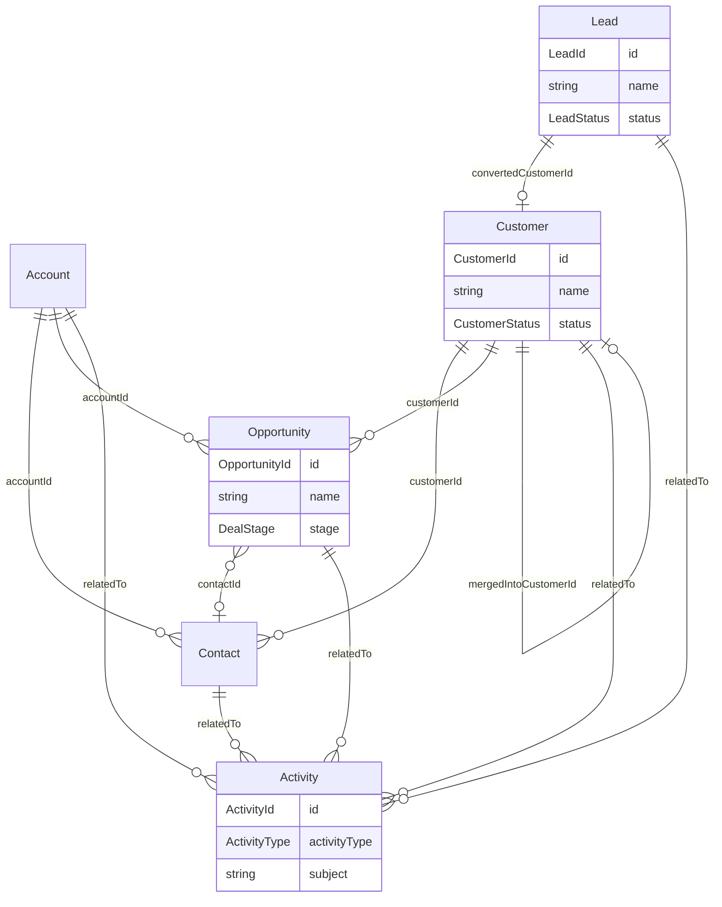

# CRM Engine — Package Architecture

> **Lateen OS Architecture v1.0 (Locked)**

## Purpose

`@lateen-os/crm-engine` is the canonical customer-relationship layer for Lateen OS — Leads, Customers, Contacts, Accounts, Opportunities, and their Activity Timeline. Every capability is a **real, deterministic, in-memory implementation** — there is no contracts-only scaffold in this package; it was created directly as a real runtime (see `runtime.ts`'s `createCrmRuntime()`).

---

## Design principles

1. **DI only, no hidden state** — every `create*` factory takes its dependencies (repositories, event bus, `now()`, and — for `relationship-management` — the optional external collaborators) explicitly. No module-level singletons.
2. **Repositories stay internal** — `createCrmRuntime()` constructs every repository and injects it into the relevant service; only services and the query layer are returned.
3. **One real integration surface** — Business DNA, Domain Graph, and Institutional Memory are consumed **only** through `relationship-management`, and only through each package's public runtime API (never their repositories, never a modification to those packages).
4. **Deterministic everywhere** — guarded lifecycle state machines, deterministic duplicate scoring, deterministic search ranking. No AI/LLM, no embeddings, no wall-clock coupling in business logic.
5. **Composition over duplication** — `Lead.convert()` calls the real `CustomerLifecycle.create()` rather than re-implementing customer creation.

---

## Module map

| Module | Responsibility | Key exports |
| ------ | -------------- | ------------ |
| `shared/` | IDs (reusing Business DNA's `OrganizationId`/`CustomerId`/`EmployeeId`), primitives, entity/domain-event/repository bases, `id.ts`/`errors.ts` helpers | — |
| `customer/` | Customer Lifecycle | `CustomerLifecycle`, `CustomerRepository` |
| `lead/` | Lead Management | `LeadLifecycle`, `LeadRepository` |
| `contact/` | Contact Management | `ContactManagement`, `ContactRepository` |
| `account/` | Account Management | `AccountManagement`, `AccountRepository` |
| `opportunity/` | Opportunity Management + Deal Pipeline | `OpportunityPipeline`, `OpportunityRepository`, `DealStage` |
| `activity/` | Activity Timeline | `ActivityTimeline`, `ActivityRepository` |
| `duplicate-detection/` | Deterministic duplicate matching | `CrmDuplicateDetectionEngine`, `detectDuplicates()` (pure) |
| `relationship-management/` | Business DNA / Domain Graph / Institutional Memory integration | `RelationshipManagement` |
| `queries/` | Read-side query port | `CrmQueries` |
| `events/` | Typed event bus | `CrmEventBus`, `CrmEventMap` |

Each aggregate module follows: `types.ts`, `repository.ts` (port), `repository.impl.ts` (real in-memory implementation), a `*.impl.ts` lifecycle/service file, and `index.ts`.

---

## Dependency rules

```
┌──────────────────────────────────────────────┐
│      Applications, future consumers          │
└────────────────────┬─────────────────────────┘
                     │
                     ▼
┌──────────────────────────────────────────────┐
│            @lateen-os/crm-engine             │
└──────┬──────────────┬──────────────┬─────────┘
       │              │              │
       ▼              ▼              ▼
┌────────────┐ ┌─────────────┐ ┌──────────────┐
│ business-  │ │ institution-│ │ domain-      │
│ dna        │ │ al-memory   │ │ graph        │
└────────────┘ └─────────────┘ └──────────────┘
       │              │              │
       └──────────────┴──────────────┘
                     ▼
            @lateen-os/shared-kernel
```

### Allowed dependencies

- `shared-kernel` — `Entity`, `Identifier`, `Timestamp`, `EventBus`, `InMemoryRepository`, `AuditInfo`, `Email`/`Phone`/`CurrencyCode`
- `business-dna` — `OrganizationId`, `CustomerId`, `EmployeeId` (type-only reuse; no repository or service dependency)
- `domain-graph` — `createDomainGraphRuntime`'s public `entities`/`relationships` services (optional, injected)
- `institutional-memory` — `createInstitutionalMemoryRuntime`'s public `lifecycle` service (optional, injected)

### Forbidden

- Persistence, ORM, vector DB, embedding libraries
- AI/ML frameworks or LLM SDKs
- Importing a repository from Business DNA, Domain Graph, or Institutional Memory (their public runtime APIs only)
- Modifying Business DNA, Domain Graph, or Institutional Memory to accommodate the CRM Engine
- Upstream packages importing `crm-engine` (no inversion)

---

## Dependency diagram

```mermaid
flowchart BT
  subgraph consumers [Future Consumers]
    APP[Applications]
  end

  subgraph crm ["@lateen-os/crm-engine"]
    IDX[index.ts]
    RT[runtime.ts]
    CUST[customer]
    LEAD[lead]
    CONT[contact]
    ACCT[account]
    OPP[opportunity]
    ACT[activity]
    DUP[duplicate-detection]
    REL[relationship-management]
    Q[queries]
    EV[events]
  end

  subgraph deps [Integration Packages]
    BD[business-dna]
    IM[institutional-memory]
    DG[domain-graph]
    SK[shared-kernel]
  end

  APP --> IDX
  IDX --> RT
  RT --> CUST & LEAD & CONT & ACCT & OPP & ACT & DUP & REL & Q & EV

  LEAD -.->|convert() composes| CUST
  DUP -.-> CUST & LEAD
  Q --> CUST & LEAD & CONT & ACCT & OPP & ACT
  REL -.->|entities/relationships, public API| DG
  REL -.->|lifecycle, public API| IM

  CUST & LEAD & CONT & ACCT & OPP & ACT --> SK
  CUST --> BD

  BD --> SK
  IM --> SK
  DG --> BD
  DG --> SK
```

---

## Aggregate relationship diagram



---

## Public API

```typescript
import {
  createCrmRuntime,
  customer,
  lead,
  contact,
  account,
  opportunity,
  activity,
  duplicateDetection,
  relationshipManagement,
  queries,
  events,
  type CrmRuntime,
  type Customer,
  type Lead,
  type Opportunity,
  type DealStage,
} from '@lateen-os/crm-engine';
```

Namespace exports for each module; root re-exports for aggregate interfaces, lifecycle/service ports, and the composition root. Repositories are exported as **types only** (for advanced testing) — never as constructed instances outside `createCrmRuntime()`.

---

## Version alignment

| Artifact | Count |
| -------- | ----- |
| Lateen OS Architecture | v1.0 Locked |
| Aggregate modules | 6 (customer, lead, contact, account, opportunity, activity) |
| Deal Pipeline stages | 6 (new, qualified, proposal, negotiation, won, lost) |
| Activity types | 5 (call, meeting, email, note, task) |
| Query methods | 8 (`CrmQueries`) |
| Runtime events | 9 (`CrmEventMap`) |
| External integrations | 3 (Business DNA, Domain Graph, Institutional Memory) — all via public API |
