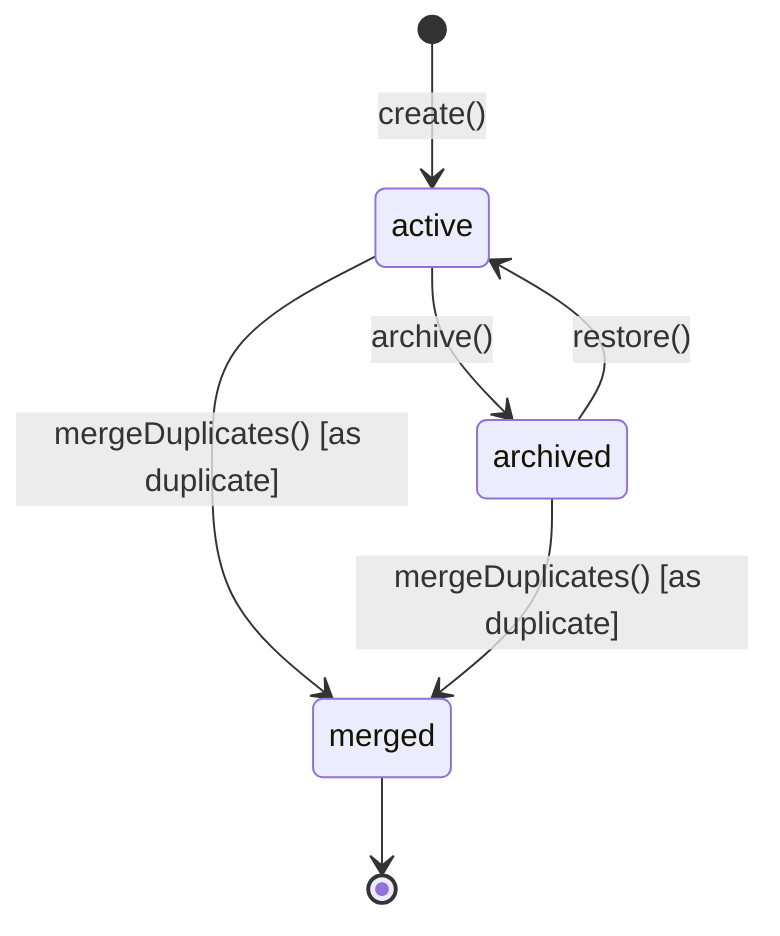
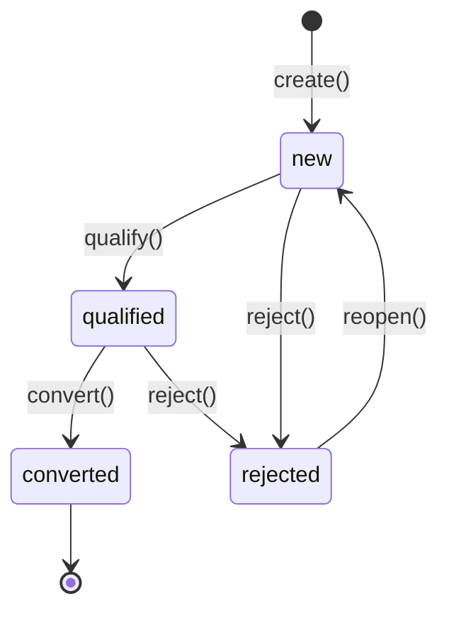
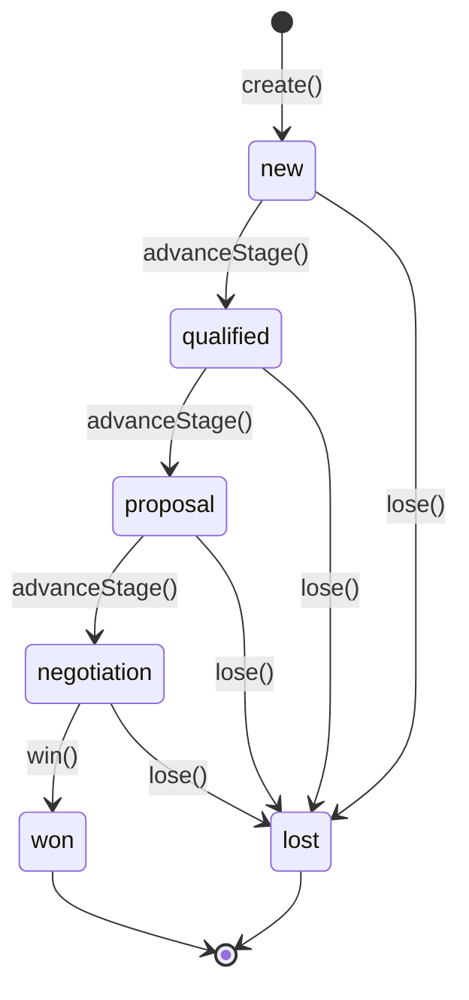

# CRM Model

> Real, implemented model for the CRM Engine — see [README.md](./README.md) for the runtime and [ARCHITECTURE.md](./ARCHITECTURE.md) for the module map.

---

## Customer Lifecycle

`customer/lifecycle.impl.ts`'s `createCustomerLifecycle()` implements a real, guarded state machine. `update()` rejects anything but an `'active'` customer. `mergeDuplicates(organizationId, primaryCustomerId, duplicateCustomerIds)`:

1. Loads the primary and every duplicate (each must not already be `'merged'`, or it throws `InvalidCustomerTransitionError`).
2. Fills any of the primary's missing `email`/`phone`/`company`/`accountId` from the first duplicate that has one.
3. Unions every duplicate's `tags` into the primary's.
4. Marks every duplicate `'merged'` with `mergedIntoCustomerId` set to the primary's id — **never deleted**, so history and any external references remain resolvable.
5. Publishes `customer.updated` for the primary once, if at least one duplicate was merged.

---

## Lead Management

`lead/lifecycle.impl.ts`'s `createLeadLifecycle()` is constructed with a real `CustomerLifecycle` collaborator. `convert()` does not duplicate customer-creation logic — it calls `customerLifecycle.create()` with the lead's `name`/`email`/`phone`/`company`/`tags` (each overridable via an optional patch) and `sourceLeadId` set to the lead's id, then stamps the lead `'converted'` with `convertedCustomerId`. `'converted'` is terminal — a converted lead cannot be reopened; the resulting `Customer` follows its own independent lifecycle from that point on.

---

## Contact Management & Account Management

Both are simple, symmetric two-state lifecycles (`create` / `update` / `archive` / `restore`) over their own repository — `contact/service.impl.ts`'s `createContactManagement()` and `account/service.impl.ts`'s `createAccountManagement()`. A `Contact` may reference a `customerId` and/or `accountId`; an `Account` is the company-level umbrella above Customers, Contacts, and Opportunities.

---

## Opportunity Management + Deal Pipeline

`opportunity/pipeline.impl.ts`'s `createOpportunityPipeline()` implements the required deterministic pipeline exactly: `new → qualified → proposal → negotiation → won/lost`. `win()` and `lose()` are convenience wrappers over the same guarded `advanceStage()` used for the intermediate stages — `win()` additionally accepts an optional final `amount` and publishes `opportunity.won`; `lose()` accepts an optional `reason` and publishes `opportunity.lost`. Both stamp `closedAt`. `update()` rejects a closed (`'won'`/`'lost'`) opportunity — a deal's terms are immutable once closed.

---

## Activity Timeline

`activity/timeline.impl.ts`'s `createActivityTimeline()` logs five activity types — `call`, `meeting`, `email`, `note`, `task` — against any CRM record via a generic `relatedTo: { entityType, entityId }` reference (`customer` / `lead` / `contact` / `account` / `opportunity`). `log()` defaults `occurredAt` to the injected `now()` if not given explicitly (letting historical activity be backdated). `task` activities start `completed: false`; `complete()` marks them done. `listByEntity()` returns every activity for a record, **most recent first** — the actual timeline view.

---

## Duplicate Detection

`duplicate-detection/engine.impl.ts` exposes both a pure function and a repository-backed convenience service:

- `detectDuplicates(existing, candidate)` — pure, generic over anything shaped like `{ name?, email?, phone?, company? }`. Normalizes each field deterministically (`normalizeEmail` lowercases/trims; `normalizePhone` strips all non-digits; `normalizeText` lowercases, strips punctuation, and collapses whitespace — used for both company and name) and computes a weighted score: email `0.5`, phone `0.3`, company `0.1`, name `0.1`. Returns every match with `score > 0`, sorted descending — callers choose their own threshold.
- `createCrmDuplicateDetectionEngine(customerRepository, leadRepository)` — the runtime-facing service, exposing `detectCustomerDuplicates()` (excluding already-`'merged'` customers) and `detectLeadDuplicates()`.

No fuzzy-matching library, no embeddings, no AI/LLM — every comparison is an exact string match after deterministic normalization.

---

## Relationship Management — the only integration surface

Per the architecture rules, `relationship-management/service.impl.ts` is the **one** module that talks to Business DNA, Institutional Memory, and Domain Graph — and only through each package's public runtime API:

| Integration | How | Required? |
| ------------ | --- | ---------- |
| Business DNA | `shared/identifiers.ts` re-exports `OrganizationId`/`CustomerId`/`EmployeeId` directly from `@lateen-os/business-dna` — structural reuse, no runtime call | Always (compile-time) |
| Domain Graph | `syncCustomerToGraph()` / `syncLeadToGraph()` / `syncContactToGraph()` upsert a real Domain Graph entity (matching on `nodeType` + `entityId` via `entities.list()` before deciding register vs. update); `linkEntities()` creates a real Domain Graph relationship | Optional — inject `{ domainGraph }` |
| Institutional Memory | `logActivityToMemory()` creates a real Institutional Memory `KnowledgeEntry` (`knowledgeType: 'observation'`, `category: 'customer'`, `source: 'crm-engine'`, tagged with the activity type and related-entity type) | Optional — inject `{ institutionalMemory }` |

Every method returns `null` when its collaborator wasn't injected at `createCrmRuntime()` time — never throws, never mocks. This means:

- The CRM Engine's own test suite proves the integration is **real** by constructing actual `createDomainGraphRuntime()` / `createInstitutionalMemoryRuntime()` instances and asserting genuine cross-package state changes (a real Domain Graph node exists; a real Institutional Memory knowledge entry exists) — never a mock of either package.
- Consumers who don't need graph/memory integration can use `createCrmRuntime()` with zero extra dependencies, fully offline.

`Account` and `Opportunity` are deliberately **not** synced into Domain Graph — neither has a matching `GraphNodeType`, and this package must not modify Domain Graph's node type registry to invent one.

---

## Query Layer

`queries/crm-queries.impl.ts`'s `createCrmQueries()` is the real, read-only query layer exposed by `createCrmRuntime()` — composed purely over the CRM repositories, never returning one:

| Method | Returns |
| ------ | ------- |
| `findCustomers()` | Customers filtered by status |
| `findLeads()` | Leads filtered by status |
| `findContacts()` | Contacts filtered by status / customerId / accountId |
| `findAccounts()` | Accounts filtered by status |
| `findDeals()` | **Every** opportunity grouped by `DealStage` — the pipeline/kanban view |
| `findActivities()` | Activities filtered by type / related entity, most recent first |
| `findOpportunities()` | Opportunities filtered by stage / accountId / customerId — the flat list view |
| `searchCRM()` | Deterministic keyword search across customers, leads, contacts, accounts, and opportunities by name/label (exact match scores higher than substring), ranked and tie-broken by id |

`findDeals()` and `findOpportunities()` intentionally return different shapes over the same underlying data: `findOpportunities()` is a flat, filterable list; `findDeals()` is the stage-grouped pipeline view every `DealStage` key present, even if empty.

---

## Constraints

- No UI, API, LLM, or persistence-adapter implementation in this package — every repository is in-memory and internal to `createCrmRuntime()`.
- Deterministic and offline: every `create*` factory accepts an injectable `now()`; duplicate scoring and search ranking never depend on Map/Set iteration order.
- Business DNA, Domain Graph, and Institutional Memory are touched **only** through `relationship-management` (behavioral) and `shared/identifiers.ts` (structural) — never their repositories, never a change to those packages.
