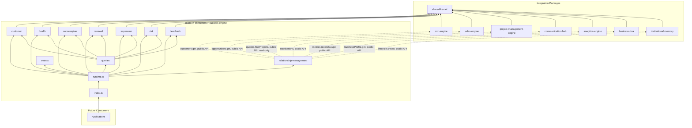
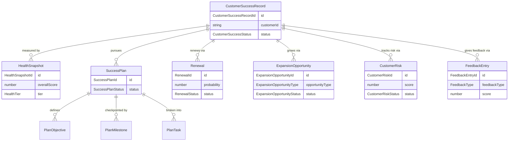

# Customer Success Engine — Package Architecture

> **Lateen OS Architecture v1.0 (Locked)**

## Purpose

`@lateen-os/customer-success-engine` is the canonical post-sale customer-success layer for Lateen OS — the Customer Lifecycle, Customer Health, Success Plans, Renewals, Expansion, Customer Risks, and Feedback. Every capability is a **real, deterministic, in-memory implementation** — there is no contracts-only scaffold in this package; it was built directly as a real runtime (see `runtime.ts`'s `createCustomerSuccessRuntime()`).

---

## Design principles

1. **DI only, no hidden state** — every `create*` factory takes its dependencies (repositories, event bus, `now()`) explicitly. No module-level singletons.
2. **Repositories stay internal** — `createCustomerSuccessRuntime()` constructs every repository and injects it into the relevant service; only services and the query layer are returned.
3. **One record per real CRM customer, never a duplicate namespace** — `CustomerSuccessRecord` is keyed by an opaque `customerId` foreign key resolved (never synced) via the Relationship Layer's `getCustomerContext()`; `onboard()` throws `DuplicateCustomerSuccessRecordError` if a record already exists for that customer in the organization, so there is always at most one customer-success record per (organization, customer) pair.
4. **The lifecycle is a genuinely connected graph, not a one-way funnel** — `onboarding → activation → adoption → expansion/renewal → churn → reactivation` is deliberately cyclic (`adoption ⇄ renewal`, `renewal → expansion`, `reactivation → onboarding | activation`) because real customer accounts move back and forth between adoption, expansion, and renewal for years; `restartOnboarding()` exists specifically because the transition table declares `reactivation → onboarding` as valid and a dedicated method is required to reach it (mirroring the same class of gap found and fixed in the Project Management Engine's Deliverables module during Commit 29).
5. **Health scoring is fixed arithmetic, never a model** — `computeHealthScore()` is an equally-weighted average of six caller-supplied 0–100 component scores (usage, communication, projects, payment, engagement, renewals); `computeHealthTier()` is a fixed banding function. **No prediction anywhere.**
6. **Risk scoring is fixed arithmetic** — `computeCustomerRiskScore()` is `probability × impact` (each a 1–5 ordinal rating, max score 25); `computeCustomerRiskLevel()` is a fixed banding function — the same pattern used by the Project Management Engine's Project Risks module.
7. **Feedback aggregation is the standard, fixed NPS formula** — `computeNpsScore()` is `%promoters − %detractors` over 0–10 scores (9–10 promoter, 7–8 passive, 0–6 detractor); `computeAverageCsat()` is a plain mean of 1–5 scores. Neither ever infers sentiment from free text.
8. **Success Plans compose four simple sub-aggregates, not one bloated entity** — `SuccessPlan`, `PlanObjective`, `PlanMilestone`, and `PlanTask` are separate repositories linked by `planId`, mirroring the Project Management Engine's Project/Phase/Milestone/Task separation.
9. **Expansion never duplicates Sales Engine** — `ExpansionOpportunity` tracks only this package's own upsell/cross-sell record; `linkSalesOpportunity()` stores an opaque `linkedSalesOpportunityId` foreign key, and the real opportunity is resolved only through the Relationship Layer's `getOpportunityContext()`, never re-implemented here.
10. **A narrow, purposeful integration surface** — of the 7 required sibling packages, each is wired to exactly one meaningful Relationship Layer capability (see below) — always through the sibling's public runtime API, never a repository, never a modification to that package. Project Management Engine's project-to-customer link is resolved by reading its real `queries.findProjects()` result and filtering client-side by `customerId` — this package never depends on an unlisted query parameter or touches a repository to get there.
11. **Deterministic everywhere** — guarded lifecycle state machines, fixed decimal-string arithmetic (`shared/decimal.ts`), fixed health/risk/NPS/CSAT arithmetic. **No LLM anywhere in this package.**

---

## Module map

| Module | Responsibility | Key exports |
| ------ | -------------- | ------------ |
| `shared/` | IDs, decimal/date arithmetic, primitives, entity/domain-event/repository bases, `id.ts` helpers | — |
| `customer/` | Customer Lifecycle — one record per real CRM customer, full guarded lifecycle | `CustomerLifecycleEngine`, `CustomerSuccessRecordRepository` |
| `health/` | Customer Health — deterministic scoring and tiering | `CustomerHealthEngine`, `HealthSnapshotRepository` |
| `successplan/` | Success Plans — objectives, milestones, owners, tasks | `SuccessPlanEngine`, `SuccessPlanRepository` |
| `renewal/` | Renewals — pipeline, reminders, probability | `RenewalEngine`, `RenewalRepository` |
| `expansion/` | Expansion — upsell/cross-sell opportunities | `ExpansionEngine`, `ExpansionOpportunityRepository` |
| `risk/` | Customer Risks — probability × impact scoring | `CustomerRiskEngine`, `CustomerRiskRepository` |
| `feedback/` | Feedback — NPS, CSAT, surveys, history | `FeedbackEngine`, `FeedbackEntryRepository` |
| `relationship-management/` | CRM Engine / Sales Engine / Project Management Engine / Communication Hub / Analytics Engine / Business DNA / Institutional Memory integration | `RelationshipManagement` |
| `queries/` | Read-side query port | `CustomerSuccessQueries` |
| `events/` | Typed event bus | `CustomerSuccessEventBus`, `CustomerSuccessEventMap` |

Each aggregate module follows: `types.ts`, `repository.ts` (port), `repository.impl.ts` (real in-memory implementation), a `*.impl.ts` service/engine file, and `index.ts`.

---

## Dependency rules

```
┌──────────────────────────────────────────────┐
│      Applications, future consumers          │
└────────────────────┬─────────────────────────┘
                     │
                     ▼
┌───────────────────────────────────────────────────────────┐
│           @lateen-os/customer-success-engine                │
└──┬──────────┬────────────┬─────────────┬──────────┬───────┘
   │          │            │             │          │
   ▼          ▼            ▼             ▼          ▼
┌───────┐┌─────────┐┌──────────────┐┌──────────┐┌───────────┐
│crm-   ││sales-   ││project-      ││communi-  ││analytics- │
│engine ││engine   ││management-   ││cation-   ││engine     │
│(rel-  ││(rel-    ││engine        ││hub       ││(rel-      │
│mgmt)  ││mgmt)    ││(rel-mgmt,    ││(rel-mgmt)││mgmt)      │
└───────┘└─────────┘│queries only) │└──────────┘└───────────┘
                     └──────────────┘
                            │        institutional-memory (rel-mgmt)
                            ▼                    │
                  @lateen-os/business-dna (OrganizationId + rel-mgmt)
                            │
                            ▼
                 @lateen-os/shared-kernel
```

### Allowed dependencies

- `shared-kernel` — `Entity`, `Identifier`, `Timestamp`, `EventBus`, `InMemoryRepository`, `AuditInfo`, `Money`, `CurrencyCode`
- `business-dna` — `OrganizationId` (type-only reuse); `createBusinessDnaRuntime`'s public `businessProfile.get()` (optional, injected via Relationship Layer)
- `crm-engine` — `createCrmRuntime`'s public `customers.get()` (optional, injected via Relationship Layer)
- `sales-engine` — `createSalesRuntime`'s public `opportunities.get()` (optional, injected via Relationship Layer)
- `project-management-engine` — `createProjectRuntime`'s public `queries.findProjects()` (optional, injected via Relationship Layer, read-only)
- `communication-hub` — `createCommunicationRuntime`'s public `notifications` service (optional, injected via Relationship Layer)
- `analytics-engine` — `createAnalyticsRuntime`'s public `metrics.recordGauge()` (optional, injected via Relationship Layer)
- `institutional-memory` — `createInstitutionalMemoryRuntime`'s public `lifecycle.create()` (optional, injected via Relationship Layer)

### Forbidden

- Persistence, ORM, or any real database/storage backend
- AI/ML frameworks or LLM SDKs of any kind
- Importing a repository from any integration package (their public runtime APIs only)
- Modifying any integration package to accommodate the Customer Success Engine
- Upstream packages importing `customer-success-engine` (no inversion)
- Re-implementing Sales Engine's opportunity pipeline inside `expansion` — an expansion opportunity may only *link* to a real Sales Engine opportunity id, never duplicate its fields or lifecycle
- Any model-based sentiment inference from feedback comments — NPS/CSAT aggregation is fixed arithmetic over caller-supplied numeric scores only

---

## Dependency diagram



---

## Aggregate relationship diagram



---

## Public API

```typescript
import {
  createCustomerSuccessRuntime,
  customer,
  health,
  successplan,
  renewal,
  expansion,
  risk,
  feedback,
  relationshipManagement,
  queries,
  events,
  type CustomerSuccessRuntime,
  type CustomerSuccessRecord,
  type HealthSnapshot,
  type SuccessPlan,
  type Renewal,
  type ExpansionOpportunity,
  type CustomerRisk,
  type FeedbackEntry,
} from '@lateen-os/customer-success-engine';
```

Namespace exports for each module; root re-exports for aggregate interfaces, service ports, pure calculation functions, and the composition root. Repositories are exported as **types only** (for advanced/testing use) — never as constructed instances outside `createCustomerSuccessRuntime()`.

---

## Version alignment

| Artifact | Count |
| -------- | ----- |
| Lateen OS Architecture | v1.0 Locked |
| Customer lifecycle states | 7 (onboarding, activation, adoption, expansion, renewal, churn, reactivation) |
| Renewal statuses | 5 (pipeline, reminder_sent, at_risk, won, lost) |
| Expansion statuses | 4 (identified, proposed, won, lost) |
| Customer risk statuses | 5 (identified, mitigating, resolved, accepted, occurred) |
| Success plan statuses | 3 (active, completed, cancelled) |
| Feedback types | 3 (nps, csat, survey) |
| Query methods | 8 (`CustomerSuccessQueries`) |
| Runtime events | 10 (`CustomerSuccessEventMap`) |
| External integrations | 7 (CRM Engine, Sales Engine, Project Management Engine, Communication Hub, Analytics Engine, Business DNA, Institutional Memory) — all via public API |
