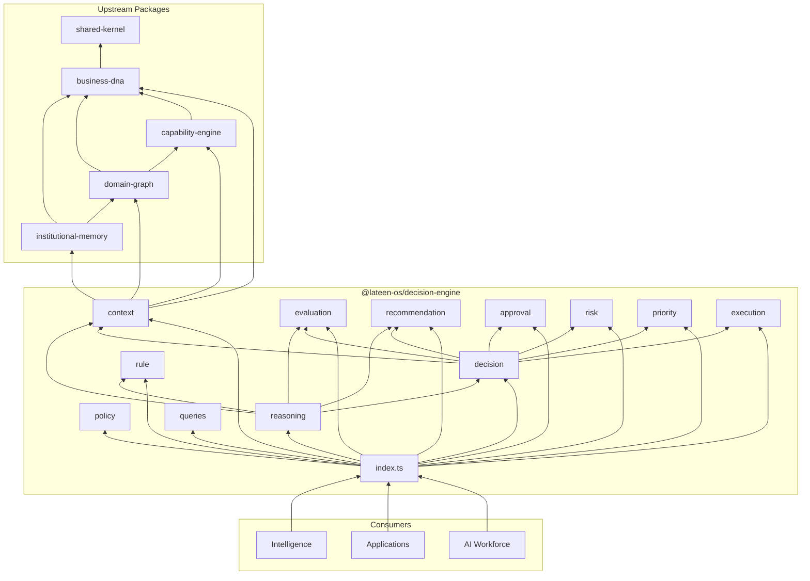
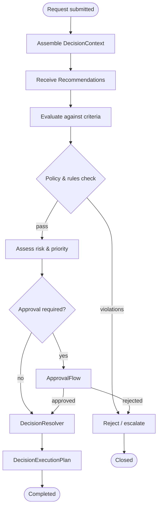
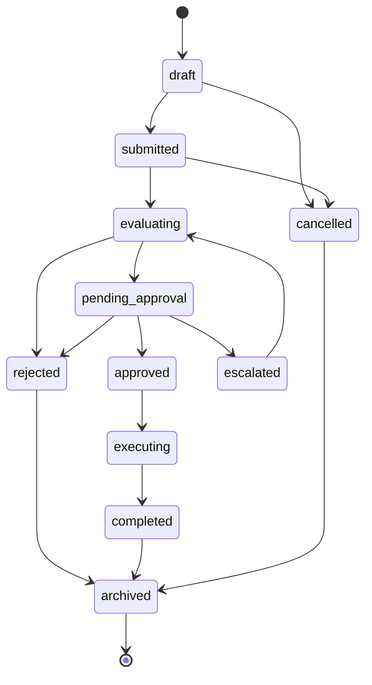

# Decision Engine — Package Architecture

> **Lateen OS Architecture v1.0 (Locked)**

## Purpose

`@lateen-os/decision-engine` is the **canonical decision layer** for Lateen OS. It ensures that no AI agent makes business decisions directly — all recommendations, approvals, rejections, prioritizations, escalations, and optimization requests pass through typed contracts defined here.

The package consumes context from Business DNA, Capability Engine, Domain Graph, and Institutional Memory. It defines models and ports only — no AI, persistence, or business logic.

---

## Architectural rule

```
AI Agent ──proposes──▶ Recommendation
                            │
                            ▼
                    Decision Engine
                     (evaluate → approve → execute)
                            │
                            ▼
                    Authorized outcome
```

---

## Module map

| Module | Types | Events | Repository |
| ------ | ----- | ------ | ---------- |
| `decision` | Decision | ✓ | DecisionRepository |
| `context` | DecisionContext | ✓ | DecisionContextRepository |
| `evaluation` | EvaluationResult, Criteria, Score | ✓ | EvaluationResultRepository |
| `policy` | DecisionPolicy, Scope, Constraint | ✓ | DecisionPolicyRepository |
| `rule` | DecisionRule, Business/Technical/Compliance | ✓ | DecisionRuleRepository |
| `recommendation` | Recommendation, Alternative, Score | ✓ | RecommendationRepository |
| `approval` | ApprovalFlow, Step, Approver | ✓ | ApprovalFlowRepository |
| `risk` | RiskAssessment, Factor, Level | ✓ | RiskAssessmentRepository |
| `priority` | PriorityScore, Level, Strategy | ✓ | PriorityScoreRepository |
| `execution` | ExecutionPlan, Step, Rollback | ✓ | DecisionExecutionPlanRepository |
| `reasoning` | 4 ports | — | — |
| `queries` | DecisionQueries | — | — |

---

## Dependency rules

```
┌──────────────────────────────────────────────┐
│  AI Workforce (recommendations only)         │
│  Applications, Intelligence                  │
└────────────────────┬─────────────────────────┘
                     │
                     ▼
┌──────────────────────────────────────────────┐
│         @lateen-os/decision-engine           │
└──┬────────┬────────┬────────┬────────┬───────┘
   │        │        │        │        │
   ▼        ▼        ▼        ▼        ▼
  SK       BD       CE       DG       IM
```

SK = shared-kernel, BD = business-dna, CE = capability-engine, DG = domain-graph, IM = institutional-memory

### Forbidden

- LLM / AI frameworks in this package
- Persistence, ORM, UI, HTTP
- Upstream packages importing decision-engine
- AI agents bypassing the engine for final decisions

---

## Dependency diagram



---

## Decision flow diagram



---

## Decision lifecycle diagram



---

## Public API

```typescript
import {
  decision,
  reasoning,
  type Decision,
  type DecisionQueries,
  type ContextResolver,
} from '@lateen-os/decision-engine';
```

---

## Version alignment

| Artifact | Count |
| -------- | ----- |
| Aggregates / core types | 10 |
| Reasoning ports | 4 |
| Query methods | 6 |
| Upstream dependencies | 5 |
