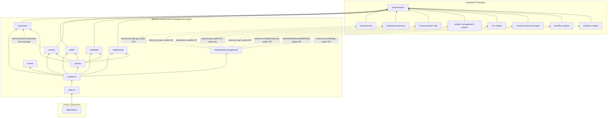
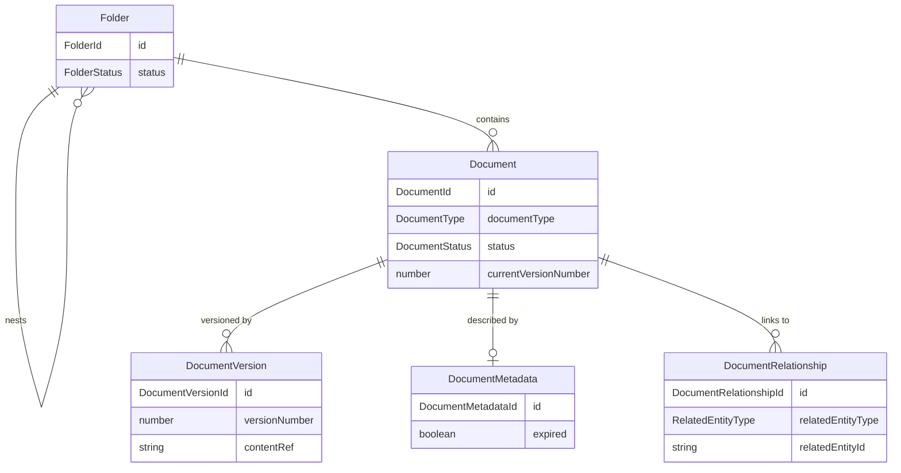

# Document Management Engine — Package Architecture

> **Lateen OS Architecture v1.0 (Locked)**

## Purpose

`@lateen-os/document-management-engine` is the canonical document-of-record layer for Lateen OS — the Document Lifecycle, Folders, Version Control, Metadata, and Relationships. Every capability is a **real, deterministic, in-memory implementation** — there is no contracts-only scaffold in this package; it was built directly as a real runtime (see `runtime.ts`'s `createDocumentManagementRuntime()`).

---

## Design principles

1. **DI only, no hidden state** — every `create*` factory takes its dependencies (repositories, event bus, `now()`) explicitly. No module-level singletons.
2. **Repositories stay internal** — `createDocumentManagementRuntime()` constructs every repository and injects it into the relevant service; only services and the query layer are returned.
3. **Content is never stored or interpreted, only referenced** — `DocumentVersion.contentRef` is an opaque string (a content hash or storage key); this package has no file storage, no text extraction, and no content-based search. Comparison (`compareVersions()`) is a fixed equality check on that reference, never a diff of actual bytes.
4. **Archive/restore is a deliberate asymmetry** — a `Document`'s `archived` status has no outgoing edges in its ordinary transition table (`DOCUMENT_TRANSITIONS`); `restore()` is a distinct operation that returns it to the status held immediately before archiving (`statusBeforeArchive`) — the same pattern proven across Finance Engine (Chart of Accounts), HR Engine (Employee/Department), Inventory Engine (Inventory Catalog), and Project Management Engine (Project).
5. **Delete is guarded behind archive** — `delete()` (a genuine `repository.delete()`, unlike every other lifecycle method which only mutates a status field) is only permitted on an already-archived document, so nothing is ever permanently removed without first passing through the recoverable archived state.
6. **Version Control composes intra-package with the Document Lifecycle, it never duplicates document state** — `createVersion()` calls the injected `DocumentLifecycleEngine`'s `setCurrentVersionNumber()` to advance the pointer; `restoreVersion()` calls the same method to move it backward (or forward) without ever deleting a later version — versions are strictly append-only.
7. **Folders are a simple, fully symmetric 2-state lifecycle** — unlike Document's asymmetric archive/restore, `Folder`'s `active ⇄ archived` transitions are both ordinary, guarded transitions (no `statusBeforeArchive` needed), matching the simpler container semantics of Department/Portfolio elsewhere in the monorepo.
8. **Relationships are directed links, never copies** — `DocumentRelationship` addresses every target (`'document' | 'project' | 'customer' | 'employee' | 'knowledge' | 'workflow' | 'communication'`) by an opaque `string` id. This module never fetches or duplicates the target entity — resolving a real sibling entity is the Relationship Layer's job.
9. **Two distinctly-named relationship surfaces, on purpose** — the runtime exposes `relationships` (this package's own intra-document linking engine) and `relationshipManagement` (the Relationship Layer integrating real sibling package runtimes) as separate properties, because both concepts are explicitly required by the specification and must not be conflated.
10. **Metadata expiry is fixed date comparison, never a scheduler** — `isExpired()` is a pure `asOfDate >= expiryDate` check; `checkExpiry()` only ever transitions `expired: false → true` once and publishes `document.expired` exactly on that transition, never on every call.
11. **A narrow, purposeful integration surface** — of the 8 required sibling packages, each is wired to exactly one meaningful Relationship Layer capability (see below) — always through the sibling's public runtime API, never a repository, never a modification to that package.
12. **Deterministic everywhere** — guarded lifecycle state machines, fixed date arithmetic (`shared/date.ts`), fixed expiry/comparison logic, fixed substring/exact-match search scoring. **No LLM anywhere in this package.**

---

## Module map

| Module | Responsibility | Key exports |
| ------ | -------------- | ------------ |
| `shared/` | IDs, date arithmetic, primitives, entity/domain-event/repository bases, `id.ts` helpers | — |
| `document/` | Document Lifecycle — draft/review/approved/published/archived, delete, 10 document types | `DocumentLifecycleEngine`, `DocumentRepository` |
| `folder/` | Folders — hierarchy, permissions, ownership | `FolderManagementEngine`, `FolderRepository` |
| `version/` | Version Control — immutable snapshots, compare, restore, composed with Document Lifecycle | `VersionControlEngine`, `DocumentVersionRepository` |
| `metadata/` | Metadata — tags, categories, owners, retention, expiry | `MetadataEngine`, `DocumentMetadataRepository` |
| `relationship/` | Relationships — links to documents/projects/customers/employees/knowledge/workflows/communications | `RelationshipEngine`, `DocumentRelationshipRepository` |
| `relationship-management/` | Business DNA / Institutional Memory / Communication Hub / Project Management Engine / CRM Engine / Customer Success Engine / Workflow Engine / Analytics Engine integration | `RelationshipManagement` |
| `queries/` | Read-side query port | `DocumentManagementQueries` |
| `events/` | Typed event bus | `DocumentManagementEventBus`, `DocumentManagementEventMap` |

Each aggregate module follows: `types.ts`, `repository.ts` (port), `repository.impl.ts` (real in-memory implementation), a `*.impl.ts` service/engine file, and `index.ts`.

---

## Dependency rules

```
┌──────────────────────────────────────────────┐
│      Applications, future consumers          │
└────────────────────┬─────────────────────────┘
                     │
                     ▼
┌────────────────────────────────────────────────────────────┐
│           @lateen-os/document-management-engine              │
└──┬───────────┬────────────┬────────────┬──────────┬────────┘
   │           │            │            │          │
   ▼           ▼            ▼            ▼          ▼
┌────────┐┌──────────┐┌────────────┐┌─────────┐┌───────────┐
│business││institu-  ││communi-    ││project- ││crm-engine │
│-dna    ││tional-   ││cation-hub  ││manage-  ││(rel-mgmt) │
│(rel-   ││memory    ││(rel-mgmt)  ││ment-    │└───────────┘
│mgmt)   ││(rel-mgmt)│└────────────┘│engine   │
└────────┘└──────────┘              │(rel-    │  customer-success-engine (rel-mgmt)
                                     │mgmt,    │            │
                                     │read-only│  workflow-engine (rel-mgmt)
                                     │via get()│            │
                                     └─────────┘  analytics-engine (rel-mgmt)
                                                             │
                                                             ▼
                                                  @lateen-os/shared-kernel
```

### Allowed dependencies

- `shared-kernel` — `Entity`, `Identifier`, `Timestamp`, `EventBus`, `InMemoryRepository`, `AuditInfo`, `Money`, `CurrencyCode`
- `business-dna` — `OrganizationId` (type-only reuse); `createBusinessDnaRuntime`'s public `businessProfile.get()` (optional, injected via Relationship Layer)
- `institutional-memory` — `createInstitutionalMemoryRuntime`'s public `lifecycle.create()` (optional, injected via Relationship Layer)
- `communication-hub` — `createCommunicationRuntime`'s public `notifications` service (optional, injected via Relationship Layer)
- `project-management-engine` — `createProjectRuntime`'s public `projects.get()` (optional, injected via Relationship Layer, read-only)
- `crm-engine` — `createCrmRuntime`'s public `customers.get()` (optional, injected via Relationship Layer)
- `customer-success-engine` — `createCustomerSuccessRuntime`'s public `customers.findByCustomer()` (optional, injected via Relationship Layer)
- `workflow-engine` — `createWorkflowRuntime`'s public `defineWorkflow()` / `startWorkflow()` (optional, injected via Relationship Layer)
- `analytics-engine` — `createAnalyticsRuntime`'s public `metrics.recordGauge()` (optional, injected via Relationship Layer)

### Forbidden

- Persistence, ORM, or any real database/storage backend — `contentRef` is always an opaque reference, never actual file bytes
- AI/ML frameworks or LLM SDKs of any kind
- Importing a repository from any integration package (their public runtime APIs only)
- Modifying any integration package to accommodate the Document Management Engine
- Upstream packages importing `document-management-engine` (no inversion)
- Deleting a document that has not first been archived — `delete()` is guarded, never a direct operation on an active/published document
- Fuzzy or content-based diffing in `compareVersions()` — only a fixed equality check on the opaque content reference
- Any model-based classification, tagging, or expiry prediction — Metadata's tags/categories are always caller-supplied, and expiry is always a fixed date comparison

---

## Dependency diagram



---

## Aggregate relationship diagram



---

## Public API

```typescript
import {
  createDocumentManagementRuntime,
  document,
  folder,
  version,
  metadata,
  relationship,
  relationshipManagement,
  queries,
  events,
  type DocumentManagementRuntime,
  type Document,
  type Folder,
  type DocumentVersion,
  type DocumentMetadata,
  type DocumentRelationship,
} from '@lateen-os/document-management-engine';
```

Namespace exports for each module; root re-exports for aggregate interfaces, service ports, pure calculation functions, and the composition root. Repositories are exported as **types only** (for advanced/testing use) — never as constructed instances outside `createDocumentManagementRuntime()`.

---

## Version alignment

| Artifact | Count |
| -------- | ----- |
| Lateen OS Architecture | v1.0 Locked |
| Document lifecycle states | 5 (draft, review, approved, published, archived) + restore + guarded delete |
| Document types | 10 (contract, proposal, invoice_reference, sop, policy, specification, report, project_document, customer_document, hr_document) |
| Folder lifecycle states | 2 (active, archived) — fully symmetric |
| Folder access levels | 3 (read, write, admin) |
| Related entity types | 7 (document, project, customer, employee, knowledge, workflow, communication) |
| Query methods | 6 (`DocumentManagementQueries`) |
| Runtime events | 10 (`DocumentManagementEventMap`) |
| External integrations | 8 (Business DNA, Institutional Memory, Communication Hub, Project Management Engine, CRM Engine, Customer Success Engine, Workflow Engine, Analytics Engine) — all via public API |
