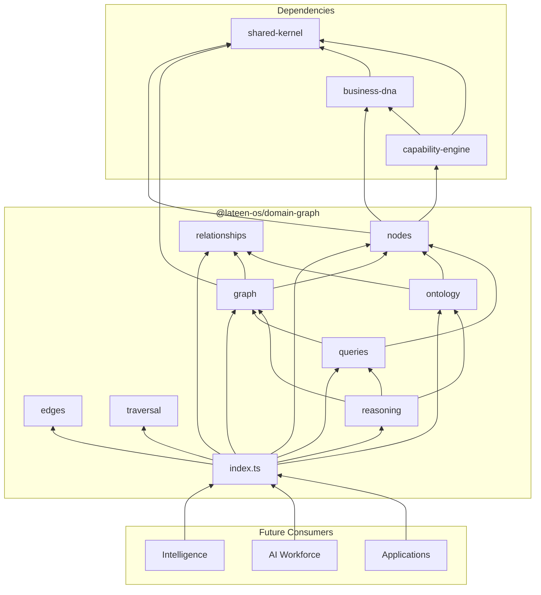
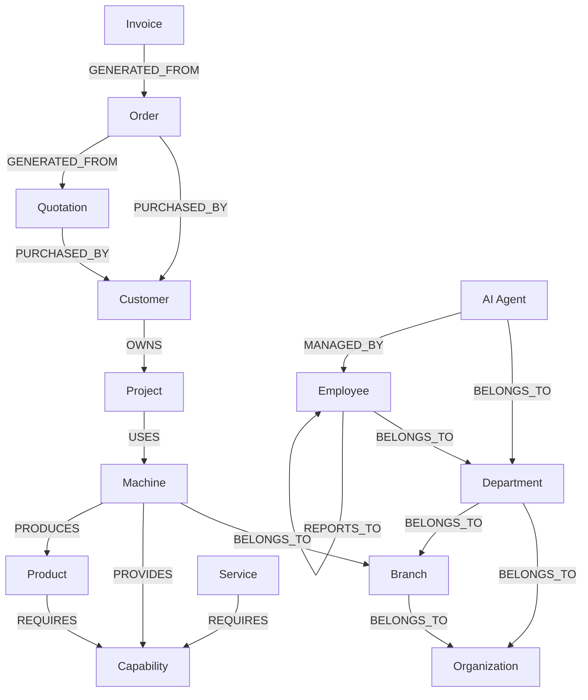
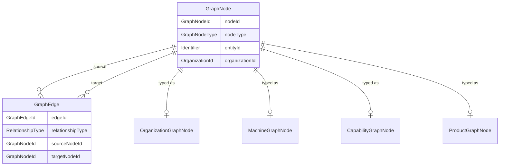

# Domain Graph — Package Architecture

> **Lateen OS Architecture v1.0 (Locked)**

## Purpose

`@lateen-os/domain-graph` defines the **canonical semantic graph** of Lateen OS — how Business DNA entities, capabilities, and commercial documents relate to each other.

The Graph Lifecycle, Entity Registry, Relationship Engine, Graph Repository, Traversal Engine, Validation engine, Search engine, query layer, and event bus are **real, deterministic, in-memory implementations** — see `runtime.ts`'s `createDomainGraphRuntime()` for the composition root. The original ontology system (`nodes/` per-type schema definitions, the upper-snake-case `RelationshipType`, `ontology/`, `reasoning/`, and the pre-existing `traversal`/`queries` port interfaces) remains types, ontology rules, and port interfaces only — it does **not** store data, implement a graph database, or contain business logic. Both coexist deliberately: see "Two relationship vocabularies" below.

---

## Design principles

1. **Semantic, not physical** — The graph models meaning (PROVIDES, REQUIRES, OWNS), not storage layout.
2. **Ontology-first** — Only edges defined in `CANONICAL_ONTOLOGY` are valid.
3. **Ports, not implementations** — Traversal, queries, and reasoning are interfaces for infrastructure and Intelligence layers.
4. **Tenant-scoped** — All graph elements carry `organizationId`.
5. **Framework-agnostic** — Pure TypeScript types.

---

## Module reference

### `graph/` — Core structures + real Graph Lifecycle

| Type | Description | Real? |
| ---- | ----------- | ----- |
| `GraphNode` | Vertex representing a Business DNA or Capability entity (now carries optional `graphId`/`status`/`createdAt`/`updatedAt` for the real registry) | — |
| `GraphEdge` | Directed ontology relationship between nodes (upper-snake-case `RelationshipType`) | contracts only |
| `GraphPath` | Ordered walk through nodes and edges (ontology-typed) | contracts only |
| `GraphMetadata` | Summary statistics about a graph view | — |
| `GraphSnapshot` | Immutable point-in-time graph view (type only) | contracts only |
| `DomainGraph` | Real, lifecycle-managed graph container | ✅ `GraphLifecycle` |
| `DomainRelationshipType` | 14-value lowercase relationship vocabulary for the real Relationship Engine | ✅ |
| `GraphRelationship` | Real, persisted relationship (distinct from ontology `GraphEdge`) | ✅ |
| `graph/algorithms.ts` | Pure BFS/DFS/shortestPath/detectCycles/dependencyOrder/connectedComponents — shared by `store/` and `traversal/` | ✅ |

### `nodes/` — 27 node definitions

Each node module exports:

- `{Entity}GraphNode` — typed node interface
- `{entity}NodeDefinition` — schema metadata
- `GRAPH_NODE_DEFINITIONS` — full registry

19 original node types plus 8 added by this commit: `lead`, `contact`, `competitor`, `market`, `mission`, `knowledge`, `document`, `campaign`.

### `relationships/` — 17 ontology relationship types (contracts only)

`RelationshipType` union with `RELATIONSHIP_TYPE_DEFINITIONS` metadata (description, directed flag). See "Two relationship vocabularies" below for why the real Relationship Engine does not reuse this type.

### `edges/` — Edge definitions (contracts only)

`GraphEdgeDefinition` and `TypedGraphEdge` for schema-level edge typing.

### `ontology/` — Canonical rules (contracts only)

| Export | Description |
| ------ | ----------- |
| `OntologyTriple` | Allowed source–relationship–target triple |
| `CANONICAL_ONTOLOGY` | Full registry of valid triples |
| `ONTOLOGY_SEMANTIC_ALIASES` | Natural-language mappings |
| `ONTOLOGY_VERSION` | Schema version (`1.0.0`) |

### `store/` — Real, internal repositories

`EntityRepository`, `RelationshipRepository`, and the combined `GraphRepository` facade (`findEntity`/`findEntities`/`findRelationships`/`findNeighbors`/`findParents`/`findChildren`/`shortestPath`/`connectedComponents`). Never exposed by `createDomainGraphRuntime()` — internal to the composition root.

### `entities/` — Real Entity Registry

`register()` / `update()` / `archive()` over `EntityRepository`, publishing `entity.created`/`entity.updated`/`entity.archived`.

### `relationship-engine/` — Real Relationship Engine

`create()` (dangling-guarded) / `update()` / `delete()`, publishing `relationship.created`/`relationship.updated`/`relationship.deleted`.

### `traversal/` — Navigation ports (contracts) + real Traversal Engine

| Port | Responsibility | Real? |
| ---- | -------------- | ----- |
| `GraphTraversal` | Bounded walks from a root node | contracts only |
| `GraphNavigator` | Immediate neighbors and incident edges | contracts only |
| `GraphExplorer` | Subgraph exploration and snapshots | contracts only |
| `GraphPathFinder` | Path discovery between nodes | contracts only |
| `TraversalEngine` | BFS / DFS / shortestPath / detectCycles / dependencyOrder | ✅ real |

### `validation/` — Real Validation engine

Duplicate entity detection, dangling relationship detection, orphan detection, cycle validation; `validate()` aggregates all four and publishes `graph.validated`.

### `search/` — Real Search engine

Deterministic search by name, type, tags, and metadata — no embeddings, no vector search.

### `queries/` — Read-side query ports

`GraphQueries` (contracts only — ontology-oriented):

| Method | Purpose |
| ------ | ------- |
| `findNeighbors` | Adjacent nodes |
| `findAncestors` | Upstream hierarchy |
| `findDescendants` | Downstream hierarchy |
| `findShortestPath` | Minimum path between nodes |
| `findRelatedEntities` | Bounded semantic neighborhood |
| `findImpactedEntities` | Downstream dependents |
| `findCapabilitiesForMachine` | Machine → Capability |
| `findProductsForMachine` | Machine → Product |
| `findProjectsForCustomer` | Customer → Project |
| `findMachinesForCapability` | Capability → Machine |
| `findCustomersUsingCapability` | Capability → Customer |

`DomainGraphQueries` (real, exposed by `createDomainGraphRuntime()`): `findEntity`, `searchEntities`, `findRelationships`, `findNeighbors`, `shortestPath`, `dependencyOrder`, `detectCycles`, `graphStatistics`.

### `events/` — Real typed event bus

`DomainGraphEventMap` — the 8 required events, each genuinely published: `entity.created`, `entity.updated`, `entity.archived`, `relationship.created`, `relationship.updated`, `relationship.deleted`, `graph.validated`, `graph.rebuilt`.

### `reasoning/` — Semantic analysis ports (contracts only)

| Port | Responsibility |
| ---- | -------------- |
| `RelationshipResolver` | Validate edges against ontology |
| `ImpactAnalyzer` | Downstream impact of changes |
| `DependencyAnalyzer` | DEPENDS_ON / REQUIRES chains |
| `ContextResolver` | Entity context for AI agents |

---

## Two relationship vocabularies

This package intentionally has **two** relationship type systems:

| | `RelationshipType` (`relationships/`) | `DomainRelationshipType` (`graph/types.ts`) |
| - | - | - |
| Casing | `UPPER_SNAKE_CASE` | `lower_snake_case` |
| Count | 17 | 14 |
| Governs | `GraphEdge` / `CANONICAL_ONTOLOGY` triples | `GraphRelationship` (real Relationship Engine) |
| Status | Pre-existing, contracts only | Added by this commit, real |

They were kept separate rather than merged because renaming or widening the pre-existing `RelationshipType` would have altered an already-locked ontology contract (`CANONICAL_ONTOLOGY`, `ONTOLOGY_SEMANTIC_ALIASES`) that other packages may come to depend on verbatim. `GraphNode` is shared by both systems (extended additively with optional `graphId`/`status`/timestamps); `GraphEdge` (ontology) and `GraphRelationship` (real) are kept as separate, non-overlapping types.

---

## Dependency rules

```
┌──────────────────────────────────────────────┐
│  Intelligence, AI Workforce, Applications    │
└────────────────────┬─────────────────────────┘
                     │
                     ▼
┌──────────────────────────────────────────────┐
│           @lateen-os/domain-graph            │
└──────┬──────────────┬──────────────┬─────────┘
       │              │              │
       ▼              ▼              ▼
┌────────────┐ ┌─────────────┐ ┌──────────────┐
│ business-  │ │ capability- │ │ shared-      │
│ dna        │ │ engine      │ │ kernel       │
└────────────┘ └─────────────┘ └──────────────┘
```

### Forbidden

- Domain Graph importing UI, HTTP, ORM, or graph database libraries
- Business DNA or Capability Engine importing Domain Graph (no upward deps)
- Implementations inside this package

---

## Dependency diagram



---

## Graph diagram



---

## Relationship diagram



---

## Public API

```typescript
import {
  graph,
  nodes,
  ontology,
  traversal,
  queries,
  reasoning,
  type GraphNode,
  type GraphQueries,
  CANONICAL_ONTOLOGY,
} from '@lateen-os/domain-graph';
```

Root re-exports cover graph structures, node/relationship registries, ontology, all ports, and graph identifiers.

---

## Version alignment

| Artifact | Status |
| -------- | ------ |
| Lateen OS Architecture | v1.0 Locked |
| Node types | 27 / 27 (19 ontology + 8 real-runtime: lead/contact/competitor/market/mission/knowledge/document/campaign) |
| Ontology relationship types | 17 / 17 (contracts only) |
| Real Relationship Engine types | 14 / 14 (`DomainRelationshipType`) |
| Ontology query methods | 11 / 11 (contracts only) |
| Real query methods | 8 / 8 (`DomainGraphQueries`) |
| Reasoning ports | 4 / 4 (contracts only) |
| Real runtime events | 8 / 8 (`DomainGraphEventMap`) |
| Ontology version | 1.0.0 |
