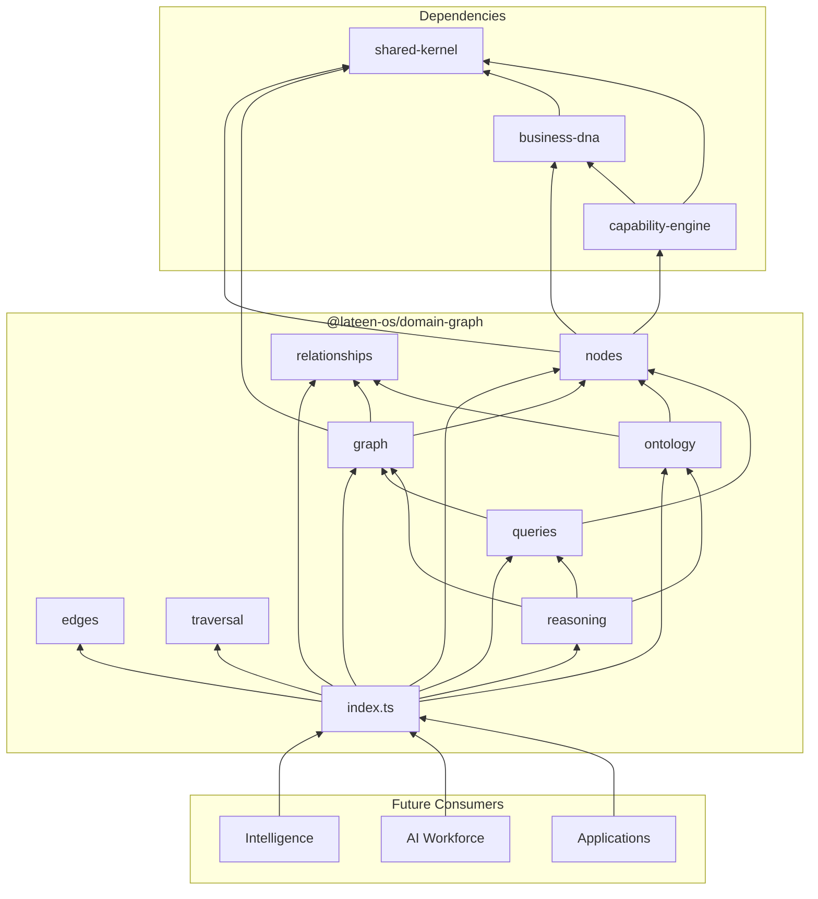
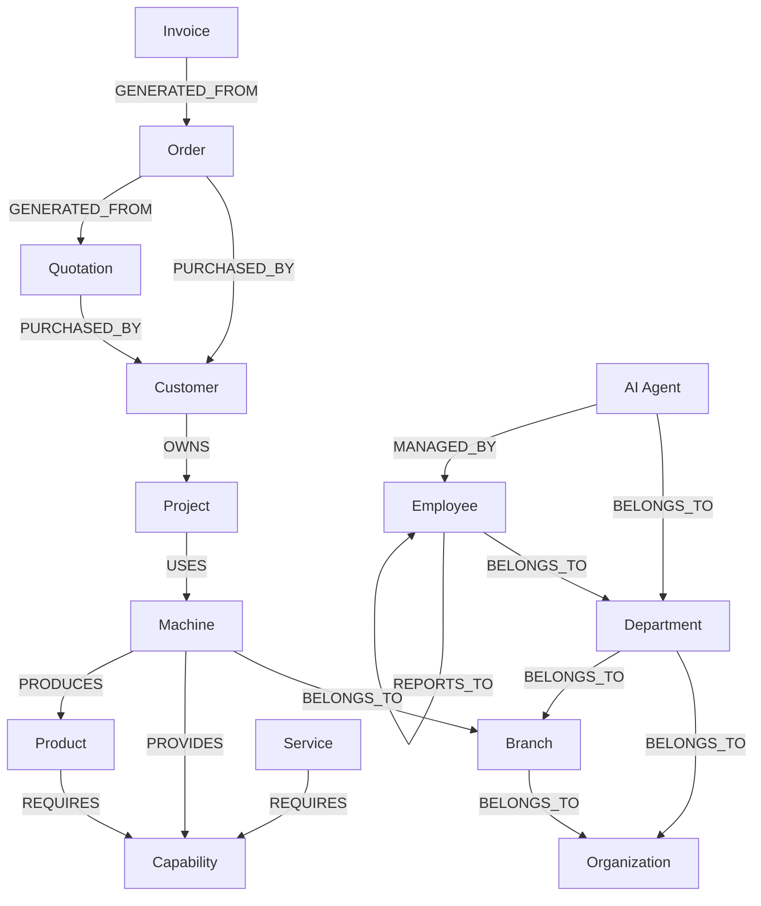
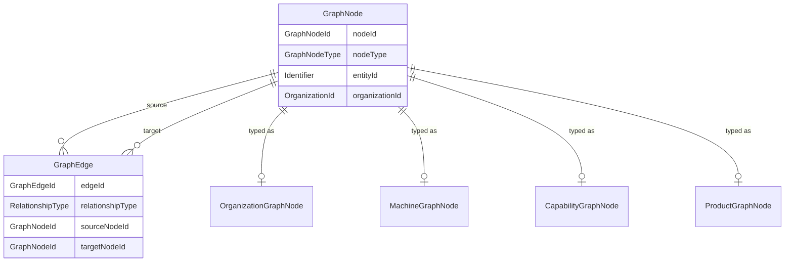

# Domain Graph — Package Architecture

> **Lateen OS Architecture v1.0 (Locked)**

## Purpose

`@lateen-os/domain-graph` defines the **canonical semantic graph** of Lateen OS — how Business DNA entities, capabilities, and commercial documents relate to each other.

The package provides types, ontology rules, and port interfaces only. It does **not** store data, implement a graph database, or contain business logic.

---

## Design principles

1. **Semantic, not physical** — The graph models meaning (PROVIDES, REQUIRES, OWNS), not storage layout.
2. **Ontology-first** — Only edges defined in `CANONICAL_ONTOLOGY` are valid.
3. **Ports, not implementations** — Traversal, queries, and reasoning are interfaces for infrastructure and Intelligence layers.
4. **Tenant-scoped** — All graph elements carry `organizationId`.
5. **Framework-agnostic** — Pure TypeScript types.

---

## Module reference

### `graph/` — Core structures

| Type | Description |
| ---- | ----------- |
| `GraphNode` | Vertex representing a Business DNA or Capability entity |
| `GraphEdge` | Directed semantic relationship between nodes |
| `GraphPath` | Ordered walk through nodes and edges |
| `GraphMetadata` | Summary statistics about a graph view |
| `GraphSnapshot` | Immutable point-in-time graph view (type only) |

### `nodes/` — 19 node definitions

Each node module exports:

- `{Entity}GraphNode` — typed node interface
- `{entity}NodeDefinition` — schema metadata
- `GRAPH_NODE_DEFINITIONS` — full registry

### `relationships/` — 17 relationship types

`RelationshipType` union with `RELATIONSHIP_TYPE_DEFINITIONS` metadata (description, directed flag).

### `edges/` — Edge definitions

`GraphEdgeDefinition` and `TypedGraphEdge` for schema-level edge typing.

### `ontology/` — Canonical rules

| Export | Description |
| ------ | ----------- |
| `OntologyTriple` | Allowed source–relationship–target triple |
| `CANONICAL_ONTOLOGY` | Full registry of valid triples |
| `ONTOLOGY_SEMANTIC_ALIASES` | Natural-language mappings |
| `ONTOLOGY_VERSION` | Schema version (`1.0.0`) |

### `traversal/` — Navigation ports

| Port | Responsibility |
| ---- | -------------- |
| `GraphTraversal` | Bounded walks from a root node |
| `GraphNavigator` | Immediate neighbors and incident edges |
| `GraphExplorer` | Subgraph exploration and snapshots |
| `GraphPathFinder` | Path discovery between nodes |

### `queries/` — Read-side query port

`GraphQueries` methods:

| Method | Purpose |
| ------ | ------- |
| `findNeighbors` | Adjacent nodes |
| `findAncestors` | Upstream hierarchy |
| `findDescendants` | Downstream hierarchy |
| `findShortestPath` | Minimum path between nodes |
| `findRelatedEntities` | Bounded semantic neighborhood |
| `findImpactedEntities` | Downstream dependents |
| `findCapabilitiesForMachine` | Machine → Capability |
| `findProductsForMachine` | Machine → Product |
| `findProjectsForCustomer` | Customer → Project |
| `findMachinesForCapability` | Capability → Machine |
| `findCustomersUsingCapability` | Capability → Customer |

### `reasoning/` — Semantic analysis ports

| Port | Responsibility |
| ---- | -------------- |
| `RelationshipResolver` | Validate edges against ontology |
| `ImpactAnalyzer` | Downstream impact of changes |
| `DependencyAnalyzer` | DEPENDS_ON / REQUIRES chains |
| `ContextResolver` | Entity context for AI agents |

---

## Dependency rules

```
┌──────────────────────────────────────────────┐
│  Intelligence, AI Workforce, Applications    │
└────────────────────┬─────────────────────────┘
                     │
                     ▼
┌──────────────────────────────────────────────┐
│           @lateen-os/domain-graph            │
└──────┬──────────────┬──────────────┬─────────┘
       │              │              │
       ▼              ▼              ▼
┌────────────┐ ┌─────────────┐ ┌──────────────┐
│ business-  │ │ capability- │ │ shared-      │
│ dna        │ │ engine      │ │ kernel       │
└────────────┘ └─────────────┘ └──────────────┘
```

### Forbidden

- Domain Graph importing UI, HTTP, ORM, or graph database libraries
- Business DNA or Capability Engine importing Domain Graph (no upward deps)
- Implementations inside this package

---

## Dependency diagram



---

## Graph diagram



---

## Relationship diagram



---

## Public API

```typescript
import {
  graph,
  nodes,
  ontology,
  traversal,
  queries,
  reasoning,
  type GraphNode,
  type GraphQueries,
  CANONICAL_ONTOLOGY,
} from '@lateen-os/domain-graph';
```

Root re-exports cover graph structures, node/relationship registries, ontology, all ports, and graph identifiers.

---

## Version alignment

| Artifact | Status |
| -------- | ------ |
| Lateen OS Architecture | v1.0 Locked |
| Node types | 19 / 19 |
| Relationship types | 17 / 17 |
| Query methods | 11 / 11 |
| Reasoning ports | 4 / 4 |
| Ontology version | 1.0.0 |
