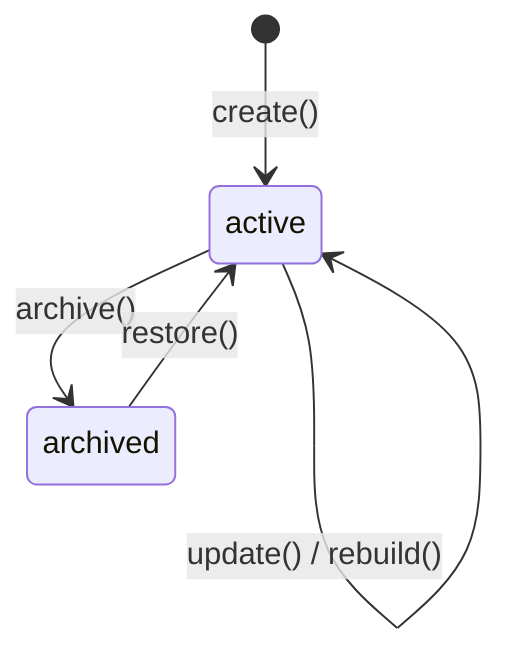

# Domain Graph Model

> Real, implemented model for the Domain Knowledge Graph — see [README.md](./README.md) for the runtime and [ARCHITECTURE.md](./ARCHITECTURE.md) for the module map. For the pre-existing ontology contracts (node schema definitions, `CANONICAL_ONTOLOGY`), see [Ontology.md](./Ontology.md).

---

## Graph lifecycle



`graph/lifecycle.impl.ts`'s `createGraphLifecycle()` implements a real, guarded state machine over `DomainGraph.status`. `canTransitionGraph(from, to)` is exported standalone for inspection. `update()` rejects an archived graph with `InvalidGraphTransitionError` — call `restore()` first. `rebuild(organizationId, graphId, stats)` stamps `updatedAt` and publishes `graph.rebuilt` with externally-computed entity/relationship counts (computed by the caller via the query layer's `graphStatistics()`, keeping the Graph Lifecycle decoupled from the storage layer).

A `DomainGraph` is a named container: every registered entity and relationship is scoped to one `(organizationId, graphId)` pair, so an organization can maintain more than one named graph (e.g. different domain views) if it chooses to.

---

## Entity Registry

`entities/registry.impl.ts`'s `createEntityRegistry()` registers, updates, and archives `GraphNode`s across all 27 `GraphNodeType`s:

```
organization · branch · department · employee · customer · supplier · machine · capability
product · service · project · workflow · policy · asset · quotation · order · invoice · ai_agent · kpi
lead · contact · competitor · market · mission · knowledge · document · campaign
```

The last 8 are new — added by this commit, additive to the pre-existing 19-value `GraphNodeType` union (no removal, no renaming, no breaking changes for downstream packages that only ever read `GraphNodeType`/`GraphNodeId` as opaque values).

Every registered entity carries `nodeId`, `nodeType`, `entityId` (a reference to the real owning aggregate elsewhere — e.g. a Business DNA `CustomerId`), `graphId`, `status` (`active`/`archived`), `label`, `properties` (free-form metadata), and audit timestamps. `register()` is deliberately permissive — it does not block on duplicates; duplicate detection is a separate, non-blocking concern owned by the Validation engine (see below), so that bulk imports or eventually-consistent upstream sources can be registered first and reconciled afterward.

---

## Relationship Engine

`relationship-engine/engine.impl.ts`'s `createRelationshipEngine()` creates, updates, and deletes `GraphRelationship` edges using a **deliberately distinct, lowercase** relationship vocabulary — `DomainRelationshipType` (14 values):

```
owns · belongs_to · manages · depends_on · references · related_to
competitor_of · customer_of · supplier_of · member_of · executes · created_by · assigned_to · blocked_by
```

Unlike the pre-existing ontology's `RelationshipType` (17 upper-snake-case values governing `CANONICAL_ONTOLOGY`), `DomainRelationshipType` is not ontology-constrained — any registered pair of entities may be connected by any of the 14 types. `create()` guards against **dangling references**: both `sourceNodeId` and `targetNodeId` must already resolve to a registered entity, or it throws `DanglingRelationshipError`. `delete()` is a hard delete (not an archive) — paired with the `relationship.deleted` event, matching the task's event vocabulary precisely (there is no `relationship.archived`).

---

## Graph Repository (internal)

`store/graph-repository.impl.ts` is the tenant-and-graph-scoped storage facade — composed over the internal `EntityRepository` and `RelationshipRepository` (both hand-rolled in-memory `Map` stores, since `GraphNode`/`GraphRelationship`'s natural keys are `nodeId`/`relationshipId`, not `id`). It is **never** part of `createDomainGraphRuntime()`'s returned surface — only services and the query layer consume it.

| Method | Semantics |
| ------ | --------- |
| `findEntity` / `findEntities` | Direct lookup / filtered list (by `nodeType`, `status`) |
| `findRelationships` | Filtered list (by `relationshipType`, `sourceNodeId`, `targetNodeId`) |
| `findNeighbors` | Adjacent nodes in a given direction (`in` / `out` / `both`) |
| `findParents` | Targets of this node's **outgoing** edges — the convention: a child points to its parent (e.g. `department --belongs_to--> organization`) |
| `findChildren` | Sources of edges **pointing to** this node — the inverse of `findParents` |
| `shortestPath` | Unweighted BFS shortest path, reusing `graph/algorithms.ts` |
| `connectedComponents` | Undirected connectivity, reusing `graph/algorithms.ts` |

---

## Traversal Engine

`graph/algorithms.ts` holds every graph algorithm as a **pure function** — no repository, no I/O, fully deterministic, directly unit-testable in isolation: `bfs`, `dfs`, `shortestPath`, `detectCycles`, `dependencyOrder` (Kahn's algorithm topological sort), and `connectedComponents`. `traversal/engine.impl.ts`'s `createTraversalEngine()` is the thin, repository-backed wrapper the runtime exposes — it fetches a graph's entities/relationships and delegates to these pure functions. The Graph Repository's `shortestPath`/`connectedComponents` reuse the very same functions, so the two capabilities never diverge.

`dependencyOrder()` throws `CyclicDependencyError` (carrying the first detected cycle) if the graph — or the subset filtered by `relationshipTypes` — is not a DAG; call `detectCycles()` first to check safely.

Every algorithm breaks ties **deterministically** (sorted neighbor visitation, sorted ready-queues, canonical cycle rotation for deduplication) so that two calls against the same data always return identical results — no incidental Map/Set iteration-order dependence.

---

## Validation

`validation/engine.impl.ts`'s `createGraphValidationEngine()` provides four independent, read-only checks plus an aggregate `validate()`:

| Check | Detects |
| ----- | ------- |
| `detectDuplicateEntities` | Two or more active entities sharing the same `(nodeType, entityId)` |
| `detectDanglingRelationships` | A relationship whose source or target no longer resolves to a known entity |
| `detectOrphans` | Active entities with zero incident relationships |
| `validateAcyclic` | Cycles in the relationship graph (optionally restricted to specific `relationshipTypes`, e.g. just `depends_on`) |

`validate()` runs all four, aggregates a `GraphValidationReport`, and publishes `graph.validated` with `isValid` (true only when duplicates, dangling relationships, and cycles are all absent — orphans are informational and do not affect validity) and an `issueCount`.

---

## Search

`search/engine.impl.ts`'s `createGraphSearchEngine()` searches deterministically by:

- **name** — case-insensitive match against `GraphNode.label` (exact match scores higher than substring)
- **type** — exact `nodeType` filter
- **tags** — exact matches against `properties.tags` (when present, expected to be a `string[]`)
- **metadata** — exact key/value matches against `properties`

No embeddings, no vector database, no AI/LLM — pure string/value comparison, deterministically ranked and ordered (`nodeId` as the final tie-break).

---

## Query Layer

`queries/domain-graph-queries.impl.ts`'s `createDomainGraphQueries()` is the real, read-only query layer exposed by `createDomainGraphRuntime()` — composed purely over the Graph Repository, Search engine, and Traversal Engine, never returning a repository:

| Method | Returns |
| ------ | ------- |
| `findEntity()` | A single entity by id |
| `searchEntities()` | Deterministic search matches with scores |
| `findRelationships()` | Relationships filtered by type/source/target |
| `findNeighbors()` | Adjacent entities |
| `shortestPath()` | Unweighted shortest path |
| `dependencyOrder()` | Topological order (throws if cyclic) |
| `detectCycles()` | Every detected cycle |
| `graphStatistics()` | Entity/relationship counts (overall and by type) plus connected-component count |

---

## Constraints

- No UI, API, LLM, graph database, or persistence-adapter implementation in this package — every repository is in-memory and internal to `createDomainGraphRuntime()`.
- Deterministic and offline: every `create*` factory accepts an injectable `now()`; every algorithm breaks ties by sorted id, never by Map/Set iteration order.
- The pre-existing ontology system (`nodes/` schema definitions, `RelationshipType`, `ontology/`, `reasoning/`, and the original `traversal`/`queries` port interfaces) remains contracts only — see [ARCHITECTURE.md](./ARCHITECTURE.md) for the full module table.
